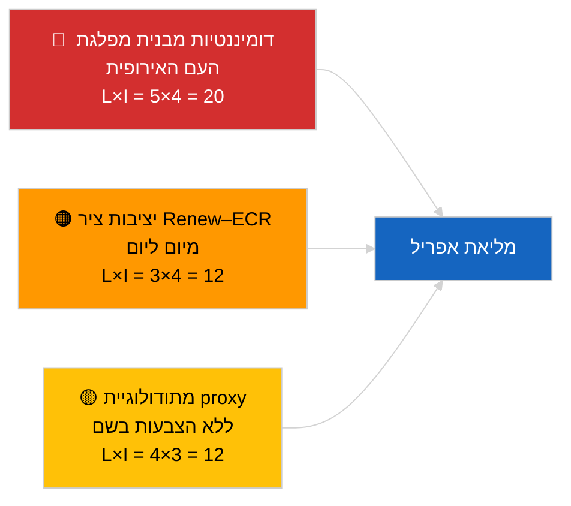

<!-- SPDX-FileCopyrightText: 2026 Hack23 AB -->
<!-- SPDX-License-Identifier: Apache-2.0 -->

# תקציר מנהלים — חדשות מתפרצות (דינמיקת קואליציות) | 2026-04-04

**סיווג:** OSINT | רשומה פרלמנטרית ציבורית
**רמת ביטחון:** 🟡 בינוני (עדכון לכידות מבנית; ללא נתוני הצבעה בשם)
**הופק:** 2026-04-04T00:00:00Z (תקציר רטרואקטיבי)
**סוג המאמר:** חדשות מתפרצות — הערכת דינמיקת קואליציות
**מקור:** פורטל הנתונים הפתוחים של הפרלמנט האירופי

---

## 🎯 מסקנה ראשונה (BLUF)

**חשבון הקואליציה ב-4 באפריל 2026 מאשש את התמונה המבנית של היום הקודם: דומיננטיות א-סימטרית של מפלגת העם האירופית ב-38% ואיתות הלכידות של Renew–ECR (~0.95) נמשך.** המאמר מציג חישוב לכידות חדש לפי יחס מושבים עם אותה מטריצה של 28 זוגות; התוצאות מתכנסות עם אתמול. הקואליציה הגדולה (מפלגת העם האירופית+S&D = 60%) נותרת ברירת המחדל; הקואליציה הגדולה-במיוחד (מפלגת העם האירופית+S&D+Renew = 65%) מספקת מרווח; חלופת מרכז-ימין (מפלגת העם האירופית+ECR+PfE = 57%) ממשיכה לקשור את S&D למרכז באמצעות לחץ תחרותי. הממצא החדש השולי ביחס ל-3 באפריל 2026 הוא יציבות מדדי הלכידות על פני חלון זמן של 24 שעות — ערכים עקביים תומכים בהשערת האסימטריה המבנית גם אם הם עדיין אינם יכולים להפריך את ה-proxy. **🟡 ביטחון בינוני** — אותה אזהרת proxy מבנית חלה; אימות דרך נתוני הצבעה בשם עדיין ממתין לפרסום רבעון ראשון.

---

## 🧭 3 החלטות שתקציר זה תומך בהן

| # | החלטה | מי מחליט | מועד אחרון | ראיות |
|:-:|-------|---------|:---------:|-------|
| 1 | **עריכה:** SKIP פרסום מחדש יומי; לאחד עם כתבת הקואליציה מ-3 באפריל 2026 | עורך | +12 שעות | הממצאים מתכנסים עם יום קודם |
| 2 | **מעקב:** לשמור על מעקב לכידות Renew–ECR לאורך המליאה באפריל | אנליסט | 2026-04-30 | חלון אימות |
| 3 | **מעקב מראש:** לשלב נתוני הצבעה בשם לאחר המליאה ברגע שנתוני Q1 מתפרסמים (סוף מאי) | מוביל ניתוח | 2026-05-31 | בדיקת הפרכה |

---

## 📰 קריאת 60 שניות

- 🔴 **לכידות Renew–ECR של 0.95 נשמרת** מיום ליום; השערת הציר המבני עדיין על השולחן. (🟡 בינוני)
- 🟠 **דומיננטיות מבנית של מפלגת העם האירופית ב-38%** ללא שינוי; כל הרוב הרלוונטיים מחייבים את מפלגת העם האירופית. (🟢 גבוה)
- 🟢 **קואליציה גדולה 60%, גדולה-במיוחד 65%, חלופת מרכז-ימין 57%** נותרים שלושת מסלולי הרוב האפשריים. (🟢 גבוה)
- 🟡 **מדד פיצול ~4.4 מפלגות אפקטיביות** — יציב. (🟡 בינוני)
- 🔵 **הסתייגות מתודולוגית:** ציוני זוג מפלגת העם האירופית עדיין 0.00 בגלל ארטיפקט מודל יחס הגודל. (🟢 גבוה)
- 🟣 **הפניה צולבת:** `breaking-2` אחות מכסה את צינור התחיקה Q1 EP10; `breaking-3` מתעד מגבלות ניתוחיות בתקופת פגרה; `breaking-4` מבצע ניתוח מעמיק של טקסטים שאומצו. (🟢 גבוה)
- 🩷 **וקטור שיבוש:** התממשות Renew–ECR תצמצם את השפעת S&D. (🟡 בינוני)
- ⚪ **תלוי:** לחכות לנתוני הצבעה בשם מסוף מאי לאימות.

---

## 🗂️ טבלת ממצאים עיקריים

| דירוג | ממצא | לכידות / נתח | ביטחון | סטטוס |
|:-----:|------|:-----------:|:------:|-------|
| 1 | לכידות Renew–ECR (יציבה מיום ליום) | 0.95 | 🟡 בינוני | ממתין לאימות |
| 2 | כדאיות קואליציה גדולה | 60% | 🟢 גבוה | ברירת מחדל |
| 3 | מרווח קואליציה גדולה-במיוחד | 65% | 🟢 גבוה | זמין |
| 4 | חלופת מרכז-ימין | 57% | 🟢 גבוה | מנוף משמעת על S&D |

---

## ⚠️ סקירת סיכונים ואיומים

| סיכון | L | I | ניקוד | טריגר | מקור | אדמירליות |
|-------|:-:|:-:|:----:|-------|------|:---------:|
| דומיננטיות מבנית מפלגת העם האירופית | 5 | 4 | 20 | כל הרוב האפשריים מחייבים את מפלגת העם האירופית | חשבון קואליציות | A1 |
| יציבות ציר Renew–ECR | 3 | 4 | 12 | לכידות מיום ליום | מטריצת לכידות | B2 |
| proxy מתודולוגי | 4 | 3 | 12 | ללא נתוני הצבעה בשם | עיכוב API הפרלמנט | A2 |

---

## 🔮 טריגר מוביל לעתיד

**בדיקה חוזרת של לכידות ביום 3 ובסופו של דבר נתוני הצבעה בשם של מליאת אפריל (סוף מאי).** יציבות מתמשכת מיום ליום מחזקת את השערת הציר המבני גם ללא נתוני הצבעה בשם.

---

## 🛡️ הערכת איכות מקורות

- **מקורות ראשוניים:** כלים אנליטיים MCP של הפרלמנט האירופי (פועלים לפי בדיקת בריאות API של `breaking-2`); מטריצת לכידות של 28 זוגות.
- **ביטחון ביציבות מיום ליום:** 🟢 גבוה.
- **ביטחון בפרשנות הציר:** 🟡 בינוני — אותן הסתייגויות מבניות כמו ב-2026-04-03/breaking.

---

## 📎 קישורים

| קישור | נתיב |
|-------|-----|
| מאמר | `./article.md` |
| ניתוחים אחים | `analysis/daily/2026-04-04/breaking-2/`, `breaking-3/`, `breaking-4/`, `week-in-review/` |
| הערכת קואליציה קודמת | `analysis/daily/2026-04-03/breaking/` |
| מניפסט | `./manifest.json` |

---

**בקרת מסמך**
- **תבנית:** `/analysis/templates/executive-brief.md`
- **נתיב קובץ:** `analysis/daily/2026-04-04/breaking/executive-brief.md`
- **סיווג:** ציבורי
- **הפקה רטרואקטיבית:** סשן מילוי.
