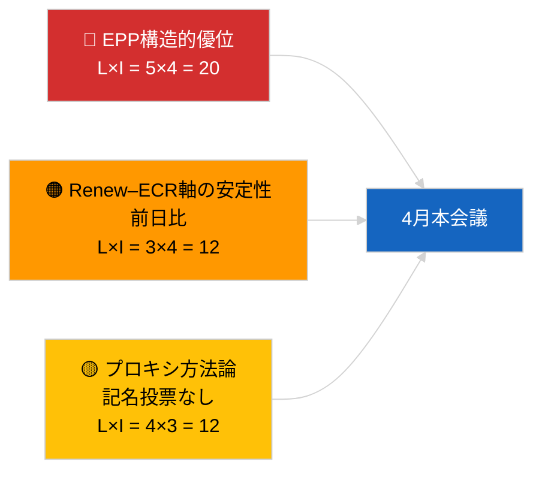

<!-- SPDX-FileCopyrightText: 2026 Hack23 AB -->
<!-- SPDX-License-Identifier: Apache-2.0 -->

# エグゼクティブ・ブリーフィング — 速報ニュース（連立力学） | 2026-04-04

**分類：** OSINT | 公開議会記録
**信頼度：** 🟡 中程度（構造的結束更新；記名投票データなし）
**作成日：** 2026-04-04T00:00:00Z（遡及ブリーフィング）
**記事種別：** 速報 — 連立力学評価
**出典：** 欧州議会オープンデータポータル

---

## 🎯 BLUF（結論先行）

**2026年4月4日の連立計算は前日の構造的状況を確認する：EPP（欧州人民党）38%の非対称優位とRenew–ECR結束シグナル（~0.95）の継続。** 本記事は同じ28ペアマトリクスを使用した議席比率に基づく新たな結束計算を提示しており、結果は前日と収束する。大連立（EPP+S&D = 60%）が引き続きデフォルト選択肢；超大連立（EPP+S&D+Renew = 65%）が余裕を提供；中道右派代替案（EPP+ECR+PfE = 57%）は競争的圧力を通じてS&Dを中道に縛り付け続ける。2026年4月3日比の限界的な新知見は、24時間ウィンドウにわたる結束指標の安定性であり、一貫した数値は構造的非対称仮説を支持するが、まだプロキシを反証するには至っていない。**🟡 中程度の信頼度** — 同じ構造的プロキシの注意事項が適用される；記名投票によるバリデーションはまだ第1四半期の公表待ち。

---

## 🧭 このブリーフィングが支援する3つの決定

| # | 決定 | 決定者 | 期限 | 証拠 |
|:-:|------|------|:---:|------|
| 1 | **編集：** 日次再公開をスキップ；2026年4月3日の連立記事と統合 | 編集者 | +12時間 | 前日と知見が収束 |
| 2 | **モニタリング：** 4月本会議を通じてRenew–ECR結束監視を維持 | アナリスト | 2026-04-30 | バリデーション窓 |
| 3 | **先行ウォッチ：** 第1四半期の票が公表され次第（5月下旬）、本会議後の記名投票データを統合 | 分析リード | 2026-05-31 | 反証テスト |

---

## 📰 60秒リード

- 🔴 **Renew–ECR結束0.95が継続**、前日比；構造的軸仮説は依然として検討対象。 (🟡 中程度)
- 🟠 **EPP構造的優位38%**変化なし；すべての実現可能な多数派はEPPを必要とする。 (🟢 高)
- 🟢 **大連立60%、超大連立65%、中道右派代替57%**が3つの実現可能な多数派経路として継続。 (🟢 高)
- 🟡 **断片化指数~4.4有効政党** — 安定。 (🟡 中程度)
- 🔵 **方法論的注意：** EPPペアスコアはサイズ比率モデルの人工産物によりまだ0.00。 (🟢 高)
- 🟣 **相互参照：** `breaking-2`は EP10第1四半期立法パイプラインをカバー；`breaking-3`は休会期間の分析的限界を文書化；`breaking-4`は採択テキストの詳細分析を実施。 (🟢 高)
- 🩷 **混乱ベクトル：** Renew–ECR軸の顕在化はS&Dの影響力を低下させる。 (🟡 中程度)
- ⚪ **繰り越し：** バリデーションのため5月下旬の記名投票データを待つ。

---

## 🗂️ 主要知見テーブル

| 順位 | 知見 | 結束 / 議席シェア | 信頼度 | ステータス |
|:---:|------|:--------------:|:-----:|---------|
| 1 | Renew–ECR結束（前日比安定） | 0.95 | 🟡 中程度 | バリデーション待ち |
| 2 | 大連立実行可能性 | 60% | 🟢 高 | デフォルト |
| 3 | 超大連立余裕 | 65% | 🟢 高 | 利用可能 |
| 4 | 中道右派代替案 | 57% | 🟢 高 | S&Dへの規律てこ |

---

## ⚠️ リスク・脅威スナップショット

| リスク | L | I | スコア | トリガー | 出典 | 提督評価 |
|------|:-:|:-:|:----:|--------|------|:-------:|
| EPP構造的優位 | 5 | 4 | 20 | すべての実現可能な多数派はEPPを必要とする | 連立計算 | A1 |
| Renew–ECR軸の安定性 | 3 | 4 | 12 | 前日比結束 | 結束マトリクス | B2 |
| 方法論的プロキシ | 4 | 3 | 12 | 記名投票データなし | EP APIの遅延 | A2 |

---

## 🔮 主要先行トリガー

**3日目の結束再測定、最終的には4月本会議の記名投票データ（5月下旬）。** 前日比の持続的安定性は、記名投票なしでも構造的軸仮説を強化する。

---

## 🛡️ 出典品質評価

- **一次出典：** EP MCP分析ツール（`breaking-2`のAPI正常性確認により稼働中）；28ペア結束マトリクス。
- **前日比安定性の信頼度：** 🟢 高。
- **軸解釈の信頼度：** 🟡 中程度 — 2026-04-03/breakingと同じ構造的注意事項。

---

## 📎 リンク

| リンク | パス |
|------|-----|
| 記事 | `./article.md` |
| 関連分析 | `analysis/daily/2026-04-04/breaking-2/`, `breaking-3/`, `breaking-4/`, `week-in-review/` |
| 前回の連立評価 | `analysis/daily/2026-04-03/breaking/` |
| マニフェスト | `./manifest.json` |

---

**文書管理**
- **テンプレート：** `/analysis/templates/executive-brief.md`
- **アーティファクトパス：** `analysis/daily/2026-04-04/breaking/executive-brief.md`
- **分類：** 公開
- **遡及生成：** バックフィルセッション。
