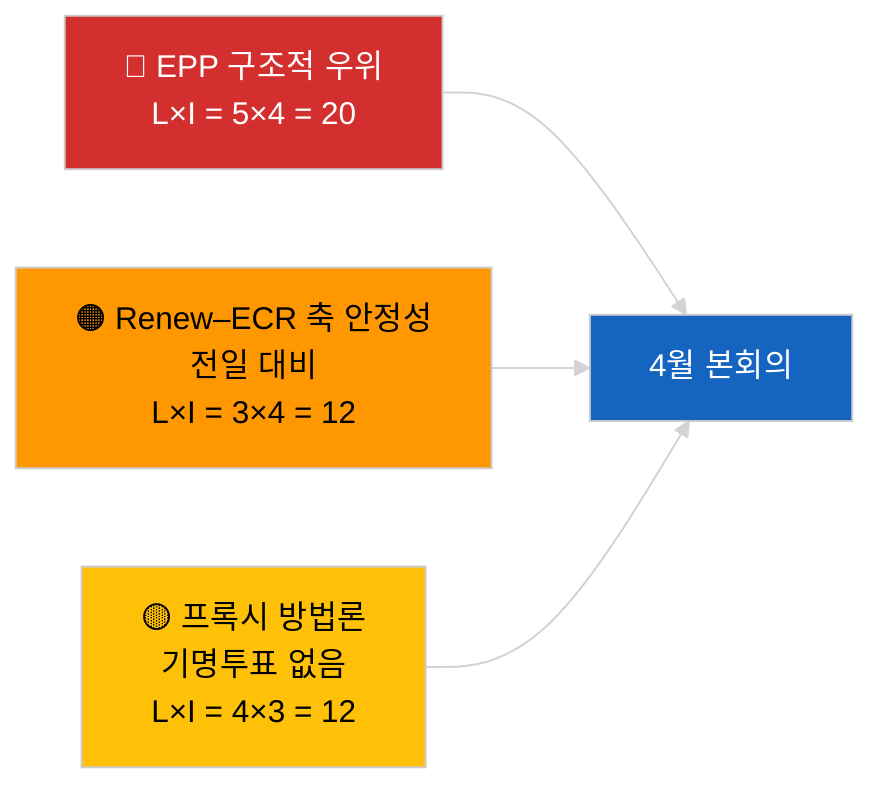

<!-- SPDX-FileCopyrightText: 2026 Hack23 AB -->
<!-- SPDX-License-Identifier: Apache-2.0 -->

# 집행 브리핑 — 속보 뉴스 (연립 역학) | 2026-04-04

**분류:** OSINT | 공개 의회 기록
**신뢰도:** 🟡 중간 (구조적 결속 업데이트; 기명투표 데이터 없음)
**작성일:** 2026-04-04T00:00:00Z (소급 브리핑)
**기사 유형:** 속보 — 연립 역학 평가
**출처:** 유럽의회 공개 데이터 포털

---

## 🎯 BLUF (결론 먼저)

**2026년 4월 4일 연립 계산은 전날의 구조적 상황을 확인한다: EPP(유럽인민당) 38%의 비대칭 우위와 Renew–ECR 결속 신호(~0.95)의 지속.** 본 기사는 동일한 28쌍 행렬을 이용한 의석 비율 기반 새로운 결속 계산을 제시하며, 결과는 어제와 수렴한다. 대연립(EPP+S&D = 60%)이 계속 기본 선택지로 남아 있으며; 초대연립(EPP+S&D+Renew = 65%)이 여유를 제공한다; 중도우파 대안(EPP+ECR+PfE = 57%)은 여전히 경쟁적 압력을 통해 S&D를 중도에 묶어두고 있다. 2026년 4월 3일 대비 한계적 신규 발견은 24시간 창에 걸친 결속 지표의 안정성이며, 일관된 값은 구조적 비대칭 가설을 지지하나 아직 프록시를 반증하지는 못한다. **🟡 중간 신뢰도** — 동일한 구조적 프록시 주의사항이 적용됨; 기명투표를 통한 검증은 1분기 발표 대기 중.

---

## 🧭 이 브리핑이 지원하는 3가지 결정

| # | 결정 | 결정자 | 마감 | 근거 |
|:-:|------|------|:---:|------|
| 1 | **편집:** 일일 재게시 건너뜀; 2026년 4월 3일 연립 기사와 통합 | 편집자 | +12시간 | 발견이 전날과 수렴 |
| 2 | **모니터링:** 4월 본회의 동안 Renew–ECR 결속 감시 유지 | 분석가 | 2026-04-30 | 검증 창 |
| 3 | **선행 관찰:** 1분기 표결 공개 즉시(5월 하순) 본회의 후 기명투표 데이터 통합 | 분석 리드 | 2026-05-31 | 반증 테스트 |

---

## 📰 60초 리드

- 🔴 **Renew–ECR 결속 0.95 전일 대비 유지**; 구조적 축 가설 여전히 테이블 위에. (🟡 중간)
- 🟠 **EPP 구조적 우위 38%** 변화 없음; 모든 실현 가능한 다수는 EPP를 필요로 함. (🟢 높음)
- 🟢 **대연립 60%, 초대연립 65%, 중도우파 대안 57%** 3가지 실현 가능한 다수 경로로 유지. (🟢 높음)
- 🟡 **파편화 지수 ~4.4 유효 정당** — 안정적. (🟡 중간)
- 🔵 **방법론적 주의:** EPP 쌍 점수는 규모 비율 모델 아티팩트로 여전히 0.00. (🟢 높음)
- 🟣 **교차 참조:** `breaking-2`는 EP10 1분기 입법 파이프라인을 커버; `breaking-3`은 휴회 기간 분석적 한계를 문서화; `breaking-4`는 채택 텍스트 심층 분석 수행. (🟢 높음)
- 🩷 **혼란 벡터:** Renew–ECR 구현은 S&D의 협상력을 감소시킬 것. (🟡 중간)
- ⚪ **이월:** 검증을 위해 5월 하순 기명투표 데이터 대기.

---

## 🗂️ 주요 발견 테이블

| 순위 | 발견 | 결속 / 의석 점유율 | 신뢰도 | 상태 |
|:---:|------|:--------------:|:-----:|------|
| 1 | Renew–ECR 결속 (전일 대비 안정) | 0.95 | 🟡 중간 | 검증 대기 |
| 2 | 대연립 실현 가능성 | 60% | 🟢 높음 | 기본값 |
| 3 | 초대연립 여유 | 65% | 🟢 높음 | 이용 가능 |
| 4 | 중도우파 대안 | 57% | 🟢 높음 | S&D에 대한 규율 레버 |

---

## ⚠️ 위험 및 위협 스냅샷

| 위험 | L | I | 점수 | 트리거 | 출처 | 해군부 |
|-----|:-:|:-:|:---:|-------|------|:-----:|
| EPP 구조적 우위 | 5 | 4 | 20 | 모든 실현 가능한 다수는 EPP를 필요로 함 | 연립 계산 | A1 |
| Renew–ECR 축 안정성 | 3 | 4 | 12 | 전일 대비 결속 | 결속 행렬 | B2 |
| 방법론적 프록시 | 4 | 3 | 12 | 기명투표 데이터 없음 | EP API 지연 | A2 |

---

## 🔮 주요 선행 트리거

**3일차 결속 재측정 및 궁극적으로 4월 본회의 기명투표 데이터(5월 하순).** 지속적인 전일 대비 안정성은 기명투표 없이도 구조적 축 가설을 강화한다.

---

## 🛡️ 출처 품질 평가

- **1차 출처:** EP MCP 분석 도구 (`breaking-2` API 상태 확인에 따라 운영 중); 28쌍 결속 행렬.
- **전일 대비 안정성 신뢰도:** 🟢 높음.
- **축 해석 신뢰도:** 🟡 중간 — 2026-04-03/breaking과 동일한 구조적 주의사항.

---

## 📎 링크

| 링크 | 경로 |
|-----|-----|
| 기사 | `./article.md` |
| 형제 분석 | `analysis/daily/2026-04-04/breaking-2/`, `breaking-3/`, `breaking-4/`, `week-in-review/` |
| 이전 연립 평가 | `analysis/daily/2026-04-03/breaking/` |
| 매니페스트 | `./manifest.json` |

---

**문서 관리**
- **템플릿:** `/analysis/templates/executive-brief.md`
- **아티팩트 경로:** `analysis/daily/2026-04-04/breaking/executive-brief.md`
- **분류:** 공개
- **소급 생성:** 백필 세션.
