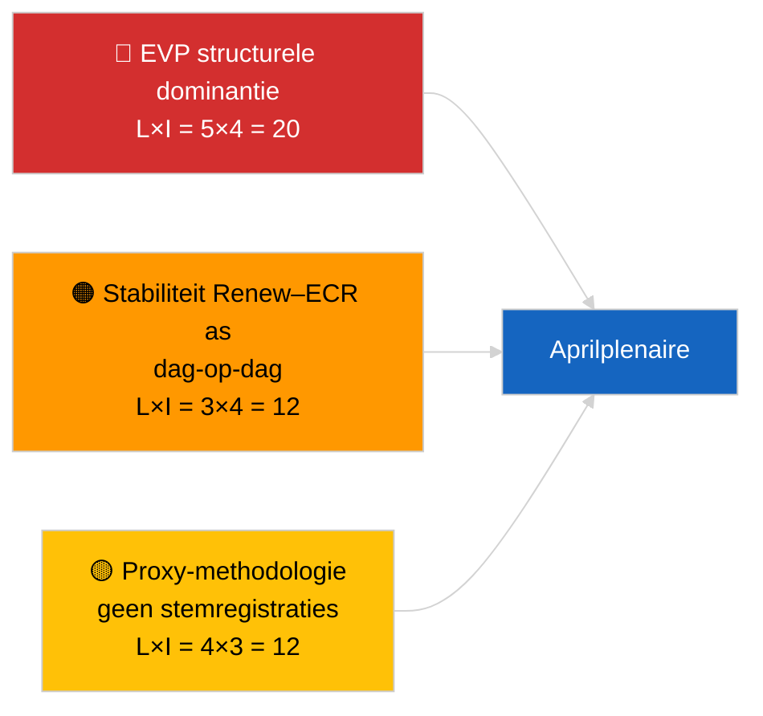

<!-- SPDX-FileCopyrightText: 2026 Hack23 AB -->
<!-- SPDX-License-Identifier: Apache-2.0 -->

# Uitvoerende Briefing — Urgente Berichten (Coalitiedynamiek) | 2026-04-04

**Classificatie:** OSINT | Openbaar parlementair verslag
**Betrouwbaarheid:** 🟡 Gemiddeld (update structurele cohesie; geen stemregistratiegegevens)
**Gegenereerd:** 2026-04-04T00:00:00Z (retrospectieve briefing)
**Artikeltype:** Urgent — Beoordeling coalitiedynamiek
**Bron:** Open Dataportaal Europees Parlement

---

## 🎯 BLUF

**De coalitie-arithmetiek van 4 april 2026 bevestigt het structurele beeld van de vorige dag: asymmetrische dominantie van EVP op 38% en het cohesiesignaal van Renew–ECR (~0,95) gaat door.** Het artikel presenteert een nieuwe cohesieberekening op basis van zetelverhoudingen met dezelfde matrix van 28 paren; resultaten convergeren met gisteren. De Grote Coalitie (EVP+S&D = 60%) blijft de standaardoptie; Super-Groot (EVP+S&D+Renew = 65%) biedt ruimte; het Centrum-Rechtse alternatief (EVP+ECR+PfE = 57%) bindt S&D via competitieve druk aan het centrum. De marginale nieuwe bevinding ten opzichte van 3 april 2026 is de stabiliteit van de cohesiemetingen over een periode van 24 uur — consistente waarden ondersteunen de structurele asymmetriehypothese, ook al kunnen ze de proxy nog niet falsifiëren. **🟡 GEMIDDELDE BETROUWBAARHEID** — dezelfde structurele proxywaarschuwing geldt; validatie via stemregistraties nog in afwachting van publicatie K1.

---

## 🧭 3 Beslissingen die deze briefing ondersteunt

| # | Beslissing | Wie beslist | Deadline | Bewijs |
|:-:|-----------|------------|:--------:|--------|
| 1 | **Redactioneel:** OVERSLAAN dagelijkse herpublicatie; consolideren met coalitie-artikel van 3 april 2026 | Redacteur | +12u | Bevindingen convergeren met vorige dag |
| 2 | **Monitoring:** Renew–ECR cohesieobservatie handhaven tijdens aprilplenaire | Analist | 2026-04-30 | Validatievenster |
| 3 | **Vooruitblik:** stemregistratiegegevens na plenaire vergadering integreren zodra K1-stemmen gepubliceerd worden (eind mei) | Analysecoördinator | 2026-05-31 | Falsificatietest |

---

## 📰 60-Secondenlezing

- 🔴 **Renew–ECR cohesie van 0,95 dag-op-dag gehandhaafd**; hypothese structurele as staat nog steeds. (🟡 Gemiddeld)
- 🟠 **Structurele dominantie EVP op 38%** ongewijzigd; alle haalbare meerderheden vereisen EVP. (🟢 Hoog)
- 🟢 **Grote Coalitie 60%, Super-Groot 65%, Centrum-Rechts alternatief 57%** blijven de drie haalbare meerderheidsroutes. (🟢 Hoog)
- 🟡 **Fragmentatie-index ~4,4 effectieve partijen** — stabiel. (🟡 Gemiddeld)
- 🔵 **Methodologische kanttekening:** EVP-paarscores nog steeds 0,00 door artefact van het omvangsratiomodel. (🟢 Hoog)
- 🟣 **Kruisverwijzing:** neefanalyse `breaking-2` dekt de K1-wetgevingspijplijn EP10; `breaking-3` documenteert analytische beperkingen tijdens reces; `breaking-4` voert een diepgaande analyse van aangenomen teksten uit. (🟢 Hoog)
- 🩷 **Verstoringsvektor:** materialisatie van Renew–ECR zou de invloed van S&D verminderen. (🟡 Gemiddeld)
- ⚪ **Openstaand:** wachten op stemregistratiegegevens eind mei voor validatie.

---

## 🗂️ Tabel Topbevindingen

| Rang | Bevinding | Cohesie / Aandeel | Betrouwbaarheid | Status |
|:---:|----------|:-----------------:|:---------------:|--------|
| 1 | Renew–ECR cohesie (dag-op-dag stabiel) | 0,95 | 🟡 GEMIDDELD | In afwachting van validatie |
| 2 | Haalbaarheid Grote Coalitie | 60% | 🟢 HOOG | Standaard |
| 3 | Super-Groot marge | 65% | 🟢 HOOG | Beschikbaar |
| 4 | Centrum-Rechts alternatief | 57% | 🟢 HOOG | Disciplinaire hefboom op S&D |

---

## ⚠️ Risico- en Dreigingsoverzicht

| Risico | L | I | Score | Trigger | Bron | Admiraliteit |
|--------|:-:|:-:|:-----:|---------|------|:------------:|
| EVP structurele dominantie | 5 | 4 | 20 | Alle haalbare meerderheden vereisen EVP | Coalitie-arithmetiek | A1 |
| Stabiliteit Renew–ECR as | 3 | 4 | 12 | Dag-op-dag cohesie | Cohesiematrix | B2 |
| Methodologische proxy | 4 | 3 | 12 | Geen stemregistraties beschikbaar | EP API-vertraging | A2 |

---

## 🔮 Voornaamste Voorwaartse Trigger

**Cohesie-hertest op dag 3 en uiteindelijk stemregistratiegegevens van de aprilplenaire (eind mei).** Aanhoudende dag-op-dag stabiliteit versterkt de structurele ashypothese zelfs zonder stemregistraties.

---

## 🛡️ Beoordeling Bronkwaliteit

- **Primaire bronnen:** EP MCP-analytische instrumenten (operationeel per API-gezondheidscontrole `breaking-2`); cohesiematrix van 28 paren.
- **Betrouwbaarheid dag-op-dag stabiliteit:** 🟢 HOOG.
- **Betrouwbaarheid asinterpretatie:** 🟡 GEMIDDELD — dezelfde structurele kanttekeningen als bij 2026-04-03/breaking.

---

## 📎 Koppelingen

| Koppeling | Pad |
|-----------|-----|
| Artikel | `./article.md` |
| Neefanalyses | `analysis/daily/2026-04-04/breaking-2/`, `breaking-3/`, `breaking-4/`, `week-in-review/` |
| Vorige coalitie-beoordeling | `analysis/daily/2026-04-03/breaking/` |
| Manifest | `./manifest.json` |

---

**Documentbeheer**
- **Sjabloon:** `/analysis/templates/executive-brief.md`
- **Artefactpad:** `analysis/daily/2026-04-04/breaking/executive-brief.md`
- **Classificatie:** Openbaar
- **Retrospectieve generatie:** Aanvul-sessie.
