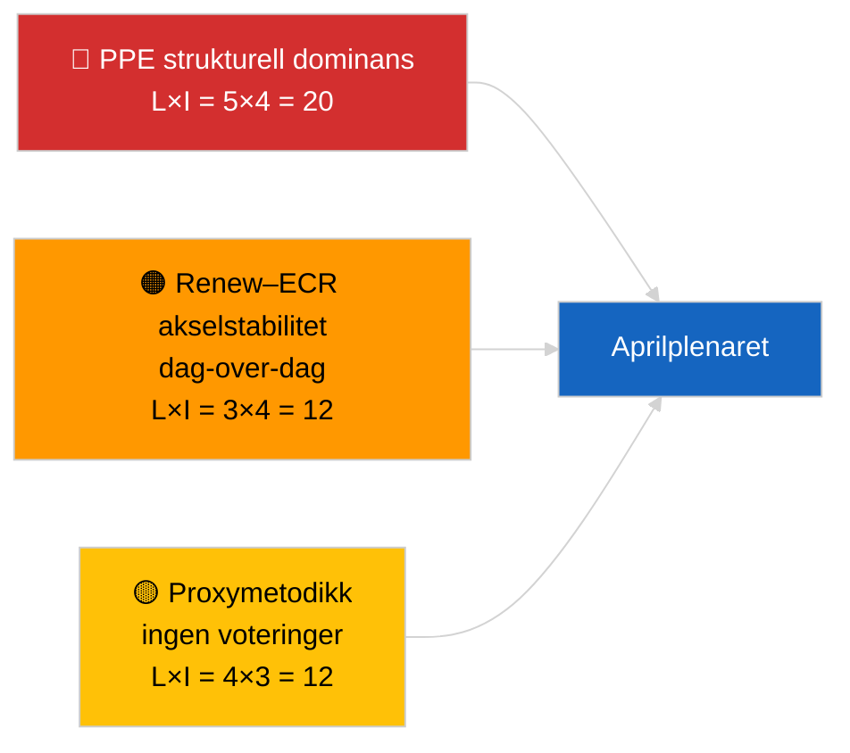

<!-- SPDX-FileCopyrightText: 2026 Hack23 AB -->
<!-- SPDX-License-Identifier: Apache-2.0 -->

# Lederorienteringen — Siste nytt (Koalisjonsdynamikk) | 2026-04-04

**Klassifisering:** OSINT | Offentlig parlamentarisk protokoll
**Konfidensnivå:** 🟡 Middels (strukturell kohesionsoppdatering; ingen voteringsdata)
**Generert:** 2026-04-04T00:00:00Z (retrospektiv orientering)
**Artikkeltype:** Siste nytt — Koalisjonsdynamikkvurdering
**Kilde:** Europaparlamentets åpne dataportal

---

## 🎯 BLUF

**Koalisjonsaritmetikken den 2026-04-04 bekrefter forrige dags strukturbilde: PPE-s asymmetriske dominans på 38 % og Renew–ECR-kohesjonssignalet (~0,95) fortsetter.** Artikkelen presenterer en ny seteandelsberegning med den samme 28-parmatrisen; resultatene konvergerer med gårsdagens. Storkoalisjonen (PPE+S&D = 60 %) er standard; Superkoalisjonen (PPE+S&D+Renew = 65 %) gir en buffer; det senterrettsorienterte alternativet (PPE+ECR+PfE = 57 %) binder fortsatt S&D til sentrum gjennom konkurranse. Det marginalt nye funnet sammenlignet med 2026-04-03 er stabiliteten i kohesjonsmålingene over et 24-timers vindu. **🟡 MIDDELS konfidensnivå** — samme strukturelle proxy-forbehold; voteringsvalidering avventer fortsatt Q1-publisering.

---

## 🧭 3 beslutninger denne orienteringen støtter

| # | Beslutning | Beslutningstager | Frist | Dokumentasjon |
|:-:|-----------|------------------|:-----:|---------------|
| 1 | **Redaksjonell:** HOPP OVER daglig republisering; konsolider med koalisjonsartikkelen 2026-04-03 | Redaktør | +12t | Funn konvergerer med foregående dag |
| 2 | **Overvåking:** oppretthold Renew–ECR-kohesjonsvakt gjennom aprilplenumet | Analytiker | 2026-04-30 | Valideringsvindu |
| 3 | **Fremovervakt:** integrer voteringsdata etter plenumet når Q1-stemmer publiseres (sen mai) | Analyseleder | 2026-05-31 | Falsifikasjonstest |

---

## 📰 60-sekunders lesning

- 🔴 **Renew–ECR 0,95 kohesjon opprettholdt** dag-over-dag; hypotesen om strukturaksen er fortsatt åpen. (🟡 Middels)
- 🟠 **PPE-s strukturelle dominans på 38 %** uendret; alle levedyktige flertall krever PPE. (🟢 Høy)
- 🟢 **Storkoalisjon 60 %, Superkoalisjon 65 %, senterrettsalternativ 57 %** forblir de tre levedyktige flertallsrutene. (🟢 Høy)
- 🟡 **Fragmenteringsindeks ~4,4 effektive partier** — stabilt. (🟡 Middels)
- 🔵 **Metodologisk forbehold:** PPE-parscorer fortsatt 0,00 pga. størrelsesandelsmodellens artefakt. (🟢 Høy)
- 🟣 **Kryssreferanse:** søsken `breaking-2` dekker EP10 Q1 lovgivningspipeline; `breaking-3` dokumenterer analytiske begrensninger i resesperioden; `breaking-4` gjennomfører dypdykk i vedtatte tekster. (🟢 Høy)
- 🩷 **Forstyrrelsevektor:** Renew–ECR-materialisering ville redusere S&D-s innflytelse. (🟡 Middels)
- ⚪ **Videreføring:** vent på voteringsdata i sen mai for validering.

---

## 🗂️ Tabell over viktigste funn

| Rang | Funn | Kohesjon/Andel | Konfidensnivå | Status |
|:----:|------|:--------------:|:-------------:|--------|
| 1 | Renew–ECR kohesjon (stabil dag-over-dag) | 0,95 | 🟡 MIDDELS | Avventer validering |
| 2 | Storkoalisjonens levedyktighet | 60 % | 🟢 HØY | Standard |
| 3 | Superkoalisjonens buffer | 65 % | 🟢 HØY | Tilgjengelig |
| 4 | Senterrettsalternativ | 57 % | 🟢 HØY | Disiplinerende løftestang mot S&D |

---

## ⚠️ Risiko- og trusselbilde

| Risiko | L | I | Score | Utløser | Kilde | Admiralitet |
|--------|:-:|:-:|:-----:|---------|-------|:-----------:|
| PPE strukturell dominans | 5 | 4 | 20 | Alle levedyktige flertall krever PPE | Koalisjonsaritmetikk | A1 |
| Renew–ECR akselstabilitet | 3 | 4 | 12 | Dag-over-dag kohesjon | Kohesjonmatrise | B2 |
| Metodologisk proxy | 4 | 3 | 12 | Ingen voteringer tilgjengelige | EP API-forsinkelse | A2 |

---

## 🔮 Viktigste fremtidige utløser

**Dag-3-kohesjonsgjenoprøving og i siste instans aprilvoteringsdata fra Strasbourg (sen mai).** Vedvarende dag-over-dag-stabilitet styrker hypotesen om strukturaksen selv uten voteringer.

---

## 🛡️ Vurdering av kildekvalitet

- **Primære kilder:** EP MCP analytiske verktøy (operative per `breaking-2` API-helseprøve); 28-parskohesjonmatrise.
- **Konfidensnivå dag-over-dag stabilitet:** 🟢 HØY.
- **Konfidensnivå akseltolkning:** 🟡 MIDDELS — samme strukturelle forbehold som 2026-04-03/breaking.

---

## 📎 Lenker

| Lenke | Bane |
|-------|------|
| Artikkel | `./article.md` |
| Søskenkjøringer | `analysis/daily/2026-04-04/breaking-2/`, `breaking-3/`, `breaking-4/`, `week-in-review/` |
| Tidligere koalisjonsvurdering | `analysis/daily/2026-04-03/breaking/` |
| Manifest | `./manifest.json` |

---

**Dokumentkontroll**
- **Mal:** `/analysis/templates/executive-brief.md`
- **Artefaktbane:** `analysis/daily/2026-04-04/breaking/executive-brief.md`
- **Klassifisering:** Offentlig
- **Retrospektiv generering:** Tilbakefyllingssesjon.
