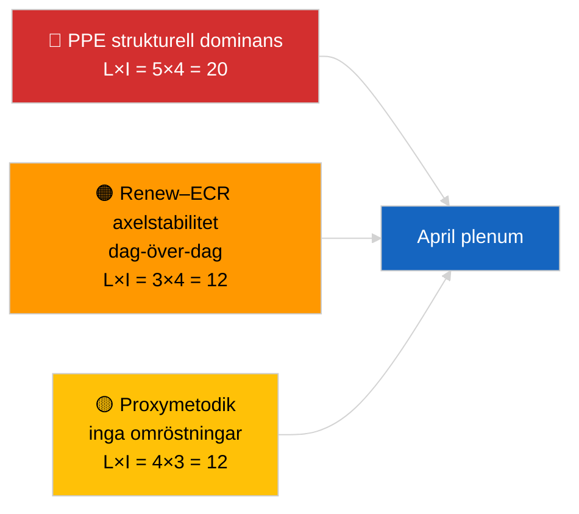

<!-- SPDX-FileCopyrightText: 2026 Hack23 AB -->
<!-- SPDX-License-Identifier: Apache-2.0 -->

# Exekutiv sammanfattning — Aktuellt (Koalitionsdynamik) | 2026-04-04

**Klassificering:** OSINT | Offentligt parlamentariskt protokoll
**Konfidensgrad:** 🟡 Medel (strukturell kohesionsuppdatering; inga omröstningsdata)
**Genererad:** 2026-04-04T00:00:00Z (retrospektiv sammanfattning)
**Artikeltyp:** Aktuellt — Koalitionsdynamikbedömning
**Källa:** Europaparlamentets öppna dataportal

---

## 🎯 BLUF

**Koalitionens aritmetik den 2026-04-04 bekräftar föregående dags strukturbild: PPE:s asymmetriska dominans på 38 % och Renew–ECR-kohesionssignalen (~0,95) kvarstår.** Artikeln presenterar en ny sätesandelsberäkning med samma 28-parmatris; resultaten konvergerar med gårdagens. Storkoalitionen (PPE+S&D = 60 %) är standard; Superkoalitionen (PPE+S&D+Renew = 65 %) ger en buffert; det centerrättsliga alternativet (PPE+ECR+PfE = 57 %) binder fortfarande S&D till centrum via konkurrenssänkt tryck. Det marginellt nya fyndet jämfört med 2026-04-03 är kohesionsmätningarnas stabilitet över ett 24-timmarsfönster — konsekventa värden stöder hypotesen om strukturell asymmetri. **🟡 MEDEL konfidensgrad** — samma strukturella proxybehållning; omröstningsvalidering väntar fortfarande Q1-publicering.

---

## 🧭 3 beslut som denna sammanfattning stöder

| # | Beslut | Beslutsfattare | Deadline | Underlag |
|:-:|--------|----------------|:--------:|----------|
| 1 | **Redaktionell:** HOPPA ÖVER daglig återpublicering; konsolidera med koalitionsstycket 2026-04-03 | Redaktör | +12h | Fynd konvergerar med föregående dag |
| 2 | **Övervakning:** upprätthåll Renew–ECR-kohesionsbevakning genom april plenum | Analytiker | 2026-04-30 | Valideringsfönster |
| 3 | **Framåtbevakning:** integrera omröstningsdata efter plenum när Q1-röster publiceras (sent i maj) | Analysledare | 2026-05-31 | Falsifieringstest |

---

## 📰 60-sekunders läsning

- 🔴 **Renew–ECR 0,95 kohesion bibehållen** dag-över-dag; hypotesen om strukturaxeln kvarstår. (🟡 Medel)
- 🟠 **PPE:s strukturella dominans på 38 %** oförändrad; alla gångbara majoriteter kräver PPE. (🟢 Hög)
- 🟢 **Storkoalition 60 %, Superkoalition 65 %, Centerrättsligt alternativ 57 %** kvarstår som de tre gångbara majoritetssvägarna. (🟢 Hög)
- 🟡 **Fragmenteringsindex ~4,4 effektiva partier** — stabilt. (🟡 Medel)
- 🔵 **Metodologisk varning:** PPE-parpoäng fortfarande 0,00 pga. storleksandelsmodellens artefakt. (🟢 Hög)
- 🟣 **Korsreferens:** syskon `breaking-2` täcker EP10 Q1 lagstiftningspipeline; `breaking-3` dokumenterar analytiska begränsningar under recessen; `breaking-4` utför djupgranskning av antagna texter. (🟢 Hög)
- 🩷 **Störningsvektor:** Renew–ECR-materialisering skulle minska S&D:s inflytande. (🟡 Medel)
- ⚪ **Carry-forward:** vänta på omröstningsdata i slutet av maj för validering.

---

## 🗂️ Tabellen med viktigaste fynd

| Rang | Fynd | Kohesion/Andel | Konfidensgrad | Status |
|:----:|------|:--------------:|:-------------:|--------|
| 1 | Renew–ECR kohesion (stabil dag-över-dag) | 0,95 | 🟡 MEDEL | Väntar validering |
| 2 | Storkoalitionens gångbarhet | 60 % | 🟢 HÖG | Standard |
| 3 | Superkoalitionens buffert | 65 % | 🟢 HÖG | Tillgänglig |
| 4 | Centerrättsligt alternativ | 57 % | 🟢 HÖG | Disciplinerande hävstång mot S&D |

---

## ⚠️ Risk- och hotöversikt

| Risk | L | I | Poäng | Utlösare | Källa | Admiralitet |
|------|:-:|:-:|:-----:|---------|--------|:-----------:|
| PPE strukturell dominans | 5 | 4 | 20 | Alla gångbara majoriteter kräver PPE | Koalitionsaritmetik | A1 |
| Renew–ECR axelstabilitet | 3 | 4 | 12 | Dag-över-dag kohesion | Kohesionsmatris | B2 |
| Metodologisk proxy | 4 | 3 | 12 | Inga omröstningar tillgängliga | EP API-fördröjning | A2 |

---

## 🔮 Viktigaste framåtutlösare

**Dag-3-kohesionsåterundersökning och slutligen april Strasbourgs omröstningsdata (sent i maj).** Bevarad dag-över-dag-stabilitet stärker hypotesen om strukturaxeln även utan omröstningar.

---

## 🛡️ Bedömning av källkvalitet

- **Primära källor:** EP MCP analytiska verktyg (operativa per `breaking-2` API-hälsosond); 28-parskohesionsmatris.
- **Konfidensgrad dag-över-dag stabilitet:** 🟢 HÖG.
- **Konfidensgrad axeltolkning:** 🟡 MEDEL — samma strukturella förbehåll som 2026-04-03/breaking.

---

## 📎 Länkar

| Länk | Sökväg |
|------|--------|
| Artikel | `./article.md` |
| Syskonkörningar | `analysis/daily/2026-04-04/breaking-2/`, `breaking-3/`, `breaking-4/`, `week-in-review/` |
| Tidigare koalitionsbedömning | `analysis/daily/2026-04-03/breaking/` |
| Manifest | `./manifest.json` |

---

**Dokumentkontroll**
- **Mall:** `/analysis/templates/executive-brief.md`
- **Artefaktsökväg:** `analysis/daily/2026-04-04/breaking/executive-brief.md`
- **Klassificering:** Offentlig
- **Retrospektiv generering:** Bakfyllningssession.
