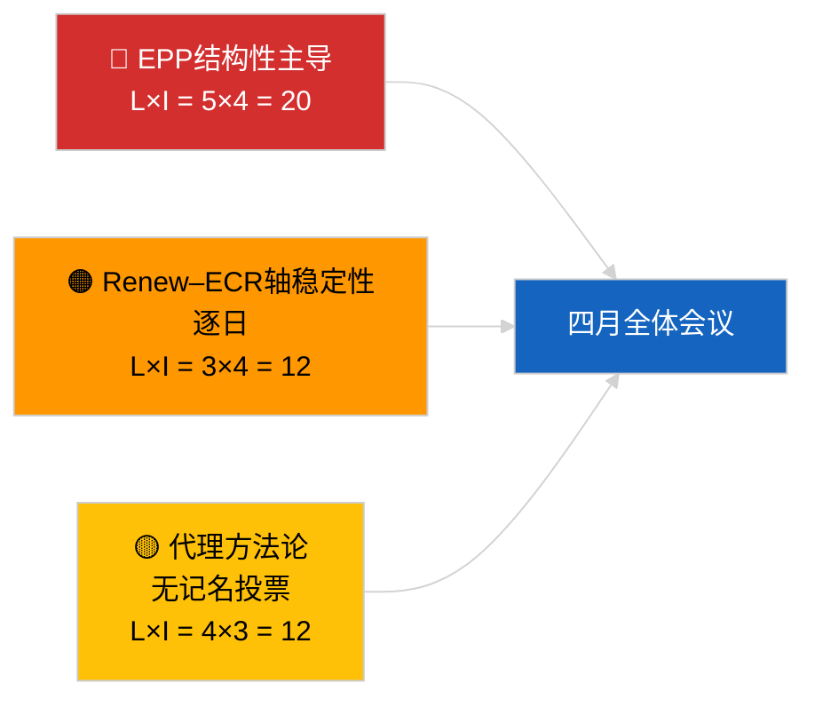

<!-- SPDX-FileCopyrightText: 2026 Hack23 AB -->
<!-- SPDX-License-Identifier: Apache-2.0 -->

# 执行简报 — 突发新闻（联盟动态）| 2026-04-04

**分类：** OSINT | 公开议会记录
**置信度：** 🟡 中等（结构性凝聚力更新；无记名投票数据）
**生成时间：** 2026-04-04T00:00:00Z（追溯简报）
**文章类型：** 突发新闻 — 联盟动态评估
**来源：** 欧洲议会开放数据门户

---

## 🎯 BLUF（结论先行）

**2026年4月4日的联盟计算确认了前一天的结构性状况：欧洲人民党（EPP）38%的非对称主导地位，以及Renew–ECR凝聚力信号（~0.95）的持续。** 本文使用相同的28对矩阵提出了新的议席比率凝聚力计算，结果与昨日收敛。大联盟（EPP+S&D = 60%）仍是默认选项；超级大联盟（EPP+S&D+Renew = 65%）提供缓冲；中右翼替代方案（EPP+ECR+PfE = 57%）继续通过竞争压力将S&D绑定于中间派。与2026年4月3日相比的边际新发现是凝聚力测量值在24小时窗口内的稳定性——一致的数值支持结构性非对称假设，即使尚无法证伪该代理指标。**🟡 中等置信度** — 同样的结构性代理警告适用；通过记名投票进行的验证仍待第一季度数据发布。

---

## 🧭 本简报支持的3项决策

| # | 决策 | 决策者 | 截止时间 | 证据 |
|:-:|------|-------|:------:|------|
| 1 | **编辑：** 跳过日常重新发布；与2026年4月3日联盟文章合并 | 编辑 | +12小时 | 发现与前日收敛 |
| 2 | **监测：** 在4月全体会议期间维持Renew–ECR凝聚力监测 | 分析师 | 2026-04-30 | 验证窗口 |
| 3 | **前瞻性观察：** 一旦第一季度投票数据发布（五月下旬），整合全体会议后的记名投票数据 | 分析负责人 | 2026-05-31 | 证伪测试 |

---

## 📰 60秒阅读

- 🔴 **Renew–ECR凝聚力0.95逐日维持**；结构性轴线假设仍在讨论中。 (🟡 中等)
- 🟠 **EPP结构性主导地位38%**不变；所有可行多数均需要EPP参与。 (🟢 高)
- 🟢 **大联盟60%、超级大联盟65%、中右翼替代57%**仍是三条可行多数路径。 (🟢 高)
- 🟡 **碎片化指数约4.4个有效政党** — 稳定。 (🟡 中等)
- 🔵 **方法论注意：** EPP配对分数因规模比例模型假象仍为0.00。 (🟢 高)
- 🟣 **交叉参考：** `breaking-2`涵盖EP10第一季度立法管道；`breaking-3`记录休会期间的分析局限；`breaking-4`对通过文本进行深度分析。 (🟢 高)
- 🩷 **颠覆向量：** Renew–ECR轴线的实现将削减S&D的影响力。 (🟡 中等)
- ⚪ **结转：** 等待五月下旬记名投票数据以进行验证。

---

## 🗂️ 主要发现汇总表

| 排名 | 发现 | 凝聚力 / 席位份额 | 置信度 | 状态 |
|:---:|------|:--------------:|:-----:|------|
| 1 | Renew–ECR凝聚力（逐日稳定） | 0.95 | 🟡 中等 | 待验证 |
| 2 | 大联盟可行性 | 60% | 🟢 高 | 默认选项 |
| 3 | 超级大联盟缓冲 | 65% | 🟢 高 | 可用 |
| 4 | 中右翼替代方案 | 57% | 🟢 高 | 对S&D的纪律杠杆 |

---

## ⚠️ 风险与威胁快照

| 风险 | L | I | 分数 | 触发因素 | 来源 | 海军部评级 |
|-----|:-:|:-:|:---:|---------|------|:---------:|
| EPP结构性主导 | 5 | 4 | 20 | 所有可行多数均需EPP参与 | 联盟计算 | A1 |
| Renew–ECR轴稳定性 | 3 | 4 | 12 | 逐日凝聚力 | 凝聚力矩阵 | B2 |
| 方法论代理指标 | 4 | 3 | 12 | 无记名投票数据 | EP API延迟 | A2 |

---

## 🔮 主要前瞻触发因素

**第3天凝聚力重新探测，最终是4月全体会议记名投票数据（五月下旬）。** 逐日持续稳定性即使在没有记名投票的情况下也能强化结构性轴线假设。

---

## 🛡️ 来源质量评估

- **一级来源：** EP MCP分析工具（根据`breaking-2` API健康探测正常运行）；28对凝聚力矩阵。
- **逐日稳定性置信度：** 🟢 高。
- **轴线解读置信度：** 🟡 中等 — 与2026-04-03/breaking相同的结构性注意事项。

---

## 📎 链接

| 链接 | 路径 |
|-----|-----|
| 文章 | `./article.md` |
| 同期分析 | `analysis/daily/2026-04-04/breaking-2/`, `breaking-3/`, `breaking-4/`, `week-in-review/` |
| 前期联盟评估 | `analysis/daily/2026-04-03/breaking/` |
| 清单 | `./manifest.json` |

---

**文档控制**
- **模板：** `/analysis/templates/executive-brief.md`
- **产物路径：** `analysis/daily/2026-04-04/breaking/executive-brief.md`
- **分类：** 公开
- **追溯生成：** 回填会话。
