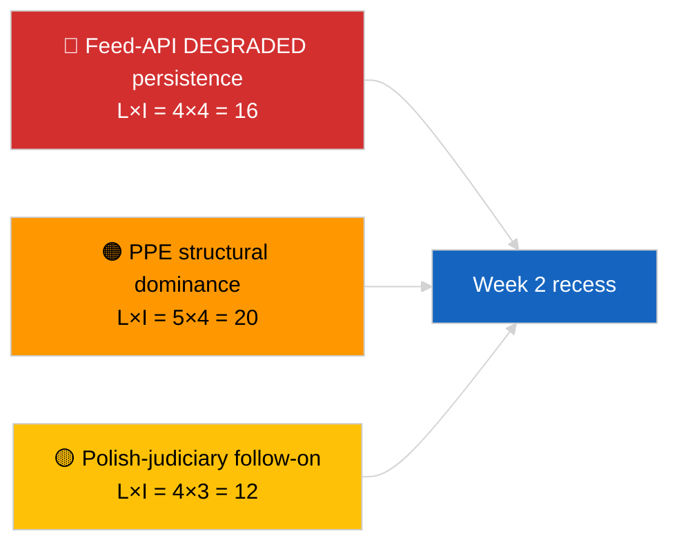
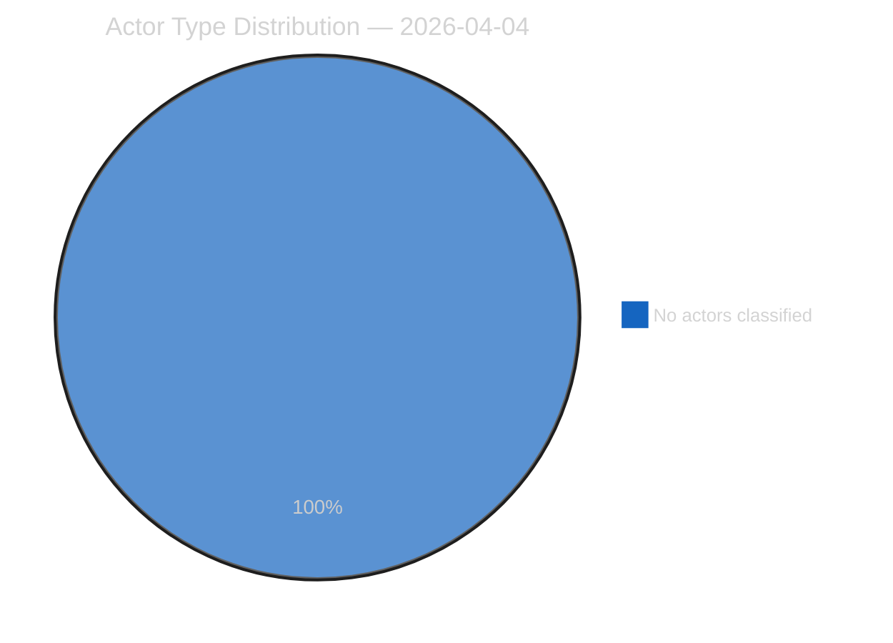
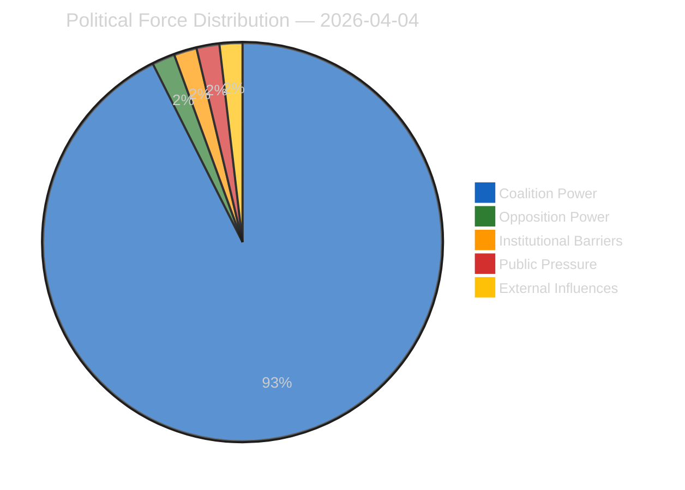
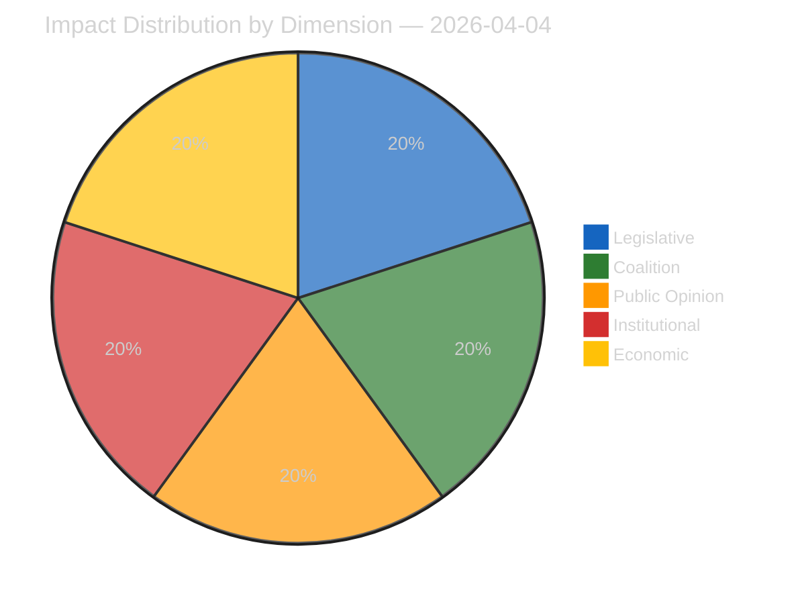
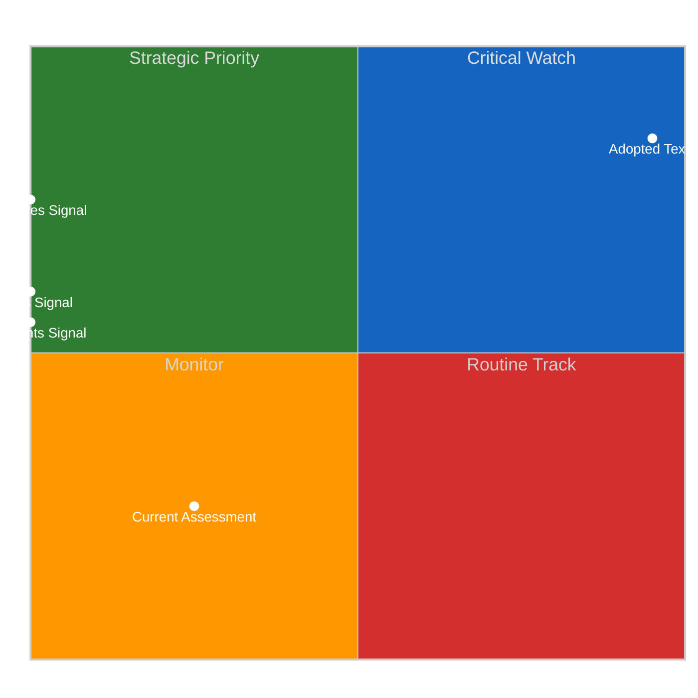
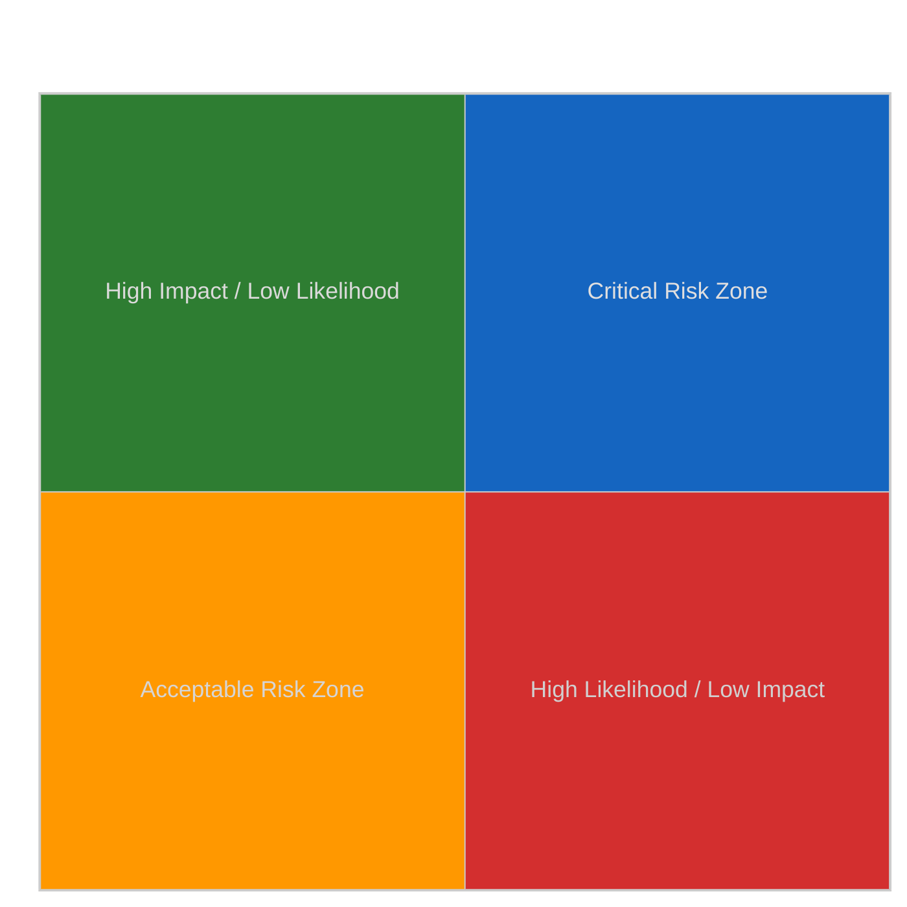
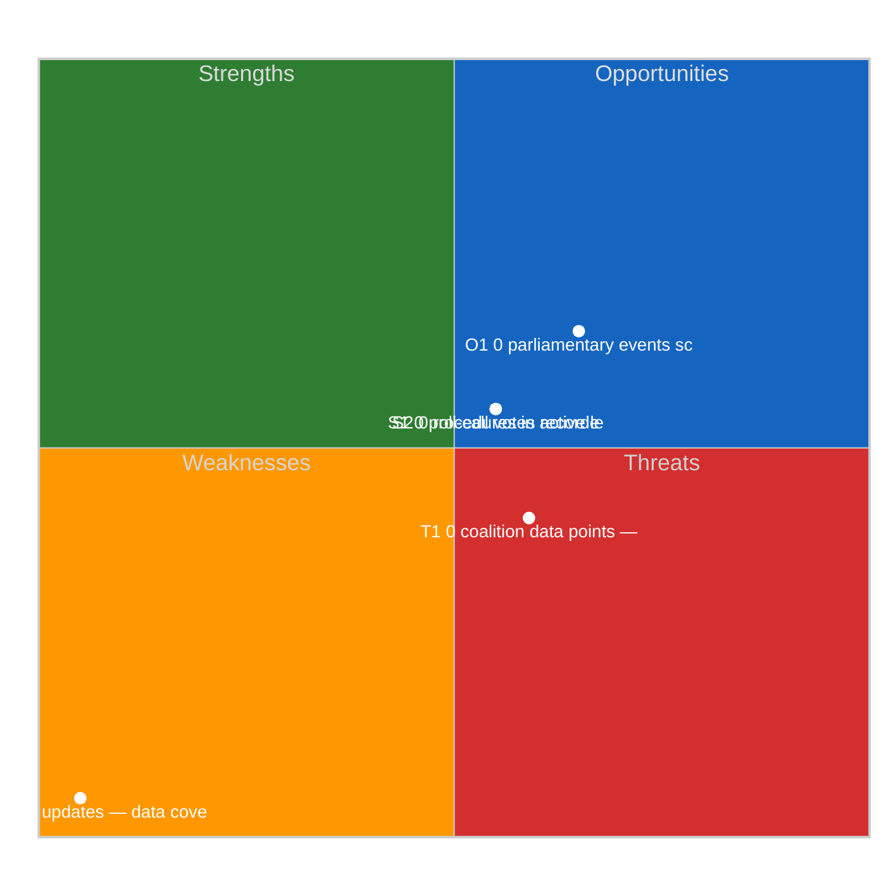
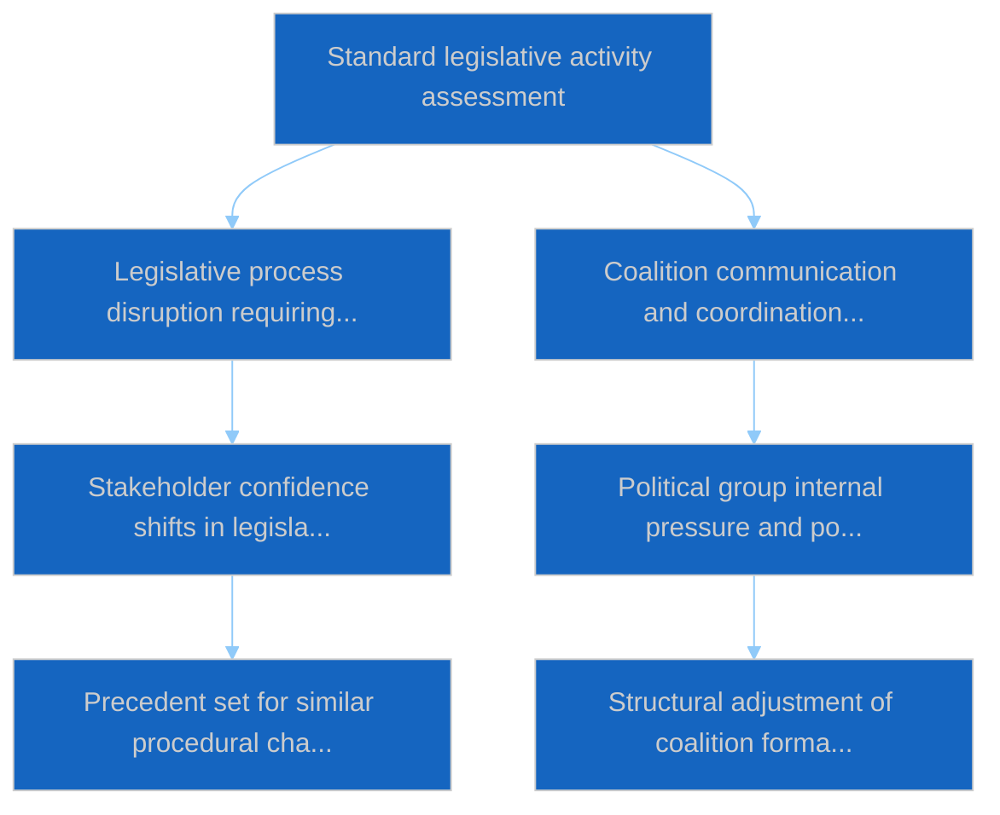

# Week In Review — 2026-04-04

<h2 id="section-executive-brief">Executive Brief</h2>

### 🎯 BLUF

**Week of 30 March → 4 April 2026 was a full recess week with the two defining intelligence signals being analytical/operational rather than legislative: (1) confirmation of EP feed-API DEGRADED state across 8 endpoints, and (2) formalisation of the EP10 coalition arithmetic showing PPE 38% structural dominance plus the Renew–ECR cohesion signal of 0.95.** The third recurring signal is the anti-corruption / institutional-reform cluster (TA-10-2026-0094 + 3 supporting texts) carrying over from the 26 March Brussels mini-plenary. Run `e92a23d1-ea51-4917-b351-16f1f93fd4a3` returned **"Quantitative risk scoring across 0 identified political dimensions"** — week-in-review synthesis is therefore reconstructed from the substantive sibling and prior-day runs. **🟢 HIGH confidence** on the three signals; the week's "no plenary, no new procedures" baseline is calendar-anchored.

---

### 🧭 3 Decisions This Brief Supports

| # | Decision | Who Decides | Deadline | Evidence |
|:-:|----------|-------------|:--------:|----------|
| 1 | **Editorial:** publish week-in-review as a three-signal synthesis (API health + coalition arithmetic + reform cluster) | Editor | +24h | Sibling-run convergence |
| 2 | **Monitoring:** maintain daily endpoint probes through Easter recess end (13 April) | Data pipeline | daily | Restore detection |
| 3 | **Forward-watch:** Q2 begins 7 April with Commission Tuesday; first plenary week 13-17 April committee work-week | Analysis lead | 2026-04-07 | Q1→Q2 transition |

---

### 📰 60-Second Read

- 🔴 **EP API DEGRADED state** confirmed by 3-run probe on 2026-04-03; 5/8 mandatory feeds failing. (🟢 High)
- 🟠 **Coalition arithmetic** formalised: PPE 38% structural dominance; Renew–ECR 0.95 cohesion signal; Grand-Coalition 60% default. (🟡 Medium on cohesion interpretation; 🟢 High on seat shares)
- 🟢 **Anti-corruption / institutional-reform cluster** (TA-10-2026-0094 + 3) carry-over remains the dominant Q1 legislative signal. (🟢 High)
- 🟡 **No plenary, no committee sittings, no new procedures** during the week. (🟢 High)
- 🔵 **Economic context:** US-EU trade trajectory continues; Mercosur ECJ opinion awaited. (🟢 High)
- 🟣 **Cross-reference:** four 2026-04-04 sibling runs converge on the same triad. (🟢 High)
- 🩷 **Disruption vector:** Polish-judiciary follow-on (Braun-precedent) is the highest-probability vector for an April-plenary surprise. (🟡 Medium)
- ⚪ **Carry-forward:** transposition windows for tier-1 March adoptions extend to Q1 2028.

---

### 🗂️ Top Findings — Week of 30 March → 4 April 2026

| Rank | Finding | Source | Significance | Confidence |
|:----:|---------|--------|:------------:|:----------:|
| 1 | EP feed-API DEGRADED (5/8 mandatory feeds) | `2026-04-03/breaking-2` | 8.0 | 🟢 HIGH |
| 2 | PPE 38% structural dominance + Renew–ECR 0.95 cohesion | `2026-04-03/breaking` | 7.5 | 🟡 MEDIUM |
| 3 | Anti-corruption / reform cluster (4 texts) | `2026-04-03/breaking-3` | 9.0 | 🟢 HIGH |
| 4 | 85-item adopted-texts week-feed | `2026-04-04/breaking-4` | 6.0 | 🟢 HIGH |
| 5 | Q1 pipeline retrospective (9 high-significance items) | `2026-04-04/breaking-2` | 7.0 | 🟡 MEDIUM |

---

### ⚠️ Risk & Threat Snapshot

| Risk | L | I | Score | Trigger | Source | Admiralty |
|------|:-:|:-:|:-----:|---------|--------|:---------:|
| Feed-API DEGRADED persistence | 4 | 4 | 16 | Past 14 April | `2026-04-03/breaking-2` | A1 |
| PPE structural dominance | 5 | 4 | 20 | All majorities require PPE | Coalition arithmetic | A1 |
| Polish-judiciary follow-on | 4 | 3 | 12 | New immunity case | TA-10-2026-0088 | A1 |
| Tier-1 transposition risk | 4 | 4 | 16 | National divergence | TA-10-2026-0094 | A1 |

---

### 🔮 Top Forward Trigger

**Easter recess end 13 April + Commission Tuesday 7 April + committee work-week 13-17 April.** The composite Q1→Q2 transition window will resolve which Q1 carry-over track dominates: trade (Scenario A), rule-of-law (Scenario B), or economic/industrial (Scenario C).

---

### 🛡️ Source Quality Assessment

- **Primary sources:** Sibling 2026-04-03 and 2026-04-04 runs; EP `get_adopted_texts_feed` one-week window.
- **Data limitations:** This week-in-review run produced empty classification; synthesis reconstructed from siblings.
- **Confidence:** 🟢 HIGH on the three week-defining signals.

---

### 📎 Links

| Link | Path |
|------|------|
| Article | `./article.md` |
| Sibling runs | `analysis/daily/2026-04-04/breaking/`, `breaking-2/`, `breaking-3/`, `breaking-4/` |
| Prior-week source | `analysis/daily/2026-04-03/breaking/`, `breaking-2/`, `breaking-3/` |
| Manifest | `./manifest.json` |

---

**Document Control**
- **Template:** `/analysis/templates/executive-brief.md`
- **Artifact path:** `analysis/daily/2026-04-04/week-in-review/executive-brief.md`
- **Classification:** Public
- **Retrospective generation:** Back-fill session.

<h2 id="reader-intelligence-guide">Reader Intelligence Guide</h2>

Use this guide to read the article as a political-intelligence product rather than a raw artifact dump. High-value reader lenses appear first; technical provenance remains available in the audit appendices.

| Reader need | What you'll get | Source artifact |
|---|---|---|
| [BLUF and editorial decisions](#section-executive-brief) | fast answer to what happened, why it matters, who is accountable, and the next dated trigger | `executive-brief.md` |
| [Actors and forces](#section-actors-forces) | who is driving the story, what political forces line up behind them, and which institutional levers they can pull | `classification/actor-mapping.md` |
| [Coalitions and voting](#section-coalitions-voting) | political group alignment, voting evidence, and coalition pressure points | `existing/voting-patterns.md` |
| [Risk assessment](#section-risk) | policy, institutional, coalition, communications, and implementation risk register | `risk-scoring/risk-matrix.md` |
| [Threat landscape](#section-threat) | hostile actors, attack vectors, consequence trees, and legislative-disruption pathways | `threat-assessment/actor-threat-profiles.md` |
| [Cross-run continuity](#section-continuity) | what changed since prior sessions and how confidence shifted between runs | `existing/cross-session-intelligence.md` |
| [Deep analysis](#section-deep-analysis) | long-form Economist-style explanation for readers who want the full argument | `existing/deep-analysis.md` |
| [Supplementary intelligence](#section-supplementary-intelligence) | additional markdown discovered in the run that has not yet been assigned to a canonical section | `executive-brief_ar.md` |

<h2 id="section-actors-forces">Actors & Forces</h2>

### Actor Mapping

### Actors Identified: 0

### Actor Classification

| Actor | Type | Influence | Position | Role |
|-------|------|-----------|----------|------|
| — | — | — | — | — |

### Type Counts

| Type | Count |
|------|-------|
| — | 0 |

### Date: 2026-04-04

### Forces Analysis

### Forces Data

| Force | Trend | Strength | Key Actors | Confidence |
|-------|-------|----------|------------|------------|
| Coalition Power | stable | 50% | — | low |
| Opposition Power | stable | 0% | — | low |
| Institutional Barriers | stable | 0% | — | low |
| Public Pressure | stable | 0% | — | low |
| External Influences | stable | 0% | — | low |

### Balance

| Metric | Value |
|--------|-------|
| Coalition vs Opposition | 50% vs 1% |
| Dominant force | Coalition |
| Date | 2026-04-04 |

### Date: 2026-04-04

### Impact Matrix

### Overall Significance: **ROUTINE**

### Impact Dimensions

| Dimension | Level | Indicator | Numeric |
|-----------|-------|-----------|---------|
| Legislative | none | 🟢 | 5 |
| Coalition | none | 🟢 | 5 |
| Public Opinion | none | 🟢 | 5 |
| Institutional | none | 🟢 | 5 |
| Economic | none | 🟢 | 5 |

### Summary

| Metric | Value |
|--------|-------|
| Overall significance | ROUTINE |
| Highest impact | Legislative |
| Date | 2026-04-04 |

### Date: 2026-04-04

### Significance Assessment

### Overall Significance: **ROUTINE**

### 5-Signal Model Scores

| Signal | Raw Data | Score |
|--------|----------|-------|
| Volume | 0 events, 0 documents | 0.0/5 |
| Pipeline | 0 procedures | 0.0/5 |
| Output | 16 adopted texts | 3.2/5 |
| Anomalies | Pattern deviation detection | — |
| Coalition | Group alignment analysis | — |

### Data Summary

| Metric | Value |
|--------|-------|
| Computed significance | ROUTINE |
| Total data points | 16 |
| Events | 0 |
| Documents | 0 |
| Procedures | 0 |
| Adopted texts | 16 |
| Date | 2026-04-04 |

### Date: 2026-04-04

<h2 id="section-coalitions-voting">Coalitions & Voting</h2>

### Voting Patterns

### Detected Trends (Script-Generated Context)
| Trend ID | Direction | Confidence | Data Points |
|----------|-----------|------------|-------------|
| No trend data available from voting records | — | — | — |

### Computed Summary
- **Trends identified**: 0
- **Records analysed**: 0

### AI Analysis Prompt

> **Instructions for AI Agent (Opus 4.6):** Using the voting pattern data above and the adopted texts from EP MCP feeds, produce a voting pattern intelligence analysis. Your analysis MUST:
>
> 1. **Identify voting blocs**: Which groups consistently vote together on recent adopted texts?
> 2. **Detect anomalies**: Any unexpected votes, close margins (<50 vote difference), or high abstention rates?
> 3. **Analyse by policy domain**: Do voting patterns differ between economic, environmental, and social legislation?
> 4. **Group discipline assessment**: Rate each major group's internal cohesion (high/medium/low) with evidence
> 5. **Trend detection**: Compare recent voting patterns to historical trends — is the Parliament becoming more/less fragmented?
> 6. **Forward-looking**: Which upcoming votes are likely to be contested based on current alignment patterns?
>
> If voting records are limited, analyse the adopted texts' policy positions to infer likely voting alignments and coalition patterns.

### AI-Produced Voting Intelligence

[TO BE FILLED BY AI AGENT — Substantive voting pattern analysis with specific vote references, group cohesion ratings, and anomaly detection. Quality gate: minimum 300 words.]

### Date: 2026-04-04

<h2 id="section-risk">Risk Assessment</h2>

### Risk Matrix

### Overview

Quantitative risk scoring across 0 identified political dimensions.
This matrix uses a standardized likelihood × impact framework to quantify and
prioritize political risks affecting the European Parliament legislative process.

### Risk Heat Map

### Risk Matrix

| Risk ID | Description | Likelihood | Impact | Score | Level |
|---------|-------------|------------|--------|-------|-------|
| — | — | — | — | — | — |

> **Risk Score** = Likelihood × Impact. **Levels**: 🟢 LOW (≤1.0), 🟡 MEDIUM (≤2.0), 🟠 HIGH (≤3.5), 🔴 CRITICAL (>3.5)

### Risk Assessment Details

| — | — | — | — | — | — |

### Risk Mitigation Framework

| Risk Level | Count | Tolerance | Action Required |
|------------|-------|-----------|-----------------|
| 🔴 CRITICAL | 0 | Zero tolerance | Immediate escalation |
| 🟠 HIGH | 0 | Low tolerance | Active mitigation |
| 🟡 MEDIUM | 0 | Moderate | Enhanced monitoring |
| 🟢 LOW | 0 | Acceptable | Routine tracking |

### Date: 2026-04-04

### Quantitative Swot

### Executive Summary

**Strategic Position Score**: 2.0/10
**Overall Assessment**: Weak strategic position: weaknesses and threats dominate — urgent mitigation needed.
**Analysis Date**: 2026-04-04

> This SWOT analysis is derived from 0 procedures, 0 events, 16 adopted texts, 0 documents, 0 voting records, and 0 coalition data points fetched from the European Parliament.

### SWOT Quadrant Chart

### SWOT Overview

| Category | Items | Avg Score | Trend |
|----------|-------|-----------|-------|
| 🟢 Strengths | 2 | 0.0 | stable |
| 🔴 Weaknesses | 1 | 5.0 | stable |
| 🔵 Opportunities | 1 | 1.5 | stable |
| 🟠 Threats | 1 | 0.9 | stable |

### 🟢 Strengths

#### S1: 0 procedures in active legislative pipeline
- **Score**: 0.0/5
- **Confidence**: low
- **Trend**: stable
- **Evidence**:
  - 0 procedures tracked in current period
  - 16 texts adopted
  - 0 documents published

#### S2: 0 roll-call votes recorded with 0 questions
- **Score**: 0.0/5
- **Confidence**: low
- **Trend**: stable
- **Evidence**:
  - 0 voting records available
  - 0 parliamentary questions filed
  - 0 MEP activity updates

### 🔴 Weaknesses

#### W1: 0 MEP updates — data coverage gap assessment
- **Score**: 5.0/5
- **Confidence**: medium
- **Trend**: stable
- **Evidence**:
  - 0 MEP updates in current period
  - 0 documents vs 0 procedures ratio
  - Data freshness depends on EP feed update frequency

### 🔵 Opportunities

#### O1: 0 parliamentary events scheduled
- **Score**: 1.5/5
- **Confidence**: medium
- **Trend**: stable
- **Evidence**:
  - 0 events in analysis period
  - 16 texts adopted indicates legislative throughput
  - 0 procedures in various stages

### 🟠 Threats

#### T1: 0 coalition data points — cohesion monitoring
- **Score**: 0.9/5
- **Confidence**: low
- **Trend**: stable
- **Evidence**:
  - 0 coalition observations recorded
  - Cross-reference with 0 voting records
  - 0 procedures may be affected by coalition shifts

### Cross-Impact Matrix

| Interaction | Net Effect | Rationale |
|-------------|-----------|----------|
| strength #1 × threat #1 | 0.00 | Strength "0 procedures in active legislative pipeline" partially mitigates threat "0 coalition data points — cohesion monitoring" |
| strength #2 × threat #1 | 0.00 | Strength "0 roll-call votes recorded with 0 questions" partially mitigates threat "0 coalition data points — cohesion monitoring" |
| weakness #1 × threat #1 | 0.75 | Weakness "0 MEP updates — data coverage gap assessment" amplifies threat "0 coalition data points — cohesion monitoring" |

### Strategic Priorities Matrix

### Data Summary

| Data Source | Count |
|-------------|-------|
| Procedures | 0 |
| Events | 0 |
| Documents | 0 |
| Voting Records | 0 |
| Adopted Texts | 16 |
| Coalitions | 0 |
| Questions | 0 |
| MEP Updates | 0 |
| **Total Data Points** | **16** |

### Date: 2026-04-04

### Political Capital Risk

### Data Inventory for Capital Risk Assessment
| Data Source | Count | Relevance |
|-------------|-------|-----------|
| Coalition data points | 0 | Group cohesion indicators |
| Voting records | 0 | Voting alignment metrics |
| Voting patterns | 0 | Trend and anomaly data |
| Active procedures | 0 | Legislative engagement |

### Date: 2026-04-04

### Legislative Velocity Risk

### Overview
Risk assessment based on legislative processing speed for 0 procedures.

### Top Velocity Risks
| Procedure | Title | Stage | Days (actual/expected) | Risk Score | Level |
|-----------|-------|-------|----------------------|------------|-------|
| — | — | — | — | — | — |

### Summary
- **Procedures analysed**: 0
- **High/Critical risks**: 0
- **Date**: 2026-04-04

### Agent Risk Workflow

### Risk Heat Map

| Impact ↓ / Likelihood → | Rare | Unlikely | Possible | Likely | Almost Certain |
|--------------------------|------|----------|----------|--------|----------------|
| **Severe** | 🟢 | 🟡 | 🟠 | 🟠 | 🔴 |
| **Major** | 🟢 | 🟡 | 🟡 | 🟠 | 🔴 |
| **Moderate** | 🟢 | 🟢 | 🟡 | 🟠 | 🟠 |
| **Minor** | 🟢 | 🟢 | 🟢 | 🟡 | 🟡 |
| **Negligible** | 🟢 | 🟢 | 🟢 | 🟢 | 🟢 |

### Identified Risks

#### RISK-W00: Baseline political risk
- **Likelihood**: rare (0.1) | **Impact**: minor (2) | **Score**: 0.2 (LOW) | **Confidence**: low
- **Evidence**: Routine parliamentary activity
- **Mitigating Factors**: Stable institutional framework

### Risk Evaluation Matrix

| Rank | Risk ID | Description | Score | Level | Confidence |
|------|---------|-------------|-------|-------|------------|
| 1 | RISK-W00 | Baseline political risk | 0.2 | LOW | low |

### Risk Treatment Plan

- Monitor legislative velocity indicators
- Track coalition voting patterns

### Recommendations

- Monitor legislative velocity indicators
- Track coalition voting patterns

<h2 id="section-threat">Threat Landscape</h2>

### Actor Threat Profiles

### Overview
Individual threat profiles for 0 political actors.

### Actor Threat Matrix
| Actor | Type | Capability | Motivation | Opportunity | Threat Level |
|-------|------|------------|------------|-------------|--------------|
| — | — | — | — | — | — |

### Date: 2026-04-04

### Consequence Trees

### Overview
Structured analysis of action-consequence chains for 0 legislative procedures.

### No procedures available for consequence analysis

### Date: 2026-04-04

### Legislative Disruption

### Overview
Identification of factors disrupting the normal legislative process.

### Disruption Assessment
| Procedure ID | Title | Stage | Resilience | Disruption Points |
|-------------|-------|-------|-----------|-------------------|
| — | — | — | — | — |

### Date: 2026-04-04

### Political Threat Landscape

### Political Threat Landscape Analysis

#### Coalition Shifts
**Threat Level**: 🟢 Low

Coalition stability appears maintained. No significant realignment signals.

**Evidence:**
- No coalition shift signals detected in available data

#### Transparency Deficit
**Threat Level**: ⚠️ Moderate

Transparency concerns at moderate level. Review committee meeting records and public documentation.

**Evidence:**
- No committee activity data available — potential information gap

#### Policy Reversal
**Threat Level**: 🟢 Low

Legislative trajectory appears stable. No major reversal signals.

**Evidence:**
- No significant policy reversal signals detected

#### Institutional Pressure
**Threat Level**: 🟢 Low

Institutional balance appears maintained. Power distribution within normal parameters.

**Evidence:**
- No institutional threat signals detected

#### Legislative Obstruction
**Threat Level**: 🟢 Low

Legislative pace within normal parameters. No obstruction signals.

**Evidence:**
- No significant legislative delay signals detected

#### Democratic Erosion
**Threat Level**: 🟢 Low

Democratic norms appear stable. Institutional processes functioning within expected parameters.

**Evidence:**
- Democratic norms appear stable. No systematic erosion signals.

### Actor Threat Profiles

*No actor threat profiles generated from available data.*

### Consequence Trees

#### Consequence Tree: Standard legislative activity assessment

**Mitigating Factors:**
- Institutional resilience mechanisms
- Cross-party dialogue channels

**Amplifying Factors:**
- No significant amplifying factors identified

### Legislative Disruption Analysis

#### Procedure: General legislative pipeline

**Current Stage**: proposal | **Resilience**: high

| Stage | Threat Category | Likelihood | Risk Level |
|-------|----------------|------------|------------|
| proposal | delay | 8% | 🟢 Low |
| committee | transparency | 18% | 🟢 Low |
| plenary first reading | shift | 22% | 🟢 Low |
| council position | delay | 12% | 🟢 Low |
| plenary second reading | shift | 21% | 🟢 Low |
| conciliation | reversal | 17% | 🟢 Low |
| adoption | delay | 5% | 🟢 Low |

**Alternative Pathways:**
- Commission resubmission with revised proposal
- Enhanced informal trilogue engagement
- Interim resolution as procedural bridge

### Key Findings

- No high-priority threats detected across threat landscape dimensions

### Recommendations

- Continue routine monitoring of parliamentary activity

---
*Assessment generated by EU Parliament Monitor Political Threat Assessment Pipeline.*  
*Based on public European Parliament data. GDPR-compliant.*

<h2 id="section-continuity">Cross-Run Continuity</h2>

### Cross Session Intelligence

### Computed Stability Metrics (Script-Generated Context)
- **Overall Stability**: 0.0%
- **Forecast**: volatile
- **Patterns Analysed**: 0
- **Stable Groups**: None identified from voting data
- **Declining Groups**: None identified from voting data

### AI Analysis Prompt

> **Instructions for AI Agent (Opus 4.6):** Using the cross-session stability metrics above and the adopted texts/voting records from recent plenary sessions, produce a cross-session intelligence synthesis. Your analysis MUST:
>
> 1. **Compare coalition patterns** across the last 3-5 plenary sessions — are alliances strengthening or fragmenting?
> 2. **Identify session-over-session trends**: Which policy areas show increasing/decreasing consensus?
> 3. **Detect coalition realignment signals**: Are new voting blocs forming? Is the Grand Coalition showing stress?
> 4. **Institutional dynamics**: How are EP-Council-Commission dynamics evolving based on recent legislative outcomes?
> 5. **Predictive assessment**: Based on cross-session patterns, forecast likely coalition behavior for upcoming votes
> 6. **Confidence levels**: Rate each finding as 🟢 High / 🟡 Medium / 🔴 Low
>
> Cross-reference with adopted texts from the most recent plenary session to ground the analysis in specific legislative outcomes.

### AI-Produced Cross-Session Intelligence

[TO BE FILLED BY AI AGENT — Cross-session trend analysis with specific plenary session references, coalition evolution assessment, and predictive indicators. Quality gate: minimum 400 words.]

### Date: 2026-04-04

<h2 id="section-deep-analysis">Deep Analysis</h2>

### Raw Data Inventory (Script-Generated Context for AI)
| Data Source | Count |
|-------------|-------|
| Events | 0 |
| Procedures | 0 |
| Documents | 0 |
| Adopted Texts | 16 |
| Questions | 0 |
| MEP Updates | 0 |
| **Total** | **16** |

### Stakeholder Groups — Data Points Available
| Stakeholder Group | Data Points Available |
|-------------------|---------------------|
| Political Groups | 16 (procedures + adopted texts) |
| Civil Society | 0 (documents + questions) |
| Industry | 0 (procedures) |
| National Governments | 16 (adopted texts) |
| Citizens | 0 (questions + MEP updates) |
| EU Institutions | 0 (events + procedures) |

### AI Analysis Prompt

> **Instructions for AI Agent (Opus 4.6):** Using the data inventory above and the raw EP MCP data files, produce a deep multi-perspective analysis following the political-style-guide.md depth Level 3 format. Your analysis MUST:
>
> 1. **Identify the 3-5 most politically significant items** from the available data, citing specific document IDs
> 2. **Analyse each from ≥3 stakeholder perspectives** (Political Groups, Civil Society, Industry, National Governments, Citizens, EU Institutions)
> 3. **Apply the SWOT framework** to the overall parliamentary activity pattern for this date
> 4. **Assess coalition dynamics** — which groups are aligning/diverging based on the adopted texts?
> 5. **Rate confidence** for each analytical claim: 🟢 High / 🟡 Medium / 🔴 Low
> 6. **Provide forward-looking indicators** — what should be monitored in the next 7-14 days?
> 7. **Include a Mermaid diagram** showing key actor relationships or policy connection mapping
>
> Evidence requirement: ≥3 citations per section from EP MCP data (document IDs, vote references, procedure numbers).

### AI-Produced Analysis

[TO BE FILLED BY AI AGENT — This section must contain substantive political intelligence analysis, not data summaries. Quality gate: minimum 500 words of original analytical prose with evidence citations.]

### Date: 2026-04-04

<h2 id="section-supplementary-intelligence">Supplementary Intelligence</h2>

### Executive Brief Ar

**التصنيف:** OSINT | سجل برلماني عام  
**درجة الثقة:** 🟢 عالية (استعراض 30 مارس → 4 أبريل)  
**تاريخ الإنشاء:** 2026-04-04T00:00:00Z (تقرير استعراضي)  
**نوع المقال:** مراجعة أسبوعية  
**معرّف التشغيل:** `e92a23d1-ea51-4917-b351-16f1f93fd4a3`  
**المصدر:** بوابة البيانات المفتوحة للبرلمان الأوروبي

---

### 🎯 BLUF

**أسبوع 30 مارس → 4 أبريل 2026 كان أسبوع استراحة كاملاً مع إشارتين استخباراتيتين محوريتين تحليليتين/تشغيليتين لا تشريعيتين: (1) تأكيد الحالة المتدهورة لواجهة برمجة تطبيقات تغذية البرلمان الأوروبي على 8 نقاط نهاية و(2) رسمنة حسابات تحالف EP10 التي تُظهر هيمنة PPE الهيكلية البالغة 38% إضافة إلى إشارة تماسك Renew–ECR البالغة 0.95.** الإشارة المتكررة الثالثة هي مجموعة مكافحة الفساد/الإصلاح المؤسسي (TA-10-2026-0094 + 3 نصوص داعمة) المنقولة من جلسة mini-plenary بروكسل بتاريخ 26 مارس. أسفرت عملية التشغيل `e92a23d1-ea51-4917-b351-16f1f93fd4a3` عن **"Quantitative risk scoring across 0 identified political dimensions"** — لذا يُعاد بناء تركيب المراجعة الأسبوعية من التشغيلات الأشقاء الجوهرية وتشغيلات اليوم السابق. **🟢 درجة ثقة عالية** للإشارات الثلاث؛ خط الأساس "لا جلسة عامة، لا إجراءات جديدة" للأسبوع مرسَّخ في التقويم.

---

### 🧭 3 قرارات يدعمها هذا التقرير

| # | القرار | من يقرر | الموعد النهائي | الأدلة |
|:-:|--------|---------|:-------------:|--------|
| 1 | **تحريري:** نشر المراجعة الأسبوعية كتركيب ثلاثي الإشارات (صحة API + حسابات التحالف + مجموعة الإصلاح) | المحرر | +24 ساعة | تقاطع التشغيلات الأشقاء |
| 2 | **مراقبة:** الحفاظ على مسبارات نقاط النهاية اليومية خلال فترة استراحة عيد الفصح (حتى 13 أبريل) | خط بيانات | يومي | كشف الاستعادة |
| 3 | **مراقبة مستقبلية:** الربع 2 يبدأ 7 أبريل مع ثلاثاء المفوضية؛ أول أسبوع جلسة عامة 13-17 أبريل أسبوع عمل اللجان | مسؤول التحليل | 2026-04-07 | انتقال الربع 1→الربع 2 |

---

### 📰 قراءة 60 ثانية

- 🔴 **الحالة المتدهورة لـ API البرلمان الأوروبي** مؤكدة بواسطة مسبار 3-تشغيلات في 2026-04-03؛ 5/8 تغذيات إلزامية فشلت. (🟢 عالية)
- 🟠 **حسابات التحالف** مُرسْمَنة: هيمنة PPE الهيكلية 38%؛ إشارة تماسك Renew–ECR 0.95؛ التحالف الكبير 60% افتراضي. (🟡 متوسطة لتفسير التماسك؛ 🟢 عالية لحصص المقاعد)
- 🟢 **مجموعة مكافحة الفساد/الإصلاح المؤسسي** (TA-10-2026-0094 + 3) تواصل سيطرتها على إشارة التشريع في الربع 1. (🟢 عالية)
- 🟡 **لا جلسة عامة، لا اجتماعات لجان، لا إجراءات جديدة** خلال الأسبوع. (🟢 عالية)
- 🔵 **السياق الاقتصادي:** مسار التجارة بين الولايات المتحدة والاتحاد الأوروبي يتواصل؛ رأي محكمة العدل الأوروبية بشأن Mercosur منتظَر. (🟢 عالية)
- 🟣 **الإسناد المتقاطع:** أربع تشغيلات أشقاء من 2026-04-04 تتقاطع على الثالوث ذاته. (🟢 عالية)
- 🩷 **المتجه التخريبي:** الإجراءات القضائية البولندية التالية (سابقة براون) هي المتجه الأعلى احتمالاً لمفاجأة في جلسة أبريل. (🟡 متوسطة)
- ⚪ **المُنقَّل:** نوافذ النقل للموافقات من المستوى الأول في مارس تمتد حتى الربع 1 من عام 2028.

---

### 🗂️ أبرز النتائج — أسبوع 30 مارس → 4 أبريل 2026

| الرتبة | النتيجة | المصدر | الأهمية | درجة الثقة |
|:------:|--------|--------|:-------:|:----------:|
| 1 | API تغذية البرلمان الأوروبي متدهورة (5/8 تغذيات إلزامية) | `2026-04-03/breaking-2` | 8.0 | 🟢 عالية |
| 2 | هيمنة PPE الهيكلية 38% + تماسك Renew–ECR 0.95 | `2026-04-03/breaking` | 7.5 | 🟡 متوسطة |
| 3 | مجموعة مكافحة الفساد/الإصلاح (4 نصوص) | `2026-04-03/breaking-3` | 9.0 | 🟢 عالية |
| 4 | تغذية أسبوعية 85 نصاً مُعتمَداً | `2026-04-04/breaking-4` | 6.0 | 🟢 عالية |
| 5 | استعراض خط أنابيب الربع 1 (9 عناصر عالية الأهمية) | `2026-04-04/breaking-2` | 7.0 | 🟡 متوسطة |

---

### ⚠️ لقطة المخاطر والتهديدات

<!-- mermaid block deduplicated: identical to earlier occurrence (hash=43dc19d1) -->

| المخاطرة | الاحتمال | التأثير | الدرجة | المحفِّز | المصدر | التقدير الأميرالي |
|---------|:--------:|:-------:|:------:|---------|--------|:-----------------:|
| API التغذية المتدهورة مستمرة | 4 | 4 | 16 | بعد 14 أبريل | `2026-04-03/breaking-2` | A1 |
| هيمنة PPE الهيكلية | 5 | 4 | 20 | كل الأغلبيات تتطلب PPE | حسابات التحالف | A1 |
| الإجراءات القضائية البولندية التالية | 4 | 3 | 12 | حالة حصانة جديدة | TA-10-2026-0088 | A1 |
| خطر نقل المستوى الأول | 4 | 4 | 16 | تباين وطني | TA-10-2026-0094 | A1 |

---

### 🔮 أبرز محفِّز مستقبلي

**نهاية استراحة عيد الفصح 13 أبريل + ثلاثاء المفوضية 7 أبريل + أسبوع عمل لجان 13-17 أبريل.** سيحدد نافذة الانتقال المركَّبة الربع 1→الربع 2 أيّ مسار منقول من الربع 1 يسيطر: التجارة (السيناريو أ) أو سيادة القانون (السيناريو ب) أو الاقتصاد/الصناعة (السيناريو ج).

---

### 🛡️ تقييم جودة المصادر

- **المصادر الأولية:** تشغيلات أشقاء 2026-04-03 و2026-04-04؛ نافذة أسبوع `get_adopted_texts_feed` للبرلمان الأوروبي.
- **قيود البيانات:** أسفرت هذه التشغيلة للمراجعة الأسبوعية عن تصنيف فارغ؛ تُعاد بناء التركيبة من التشغيلات الأشقاء.
- **درجة الثقة:** 🟢 عالية للإشارات الثلاث المحددة للأسبوع.

---

### 📎 الروابط

| الرابط | المسار |
|--------|--------|
| المقال | `./article.md` |
| التشغيلات الأشقاء | `analysis/daily/2026-04-04/breaking/`، `breaking-2/`، `breaking-3/`، `breaking-4/` |
| مصدر الأسبوع السابق | `analysis/daily/2026-04-03/breaking/`، `breaking-2/`، `breaking-3/` |
| القائمة | `./manifest.json` |

---

**التحكم في الوثيقة**
- **القالب:** `/analysis/templates/executive-brief.md`
- **مسار القطعة:** `analysis/daily/2026-04-04/week-in-review/executive-brief.md`
- **التصنيف:** عام
- **الإنشاء الاستعراضي:** جلسة الترجيع.

### Executive Brief Da

### 🎯 BLUF

**Ugen 30. marts → 4. april 2026 var en fuld recessuge med de to afgørende efterretningssignaler analytiske/operationelle snarere end lovgivningsmæssige: (1) bekræftelse af EP-feed-API DEGRADERET tilstand over 8 slutpunkter og (2) formalisering af EP10-koalitionsaritmetikken, der viser PPE 38% strukturel dominans plus Renew–ECR-samhørighedssignalet på 0,95.** Det tredje tilbagevendende signal er antikorruptions-/institutionsreformklyngen (TA-10-2026-0094 + 3 støttetekster), der overføres fra mini-plenumsmødet i Bruxelles den 26. marts. Kørsel `e92a23d1-ea51-4917-b351-16f1f93fd4a3` returnerede **"Quantitative risk scoring across 0 identified political dimensions"** — ugesgennemgangssyntesen rekonstrueres derfor fra substantielle søskendekørsler og foregående dags kørsler. **🟢 HØJ konfidensgrad** for de tre signaler; ugens "ingen plenum, ingen nye procedurer"-basislinje er kalenderforankret.

---

### 🧭 3 Beslutninger denne rapport understøtter

| # | Beslutning | Hvem beslutter | Deadline | Bevis |
|:-:|------------|----------------|:--------:|-------|
| 1 | **Redaktionelt:** udgiv ugesgennemgang som en tre-signals-syntese (API-helbred + koalitionsaritmetik + reformklynge) | Redaktør | +24t | Søskendekørslers konvergens |
| 2 | **Overvågning:** oprethold daglige slutpunktsprober gennem påskepausen (til 13. april) | Datapipeline | dagligt | Genoprettelsesdetektion |
| 3 | **Fremadskuende:** K2 begynder 7. april med Kommissionens tirsdag; første plenaruge 13.–17. april komitéarbejdsuge | Analyseansvarlig | 2026-04-07 | K1→K2-overgang |

---

### 📰 60-sekunders læsning

- 🔴 **EP API DEGRADERET tilstand** bekræftet af 3-kørselsprobe den 2026-04-03; 5/8 obligatoriske feeds mislykkedes. (🟢 Høj)
- 🟠 **Koalitionsaritmetik** formaliseret: PPE 38% strukturel dominans; Renew–ECR 0,95 samhørighedssignal; Stor-koalition 60% standard. (🟡 Middel for samhørighedsfortolkning; 🟢 Høj for mandatandele)
- 🟢 **Antikorruptions-/institutionsreformklynge** (TA-10-2026-0094 + 3) fortsætter med at være det dominerende K1-lovgivningssignal. (🟢 Høj)
- 🟡 **Ingen plenum, ingen komitémøder, ingen nye procedurer** i løbet af ugen. (🟢 Høj)
- 🔵 **Økonomisk kontekst:** USA-EU-handelsbane fortsætter; Mercosur EUD-udtalelse afventes. (🟢 Høj)
- 🟣 **Krydsreference:** fire søskendekørsler fra 2026-04-04 konvergerer på den samme triade. (🟢 Høj)
- 🩷 **Forstyrrelsesvektorer:** Polsk-retsystem-opfølgning (Braun-præcedens) er den højst sandsynlige vektor for en april-plenums-overraskelse. (🟡 Middel)
- ⚪ **Overført:** transpositionsvinduer for tier-1-martantagelser strækker sig til K1 2028.

---

### 🗂️ Topfund — Ugen 30. marts → 4. april 2026

| Rang | Fund | Kilde | Betydning | Konfidensgrad |
|:----:|------|-------|:---------:|:------------:|
| 1 | EP feed-API DEGRADERET (5/8 obligatoriske feeds) | `2026-04-03/breaking-2` | 8,0 | 🟢 HØJ |
| 2 | PPE 38% strukturel dominans + Renew–ECR 0,95 samhørighed | `2026-04-03/breaking` | 7,5 | 🟡 MIDDEL |
| 3 | Antikorruptions-/reformklynge (4 tekster) | `2026-04-03/breaking-3` | 9,0 | 🟢 HØJ |
| 4 | 85-post vedtagne-tekster ugefeed | `2026-04-04/breaking-4` | 6,0 | 🟢 HØJ |
| 5 | K1-pipeline retrospektiv (9 højbetydende poster) | `2026-04-04/breaking-2` | 7,0 | 🟡 MIDDEL |

---

### ⚠️ Risiko- og trusselsøjebliksbillede

<!-- mermaid block deduplicated: identical to earlier occurrence (hash=43dc19d1) -->

| Risiko | S | I | Score | Udløser | Kilde | Admiralitet |
|--------|:-:|:-:|:-----:|---------|-------|:-----------:|
| Feed-API DEGRADERET vedvarer | 4 | 4 | 16 | Forbi 14. april | `2026-04-03/breaking-2` | A1 |
| PPE strukturel dominans | 5 | 4 | 20 | Alle flertal kræver PPE | Koalitionsaritmetik | A1 |
| Polsk-retsystem-opfølgning | 4 | 3 | 12 | Ny immunitetsag | TA-10-2026-0088 | A1 |
| Tier-1 transpositionsrisiko | 4 | 4 | 16 | National divergens | TA-10-2026-0094 | A1 |

---

### 🔮 Top fremadrettede udløser

**Påskepausens slutning 13. april + Kommissionens tirsdag 7. april + komitéarbejdsuge 13.–17. april.** Det sammensatte K1→K2-overgangsvindue afgør, hvilket K1-overført spor dominerer: handel (Scenario A), retsstat (Scenario B) eller økonomi/industri (Scenario C).

---

### 🛡️ Kildekvalitetsvurdering

- **Primære kilder:** Søskendekørsler 2026-04-03 og 2026-04-04; EP `get_adopted_texts_feed` en-uge-vindue.
- **Databegrænsninger:** Denne ugesgennemgangskørsel producerede tom klassificering; syntese rekonstrueret fra søskendekørsler.
- **Konfidensgrad:** 🟢 HØJ for de tre ugesdefinerende signaler.

---

### 📎 Links

| Link | Sti |
|------|-----|
| Artikel | `./article.md` |
| Søskendekørsler | `analysis/daily/2026-04-04/breaking/`, `breaking-2/`, `breaking-3/`, `breaking-4/` |
| Foregående uges kilde | `analysis/daily/2026-04-03/breaking/`, `breaking-2/`, `breaking-3/` |
| Manifest | `./manifest.json` |

---

**Dokumentkontrol**
- **Skabelon:** `/analysis/templates/executive-brief.md`
- **Artefaktsti:** `analysis/daily/2026-04-04/week-in-review/executive-brief.md`
- **Klassificering:** Offentlig
- **Retrospektiv generering:** Bagfyldningssession.

### Executive Brief De

### 🎯 BLUF

**Die Woche vom 30. März → 4. April 2026 war eine vollständige Recesswoche, wobei die zwei entscheidenden Geheimdienstsignale analytisch/operativ statt legislativ waren: (1) Bestätigung des EP-Feed-API-DEGRADIERTEN Zustands über 8 Endpunkte und (2) Formalisierung der EP10-Koalitionsarithmetik, die PPE 38% strukturelle Dominanz sowie das Renew–ECR-Kohäsionssignal von 0,95 zeigt.** Das dritte wiederkehrende Signal ist der Antikorruptions-/Institutionsreformcluster (TA-10-2026-0094 + 3 Unterstützungstexte), der vom Brüsseler Mini-Plenum am 26. März übertragen wird. Lauf `e92a23d1-ea51-4917-b351-16f1f93fd4a3` lieferte **"Quantitative risk scoring across 0 identified political dimensions"** — die Wochenübersichtssynthese wird daher aus substantiellen Geschwisterläufen und Vortagsläufen rekonstruiert. **🟢 HOHER Vertrauensgrad** für die drei Signale; die "kein Plenum, keine neuen Verfahren"-Basislinie der Woche ist kalenderverankert.

---

### 🧭 3 Entscheidungen, die dieser Brief unterstützt

| # | Entscheidung | Wer entscheidet | Frist | Belege |
|:-:|--------------|-----------------|:-----:|--------|
| 1 | **Redaktionell:** Wochenbericht als Drei-Signal-Synthese veröffentlichen (API-Gesundheit + Koalitionsarithmetik + Reformcluster) | Redakteur | +24h | Konvergenz der Geschwisterläufe |
| 2 | **Überwachung:** Tägliche Endpunkt-Probes während der Osterpause aufrechterhalten (bis 13. April) | Datenpipeline | täglich | Wiederherstellungserkennung |
| 3 | **Vorausschau:** Q2 beginnt am 7. April mit Kommissionsdienstag; erste Plenumswoche 13.–17. April Ausschussarbeitswoche | Analysebeauftragter | 2026-04-07 | Q1→Q2-Übergang |

---

### 📰 60-Sekunden-Lektüre

- 🔴 **EP-API DEGRADIERTER Zustand** bestätigt durch 3-Lauf-Probe am 2026-04-03; 5/8 Pflicht-Feeds fehlgeschlagen. (🟢 Hoch)
- 🟠 **Koalitionsarithmetik** formalisiert: PPE 38% strukturelle Dominanz; Renew–ECR 0,95 Kohäsionssignal; Große Koalition 60% Standard. (🟡 Mittel für Kohäsionsinterpretation; 🟢 Hoch für Sitzanteile)
- 🟢 **Antikorruptions-/Institutionsreformcluster** (TA-10-2026-0094 + 3) bleibt das dominante Q1-Gesetzgebungssignal. (🟢 Hoch)
- 🟡 **Kein Plenum, keine Ausschusssitzungen, keine neuen Verfahren** in der Woche. (🟢 Hoch)
- 🔵 **Wirtschaftlicher Kontext:** US-EU-Handelsweg setzt sich fort; Mercosur-EuGH-Gutachten erwartet. (🟢 Hoch)
- 🟣 **Querverweisungen:** Vier 2026-04-04-Geschwisterläufe konvergieren auf dieselbe Triade. (🟢 Hoch)
- 🩷 **Störungsvektor:** Polnisch-Justiz-Folgemaßnahmen (Braun-Präzedenzfall) ist der wahrscheinlichste Vektor für eine April-Plenum-Überraschung. (🟡 Mittel)
- ⚪ **Übertragen:** Transpositionsfenster für Tier-1-März-Annahmen erstrecken sich bis Q1 2028.

---

### 🗂️ Hauptbefunde — Woche vom 30. März → 4. April 2026

| Rang | Befund | Quelle | Bedeutung | Vertrauensgrad |
|:----:|--------|--------|:---------:|:--------------:|
| 1 | EP-Feed-API DEGRADIERT (5/8 Pflicht-Feeds) | `2026-04-03/breaking-2` | 8,0 | 🟢 HOCH |
| 2 | PPE 38% strukturelle Dominanz + Renew–ECR 0,95 Kohäsion | `2026-04-03/breaking` | 7,5 | 🟡 MITTEL |
| 3 | Antikorruptions-/Reformcluster (4 Texte) | `2026-04-03/breaking-3` | 9,0 | 🟢 HOCH |
| 4 | 85-Einträge angenommene-Texte Wochenfeed | `2026-04-04/breaking-4` | 6,0 | 🟢 HOCH |
| 5 | Q1-Pipeline-Retrospektive (9 hochbedeutsame Einträge) | `2026-04-04/breaking-2` | 7,0 | 🟡 MITTEL |

---

### ⚠️ Risiko- und Bedrohungsschnappschuss

<!-- mermaid block deduplicated: identical to earlier occurrence (hash=43dc19d1) -->

| Risiko | W | A | Punkte | Auslöser | Quelle | Admiralität |
|--------|:-:|:-:|:------:|---------|--------|:-----------:|
| Feed-API DEGRADIERT bleibt | 4 | 4 | 16 | Über den 14. April | `2026-04-03/breaking-2` | A1 |
| PPE strukturelle Dominanz | 5 | 4 | 20 | Alle Mehrheiten erfordern PPE | Koalitionsarithmetik | A1 |
| Polnisch-Justiz-Folgemaßnahmen | 4 | 3 | 12 | Neuer Immunitätsfall | TA-10-2026-0088 | A1 |
| Tier-1-Transpositionsrisiko | 4 | 4 | 16 | Nationale Divergenz | TA-10-2026-0094 | A1 |

---

### 🔮 Wichtigster vorwärtiger Auslöser

**Osterpausenende 13. April + Kommissionsdienstag 7. April + Ausschussarbeitswoche 13.–17. April.** Das zusammengesetzte Q1→Q2-Übergangsfenster entscheidet, welcher Q1-übertragene Pfad dominiert: Handel (Szenario A), Rechtsstaat (Szenario B) oder Wirtschaft/Industrie (Szenario C).

---

### 🛡️ Quellenqualitätsbeurteilung

- **Primärquellen:** Geschwisterläufe 2026-04-03 und 2026-04-04; EP `get_adopted_texts_feed` Ein-Wochen-Fenster.
- **Datenbeschränkungen:** Dieser Wochenberichtslauf lieferte leere Klassifizierung; Synthese aus Geschwisterläufen rekonstruiert.
- **Vertrauensgrad:** 🟢 HOCH für die drei wochenbestimmenden Signale.

---

### 📎 Links

| Link | Pfad |
|------|------|
| Artikel | `./article.md` |
| Geschwisterläufe | `analysis/daily/2026-04-04/breaking/`, `breaking-2/`, `breaking-3/`, `breaking-4/` |
| Vorwochequelle | `analysis/daily/2026-04-03/breaking/`, `breaking-2/`, `breaking-3/` |
| Manifest | `./manifest.json` |

---

**Dokumentkontrolle**
- **Vorlage:** `/analysis/templates/executive-brief.md`
- **Artefaktpfad:** `analysis/daily/2026-04-04/week-in-review/executive-brief.md`
- **Klassifizierung:** Öffentlich
- **Retrospektive Erstellung:** Nachfüllungssitzung.

### Executive Brief Es

### 🎯 BLUF

**La semana del 30 de marzo → 4 de abril de 2026 fue una semana de receso completo con las dos señales de inteligencia determinantes analíticas/operativas en lugar de legislativas: (1) confirmación del estado DEGRADADO de la API de feeds del PE en 8 puntos finales y (2) formalización de la aritmética de coalición EP10 que muestra la dominancia estructural del PPE del 38% más la señal de cohesión Renew–ECR de 0,95.** La tercera señal recurrente es el clúster de anticorrupción/reforma institucional (TA-10-2026-0094 + 3 textos de apoyo) trasladado desde la mini-plenaria de Bruselas del 26 de marzo. La ejecución `e92a23d1-ea51-4917-b351-16f1f93fd4a3` devolvió **"Quantitative risk scoring across 0 identified political dimensions"** — la síntesis de la revisión semanal se reconstruye, por tanto, a partir de las ejecuciones paralelas sustanciales y las ejecuciones del día anterior. **🟢 ALTA confianza** en las tres señales; la línea base "sin plenaria, sin nuevos procedimientos" de la semana está anclada en el calendario.

---

### 🧭 3 Decisiones que apoya este informe

| # | Decisión | Quién decide | Plazo | Evidencia |
|:-:|----------|--------------|:-----:|-----------|
| 1 | **Editorial:** publicar revisión semanal como síntesis de tres señales (salud API + aritmética de coalición + clúster de reforma) | Editor | +24h | Convergencia de ejecuciones paralelas |
| 2 | **Monitoreo:** mantener sondas diarias de puntos finales durante el receso de Semana Santa (hasta el 13 de abril) | Pipeline de datos | diario | Detección de restauración |
| 3 | **Vigilancia prospectiva:** Q2 comienza el 7 de abril con el martes de la Comisión; primera semana plenaria 13–17 de abril semana de trabajo de comités | Responsable de análisis | 2026-04-07 | Transición Q1→Q2 |

---

### 📰 Lectura de 60 segundos

- 🔴 **Estado DEGRADADO de la API del PE** confirmado por sonda de 3 ejecuciones el 2026-04-03; 5/8 feeds obligatorios fallidos. (🟢 Alto)
- 🟠 **Aritmética de coalición** formalizada: dominancia estructural del PPE del 38%; señal de cohesión Renew–ECR de 0,95; Gran Coalición 60% predeterminada. (🟡 Medio para la interpretación de cohesión; 🟢 Alto para las cuotas de escaños)
- 🟢 **Clúster de anticorrupción/reforma institucional** (TA-10-2026-0094 + 3) sigue siendo la señal legislativa Q1 dominante. (🟢 Alto)
- 🟡 **Sin plenaria, sin reuniones de comité, sin nuevos procedimientos** durante la semana. (🟢 Alto)
- 🔵 **Contexto económico:** la trayectoria comercial UE-EE.UU. continúa; se espera opinión del TJUE sobre el Mercosur. (🟢 Alto)
- 🟣 **Referencia cruzada:** cuatro ejecuciones paralelas del 2026-04-04 convergen en la misma tríada. (🟢 Alto)
- 🩷 **Vector de perturbación:** el seguimiento judicial polaco (precedente Braun) es el vector de mayor probabilidad para una sorpresa en la plenaria de abril. (🟡 Medio)
- ⚪ **Traslado:** las ventanas de transposición para las adopciones de marzo de nivel 1 se extienden hasta Q1 2028.

---

### 🗂️ Principales hallazgos — Semana del 30 de marzo → 4 de abril de 2026

| Rango | Hallazgo | Fuente | Relevancia | Confianza |
|:-----:|---------|--------|:----------:|:---------:|
| 1 | API de feeds del PE DEGRADADA (5/8 feeds obligatorios) | `2026-04-03/breaking-2` | 8,0 | 🟢 ALTA |
| 2 | Dominancia estructural PPE 38% + cohesión Renew–ECR 0,95 | `2026-04-03/breaking` | 7,5 | 🟡 MEDIO |
| 3 | Clúster anticorrupción/reforma (4 textos) | `2026-04-03/breaking-3` | 9,0 | 🟢 ALTA |
| 4 | Feed semanal de 85 textos adoptados | `2026-04-04/breaking-4` | 6,0 | 🟢 ALTA |
| 5 | Retrospectiva pipeline Q1 (9 elementos de alta relevancia) | `2026-04-04/breaking-2` | 7,0 | 🟡 MEDIO |

---

### ⚠️ Instantánea de riesgos y amenazas

<!-- mermaid block deduplicated: identical to earlier occurrence (hash=43dc19d1) -->

| Riesgo | V | I | Puntuación | Desencadenante | Fuente | Almirantazgo |
|--------|:-:|:-:|:----------:|----------------|--------|:------------:|
| Persistencia DEGRADADA de la API de feeds | 4 | 4 | 16 | Después del 14 de abril | `2026-04-03/breaking-2` | A1 |
| Dominancia estructural PPE | 5 | 4 | 20 | Todas las mayorías requieren PPE | Aritmética de coalición | A1 |
| Seguimiento judicial polaco | 4 | 3 | 12 | Nuevo caso de inmunidad | TA-10-2026-0088 | A1 |
| Riesgo de transposición nivel 1 | 4 | 4 | 16 | Divergencia nacional | TA-10-2026-0094 | A1 |

---

### 🔮 Principal desencadenante prospectivo

**Fin del receso de Semana Santa el 13 de abril + martes de la Comisión el 7 de abril + semana de trabajo de comités del 13 al 17 de abril.** La ventana de transición compuesta Q1→Q2 resolverá qué pista trasladada del Q1 domina: comercio (Escenario A), estado de derecho (Escenario B) o economía/industria (Escenario C).

---

### 🛡️ Evaluación de calidad de fuentes

- **Fuentes primarias:** Ejecuciones paralelas 2026-04-03 y 2026-04-04; EP `get_adopted_texts_feed` ventana de una semana.
- **Limitaciones de datos:** Esta ejecución de revisión semanal produjo clasificación vacía; síntesis reconstruida a partir de ejecuciones paralelas.
- **Nivel de confianza:** 🟢 ALTO para las tres señales que definen la semana.

---

### 📎 Enlaces

| Enlace | Ruta |
|--------|------|
| Artículo | `./article.md` |
| Ejecuciones paralelas | `analysis/daily/2026-04-04/breaking/`, `breaking-2/`, `breaking-3/`, `breaking-4/` |
| Fuente de la semana anterior | `analysis/daily/2026-04-03/breaking/`, `breaking-2/`, `breaking-3/` |
| Manifiesto | `./manifest.json` |

---

**Control del documento**
- **Plantilla:** `/analysis/templates/executive-brief.md`
- **Ruta del artefacto:** `analysis/daily/2026-04-04/week-in-review/executive-brief.md`
- **Clasificación:** Público
- **Generación retrospectiva:** Sesión de relleno retroactivo.

### Executive Brief Fi

### 🎯 BLUF

**Viikko 30. maaliskuuta → 4. huhtikuuta 2026 oli täysi taukoviikko, ja kaksi määräävää tiedustelusignaalia olivat analyyttisia/operatiivisia eikä lainsäädännöllisiä: (1) EP:n syöterajapinnan HEIKENTYNYT tila vahvistettiin 8 päätepisteessä ja (2) EP10-koalitioaritmetiikka formalisoitiin, osoittaen PPE:n 38% rakenteellinen hallitsevuus sekä Renew–ECR-koheesiosignaali 0,95.** Kolmas toistuva signaali on korruptiontorjunta-/institutionaaliuudistusrypäs (TA-10-2026-0094 + 3 tukitekstiä), joka siirtyy 26. maaliskuuta Brysselissä pidetystä mini-täysistunnosta. Ajokerta `e92a23d1-ea51-4917-b351-16f1f93fd4a3` palautti **"Quantitative risk scoring across 0 identified political dimensions"** — viikkokatsauksen synteesi rekonstruoidaan siksi sisaruskierrosten ja edellisen päivän ajokertojen perusteella. **🟢 KORKEA luottamustaso** kolmelle signaalille; viikon "ei täysistuntoa, ei uusia menettelyjä" -peruslinja on kalenterisidonnainen.

---

### 🧭 3 päätöstä, joita tämä raportti tukee

| # | Päätös | Kuka päättää | Määräaika | Todisteet |
|:-:|--------|--------------|:---------:|-----------|
| 1 | **Toimituksellinen:** julkaise viikkokatsaus kolmen signaalin synteesina (rajapinnan terveys + koalitioaritmetiikka + uudistusrypäs) | Toimittaja | +24t | Sisaruskierrosten konvergenssi |
| 2 | **Seuranta:** ylläpidä päivittäisiä päätepistekoettoja pääsiäistauon ajan (13. huhtikuuta asti) | Dataputki | päivittäin | Palautumisdetektio |
| 3 | **Eteenpäinkatsominen:** K2 alkaa 7. huhtikuuta komission tiistain kanssa; ensimmäinen täysistuntaviikko 13.–17. huhtikuuta valiokuntatyöviikko | Analyysipäällikkö | 2026-04-07 | K1→K2-siirtymä |

---

### 📰 60 sekunnin lukeminen

- 🔴 **EP:n rajapinnan HEIKENTYNYT tila** vahvistettu 3-koettoa-ajokerta 2026-04-03; 5/8 pakollista syötettä epäonnistui. (🟢 Korkea)
- 🟠 **Koalitioaritmetiikka** formalisoitu: PPE 38% rakenteellinen hallitsevuus; Renew–ECR 0,95 koheesiosignaali; Suurkoalitio 60% oletus. (🟡 Keskikohdainen koheesiotulkinnalle; 🟢 Korkea paikkojen osuudelle)
- 🟢 **Korruptiontorjunta-/institutionaaliuudistusrypäs** (TA-10-2026-0094 + 3) jatkaa K1-lainsäädäntösignaalin hallitsevana elementtinä. (🟢 Korkea)
- 🟡 **Ei täysistuntoa, ei valiokuntakokouksia, ei uusia menettelyjä** viikon aikana. (🟢 Korkea)
- 🔵 **Taloudellinen konteksti:** USA-EU-kauppakehitys jatkuu; Mercosur EUT-lausunto odottaa. (🟢 Korkea)
- 🟣 **Ristikkäisviittaus:** neljä 2026-04-04-sisaruskierrosta supistuu samaan triadiin. (🟢 Korkea)
- 🩷 **Häiriövektori:** Puolan-oikeuslaitos-seuranta (Braun-ennakkotapaus) on todennäköisin vektori huhtikuun täysistunnon yllätykselle. (🟡 Keskikohdainen)
- ⚪ **Siirretty:** tier-1-maaliskuun hyväksyntöjen transponointioikkunat ulottuvat K1:een 2028.

---

### 🗂️ Tärkeimmät havainnot — Viikko 30. maaliskuuta → 4. huhtikuuta 2026

| Sija | Havainto | Lähde | Merkitys | Luottamustaso |
|:----:|---------|-------|:--------:|:------------:|
| 1 | EP syöterajapinta HEIKENTYNYT (5/8 pakollisesta syötteestä) | `2026-04-03/breaking-2` | 8,0 | 🟢 KORKEA |
| 2 | PPE 38% rakenteellinen hallitsevuus + Renew–ECR 0,95 koheesio | `2026-04-03/breaking` | 7,5 | 🟡 KESKIKOHDAINEN |
| 3 | Korruptiontorjunta-/uudistusrypäs (4 tekstiä) | `2026-04-03/breaking-3` | 9,0 | 🟢 KORKEA |
| 4 | 85-kohdan hyväksyttyjen tekstien viikkosyöte | `2026-04-04/breaking-4` | 6,0 | 🟢 KORKEA |
| 5 | K1-putki retrospektiivinen (9 merkittävää kohtaa) | `2026-04-04/breaking-2` | 7,0 | 🟡 KESKIKOHDAINEN |

---

### ⚠️ Riski- ja uhkahetkikuva

<!-- mermaid block deduplicated: identical to earlier occurrence (hash=43dc19d1) -->

| Riski | T | V | Pisteet | Laukaisin | Lähde | Amiraalius |
|-------|:-:|:-:|:-------:|-----------|-------|:----------:|
| Syöterajapinta HEIKENTYNYT jatkuu | 4 | 4 | 16 | Ohi 14. huhtikuuta | `2026-04-03/breaking-2` | A1 |
| PPE rakenteellinen hallitsevuus | 5 | 4 | 20 | Kaikki enemmistöt vaativat PPE:tä | Koalitioaritmetiikka | A1 |
| Puolan-oikeuslaitos-seuranta | 4 | 3 | 12 | Uusi immuniteettiasia | TA-10-2026-0088 | A1 |
| Tier-1 transponointiriski | 4 | 4 | 16 | Kansallinen eroavaisuus | TA-10-2026-0094 | A1 |

---

### 🔮 Tärkein tulevaisuuden laukaisin

**Pääsiäistauon loppu 13. huhtikuuta + komission tiistai 7. huhtikuuta + valiokuntatyöviikko 13.–17. huhtikuuta.** Yhdistetty K1→K2-siirtymäoikkuna ratkaisee, mikä K1:stä siirretty polku hallitsee: kauppa (Skenaario A), oikeusvaltioperiaate (Skenaario B) vai talous/teollisuus (Skenaario C).

---

### 🛡️ Lähdekvaliteetin arviointi

- **Ensisijaiset lähteet:** Sisaruskierrokset 2026-04-03 ja 2026-04-04; EP:n `get_adopted_texts_feed` yhden viikon oikkuna.
- **Tietorajoitukset:** Tämä viikkokatsausajokerta tuotti tyhjän luokittelun; synteesi rekonstruoitu sisaruskierrosten perusteella.
- **Luottamustaso:** 🟢 KORKEA kolmelle viikon määräävälle signaalille.

---

### 📎 Linkit

| Linkki | Polku |
|--------|-------|
| Artikkeli | `./article.md` |
| Sisaruskierrokset | `analysis/daily/2026-04-04/breaking/`, `breaking-2/`, `breaking-3/`, `breaking-4/` |
| Edellisen viikon lähde | `analysis/daily/2026-04-03/breaking/`, `breaking-2/`, `breaking-3/` |
| Manifest | `./manifest.json` |

---

**Asiakirjahallinta**
- **Malli:** `/analysis/templates/executive-brief.md`
- **Artefaktipolku:** `analysis/daily/2026-04-04/week-in-review/executive-brief.md`
- **Luokittelu:** Julkinen
- **Retrospektiivinen generointi:** Täydennysistunto.

### Executive Brief Fr

### 🎯 BLUF

**La semaine du 30 mars → 4 avril 2026 était une semaine de session plénière complète avec les deux signaux de renseignement déterminants analytiques/opérationnels plutôt que législatifs : (1) confirmation de l'état DÉGRADÉ de l'API de flux du PE sur 8 points d'extrémité et (2) formalisation de l'arithmétique de la coalition EP10 montrant la dominance structurelle PPE à 38 % plus le signal de cohésion Renew–ECR de 0,95.** Le troisième signal récurrent est le cluster anti-corruption/réforme institutionnelle (TA-10-2026-0094 + 3 textes d'appui) reporté de la mini-plénière de Bruxelles du 26 mars. L'exécution `e92a23d1-ea51-4917-b351-16f1f93fd4a3` a retourné **"Quantitative risk scoring across 0 identified political dimensions"** — la synthèse de la revue hebdomadaire est donc reconstruite à partir des exécutions parallèles substantielles et des exécutions du jour précédent. **🟢 HAUTE confiance** pour les trois signaux ; la ligne de base "pas de plénière, pas de nouvelles procédures" de la semaine est ancrée dans le calendrier.

---

### 🧭 3 Décisions que ce brief soutient

| # | Décision | Qui décide | Délai | Preuves |
|:-:|----------|------------|:-----:|---------|
| 1 | **Éditorial :** publier la revue hebdomadaire comme synthèse à trois signaux (santé API + arithmétique de coalition + cluster de réforme) | Rédacteur | +24h | Convergence des exécutions parallèles |
| 2 | **Suivi :** maintenir des sondes quotidiennes des points d'extrémité pendant les vacances de Pâques (jusqu'au 13 avril) | Pipeline de données | quotidien | Détection de restauration |
| 3 | **Veille prospective :** Q2 commence le 7 avril avec le mardi de la Commission ; première semaine plénière 13–17 avril semaine de travail des commissions | Responsable de l'analyse | 2026-04-07 | Transition Q1→Q2 |

---

### 📰 Lecture de 60 secondes

- 🔴 **État DÉGRADÉ de l'API PE** confirmé par une sonde à 3 exécutions le 2026-04-03 ; 5/8 flux obligatoires en échec. (🟢 Élevé)
- 🟠 **Arithmétique de coalition** formalisée : dominance structurelle PPE à 38 % ; signal de cohésion Renew–ECR de 0,95 ; Grande Coalition à 60 % par défaut. (🟡 Moyen pour l'interprétation de la cohésion ; 🟢 Élevé pour les parts de sièges)
- 🟢 **Cluster anti-corruption/réforme institutionnelle** (TA-10-2026-0094 + 3) reste le signal législatif Q1 dominant. (🟢 Élevé)
- 🟡 **Pas de plénière, pas de réunions de commission, pas de nouvelles procédures** pendant la semaine. (🟢 Élevé)
- 🔵 **Contexte économique :** la trajectoire commerciale UE-États-Unis se poursuit ; avis CJE sur le Mercosur attendu. (🟢 Élevé)
- 🟣 **Référence croisée :** quatre exécutions parallèles du 2026-04-04 convergent vers la même triade. (🟢 Élevé)
- 🩷 **Vecteur de perturbation :** suivi judiciaire polonais (précédent Braun) est le vecteur le plus probable pour une surprise en session d'avril. (🟡 Moyen)
- ⚪ **Report :** les fenêtres de transposition pour les adoptions de mars de rang 1 s'étendent jusqu'au Q1 2028.

---

### 🗂️ Principales conclusions — Semaine du 30 mars → 4 avril 2026

| Rang | Conclusion | Source | Importance | Confiance |
|:----:|------------|--------|:----------:|:---------:|
| 1 | API de flux PE DÉGRADÉE (5/8 flux obligatoires) | `2026-04-03/breaking-2` | 8,0 | 🟢 ÉLEVÉE |
| 2 | Dominance structurelle PPE à 38 % + cohésion Renew–ECR 0,95 | `2026-04-03/breaking` | 7,5 | 🟡 MOYEN |
| 3 | Cluster anti-corruption/réforme (4 textes) | `2026-04-03/breaking-3` | 9,0 | 🟢 ÉLEVÉE |
| 4 | Flux hebdomadaire de 85 textes adoptés | `2026-04-04/breaking-4` | 6,0 | 🟢 ÉLEVÉE |
| 5 | Rétrospective pipeline Q1 (9 éléments à haute importance) | `2026-04-04/breaking-2` | 7,0 | 🟡 MOYEN |

---

### ⚠️ Instantané des risques et menaces

<!-- mermaid block deduplicated: identical to earlier occurrence (hash=43dc19d1) -->

| Risque | V | I | Score | Déclencheur | Source | Amirauté |
|--------|:-:|:-:|:-----:|-------------|--------|:--------:|
| Persistance DÉGRADÉE de l'API de flux | 4 | 4 | 16 | Après le 14 avril | `2026-04-03/breaking-2` | A1 |
| Dominance structurelle PPE | 5 | 4 | 20 | Toutes les majorités nécessitent le PPE | Arithmétique de coalition | A1 |
| Suivi judiciaire polonais | 4 | 3 | 12 | Nouveau cas d'immunité | TA-10-2026-0088 | A1 |
| Risque de transposition rang 1 | 4 | 4 | 16 | Divergence nationale | TA-10-2026-0094 | A1 |

---

### 🔮 Principal déclencheur prospectif

**Fin des vacances de Pâques le 13 avril + mardi de la Commission le 7 avril + semaine de travail des commissions du 13 au 17 avril.** La fenêtre de transition Q1→Q2 composée déterminera quelle piste reportée du Q1 dominera : commerce (Scénario A), état de droit (Scénario B) ou économie/industrie (Scénario C).

---

### 🛡️ Évaluation de la qualité des sources

- **Sources primaires :** Exécutions parallèles 2026-04-03 et 2026-04-04 ; EP `get_adopted_texts_feed` fenêtre d'une semaine.
- **Limites des données :** Cette exécution de revue hebdomadaire a produit une classification vide ; synthèse reconstruite à partir des exécutions parallèles.
- **Niveau de confiance :** 🟢 ÉLEVÉ pour les trois signaux définissant la semaine.

---

### 📎 Liens

| Lien | Chemin |
|------|--------|
| Article | `./article.md` |
| Exécutions parallèles | `analysis/daily/2026-04-04/breaking/`, `breaking-2/`, `breaking-3/`, `breaking-4/` |
| Source de la semaine précédente | `analysis/daily/2026-04-03/breaking/`, `breaking-2/`, `breaking-3/` |
| Manifeste | `./manifest.json` |

---

**Contrôle du document**
- **Modèle :** `/analysis/templates/executive-brief.md`
- **Chemin de l'artefact :** `analysis/daily/2026-04-04/week-in-review/executive-brief.md`
- **Classification :** Public
- **Génération rétrospective :** Session de remplissage rétroactif.

### Executive Brief He

**סיווג:** OSINT | רישום פרלמנטרי ציבורי  
**רמת ביטחון:** 🟢 גבוהה (רטרוספקטיב 30 מרץ → 4 אפריל)  
**נוצר:** 2026-04-04T00:00:00Z (דו"ח רטרוספקטיבי)  
**סוג מאמר:** סקירה שבועית  
**מזהה ריצה:** `e92a23d1-ea51-4917-b351-16f1f93fd4a3`  
**מקור:** פורטל הנתונים הפתוחים של הפרלמנט האירופי

---

### 🎯 BLUF

**השבוע של 30 מרץ → 4 אפריל 2026 היה שבוע הפסקה מלא עם שני אותות המודיעין המכריעים אנליטיים/מבצעיים ולא חקיקתיים: (1) אישור המצב מושפל של ה-API של הפיד של הפרלמנט האירופי על 8 נקודות קצה ו-(2) פורמליזציה של אריתמטיקת הקואליציה EP10 המראה דומיננטיות מבנית PPE של 38% בתוספת אות הלכידות Renew–ECR של 0.95.** האות החוזר השלישי הוא קלאסטר האנטי-שחיתות/רפורמה מוסדית (TA-10-2026-0094 + 3 טקסטים תומכים) המועבר ממושב המיני-מליאה של בריסל מ-26 במרץ. הריצה `e92a23d1-ea51-4917-b351-16f1f93fd4a3` החזירה **"Quantitative risk scoring across 0 identified political dimensions"** — סינתזת סקירת השבוע מתוחזרת לפיכך מריצות הסיסטר הנמרצות ומריצות היום הקודם. **🟢 ביטחון גבוה** על שלושת האותות; קו הבסיס "ללא מליאה, ללא נהלים חדשים" של השבוע מעוגן בלוח השנה.

---

### 🧭 3 החלטות שמתקציר זה תומך בהן

| # | החלטה | מי מחליט | מועד אחרון | עדויות |
|:-:|-------|----------|:----------:|--------|
| 1 | **עריכתי:** פרסם סקירת שבוע כסינתזה של שלושה אותות (בריאות API + אריתמטיקת קואליציה + קלאסטר רפורמה) | עורך | +24ש | התכנסות ריצות הסיסטר |
| 2 | **ניטור:** שמור על בדיקות יומיות של נקודות קצה במהלך חופשת הפסחא (עד 13 אפריל) | צינור נתונים | יומי | זיהוי שחזור |
| 3 | **צפייה קדימה:** Q2 מתחיל ב-7 אפריל עם שלישי הנציבות; שבוע מליאה ראשון 13–17 אפריל שבוע עבודת ועדות | אחראי ניתוח | 2026-04-07 | מעבר Q1→Q2 |

---

### 📰 קריאה של 60 שניות

- 🔴 **מצב מושפל של ה-API של הפרלמנט האירופי** מאושר על ידי בדיקה של 3 ריצות ב-2026-04-03; 5/8 פידים חובה נכשלו. (🟢 גבוה)
- 🟠 **אריתמטיקת קואליציה** מפורמלת: דומיננטיות מבנית PPE 38%; אות לכידות Renew–ECR 0.95; קואליציה גדולה 60% ברירת מחדל. (🟡 בינוני לפרשנות לכידות; 🟢 גבוה לנתחי מושבים)
- 🟢 **קלאסטר אנטי-שחיתות/רפורמה מוסדית** (TA-10-2026-0094 + 3) ממשיך להיות אות החקיקה הדומיננטי של Q1. (🟢 גבוה)
- 🟡 **ללא מליאה, ללא ישיבות ועדה, ללא נהלים חדשים** בשבוע. (🟢 גבוה)
- 🔵 **הקשר כלכלי:** מסלול הסחר ארה"ב-האיחוד האירופי נמשך; חוות דעת בית משפט ה-EU על Mercosur מצופה. (🟢 גבוה)
- 🟣 **הפניה צולבת:** ארבע ריצות סיסטר מ-2026-04-04 מתכנסות לאותה טריאדה. (🟢 גבוה)
- 🩷 **וקטור שיבוש:** המשך שיפוט פולני (תקדים Braun) הוא הוקטור הסביר ביותר להפתעה במושב אפריל. (🟡 בינוני)
- ⚪ **מועבר:** חלונות טרנספוזיציה לאימוצים של מרץ רמה-1 מתארכים עד Q1 2028.

---

### 🗂️ ממצאים עיקריים — שבוע 30 מרץ → 4 אפריל 2026

| דירוג | ממצא | מקור | חשיבות | ביטחון |
|:-----:|------|------|:-------:|:------:|
| 1 | ה-API הפיד של הפרלמנט האירופי מושפל (5/8 פידים חובה) | `2026-04-03/breaking-2` | 8.0 | 🟢 גבוה |
| 2 | דומיננטיות מבנית PPE 38% + לכידות Renew–ECR 0.95 | `2026-04-03/breaking` | 7.5 | 🟡 בינוני |
| 3 | קלאסטר אנטי-שחיתות/רפורמה (4 טקסטים) | `2026-04-03/breaking-3` | 9.0 | 🟢 גבוה |
| 4 | פיד שבועי של 85 טקסטים שאומצו | `2026-04-04/breaking-4` | 6.0 | 🟢 גבוה |
| 5 | רטרוספקטיב צינור Q1 (9 פריטים בעלי חשיבות גבוהה) | `2026-04-04/breaking-2` | 7.0 | 🟡 בינוני |

---

### ⚠️ תמונת מצב סיכונים ואיומים

<!-- mermaid block deduplicated: identical to earlier occurrence (hash=43dc19d1) -->

| סיכון | ס | ה | ציון | מפעיל | מקור | אדמירליות |
|-------|:-:|:-:|:----:|-------|------|:---------:|
| ה-API פיד מושפל מתמשך | 4 | 4 | 16 | אחרי 14 אפריל | `2026-04-03/breaking-2` | A1 |
| דומיננטיות מבנית PPE | 5 | 4 | 20 | כל הרוב דורשים PPE | אריתמטיקת קואליציה | A1 |
| המשך שיפוט פולני | 4 | 3 | 12 | מקרה חסינות חדש | TA-10-2026-0088 | A1 |
| סיכון טרנספוזיציה רמה-1 | 4 | 4 | 16 | דיברגנציה לאומית | TA-10-2026-0094 | A1 |

---

### 🔮 טריגר עתידי עיקרי

**סיום חופשת פסחא 13 אפריל + שלישי הנציבות 7 אפריל + שבוע עבודת ועדות 13–17 אפריל.** חלון המעבר המורכב Q1→Q2 יקבע איזה מסלול מועבר של Q1 ישלוט: מסחר (תרחיש A), שלטון חוק (תרחיש B) או כלכלה/תעשייה (תרחיש C).

---

### 🛡️ הערכת איכות מקורות

- **מקורות ראשוניים:** ריצות סיסטר 2026-04-03 ו-2026-04-04; חלון שבוע `get_adopted_texts_feed` של הפרלמנט האירופי.
- **מגבלות נתונים:** ריצת סקירת שבוע זו הפיקה סיווג ריק; סינתזה מתוחזרת מריצות הסיסטר.
- **רמת ביטחון:** 🟢 גבוה לשלושת האותות המגדירים את השבוע.

---

### 📎 קישורים

| קישור | נתיב |
|-------|------|
| מאמר | `./article.md` |
| ריצות סיסטר | `analysis/daily/2026-04-04/breaking/`, `breaking-2/`, `breaking-3/`, `breaking-4/` |
| מקור שבוע קודם | `analysis/daily/2026-04-03/breaking/`, `breaking-2/`, `breaking-3/` |
| מניפסט | `./manifest.json` |

---

**בקרת מסמכים**
- **תבנית:** `/analysis/templates/executive-brief.md`
- **נתיב ארטיפקט:** `analysis/daily/2026-04-04/week-in-review/executive-brief.md`
- **סיווג:** ציבורי
- **יצירה רטרוספקטיבית:** סשן מילוי לאחור.

### Executive Brief Ja

**分類:** OSINT | 公開議会記録  
**信頼度:** 🟢 高 (振り返り 3月30日 → 4月4日)  
**作成日:** 2026-04-04T00:00:00Z（振り返りレポート）  
**記事タイプ:** 週次レビュー  
**実行ID:** `e92a23d1-ea51-4917-b351-16f1f93fd4a3`  
**データソース:** 欧州議会オープンデータポータル

---

### 🎯 BLUF

**3月30日→4月4日の週は完全な休会期間であり、主要な分析/作戦上の知見は立法的なものではなく二つに集約される: (1) 欧州議会フィードAPIの8エンドポイントにおける低下状態の確認、(2) PPE構造的支配38%とRenew–ECR凝集シグナル0.95を示すEP10連立演算の形式化。** 第三の繰り返しシグナルは、3月26日ブリュッセル・ミニ本会議から進行中の腐敗防止/制度改革クラスター (TA-10-2026-0094 + 3件の補完テキスト) である。実行 `e92a23d1-ea51-4917-b351-16f1f93fd4a3` は **"Quantitative risk scoring across 0 identified political dimensions"** を返した — 週次レビューの統合は、姉妹実行と前日実行から復元する。三つのシグナルは **🟢 高信頼度**; 「本会議なし、新手続きなし」という週のベースラインは暦に根ざしている。

---

### 🧭 このブリーフが支援する3つの意思決定

| # | 意思決定 | 意思決定者 | 期限 | 根拠 |
|:-:|---------|-----------|:----:|------|
| 1 | **編集:** 週次レビューを三シグナル統合 (API健全性 + 連立演算 + 改革クラスター) として公表 | 編集者 | +24h | 姉妹実行の収束 |
| 2 | **監視:** 復活祭休暇中 (4月13日まで) の日次エンドポイント確認を維持 | データパイプライン | 日次 | 復旧検知 |
| 3 | **先読み:** Q2は4月7日の委員会火曜日から始まり、第1本会議週は4月13–17日で委員会作業週 | 分析担当 | 2026-04-07 | Q1→Q2移行 |

---

### 📰 60秒ブリーフィング

- 🔴 **欧州議会APIの低下状態**は2026-04-03の3実行での確認; 義務フィード8件中5件が失敗。 (🟢 高)
- 🟠 **連立演算**の形式化: PPE構造的支配38%; Renew–ECR凝集0.95; 大連立60%がデフォルト。 (🟡 凝集解釈は中; 🟢 議席比率は高)
- 🟢 **腐敗防止/制度改革クラスター** (TA-10-2026-0094 + 3) がQ1の支配的立法シグナルであり続けている。 (🟢 高)
- 🟡 **本会議なし、委員会会議なし、新手続きなし**の週。 (🟢 高)
- 🔵 **経済コンテキスト:** 米国–EU貿易ルートが継続; メルコスールに関するEU裁判所意見書が予定。 (🟢 高)
- 🟣 **クロスリファレンス:** 2026-04-04の4つの姉妹実行が同じ三位一体に収束。 (🟢 高)
- 🩷 **混乱ベクター:** ポーランド司法の継続 (Braun先例) が4月会議での最有力サプライズベクター。 (🟡 中)
- ⚪ **繰り越し:** 3月レベル1採択のトランスポジション窓が2028年Q1まで延長。

---

### 🗂️ 主要所見 — 2026年3月30日→4月4日週

| 順位 | 所見 | ソース | 重要度 | 信頼度 |
|:---:|------|------|:------:|:------:|
| 1 | 欧州議会フィードAPI低下 (義務フィード8件中5件) | `2026-04-03/breaking-2` | 8.0 | 🟢 高 |
| 2 | PPE構造的支配38% + Renew–ECR凝集0.95 | `2026-04-03/breaking` | 7.5 | 🟡 中 |
| 3 | 腐敗防止/制度改革クラスター (4テキスト) | `2026-04-03/breaking-3` | 9.0 | 🟢 高 |
| 4 | 週次85採択テキストフィード | `2026-04-04/breaking-4` | 6.0 | 🟢 高 |
| 5 | Q1パイプライン振り返り (高重要性9項目) | `2026-04-04/breaking-2` | 7.0 | 🟡 中 |

---

### ⚠️ リスク・脅威スナップショット

<!-- mermaid block deduplicated: identical to earlier occurrence (hash=43dc19d1) -->

| リスク | L | I | スコア | トリガー | ソース | アドミラルティ |
|--------|:-:|:-:|:------:|--------|------|:----------:|
| フィードAPI低下継続 | 4 | 4 | 16 | 4月14日以降 | `2026-04-03/breaking-2` | A1 |
| PPE構造的支配 | 5 | 4 | 20 | 全過半数がPPEを要求 | 連立演算 | A1 |
| ポーランド司法継続 | 4 | 3 | 12 | 新たな免責事案 | TA-10-2026-0088 | A1 |
| レベル1トランスポジションリスク | 4 | 4 | 16 | 国内乖離 | TA-10-2026-0094 | A1 |

---

### 🔮 最重要先読みトリガー

**復活祭休暇終了4月13日 + 委員会火曜日4月7日 + 委員会作業週4月13–17日。** 複雑なQ1→Q2移行窓が、どのQ1引き継ぎトラックが支配的かを決定する: 貿易 (シナリオA)、法の支配 (シナリオB)、または経済/産業 (シナリオC)。

---

### 🛡️ ソース品質評価

- **一次ソース:** 2026-04-03および2026-04-04姉妹実行; 欧州議会 `get_adopted_texts_feed` 週次窓。
- **データ限界:** この週次レビュー実行は空の分類を生成; 統合は姉妹実行から復元。
- **信頼度:** 週を定義する三シグナルで 🟢 高。

---

### 📎 リンク

| リンク | パス |
|-------|------|
| 記事 | `./article.md` |
| 姉妹実行 | `analysis/daily/2026-04-04/breaking/`, `breaking-2/`, `breaking-3/`, `breaking-4/` |
| 前週ソース | `analysis/daily/2026-04-03/breaking/`, `breaking-2/`, `breaking-3/` |
| マニフェスト | `./manifest.json` |

---

**文書管理**
- **テンプレート:** `/analysis/templates/executive-brief.md`
- **アーティファクトパス:** `analysis/daily/2026-04-04/week-in-review/executive-brief.md`
- **分類:** 公開
- **遡及作成:** バックフィルセッション。

### Executive Brief Ko

**분류:** OSINT | 공개 의회 기록  
**신뢰도:** 🟢 높음 (소급 3월 30일 → 4월 4일)  
**생성일:** 2026-04-04T00:00:00Z (소급 보고서)  
**기사 유형:** 주간 리뷰  
**실행 ID:** `e92a23d1-ea51-4917-b351-16f1f93fd4a3`  
**데이터 소스:** 유럽의회 공개 데이터 포털

---

### 🎯 BLUF

**3월 30일→4월 4일 주는 완전한 휴회 기간이었으며, 주요 분석/작전적 인텔리전스 발견은 입법적이 아닌 두 가지로 집약된다: (1) 유럽의회 피드 API 8개 엔드포인트의 저하 상태 확인, (2) PPE 구조적 지배 38%와 Renew–ECR 응집 신호 0.95를 보여주는 EP10 연립 산술의 공식화.** 세 번째 반복 신호는 3월 26일 브뤼셀 미니 본회의에서 진행 중인 반부패/제도 개혁 클러스터 (TA-10-2026-0094 + 3개 보완 텍스트)이다. 실행 `e92a23d1-ea51-4917-b351-16f1f93fd4a3`은 **"Quantitative risk scoring across 0 identified political dimensions"**를 반환했다 — 주간 리뷰 종합은 자매 실행 및 전날 실행에서 복원된다. 세 가지 신호 모두 **🟢 높은 신뢰도**; "본회의 없음, 새 절차 없음"이라는 주의 기준선은 달력에 기반한다.

---

### 🧭 이 브리핑이 지원하는 3가지 의사결정

| # | 의사결정 | 결정자 | 기한 | 근거 |
|:-:|---------|--------|:----:|------|
| 1 | **편집:** 주간 리뷰를 3가지 신호 종합 (API 상태 + 연립 산술 + 개혁 클러스터)으로 발행 | 편집자 | +24h | 자매 실행 수렴 |
| 2 | **모니터링:** 부활절 휴가 중 (4월 13일까지) 일별 엔드포인트 확인 유지 | 데이터 파이프라인 | 일별 | 복구 감지 |
| 3 | **선행 조회:** Q2는 4월 7일 위원회 화요일부터 시작; 첫 본회의 주는 4월 13–17일 위원회 작업 주 | 분석 담당 | 2026-04-07 | Q1→Q2 전환 |

---

### 📰 60초 브리핑

- 🔴 **유럽의회 API 저하 상태** 2026-04-03의 3개 실행에서 확인; 필수 피드 8개 중 5개 실패. (🟢 높음)
- 🟠 **연립 산술** 공식화: PPE 구조적 지배 38%; Renew–ECR 응집 0.95; 대연립 60% 기본값. (🟡 응집 해석 중간; 🟢 의석 비율 높음)
- 🟢 **반부패/제도 개혁 클러스터** (TA-10-2026-0094 + 3) Q1 지배적 입법 신호 지속. (🟢 높음)
- 🟡 **본회의 없음, 위원회 회의 없음, 새 절차 없음** 주. (🟢 높음)
- 🔵 **경제 맥락:** 미국–EU 무역 경로 지속; 메르코수르에 관한 EU 법원 의견서 예정. (🟢 높음)
- 🟣 **교차 참조:** 2026-04-04의 4개 자매 실행이 동일한 삼위일체에 수렴. (🟢 높음)
- 🩷 **혼란 벡터:** 폴란드 사법부 속편 (Braun 선례)가 4월 회기에서 가장 가능성 높은 서프라이즈 벡터. (🟡 중간)
- ⚪ **이월:** 3월 레벨-1 채택의 전치 창이 2028년 Q1까지 연장.

---

### 🗂️ 주요 발견사항 — 2026년 3월 30일→4월 4일 주

| 순위 | 발견 | 출처 | 중요도 | 신뢰도 |
|:---:|------|------|:------:|:------:|
| 1 | 유럽의회 피드 API 저하 (필수 피드 8개 중 5개) | `2026-04-03/breaking-2` | 8.0 | 🟢 높음 |
| 2 | PPE 구조적 지배 38% + Renew–ECR 응집 0.95 | `2026-04-03/breaking` | 7.5 | 🟡 중간 |
| 3 | 반부패/제도 개혁 클러스터 (4개 텍스트) | `2026-04-03/breaking-3` | 9.0 | 🟢 높음 |
| 4 | 주간 85개 채택 텍스트 피드 | `2026-04-04/breaking-4` | 6.0 | 🟢 높음 |
| 5 | Q1 파이프라인 소급 (높은 중요도 9개 항목) | `2026-04-04/breaking-2` | 7.0 | 🟡 중간 |

---

### ⚠️ 위험·위협 스냅샷

<!-- mermaid block deduplicated: identical to earlier occurrence (hash=43dc19d1) -->

| 위험 | L | I | 점수 | 트리거 | 출처 | 해군 등급 |
|-----|:-:|:-:|:----:|-------|------|:--------:|
| 피드 API 저하 지속 | 4 | 4 | 16 | 4월 14일 이후 | `2026-04-03/breaking-2` | A1 |
| PPE 구조적 지배 | 5 | 4 | 20 | 모든 다수가 PPE 필요 | 연립 산술 | A1 |
| 폴란드 사법부 속편 | 4 | 3 | 12 | 새 면책 사건 | TA-10-2026-0088 | A1 |
| 레벨-1 전치 위험 | 4 | 4 | 16 | 국내 이탈 | TA-10-2026-0094 | A1 |

---

### 🔮 최상위 선행 트리거

**부활절 휴가 종료 4월 13일 + 위원회 화요일 4월 7일 + 위원회 작업 주 4월 13–17일.** 복잡한 Q1→Q2 전환 창이 어떤 Q1 이월 트랙이 지배적인지 결정할 것이다: 무역 (시나리오 A), 법치주의 (시나리오 B), 또는 경제/산업 (시나리오 C).

---

### 🛡️ 소스 품질 평가

- **1차 소스:** 2026-04-03 및 2026-04-04 자매 실행; 유럽의회 `get_adopted_texts_feed` 주간 창.
- **데이터 한계:** 이 주간 리뷰 실행은 빈 분류를 생성했음; 종합은 자매 실행에서 복원.
- **신뢰도:** 주를 정의하는 세 가지 신호에서 🟢 높음.

---

### 📎 링크

| 링크 | 경로 |
|------|------|
| 기사 | `./article.md` |
| 자매 실행 | `analysis/daily/2026-04-04/breaking/`, `breaking-2/`, `breaking-3/`, `breaking-4/` |
| 이전 주 소스 | `analysis/daily/2026-04-03/breaking/`, `breaking-2/`, `breaking-3/` |
| 매니페스트 | `./manifest.json` |

---

**문서 관리**
- **템플릿:** `/analysis/templates/executive-brief.md`
- **아티팩트 경로:** `analysis/daily/2026-04-04/week-in-review/executive-brief.md`
- **분류:** 공개
- **소급 생성:** 백필 세션.

### Executive Brief Nl

### 🎯 BLUF

**De week van 30 maart → 4 april 2026 was een volledige recessweek met de twee bepalende inlichtingensignalen analytisch/operationeel in plaats van wetgevend: (1) bevestiging van de GEDEGRADEERDE toestand van de EP-feed-API over 8 eindpunten en (2) formalisering van de EP10-coalitierekenkunde die PPE 38% structurele dominantie aantoont plus het Renew–ECR-cohesiesignaal van 0,95.** Het derde terugkerende signaal is het antikorruptie-/institutionele hervormingscluster (TA-10-2026-0094 + 3 ondersteunende teksten) dat wordt overgedragen van de Brusselse mini-plenaire vergadering op 26 maart. Uitvoering `e92a23d1-ea51-4917-b351-16f1f93fd4a3` retourneerde **"Quantitative risk scoring across 0 identified political dimensions"** — de weekoverzichtsynthese wordt daarom gereconstrueerd uit substantiële zusteruitvoeringen en uitvoeringen van de vorige dag. **🟢 HOOG betrouwbaarheidsniveau** voor de drie signalen; de basislijn "geen plenaire, geen nieuwe procedures" van de week is kalenderverankerd.

---

### 🧭 3 Beslissingen die dit rapport ondersteunt

| # | Beslissing | Wie beslist | Deadline | Bewijs |
|:-:|------------|-------------|:--------:|--------|
| 1 | **Redactioneel:** weekoverzicht publiceren als drie-signaalssynthese (API-gezondheid + coalitierekenkunde + hervormingscluster) | Redacteur | +24u | Convergentie zusteruitvoeringen |
| 2 | **Monitoring:** dagelijkse eindpuntprobes handhaven tijdens paasreces (tot 13 april) | Datapijplijn | dagelijks | Hersteldetectie |
| 3 | **Vooruitblik:** K2 begint op 7 april met Commissiedinsdag; eerste plenaire week 13–17 april commissiewerkweek | Analyseverantwoordelijke | 2026-04-07 | K1→K2-overgang |

---

### 📰 60-secondenlezing

- 🔴 **GEDEGRADEERDE toestand EP-API** bevestigd door 3-uitvoerings-probe op 2026-04-03; 5/8 verplichte feeds mislukt. (🟢 Hoog)
- 🟠 **Coalitierekenkunde** geformaliseerd: PPE 38% structurele dominantie; Renew–ECR 0,95 cohesiesignaal; Grote Coalitie 60% standaard. (🟡 Gemiddeld voor cohesie-interpretatie; 🟢 Hoog voor zetelverdelingen)
- 🟢 **Antikorruptie-/institutioneel hervormingscluster** (TA-10-2026-0094 + 3) blijft het dominante K1-wetgevingssignaal. (🟢 Hoog)
- 🟡 **Geen plenaire, geen commissievergaderingen, geen nieuwe procedures** gedurende de week. (🟢 Hoog)
- 🔵 **Economische context:** VS-EU-handelsroute zet voort; Mercosur HvJ-advies afgewacht. (🟢 Hoog)
- 🟣 **Kruisverwijzing:** vier zusteruitvoeringen van 2026-04-04 convergeren naar dezelfde triade. (🟢 Hoog)
- 🩷 **Storingsvector:** Pools-justitiële follow-up (Braun-precedent) is de meest waarschijnlijke vector voor een aprilplenaire verrassing. (🟡 Gemiddeld)
- ⚪ **Overgedragen:** transpositievensters voor tier-1-maartaannemingen strekken zich uit tot K1 2028.

---

### 🗂️ Topbevindingen — Week van 30 maart → 4 april 2026

| Rang | Bevinding | Bron | Belang | Betrouwbaarheid |
|:----:|-----------|------|:------:|:---------------:|
| 1 | EP-feed-API GEDEGRADEERD (5/8 verplichte feeds) | `2026-04-03/breaking-2` | 8,0 | 🟢 HOOG |
| 2 | PPE 38% structurele dominantie + Renew–ECR 0,95 cohesie | `2026-04-03/breaking` | 7,5 | 🟡 GEMIDDELD |
| 3 | Antikorruptie-/hervormingscluster (4 teksten) | `2026-04-03/breaking-3` | 9,0 | 🟢 HOOG |
| 4 | 85-item aangenomen-teksten weekfeed | `2026-04-04/breaking-4` | 6,0 | 🟢 HOOG |
| 5 | K1-pijplijn retrospectief (9 hoogbetekende items) | `2026-04-04/breaking-2` | 7,0 | 🟡 GEMIDDELD |

---

### ⚠️ Risico- en dreigingsmomentopname

<!-- mermaid block deduplicated: identical to earlier occurrence (hash=43dc19d1) -->

| Risico | W | I | Score | Aanleiding | Bron | Admiraliteit |
|--------|:-:|:-:|:-----:|-----------|------|:-----------:|
| Feed-API GEDEGRADEERD aanhoudend | 4 | 4 | 16 | Na 14 april | `2026-04-03/breaking-2` | A1 |
| PPE structurele dominantie | 5 | 4 | 20 | Alle meerderheden vereisen PPE | Coalitierekenkunde | A1 |
| Pools-justitiële follow-up | 4 | 3 | 12 | Nieuwe immuniteitszaak | TA-10-2026-0088 | A1 |
| Tier-1 transpositierisico | 4 | 4 | 16 | Nationale divergentie | TA-10-2026-0094 | A1 |

---

### 🔮 Topaanleiding voor de toekomst

**Einde paasreces 13 april + Commissiedinsdag 7 april + commissiewerkweek 13–17 april.** Het samengestelde K1→K2-overgangsvenster bepaalt welk overgedragen K1-traject domineert: handel (Scenario A), rechtsstaat (Scenario B) of economie/industrie (Scenario C).

---

### 🛡️ Bronkwaliteitsbeoordeling

- **Primaire bronnen:** Zusteruitvoeringen 2026-04-03 en 2026-04-04; EP `get_adopted_texts_feed` één-week-venster.
- **Databeperkingen:** Deze weekoverzichtsuitvoering produceerde lege classificatie; synthese gereconstrueerd uit zusteruitvoeringen.
- **Betrouwbaarheidsniveau:** 🟢 HOOG voor de drie weekbepalende signalen.

---

### 📎 Links

| Link | Pad |
|------|-----|
| Artikel | `./article.md` |
| Zusteruitvoeringen | `analysis/daily/2026-04-04/breaking/`, `breaking-2/`, `breaking-3/`, `breaking-4/` |
| Bron van vorige week | `analysis/daily/2026-04-03/breaking/`, `breaking-2/`, `breaking-3/` |
| Manifest | `./manifest.json` |

---

**Documentbeheer**
- **Sjabloon:** `/analysis/templates/executive-brief.md`
- **Artefactpad:** `analysis/daily/2026-04-04/week-in-review/executive-brief.md`
- **Classificatie:** Openbaar
- **Retrospectieve generatie:** Aanvullende sessie.

### Executive Brief No

### 🎯 BLUF

**Uken 30. mars → 4. april 2026 var en full recessuke med de to avgjørende etterretningssignalene analytiske/operasjonelle snarere enn lovgivningsmessige: (1) bekreftelse av EP-feed-API DEGRADERT tilstand over 8 endepunkter og (2) formalisering av EP10-koalisjonsaritmetikken som viser PPE 38% strukturell dominans pluss Renew–ECR-samholdssignalet på 0,95.** Det tredje tilbakevendende signalet er antikorruptions-/institusjonsreformklyngen (TA-10-2026-0094 + 3 støttetekster), som overføres fra mini-plenumsmøtet i Brussel 26. mars. Kjøring `e92a23d1-ea51-4917-b351-16f1f93fd4a3` returnerte **"Quantitative risk scoring across 0 identified political dimensions"** — ukesgjennomgangssyntesen rekonstrueres derfor fra substansielle søskenkjøringer og foregående dags kjøringer. **🟢 HØY konfidensgrad** for de tre signalene; ukens "ingen plenum, ingen nye prosedyrer"-basislinje er kalenderforankret.

---

### 🧭 3 Beslutninger denne rapporten støtter

| # | Beslutning | Hvem beslutter | Frist | Bevis |
|:-:|------------|----------------|:-----:|-------|
| 1 | **Redaksjonelt:** publiser ukesgjennomgang som en tre-signalssyntese (API-helse + koalisjonsaritmetikk + reformklynge) | Redaktør | +24t | Konvergens søskenkjøringer |
| 2 | **Overvåking:** oppretthold daglige endepunktsprober gjennom påskepausen (til 13. april) | Datapipeline | daglig | Gjenopprettingsdeteksjon |
| 3 | **Fremoverskuende:** K2 begynner 7. april med Kommisjonens tirsdag; første plenarsuke 13.–17. april komitéarbeidsuke | Analyseansvarlig | 2026-04-07 | K1→K2-overgang |

---

### 📰 60-sekunders lesning

- 🔴 **EP API DEGRADERT tilstand** bekreftet av 3-kjøringsprobe 2026-04-03; 5/8 obligatoriske feeder feilet. (🟢 Høy)
- 🟠 **Koalisjonsaritmetikk** formalisert: PPE 38% strukturell dominans; Renew–ECR 0,95 samholdssignal; Storkoalisjon 60% standard. (🟡 Middels for samholdsfortolkning; 🟢 Høy for mandatandeler)
- 🟢 **Antikorruptions-/institusjonsreformklynge** (TA-10-2026-0094 + 3) fortsetter å være det dominerende K1-lovgivningssignalet. (🟢 Høy)
- 🟡 **Ingen plenum, ingen komitémøter, ingen nye prosedyrer** i løpet av uken. (🟢 Høy)
- 🔵 **Økonomisk kontekst:** USA-EU-handelsbane fortsetter; Mercosur EUD-uttalelse avventes. (🟢 Høy)
- 🟣 **Kryssreferanse:** fire søskenkjøringer fra 2026-04-04 konvergerer på den samme triaden. (🟢 Høy)
- 🩷 **Forstyrrelsesvektorer:** Polsk-rettsvesen-oppfølging (Braun-presedens) er den høyest sannsynlige vektoren for en aprilplenum-overraskelse. (🟡 Middels)
- ⚪ **Overført:** transposjonsvinduer for tier-1-marsvedtak strekker seg til K1 2028.

---

### 🗂️ Toppfunn — Uken 30. mars → 4. april 2026

| Rang | Funn | Kilde | Betydning | Konfidensgrad |
|:----:|------|-------|:---------:|:------------:|
| 1 | EP feed-API DEGRADERT (5/8 obligatoriske feeder) | `2026-04-03/breaking-2` | 8,0 | 🟢 HØY |
| 2 | PPE 38% strukturell dominans + Renew–ECR 0,95 samhold | `2026-04-03/breaking` | 7,5 | 🟡 MIDDELS |
| 3 | Antikorruptions-/reformklynge (4 tekster) | `2026-04-03/breaking-3` | 9,0 | 🟢 HØY |
| 4 | 85-post vedtatte-tekster ukefeed | `2026-04-04/breaking-4` | 6,0 | 🟢 HØY |
| 5 | K1-pipeline retrospektiv (9 høybetydende poster) | `2026-04-04/breaking-2` | 7,0 | 🟡 MIDDELS |

---

### ⚠️ Risiko- og trusselsbilde

<!-- mermaid block deduplicated: identical to earlier occurrence (hash=43dc19d1) -->

| Risiko | S | I | Poeng | Utløser | Kilde | Admiralitet |
|--------|:-:|:-:|:-----:|---------|-------|:-----------:|
| Feed-API DEGRADERT vedvarer | 4 | 4 | 16 | Forbi 14. april | `2026-04-03/breaking-2` | A1 |
| PPE strukturell dominans | 5 | 4 | 20 | Alle flertall krever PPE | Koalisjonsaritmetikk | A1 |
| Polsk-rettsvesen-oppfølging | 4 | 3 | 12 | Ny immunitetsak | TA-10-2026-0088 | A1 |
| Tier-1 transposisonsrisiko | 4 | 4 | 16 | Nasjonal divergens | TA-10-2026-0094 | A1 |

---

### 🔮 Topp fremtidsutløser

**Påskepausens slutt 13. april + Kommisjonens tirsdag 7. april + komitéarbeidsuke 13.–17. april.** Det sammensatte K1→K2-overgangsvinduet avgjør hvilket K1-overført spor dominerer: handel (Scenario A), rettstat (Scenario B) eller økonomi/industri (Scenario C).

---

### 🛡️ Kildekvalitetsvurdering

- **Primærkilder:** Søskenkjøringer 2026-04-03 og 2026-04-04; EP `get_adopted_texts_feed` en-uke-vindu.
- **Databegrensninger:** Denne ukesgjennomgangskjøringen produserte tom klassifisering; syntese rekonstruert fra søskenkjøringer.
- **Konfidensgrad:** 🟢 HØY for de tre ukesdefinerende signalene.

---

### 📎 Lenker

| Lenke | Sti |
|-------|-----|
| Artikkel | `./article.md` |
| Søskenkjøringer | `analysis/daily/2026-04-04/breaking/`, `breaking-2/`, `breaking-3/`, `breaking-4/` |
| Forrige ukes kilde | `analysis/daily/2026-04-03/breaking/`, `breaking-2/`, `breaking-3/` |
| Manifest | `./manifest.json` |

---

**Dokumentkontroll**
- **Mal:** `/analysis/templates/executive-brief.md`
- **Artefaktsti:** `analysis/daily/2026-04-04/week-in-review/executive-brief.md`
- **Klassifisering:** Offentlig
- **Retrospektiv generering:** Bakfyllingssesjon.

### Executive Brief Sv

### 🎯 BLUF

**Veckan 30 mars → 4 april 2026 var en full recessvecka med de två avgörande underrättelsesignalerna analytiska/operativa snarare än lagstiftande: (1) bekräftelse av EP:s API-matning i DEGRADERAT tillstånd över 8 slutpunkter, och (2) formalisering av EP10-koalitionsaritmetiken som visar PPE 38% strukturell dominans plus Renew–ECR-sammanhållningssignalen på 0,95.** Den tredje återkommande signalen är antikorruptions-/institutionsreformklustret (TA-10-2026-0094 + 3 stödtexter) som övergår från mini-plenum i Bryssel den 26 mars. Körning `e92a23d1-ea51-4917-b351-16f1f93fd4a3` returnerade **"Quantitative risk scoring across 0 identified political dimensions"** — veckoöversiktssyntesen rekonstrueras därför från substantiella syskonkörningar och föregående dags körningar. **🟢 HÖG konfidensgrad** för de tre signalerna; veckans "inget plenum, inga nya procedurer"-baslinje är kalenderförankrad.

---

### 🧭 3 Beslut som denna rapport stöder

| # | Beslut | Vem beslutar | Tidsgräns | Bevis |
|:-:|--------|--------------|:---------:|-------|
| 1 | **Redaktionellt:** publicera veckoöversikt som en tre-signals-syntes (API-hälsa + koalitionsaritmetik + reformkluster) | Redaktör | +24h | Konvergens syskonkörningar |
| 2 | **Övervakning:** upprätthåll dagliga slutpunktsprober under påskuppehållet (till 13 april) | Datapipeline | dagligen | Återställningsdetektering |
| 3 | **Framåtbevakning:** K2 börjar 7 april med kommissionens tisdag; första plenumsveckan 13–17 april kommittéarbetsvecka | Analysansvarig | 2026-04-07 | K1→K2-övergång |

---

### 📰 60-sekunders läsning

- 🔴 **EP API DEGRADERAT tillstånd** bekräftat av 3-körningsprob den 2026-04-03; 5/8 obligatoriska matningar misslyckades. (🟢 Hög)
- 🟠 **Koalitionsaritmetik** formaliserad: PPE 38% strukturell dominans; Renew–ECR 0,95 sammanhållningssignal; Storkoalition 60% standard. (🟡 Medel för sammanhållningstolkning; 🟢 Hög för mandatandelar)
- 🟢 **Antikorruptions-/institutionsreformkluster** (TA-10-2026-0094 + 3) fortsätter att vara den dominerande K1-lagstiftningssignalen. (🟢 Hög)
- 🟡 **Inget plenum, inga kommittémöten, inga nya procedurer** under veckan. (🟢 Hög)
- 🔵 **Ekonomisk kontext:** USA-EU-handelsbana fortsätter; Mercosur EUD-yttrande inväntas. (🟢 Hög)
- 🟣 **Korsreferens:** fyra syskonkörningar från 2026-04-04 konvergerar på samma triad. (🟢 Hög)
- 🩷 **Störningsvektor:** Polsk-rättssystem-uppföljning (Braun-prejudikat) är den högst sannolika vektorn för en aprilplenum-överraskning. (🟡 Medel)
- ⚪ **Överfört:** transpositionsfönster för tier-1-marsantaganden sträcker sig till K1 2028.

---

### 🗂️ Toppfynd — Veckan 30 mars → 4 april 2026

| Rang | Fynd | Källa | Betydelse | Konfidensgrad |
|:----:|------|-------|:---------:|:------------:|
| 1 | EP matnings-API DEGRADERAT (5/8 obligatoriska matningar) | `2026-04-03/breaking-2` | 8,0 | 🟢 HÖG |
| 2 | PPE 38% strukturell dominans + Renew–ECR 0,95 sammanhållning | `2026-04-03/breaking` | 7,5 | 🟡 MEDEL |
| 3 | Antikorruptions-/reformkluster (4 texter) | `2026-04-03/breaking-3` | 9,0 | 🟢 HÖG |
| 4 | 85-post antagna-texter veckomatning | `2026-04-04/breaking-4` | 6,0 | 🟢 HÖG |
| 5 | K1-pipeline retrospektiv (9 högbetydande poster) | `2026-04-04/breaking-2` | 7,0 | 🟡 MEDEL |

---

### ⚠️ Risk- och hotöversikt

<!-- mermaid block deduplicated: identical to earlier occurrence (hash=43dc19d1) -->

| Risk | S | I | Poäng | Utlösare | Källa | Amiralitet |
|------|:-:|:-:|:-----:|---------|-------|:---------:|
| Matnings-API DEGRADERAT kvarstår | 4 | 4 | 16 | Förbi 14 april | `2026-04-03/breaking-2` | A1 |
| PPE strukturell dominans | 5 | 4 | 20 | Alla majoriter kräver PPE | Koalitionsaritmetik | A1 |
| Polsk-rättssystem-uppföljning | 4 | 3 | 12 | Nytt immunitetsfall | TA-10-2026-0088 | A1 |
| Tier-1 transpositionsrisk | 4 | 4 | 16 | Nationell divergens | TA-10-2026-0094 | A1 |

---

### 🔮 Topp framåtutlösare

**Påskuppehållets slut 13 april + kommissionens tisdag 7 april + kommittéarbetsvecka 13–17 april.** Det sammansatta K1→K2-övergångsfönstret avgör vilket K1-överfört spår dominerar: handel (Scenario A), rättsstat (Scenario B) eller ekonomi/industri (Scenario C).

---

### 🛡️ Källkvalitetsbedömning

- **Primära källor:** Syskonkörningar 2026-04-03 och 2026-04-04; EP `get_adopted_texts_feed` en-vecka-fönster.
- **Databegränsningar:** Denna veckoöversiktskörning gav tom klassificering; syntes rekonstruerad från syskonkörningar.
- **Konfidensgrad:** 🟢 HÖG för de tre veckodefinierande signalerna.

---

### 📎 Länkar

| Länk | Sökväg |
|------|--------|
| Artikel | `./article.md` |
| Syskonkörningar | `analysis/daily/2026-04-04/breaking/`, `breaking-2/`, `breaking-3/`, `breaking-4/` |
| Föregående veckas källa | `analysis/daily/2026-04-03/breaking/`, `breaking-2/`, `breaking-3/` |
| Manifest | `./manifest.json` |

---

**Dokumentkontroll**
- **Mall:** `/analysis/templates/executive-brief.md`
- **Artefaktsökväg:** `analysis/daily/2026-04-04/week-in-review/executive-brief.md`
- **Klassificering:** Offentlig
- **Retrospektiv generering:** Bakåtfyllningssession.

### Executive Brief Zh

**分类：** OSINT | 公开议会记录  
**置信度：** 🟢 高（回顾 3月30日 → 4月4日）  
**创建时间：** 2026-04-04T00:00:00Z（回顾报告）  
**文章类型：** 每周回顾  
**运行ID：** `e92a23d1-ea51-4917-b351-16f1f93fd4a3`  
**数据来源：** 欧洲议会开放数据门户

---

### 🎯 BLUF

**3月30日→4月4日这一周是完全的休会期，主要分析/行动情报发现并非立法性的，而是集中于两点：(1) 确认欧洲议会Feed API在8个端点上的降级状态，(2) EP10联合算术正式化，显示PPE结构性主导地位38%以及Renew–ECR凝聚信号0.95。** 第三个反复出现的信号是来自3月26日布鲁塞尔小型全会的持续反腐/制度改革集群（TA-10-2026-0094 + 3个补充文本）。运行 `e92a23d1-ea51-4917-b351-16f1f93fd4a3` 返回了 **"Quantitative risk scoring across 0 identified political dimensions"** — 周回顾综合从姐妹运行和前一天运行中恢复。三个信号均为 **🟢 高置信度**；本周"无全会、无新程序"的基准已由日历确认。

---

### 🧭 本简报支持的3项决策

| # | 决策 | 决策者 | 截止时间 | 依据 |
|:-:|-----|--------|:--------:|------|
| 1 | **编辑：** 将周回顾发布为三信号综合（API健康 + 联合算术 + 改革集群） | 编辑 | +24h | 姐妹运行收敛 |
| 2 | **监控：** 复活节假期期间（至4月13日）维持每日端点检查 | 数据管道 | 每日 | 恢复检测 |
| 3 | **前瞻：** Q2从4月7日委员会星期二开始；第一个全会周为4月13–17日委员会工作周 | 分析负责人 | 2026-04-07 | Q1→Q2过渡 |

---

### 📰 60秒简报

- 🔴 **欧洲议会API降级状态**经2026-04-03三次运行确认；必需Feed 8个中5个失败。 (🟢 高)
- 🟠 **联合算术**正式化：PPE结构性主导38%；Renew–ECR凝聚度0.95；大联合60%为默认。 (🟡 凝聚解读中等；🟢 议席比例高)
- 🟢 **反腐/制度改革集群**（TA-10-2026-0094 + 3件）持续为Q1主导立法信号。 (🟢 高)
- 🟡 **无全会、无委员会会议、无新程序**的一周。 (🟢 高)
- 🔵 **经济背景：** 美欧贸易轨道持续；关于南方共同市场的欧盟法院意见预期中。 (🟢 高)
- 🟣 **交叉参考：** 2026-04-04的4个姐妹运行收敛于同一三角。 (🟢 高)
- 🩷 **颠覆载体：** 波兰司法续集（Braun先例）是4月会期最可能的意外载体。 (🟡 中等)
- ⚪ **结转：** 3月一级采纳的转置窗延长至2028年Q1。

---

### 🗂️ 主要发现 — 2026年3月30日→4月4日周

| 排名 | 发现 | 来源 | 重要性 | 置信度 |
|:---:|------|------|:------:|:------:|
| 1 | 欧洲议会Feed API降级（必需Feed 8个中5个） | `2026-04-03/breaking-2` | 8.0 | 🟢 高 |
| 2 | PPE结构性主导38% + Renew–ECR凝聚度0.95 | `2026-04-03/breaking` | 7.5 | 🟡 中等 |
| 3 | 反腐/制度改革集群（4项文本） | `2026-04-03/breaking-3` | 9.0 | 🟢 高 |
| 4 | 每周85项采纳文本Feed | `2026-04-04/breaking-4` | 6.0 | 🟢 高 |
| 5 | Q1管道回顾（9项高重要性条目） | `2026-04-04/breaking-2` | 7.0 | 🟡 中等 |

---

### ⚠️ 风险与威胁快照

<!-- mermaid block deduplicated: identical to earlier occurrence (hash=43dc19d1) -->

| 风险 | L | I | 得分 | 触发因素 | 来源 | 海军情报等级 |
|-----|:-:|:-:|:----:|---------|------|:----------:|
| Feed API降级持续 | 4 | 4 | 16 | 4月14日后 | `2026-04-03/breaking-2` | A1 |
| PPE结构性主导 | 5 | 4 | 20 | 所有多数需PPE | 联合算术 | A1 |
| 波兰司法续集 | 4 | 3 | 12 | 新豁免案件 | TA-10-2026-0088 | A1 |
| 一级转置风险 | 4 | 4 | 16 | 国内偏离 | TA-10-2026-0094 | A1 |

---

### 🔮 首要前瞻触发因素

**复活节假期结束4月13日 + 委员会星期二4月7日 + 委员会工作周4月13–17日。** 复杂的Q1→Q2过渡窗将决定哪个Q1结转轨道占主导：贸易（情景A）、法治（情景B）或经济/工业（情景C）。

---

### 🛡️ 来源质量评估

- **一级来源：** 2026-04-03和2026-04-04姐妹运行；欧洲议会 `get_adopted_texts_feed` 每周窗口。
- **数据限制：** 本周回顾运行产生了空分类；综合从姐妹运行恢复。
- **置信度：** 定义本周的三个信号均为 🟢 高。

---

### 📎 链接

| 链接 | 路径 |
|------|------|
| 文章 | `./article.md` |
| 姐妹运行 | `analysis/daily/2026-04-04/breaking/`, `breaking-2/`, `breaking-3/`, `breaking-4/` |
| 上周来源 | `analysis/daily/2026-04-03/breaking/`, `breaking-2/`, `breaking-3/` |
| 清单 | `./manifest.json` |

---

**文档管理**
- **模板：** `/analysis/templates/executive-brief.md`
- **工件路径：** `analysis/daily/2026-04-04/week-in-review/executive-brief.md`
- **分类：** 公开
- **追溯创建：** 补充会话。

### Coalition Analysis

### Computed Metrics (Script-Generated Context)
- **Overall Stability**: 0.0%
- **Forecast**: volatile
- **Patterns Analysed**: 0
- **Stable Groups**: No stable groups identified from voting data
- **Declining Groups**: No declining groups identified from voting data
- **Raw Patterns Evaluated**: 0

### AI Analysis Prompt

> **Instructions for AI Agent (Opus 4.6):** Using the political-risk-methodology.md coalition risk framework and the computed metrics above, produce a coalition intelligence analysis. Your analysis MUST:
>
> 1. **Assess the Grand Coalition** (EPP + S&D + Renew): Is it holding? What are the stress points?
> 2. **Identify emerging alliances**: Are ECR, PfE, or Greens/EFA forming tactical voting blocs?
> 3. **Analyse abstention patterns**: High abstention rates signal internal group conflicts — identify which groups and why
> 4. **Cross-party voting**: Identify any cases where MEPs voted against their group line on recent adopted texts
> 5. **Predict coalition evolution**: Based on current patterns, which coalitions will strengthen/weaken in the next month?
> 6. **Include a Mermaid diagram** showing group-to-group voting alignment strength
> 7. **Confidence levels**: Rate each coalition assessment as 🟢 High / 🟡 Medium / 🔴 Low
>
> If voting data is limited (patterns analysed = 0), use adopted texts and political landscape data to infer coalition dynamics from the policy positions embedded in recent legislation.

### AI-Produced Coalition Intelligence

[TO BE FILLED BY AI AGENT — Substantive coalition dynamics analysis with evidence citations, confidence levels, and forward-looking predictions. Quality gate: minimum 400 words.]

### Date: 2026-04-04

### Stakeholder Analysis

### Data Available for Stakeholder Assessment (Script-Generated Context)
| Stakeholder Group | Primary Data Sources | Data Points |
|-------------------|---------------------|-------------|
| Political Groups | Procedures, Adopted Texts, Voting Records, Coalitions | 16 |
| Civil Society | Documents, Questions, Events | 0 |
| Industry | Procedures, Adopted Texts | 16 |
| National Governments | Adopted Texts, Procedures, Coalitions | 16 |
| Citizens | Questions, MEP Updates, Events | 0 |
| EU Institutions | Events, Procedures, Adopted Texts, Voting Records | 16 |

### Data Source Summary
| Source | Count |
|--------|-------|
| patterns | 0 |
| votingRecords | 0 |
| events | 0 |
| documents | 0 |
| adoptedTexts | 16 |
| procedures | 0 |
| mepUpdates | 0 |
| plenaryDocuments | 0 |
| committeeDocuments | 0 |
| plenarySessionDocuments | 0 |
| externalDocuments | 0 |
| questions | 0 |
| declarations | 0 |
| corporateBodies | 0 |

### AI Analysis Prompt

> **Instructions for AI Agent (Opus 4.6):** Using the stakeholder-impact.md template and the data inventory above, produce a stakeholder impact analysis for each of the 6 stakeholder groups. For each group:
>
> 1. **Impact direction**: positive / negative / neutral / mixed
> 2. **Impact severity**: high / medium / low
> 3. **Specific evidence**: Cite ≥2 specific EP documents, votes, or procedures that affect this stakeholder
> 4. **Reasoning**: 2-3 sentences explaining WHY this stakeholder is affected and HOW
> 5. **Action items**: What should this stakeholder watch or do in response?
> 6. **Confidence level**: 🟢 High / 🟡 Medium / 🔴 Low
>
> Focus on the MOST RECENT adopted texts and procedures. Do not produce generic stakeholder descriptions — every assessment must be grounded in specific EP data from this date period.

### AI-Produced Stakeholder Assessment

[TO BE FILLED BY AI AGENT — Each stakeholder group must have impact direction, severity, evidence citations, and reasoning. Quality gate: minimum 300 words of original analytical prose.]

### Date: 2026-04-04

> **Provenance & Audit**
>
> - **Article type:** `week-in-review`
> - **Run date:** 2026-04-04
> - **Run id:** `e92a23d1-ea51-4917-b351-16f1f93fd4a3`
> - **Gate result:** `PENDING`
> - **Analysis tree:** [analysis/daily/2026-04-04/week-in-review](https://github.com/Hack23/euparliamentmonitor/tree/main/analysis/daily/2026-04-04/week-in-review)
> - **Manifest:** [manifest.json](https://github.com/Hack23/euparliamentmonitor/blob/main/analysis/daily/2026-04-04/week-in-review/manifest.json)

<h2 id="aggregator-tradecraft-references">Tradecraft References</h2>

This article is produced under the [Hack23 AB](https://hack23.com) intelligence tradecraft library. Every methodology and artifact template applied to this run is linked below.

### Artifact templates

- [README](https://github.com/Hack23/euparliamentmonitor/blob/main/analysis/templates/README.md)
- [Actor Mapping](https://github.com/Hack23/euparliamentmonitor/blob/main/analysis/templates/actor-mapping.md)
- [Actor Threat Profiles](https://github.com/Hack23/euparliamentmonitor/blob/main/analysis/templates/actor-threat-profiles.md)
- [Analysis Index](https://github.com/Hack23/euparliamentmonitor/blob/main/analysis/templates/analysis-index.md)
- [Coalition Dynamics](https://github.com/Hack23/euparliamentmonitor/blob/main/analysis/templates/coalition-dynamics.md)
- [Coalition Mathematics](https://github.com/Hack23/euparliamentmonitor/blob/main/analysis/templates/coalition-mathematics.md)
- [Commission Wp Alignment](https://github.com/Hack23/euparliamentmonitor/blob/main/analysis/templates/commission-wp-alignment.md)
- [Comparative International](https://github.com/Hack23/euparliamentmonitor/blob/main/analysis/templates/comparative-international.md)
- [Consequence Trees](https://github.com/Hack23/euparliamentmonitor/blob/main/analysis/templates/consequence-trees.md)
- [Cross Reference Map](https://github.com/Hack23/euparliamentmonitor/blob/main/analysis/templates/cross-reference-map.md)
- [Cross Run Diff](https://github.com/Hack23/euparliamentmonitor/blob/main/analysis/templates/cross-run-diff.md)
- [Cross Session Intelligence](https://github.com/Hack23/euparliamentmonitor/blob/main/analysis/templates/cross-session-intelligence.md)
- [Data Availability Assessment](https://github.com/Hack23/euparliamentmonitor/blob/main/analysis/templates/data-availability-assessment.md)
- [Data Download Manifest](https://github.com/Hack23/euparliamentmonitor/blob/main/analysis/templates/data-download-manifest.md)
- [Deep Analysis](https://github.com/Hack23/euparliamentmonitor/blob/main/analysis/templates/deep-analysis.md)
- [Devils Advocate Analysis](https://github.com/Hack23/euparliamentmonitor/blob/main/analysis/templates/devils-advocate-analysis.md)
- [Economic Context](https://github.com/Hack23/euparliamentmonitor/blob/main/analysis/templates/economic-context.md)
- [Executive Brief](https://github.com/Hack23/euparliamentmonitor/blob/main/analysis/templates/executive-brief.md)
- [Forces Analysis](https://github.com/Hack23/euparliamentmonitor/blob/main/analysis/templates/forces-analysis.md)
- [Forward Indicators](https://github.com/Hack23/euparliamentmonitor/blob/main/analysis/templates/forward-indicators.md)
- [Forward Projection](https://github.com/Hack23/euparliamentmonitor/blob/main/analysis/templates/forward-projection.md)
- [Historical Baseline](https://github.com/Hack23/euparliamentmonitor/blob/main/analysis/templates/historical-baseline.md)
- [Historical Parallels](https://github.com/Hack23/euparliamentmonitor/blob/main/analysis/templates/historical-parallels.md)
- [Imf Vintage Audit](https://github.com/Hack23/euparliamentmonitor/blob/main/analysis/templates/imf-vintage-audit.md)
- [Impact Matrix](https://github.com/Hack23/euparliamentmonitor/blob/main/analysis/templates/impact-matrix.md)
- [Implementation Feasibility](https://github.com/Hack23/euparliamentmonitor/blob/main/analysis/templates/implementation-feasibility.md)
- [Intelligence Assessment](https://github.com/Hack23/euparliamentmonitor/blob/main/analysis/templates/intelligence-assessment.md)
- [Legislative Disruption](https://github.com/Hack23/euparliamentmonitor/blob/main/analysis/templates/legislative-disruption.md)
- [Legislative Pipeline Forecast](https://github.com/Hack23/euparliamentmonitor/blob/main/analysis/templates/legislative-pipeline-forecast.md)
- [Legislative Velocity Risk](https://github.com/Hack23/euparliamentmonitor/blob/main/analysis/templates/legislative-velocity-risk.md)
- [Mandate Fulfilment Scorecard](https://github.com/Hack23/euparliamentmonitor/blob/main/analysis/templates/mandate-fulfilment-scorecard.md)
- [Mcp Reliability Audit](https://github.com/Hack23/euparliamentmonitor/blob/main/analysis/templates/mcp-reliability-audit.md)
- [Media Framing Analysis](https://github.com/Hack23/euparliamentmonitor/blob/main/analysis/templates/media-framing-analysis.md)
- [Methodology Reflection](https://github.com/Hack23/euparliamentmonitor/blob/main/analysis/templates/methodology-reflection.md)
- [Parliamentary Calendar Projection](https://github.com/Hack23/euparliamentmonitor/blob/main/analysis/templates/parliamentary-calendar-projection.md)
- [Per File Political Intelligence](https://github.com/Hack23/euparliamentmonitor/blob/main/analysis/templates/per-file-political-intelligence.md)
- [Pestle Analysis](https://github.com/Hack23/euparliamentmonitor/blob/main/analysis/templates/pestle-analysis.md)
- [Political Capital Risk](https://github.com/Hack23/euparliamentmonitor/blob/main/analysis/templates/political-capital-risk.md)
- [Political Classification](https://github.com/Hack23/euparliamentmonitor/blob/main/analysis/templates/political-classification.md)
- [Political Threat Landscape](https://github.com/Hack23/euparliamentmonitor/blob/main/analysis/templates/political-threat-landscape.md)
- [Presidency Trio Context](https://github.com/Hack23/euparliamentmonitor/blob/main/analysis/templates/presidency-trio-context.md)
- [Quantitative Swot](https://github.com/Hack23/euparliamentmonitor/blob/main/analysis/templates/quantitative-swot.md)
- [Reference Analysis Quality](https://github.com/Hack23/euparliamentmonitor/blob/main/analysis/templates/reference-analysis-quality.md)
- [Risk Assessment](https://github.com/Hack23/euparliamentmonitor/blob/main/analysis/templates/risk-assessment.md)
- [Risk Matrix](https://github.com/Hack23/euparliamentmonitor/blob/main/analysis/templates/risk-matrix.md)
- [Scenario Forecast](https://github.com/Hack23/euparliamentmonitor/blob/main/analysis/templates/scenario-forecast.md)
- [Seat Projection](https://github.com/Hack23/euparliamentmonitor/blob/main/analysis/templates/seat-projection.md)
- [Session Baseline](https://github.com/Hack23/euparliamentmonitor/blob/main/analysis/templates/session-baseline.md)
- [Significance Classification](https://github.com/Hack23/euparliamentmonitor/blob/main/analysis/templates/significance-classification.md)
- [Significance Scoring](https://github.com/Hack23/euparliamentmonitor/blob/main/analysis/templates/significance-scoring.md)
- [Stakeholder Impact](https://github.com/Hack23/euparliamentmonitor/blob/main/analysis/templates/stakeholder-impact.md)
- [Stakeholder Map](https://github.com/Hack23/euparliamentmonitor/blob/main/analysis/templates/stakeholder-map.md)
- [Swot Analysis](https://github.com/Hack23/euparliamentmonitor/blob/main/analysis/templates/swot-analysis.md)
- [Synthesis Summary](https://github.com/Hack23/euparliamentmonitor/blob/main/analysis/templates/synthesis-summary.md)
- [Term Arc](https://github.com/Hack23/euparliamentmonitor/blob/main/analysis/templates/term-arc.md)
- [Threat Analysis](https://github.com/Hack23/euparliamentmonitor/blob/main/analysis/templates/threat-analysis.md)
- [Threat Model](https://github.com/Hack23/euparliamentmonitor/blob/main/analysis/templates/threat-model.md)
- [Voter Segmentation](https://github.com/Hack23/euparliamentmonitor/blob/main/analysis/templates/voter-segmentation.md)
- [Voting Patterns](https://github.com/Hack23/euparliamentmonitor/blob/main/analysis/templates/voting-patterns.md)
- [Wildcards Blackswans](https://github.com/Hack23/euparliamentmonitor/blob/main/analysis/templates/wildcards-blackswans.md)
- [Workflow Audit](https://github.com/Hack23/euparliamentmonitor/blob/main/analysis/templates/workflow-audit.md)

### Methodologies

- [README](https://github.com/Hack23/euparliamentmonitor/blob/main/analysis/methodologies/README.md)
- [Ai Driven Analysis Guide](https://github.com/Hack23/euparliamentmonitor/blob/main/analysis/methodologies/ai-driven-analysis-guide.md)
- [Analytical Supplementary Methodology](https://github.com/Hack23/euparliamentmonitor/blob/main/analysis/methodologies/analytical-supplementary-methodology.md)
- [Artifact Catalog](https://github.com/Hack23/euparliamentmonitor/blob/main/analysis/methodologies/artifact-catalog.md)
- [Confidence Calibration](https://github.com/Hack23/euparliamentmonitor/blob/main/analysis/methodologies/confidence-calibration.md)
- [Electoral Cycle Methodology](https://github.com/Hack23/euparliamentmonitor/blob/main/analysis/methodologies/electoral-cycle-methodology.md)
- [Electoral Domain Methodology](https://github.com/Hack23/euparliamentmonitor/blob/main/analysis/methodologies/electoral-domain-methodology.md)
- [Forward Projection Methodology](https://github.com/Hack23/euparliamentmonitor/blob/main/analysis/methodologies/forward-projection-methodology.md)
- [Imf Indicator Mapping](https://github.com/Hack23/euparliamentmonitor/blob/main/analysis/methodologies/imf-indicator-mapping.md)
- [Osint Tradecraft Standards](https://github.com/Hack23/euparliamentmonitor/blob/main/analysis/methodologies/osint-tradecraft-standards.md)
- [Per Artifact Methodologies](https://github.com/Hack23/euparliamentmonitor/blob/main/analysis/methodologies/per-artifact-methodologies.md)
- [Per Document Methodology](https://github.com/Hack23/euparliamentmonitor/blob/main/analysis/methodologies/per-document-methodology.md)
- [Political Classification Guide](https://github.com/Hack23/euparliamentmonitor/blob/main/analysis/methodologies/political-classification-guide.md)
- [Political Risk Methodology](https://github.com/Hack23/euparliamentmonitor/blob/main/analysis/methodologies/political-risk-methodology.md)
- [Political Style Guide](https://github.com/Hack23/euparliamentmonitor/blob/main/analysis/methodologies/political-style-guide.md)
- [Political Swot Framework](https://github.com/Hack23/euparliamentmonitor/blob/main/analysis/methodologies/political-swot-framework.md)
- [Political Threat Framework](https://github.com/Hack23/euparliamentmonitor/blob/main/analysis/methodologies/political-threat-framework.md)
- [Seo Headers Policy](https://github.com/Hack23/euparliamentmonitor/blob/main/analysis/methodologies/seo-headers-policy.md)
- [Source Triangulation](https://github.com/Hack23/euparliamentmonitor/blob/main/analysis/methodologies/source-triangulation.md)
- [Strategic Extensions Methodology](https://github.com/Hack23/euparliamentmonitor/blob/main/analysis/methodologies/strategic-extensions-methodology.md)
- [Structural Metadata Methodology](https://github.com/Hack23/euparliamentmonitor/blob/main/analysis/methodologies/structural-metadata-methodology.md)
- [Synthesis Methodology](https://github.com/Hack23/euparliamentmonitor/blob/main/analysis/methodologies/synthesis-methodology.md)
- [Voter Segmentation Methodology](https://github.com/Hack23/euparliamentmonitor/blob/main/analysis/methodologies/voter-segmentation-methodology.md)
- [Worldbank Indicator Mapping](https://github.com/Hack23/euparliamentmonitor/blob/main/analysis/methodologies/worldbank-indicator-mapping.md)

<h2 id="aggregator-analysis-index">Analysis Index</h2>

Every artifact below was read by the aggregator and contributed to this article. The raw [manifest.json](https://github.com/Hack23/euparliamentmonitor/blob/main/analysis/daily/2026-04-04/week-in-review/manifest.json) carries the full machine-readable list, including gate-result history.

| Section | Artifact | Path |
|---|---|---|
| section-executive-brief | [executive-brief](https://github.com/Hack23/euparliamentmonitor/blob/main/analysis/daily/2026-04-04/week-in-review/executive-brief.md) | `executive-brief.md` |
| section-actors-forces | [actor-mapping](https://github.com/Hack23/euparliamentmonitor/blob/main/analysis/daily/2026-04-04/week-in-review/classification/actor-mapping.md) | `classification/actor-mapping.md` |
| section-actors-forces | [forces-analysis](https://github.com/Hack23/euparliamentmonitor/blob/main/analysis/daily/2026-04-04/week-in-review/classification/forces-analysis.md) | `classification/forces-analysis.md` |
| section-actors-forces | [impact-matrix](https://github.com/Hack23/euparliamentmonitor/blob/main/analysis/daily/2026-04-04/week-in-review/classification/impact-matrix.md) | `classification/impact-matrix.md` |
| section-actors-forces | [significance-assessment](https://github.com/Hack23/euparliamentmonitor/blob/main/analysis/daily/2026-04-04/week-in-review/classification/significance-assessment.md) | `classification/significance-assessment.md` |
| section-coalitions-voting | [voting-patterns](https://github.com/Hack23/euparliamentmonitor/blob/main/analysis/daily/2026-04-04/week-in-review/existing/voting-patterns.md) | `existing/voting-patterns.md` |
| section-risk | [risk-matrix](https://github.com/Hack23/euparliamentmonitor/blob/main/analysis/daily/2026-04-04/week-in-review/risk-scoring/risk-matrix.md) | `risk-scoring/risk-matrix.md` |
| section-risk | [quantitative-swot](https://github.com/Hack23/euparliamentmonitor/blob/main/analysis/daily/2026-04-04/week-in-review/risk-scoring/quantitative-swot.md) | `risk-scoring/quantitative-swot.md` |
| section-risk | [political-capital-risk](https://github.com/Hack23/euparliamentmonitor/blob/main/analysis/daily/2026-04-04/week-in-review/risk-scoring/political-capital-risk.md) | `risk-scoring/political-capital-risk.md` |
| section-risk | [legislative-velocity-risk](https://github.com/Hack23/euparliamentmonitor/blob/main/analysis/daily/2026-04-04/week-in-review/risk-scoring/legislative-velocity-risk.md) | `risk-scoring/legislative-velocity-risk.md` |
| section-risk | [agent-risk-workflow](https://github.com/Hack23/euparliamentmonitor/blob/main/analysis/daily/2026-04-04/week-in-review/risk-scoring/agent-risk-workflow.md) | `risk-scoring/agent-risk-workflow.md` |
| section-threat | [actor-threat-profiles](https://github.com/Hack23/euparliamentmonitor/blob/main/analysis/daily/2026-04-04/week-in-review/threat-assessment/actor-threat-profiles.md) | `threat-assessment/actor-threat-profiles.md` |
| section-threat | [consequence-trees](https://github.com/Hack23/euparliamentmonitor/blob/main/analysis/daily/2026-04-04/week-in-review/threat-assessment/consequence-trees.md) | `threat-assessment/consequence-trees.md` |
| section-threat | [legislative-disruption](https://github.com/Hack23/euparliamentmonitor/blob/main/analysis/daily/2026-04-04/week-in-review/threat-assessment/legislative-disruption.md) | `threat-assessment/legislative-disruption.md` |
| section-threat | [political-threat-landscape](https://github.com/Hack23/euparliamentmonitor/blob/main/analysis/daily/2026-04-04/week-in-review/threat-assessment/political-threat-landscape.md) | `threat-assessment/political-threat-landscape.md` |
| section-continuity | [cross-session-intelligence](https://github.com/Hack23/euparliamentmonitor/blob/main/analysis/daily/2026-04-04/week-in-review/existing/cross-session-intelligence.md) | `existing/cross-session-intelligence.md` |
| section-deep-analysis | [deep-analysis](https://github.com/Hack23/euparliamentmonitor/blob/main/analysis/daily/2026-04-04/week-in-review/existing/deep-analysis.md) | `existing/deep-analysis.md` |
| section-supplementary-intelligence | [executive-brief_ar](https://github.com/Hack23/euparliamentmonitor/blob/main/analysis/daily/2026-04-04/week-in-review/executive-brief_ar.md) | `executive-brief_ar.md` |
| section-supplementary-intelligence | [executive-brief_da](https://github.com/Hack23/euparliamentmonitor/blob/main/analysis/daily/2026-04-04/week-in-review/executive-brief_da.md) | `executive-brief_da.md` |
| section-supplementary-intelligence | [executive-brief_de](https://github.com/Hack23/euparliamentmonitor/blob/main/analysis/daily/2026-04-04/week-in-review/executive-brief_de.md) | `executive-brief_de.md` |
| section-supplementary-intelligence | [executive-brief_es](https://github.com/Hack23/euparliamentmonitor/blob/main/analysis/daily/2026-04-04/week-in-review/executive-brief_es.md) | `executive-brief_es.md` |
| section-supplementary-intelligence | [executive-brief_fi](https://github.com/Hack23/euparliamentmonitor/blob/main/analysis/daily/2026-04-04/week-in-review/executive-brief_fi.md) | `executive-brief_fi.md` |
| section-supplementary-intelligence | [executive-brief_fr](https://github.com/Hack23/euparliamentmonitor/blob/main/analysis/daily/2026-04-04/week-in-review/executive-brief_fr.md) | `executive-brief_fr.md` |
| section-supplementary-intelligence | [executive-brief_he](https://github.com/Hack23/euparliamentmonitor/blob/main/analysis/daily/2026-04-04/week-in-review/executive-brief_he.md) | `executive-brief_he.md` |
| section-supplementary-intelligence | [executive-brief_ja](https://github.com/Hack23/euparliamentmonitor/blob/main/analysis/daily/2026-04-04/week-in-review/executive-brief_ja.md) | `executive-brief_ja.md` |
| section-supplementary-intelligence | [executive-brief_ko](https://github.com/Hack23/euparliamentmonitor/blob/main/analysis/daily/2026-04-04/week-in-review/executive-brief_ko.md) | `executive-brief_ko.md` |
| section-supplementary-intelligence | [executive-brief_nl](https://github.com/Hack23/euparliamentmonitor/blob/main/analysis/daily/2026-04-04/week-in-review/executive-brief_nl.md) | `executive-brief_nl.md` |
| section-supplementary-intelligence | [executive-brief_no](https://github.com/Hack23/euparliamentmonitor/blob/main/analysis/daily/2026-04-04/week-in-review/executive-brief_no.md) | `executive-brief_no.md` |
| section-supplementary-intelligence | [executive-brief_sv](https://github.com/Hack23/euparliamentmonitor/blob/main/analysis/daily/2026-04-04/week-in-review/executive-brief_sv.md) | `executive-brief_sv.md` |
| section-supplementary-intelligence | [executive-brief_zh](https://github.com/Hack23/euparliamentmonitor/blob/main/analysis/daily/2026-04-04/week-in-review/executive-brief_zh.md) | `executive-brief_zh.md` |
| section-supplementary-intelligence | [coalition-analysis](https://github.com/Hack23/euparliamentmonitor/blob/main/analysis/daily/2026-04-04/week-in-review/existing/coalition-analysis.md) | `existing/coalition-analysis.md` |
| section-supplementary-intelligence | [stakeholder-analysis](https://github.com/Hack23/euparliamentmonitor/blob/main/analysis/daily/2026-04-04/week-in-review/existing/stakeholder-analysis.md) | `existing/stakeholder-analysis.md` |

