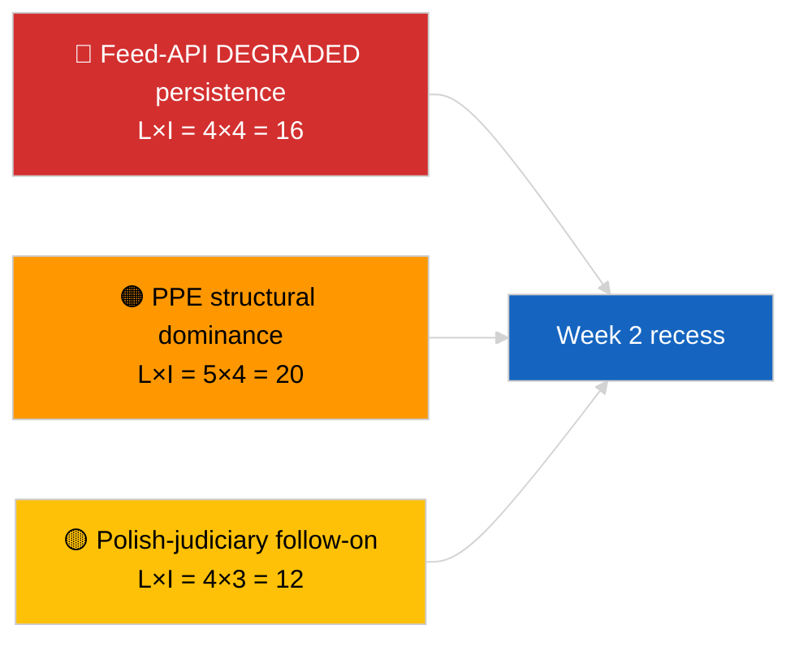

<!-- SPDX-FileCopyrightText: 2026 Hack23 AB -->
<!-- SPDX-License-Identifier: Apache-2.0 -->

# Executive Brief — Week In Review | 2026-04-04

**Classification:** OSINT | Public Parliamentary Record
**Confidence:** 🟢 High (week-of-30-March → 4-April retrospective)
**Generated:** 2026-04-04T00:00:00Z (retrospective brief)
**Article Type:** Week In Review
**Run ID:** `e92a23d1-ea51-4917-b351-16f1f93fd4a3`
**Source:** European Parliament Open Data Portal

---

## 🎯 BLUF

**Week of 30 March → 4 April 2026 was a full recess week with the two defining intelligence signals being analytical/operational rather than legislative: (1) confirmation of EP feed-API DEGRADED state across 8 endpoints, and (2) formalisation of the EP10 coalition arithmetic showing PPE 38% structural dominance plus the Renew–ECR cohesion signal of 0.95.** The third recurring signal is the anti-corruption / institutional-reform cluster (TA-10-2026-0094 + 3 supporting texts) carrying over from the 26 March Brussels mini-plenary. Run `e92a23d1-ea51-4917-b351-16f1f93fd4a3` returned **"Quantitative risk scoring across 0 identified political dimensions"** — week-in-review synthesis is therefore reconstructed from the substantive sibling and prior-day runs. **🟢 HIGH confidence** on the three signals; the week's "no plenary, no new procedures" baseline is calendar-anchored.

---

## 🧭 3 Decisions This Brief Supports

| # | Decision | Who Decides | Deadline | Evidence |
|:-:|----------|-------------|:--------:|----------|
| 1 | **Editorial:** publish week-in-review as a three-signal synthesis (API health + coalition arithmetic + reform cluster) | Editor | +24h | Sibling-run convergence |
| 2 | **Monitoring:** maintain daily endpoint probes through Easter recess end (13 April) | Data pipeline | daily | Restore detection |
| 3 | **Forward-watch:** Q2 begins 7 April with Commission Tuesday; first plenary week 13-17 April committee work-week | Analysis lead | 2026-04-07 | Q1→Q2 transition |

---

## 📰 60-Second Read

- 🔴 **EP API DEGRADED state** confirmed by 3-run probe on 2026-04-03; 5/8 mandatory feeds failing. (🟢 High)
- 🟠 **Coalition arithmetic** formalised: PPE 38% structural dominance; Renew–ECR 0.95 cohesion signal; Grand-Coalition 60% default. (🟡 Medium on cohesion interpretation; 🟢 High on seat shares)
- 🟢 **Anti-corruption / institutional-reform cluster** (TA-10-2026-0094 + 3) carry-over remains the dominant Q1 legislative signal. (🟢 High)
- 🟡 **No plenary, no committee sittings, no new procedures** during the week. (🟢 High)
- 🔵 **Economic context:** US-EU trade trajectory continues; Mercosur ECJ opinion awaited. (🟢 High)
- 🟣 **Cross-reference:** four 2026-04-04 sibling runs converge on the same triad. (🟢 High)
- 🩷 **Disruption vector:** Polish-judiciary follow-on (Braun-precedent) is the highest-probability vector for an April-plenary surprise. (🟡 Medium)
- ⚪ **Carry-forward:** transposition windows for tier-1 March adoptions extend to Q1 2028.

---

## 🗂️ Top Findings — Week of 30 March → 4 April 2026

| Rank | Finding | Source | Significance | Confidence |
|:----:|---------|--------|:------------:|:----------:|
| 1 | EP feed-API DEGRADED (5/8 mandatory feeds) | `2026-04-03/breaking-2` | 8.0 | 🟢 HIGH |
| 2 | PPE 38% structural dominance + Renew–ECR 0.95 cohesion | `2026-04-03/breaking` | 7.5 | 🟡 MEDIUM |
| 3 | Anti-corruption / reform cluster (4 texts) | `2026-04-03/breaking-3` | 9.0 | 🟢 HIGH |
| 4 | 85-item adopted-texts week-feed | `2026-04-04/breaking-4` | 6.0 | 🟢 HIGH |
| 5 | Q1 pipeline retrospective (9 high-significance items) | `2026-04-04/breaking-2` | 7.0 | 🟡 MEDIUM |

---

## ⚠️ Risk & Threat Snapshot

| Risk | L | I | Score | Trigger | Source | Admiralty |
|------|:-:|:-:|:-----:|---------|--------|:---------:|
| Feed-API DEGRADED persistence | 4 | 4 | 16 | Past 14 April | `2026-04-03/breaking-2` | A1 |
| PPE structural dominance | 5 | 4 | 20 | All majorities require PPE | Coalition arithmetic | A1 |
| Polish-judiciary follow-on | 4 | 3 | 12 | New immunity case | TA-10-2026-0088 | A1 |
| Tier-1 transposition risk | 4 | 4 | 16 | National divergence | TA-10-2026-0094 | A1 |

---

## 🔮 Top Forward Trigger

**Easter recess end 13 April + Commission Tuesday 7 April + committee work-week 13-17 April.** The composite Q1→Q2 transition window will resolve which Q1 carry-over track dominates: trade (Scenario A), rule-of-law (Scenario B), or economic/industrial (Scenario C).

---

## 🛡️ Source Quality Assessment

- **Primary sources:** Sibling 2026-04-03 and 2026-04-04 runs; EP `get_adopted_texts_feed` one-week window.
- **Data limitations:** This week-in-review run produced empty classification; synthesis reconstructed from siblings.
- **Confidence:** 🟢 HIGH on the three week-defining signals.

---

## 📎 Links

| Link | Path |
|------|------|
| Article | `./article.md` |
| Sibling runs | `analysis/daily/2026-04-04/breaking/`, `breaking-2/`, `breaking-3/`, `breaking-4/` |
| Prior-week source | `analysis/daily/2026-04-03/breaking/`, `breaking-2/`, `breaking-3/` |
| Manifest | `./manifest.json` |

---

**Document Control**
- **Template:** `/analysis/templates/executive-brief.md`
- **Artifact path:** `analysis/daily/2026-04-04/week-in-review/executive-brief.md`
- **Classification:** Public
- **Retrospective generation:** Back-fill session.
