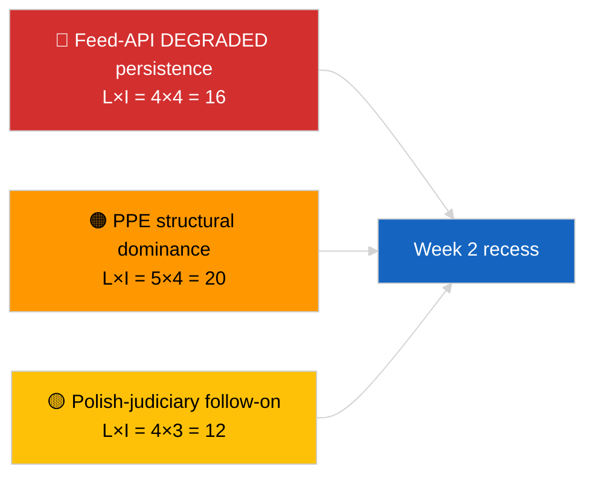

<!-- SPDX-FileCopyrightText: 2026 Hack23 AB -->
<!-- SPDX-License-Identifier: Apache-2.0 -->

# موجز تنفيذي — الأسبوع في مراجعة | 2026-04-04

**التصنيف:** OSINT | سجل برلماني عام  
**درجة الثقة:** 🟢 عالية (استعراض 30 مارس → 4 أبريل)  
**تاريخ الإنشاء:** 2026-04-04T00:00:00Z (تقرير استعراضي)  
**نوع المقال:** مراجعة أسبوعية  
**معرّف التشغيل:** `e92a23d1-ea51-4917-b351-16f1f93fd4a3`  
**المصدر:** بوابة البيانات المفتوحة للبرلمان الأوروبي

---

## 🎯 BLUF

**أسبوع 30 مارس → 4 أبريل 2026 كان أسبوع استراحة كاملاً مع إشارتين استخباراتيتين محوريتين تحليليتين/تشغيليتين لا تشريعيتين: (1) تأكيد الحالة المتدهورة لواجهة برمجة تطبيقات تغذية البرلمان الأوروبي على 8 نقاط نهاية و(2) رسمنة حسابات تحالف EP10 التي تُظهر هيمنة PPE الهيكلية البالغة 38% إضافة إلى إشارة تماسك Renew–ECR البالغة 0.95.** الإشارة المتكررة الثالثة هي مجموعة مكافحة الفساد/الإصلاح المؤسسي (TA-10-2026-0094 + 3 نصوص داعمة) المنقولة من جلسة mini-plenary بروكسل بتاريخ 26 مارس. أسفرت عملية التشغيل `e92a23d1-ea51-4917-b351-16f1f93fd4a3` عن **"Quantitative risk scoring across 0 identified political dimensions"** — لذا يُعاد بناء تركيب المراجعة الأسبوعية من التشغيلات الأشقاء الجوهرية وتشغيلات اليوم السابق. **🟢 درجة ثقة عالية** للإشارات الثلاث؛ خط الأساس "لا جلسة عامة، لا إجراءات جديدة" للأسبوع مرسَّخ في التقويم.

---

## 🧭 3 قرارات يدعمها هذا التقرير

| # | القرار | من يقرر | الموعد النهائي | الأدلة |
|:-:|--------|---------|:-------------:|--------|
| 1 | **تحريري:** نشر المراجعة الأسبوعية كتركيب ثلاثي الإشارات (صحة API + حسابات التحالف + مجموعة الإصلاح) | المحرر | +24 ساعة | تقاطع التشغيلات الأشقاء |
| 2 | **مراقبة:** الحفاظ على مسبارات نقاط النهاية اليومية خلال فترة استراحة عيد الفصح (حتى 13 أبريل) | خط بيانات | يومي | كشف الاستعادة |
| 3 | **مراقبة مستقبلية:** الربع 2 يبدأ 7 أبريل مع ثلاثاء المفوضية؛ أول أسبوع جلسة عامة 13-17 أبريل أسبوع عمل اللجان | مسؤول التحليل | 2026-04-07 | انتقال الربع 1→الربع 2 |

---

## 📰 قراءة 60 ثانية

- 🔴 **الحالة المتدهورة لـ API البرلمان الأوروبي** مؤكدة بواسطة مسبار 3-تشغيلات في 2026-04-03؛ 5/8 تغذيات إلزامية فشلت. (🟢 عالية)
- 🟠 **حسابات التحالف** مُرسْمَنة: هيمنة PPE الهيكلية 38%؛ إشارة تماسك Renew–ECR 0.95؛ التحالف الكبير 60% افتراضي. (🟡 متوسطة لتفسير التماسك؛ 🟢 عالية لحصص المقاعد)
- 🟢 **مجموعة مكافحة الفساد/الإصلاح المؤسسي** (TA-10-2026-0094 + 3) تواصل سيطرتها على إشارة التشريع في الربع 1. (🟢 عالية)
- 🟡 **لا جلسة عامة، لا اجتماعات لجان، لا إجراءات جديدة** خلال الأسبوع. (🟢 عالية)
- 🔵 **السياق الاقتصادي:** مسار التجارة بين الولايات المتحدة والاتحاد الأوروبي يتواصل؛ رأي محكمة العدل الأوروبية بشأن Mercosur منتظَر. (🟢 عالية)
- 🟣 **الإسناد المتقاطع:** أربع تشغيلات أشقاء من 2026-04-04 تتقاطع على الثالوث ذاته. (🟢 عالية)
- 🩷 **المتجه التخريبي:** الإجراءات القضائية البولندية التالية (سابقة براون) هي المتجه الأعلى احتمالاً لمفاجأة في جلسة أبريل. (🟡 متوسطة)
- ⚪ **المُنقَّل:** نوافذ النقل للموافقات من المستوى الأول في مارس تمتد حتى الربع 1 من عام 2028.

---

## 🗂️ أبرز النتائج — أسبوع 30 مارس → 4 أبريل 2026

| الرتبة | النتيجة | المصدر | الأهمية | درجة الثقة |
|:------:|--------|--------|:-------:|:----------:|
| 1 | API تغذية البرلمان الأوروبي متدهورة (5/8 تغذيات إلزامية) | `2026-04-03/breaking-2` | 8.0 | 🟢 عالية |
| 2 | هيمنة PPE الهيكلية 38% + تماسك Renew–ECR 0.95 | `2026-04-03/breaking` | 7.5 | 🟡 متوسطة |
| 3 | مجموعة مكافحة الفساد/الإصلاح (4 نصوص) | `2026-04-03/breaking-3` | 9.0 | 🟢 عالية |
| 4 | تغذية أسبوعية 85 نصاً مُعتمَداً | `2026-04-04/breaking-4` | 6.0 | 🟢 عالية |
| 5 | استعراض خط أنابيب الربع 1 (9 عناصر عالية الأهمية) | `2026-04-04/breaking-2` | 7.0 | 🟡 متوسطة |

---

## ⚠️ لقطة المخاطر والتهديدات

| المخاطرة | الاحتمال | التأثير | الدرجة | المحفِّز | المصدر | التقدير الأميرالي |
|---------|:--------:|:-------:|:------:|---------|--------|:-----------------:|
| API التغذية المتدهورة مستمرة | 4 | 4 | 16 | بعد 14 أبريل | `2026-04-03/breaking-2` | A1 |
| هيمنة PPE الهيكلية | 5 | 4 | 20 | كل الأغلبيات تتطلب PPE | حسابات التحالف | A1 |
| الإجراءات القضائية البولندية التالية | 4 | 3 | 12 | حالة حصانة جديدة | TA-10-2026-0088 | A1 |
| خطر نقل المستوى الأول | 4 | 4 | 16 | تباين وطني | TA-10-2026-0094 | A1 |

---

## 🔮 أبرز محفِّز مستقبلي

**نهاية استراحة عيد الفصح 13 أبريل + ثلاثاء المفوضية 7 أبريل + أسبوع عمل لجان 13-17 أبريل.** سيحدد نافذة الانتقال المركَّبة الربع 1→الربع 2 أيّ مسار منقول من الربع 1 يسيطر: التجارة (السيناريو أ) أو سيادة القانون (السيناريو ب) أو الاقتصاد/الصناعة (السيناريو ج).

---

## 🛡️ تقييم جودة المصادر

- **المصادر الأولية:** تشغيلات أشقاء 2026-04-03 و2026-04-04؛ نافذة أسبوع `get_adopted_texts_feed` للبرلمان الأوروبي.
- **قيود البيانات:** أسفرت هذه التشغيلة للمراجعة الأسبوعية عن تصنيف فارغ؛ تُعاد بناء التركيبة من التشغيلات الأشقاء.
- **درجة الثقة:** 🟢 عالية للإشارات الثلاث المحددة للأسبوع.

---

## 📎 الروابط

| الرابط | المسار |
|--------|--------|
| المقال | `./article.md` |
| التشغيلات الأشقاء | `analysis/daily/2026-04-04/breaking/`، `breaking-2/`، `breaking-3/`، `breaking-4/` |
| مصدر الأسبوع السابق | `analysis/daily/2026-04-03/breaking/`، `breaking-2/`، `breaking-3/` |
| القائمة | `./manifest.json` |

---

**التحكم في الوثيقة**
- **القالب:** `/analysis/templates/executive-brief.md`
- **مسار القطعة:** `analysis/daily/2026-04-04/week-in-review/executive-brief.md`
- **التصنيف:** عام
- **الإنشاء الاستعراضي:** جلسة الترجيع.
