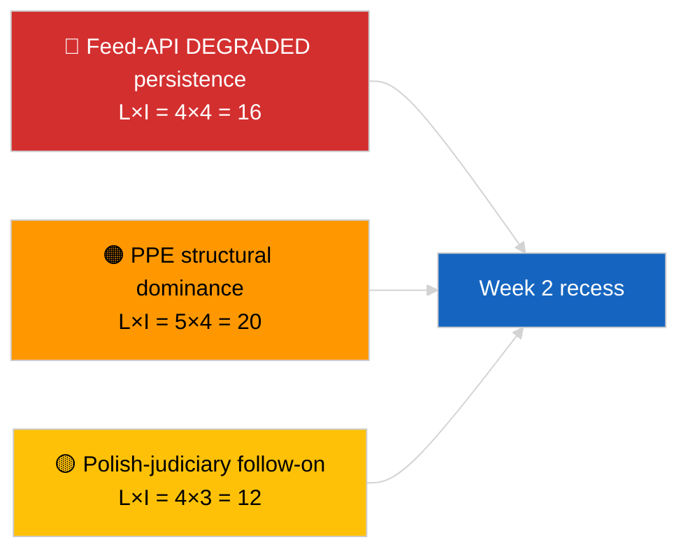

<!-- SPDX-FileCopyrightText: 2026 Hack23 AB -->
<!-- SPDX-License-Identifier: Apache-2.0 -->

# Ledelsesoversigt — Ugen i korthed | 2026-04-04

**Klassificering:** OSINT | Offentlig parlamentarisk registrering  
**Konfidensgrad:** 🟢 Høj (retrospektiv 30. marts → 4. april)  
**Genereret:** 2026-04-04T00:00:00Z (retrospektiv rapport)  
**Artikeltype:** Ugesgennemgang  
**Kørsels-ID:** `e92a23d1-ea51-4917-b351-16f1f93fd4a3`  
**Kilde:** Europa-Parlamentets åbne dataportal

---

## 🎯 BLUF

**Ugen 30. marts → 4. april 2026 var en fuld recessuge med de to afgørende efterretningssignaler analytiske/operationelle snarere end lovgivningsmæssige: (1) bekræftelse af EP-feed-API DEGRADERET tilstand over 8 slutpunkter og (2) formalisering af EP10-koalitionsaritmetikken, der viser PPE 38% strukturel dominans plus Renew–ECR-samhørighedssignalet på 0,95.** Det tredje tilbagevendende signal er antikorruptions-/institutionsreformklyngen (TA-10-2026-0094 + 3 støttetekster), der overføres fra mini-plenumsmødet i Bruxelles den 26. marts. Kørsel `e92a23d1-ea51-4917-b351-16f1f93fd4a3` returnerede **"Quantitative risk scoring across 0 identified political dimensions"** — ugesgennemgangssyntesen rekonstrueres derfor fra substantielle søskendekørsler og foregående dags kørsler. **🟢 HØJ konfidensgrad** for de tre signaler; ugens "ingen plenum, ingen nye procedurer"-basislinje er kalenderforankret.

---

## 🧭 3 Beslutninger denne rapport understøtter

| # | Beslutning | Hvem beslutter | Deadline | Bevis |
|:-:|------------|----------------|:--------:|-------|
| 1 | **Redaktionelt:** udgiv ugesgennemgang som en tre-signals-syntese (API-helbred + koalitionsaritmetik + reformklynge) | Redaktør | +24t | Søskendekørslers konvergens |
| 2 | **Overvågning:** oprethold daglige slutpunktsprober gennem påskepausen (til 13. april) | Datapipeline | dagligt | Genoprettelsesdetektion |
| 3 | **Fremadskuende:** K2 begynder 7. april med Kommissionens tirsdag; første plenaruge 13.–17. april komitéarbejdsuge | Analyseansvarlig | 2026-04-07 | K1→K2-overgang |

---

## 📰 60-sekunders læsning

- 🔴 **EP API DEGRADERET tilstand** bekræftet af 3-kørselsprobe den 2026-04-03; 5/8 obligatoriske feeds mislykkedes. (🟢 Høj)
- 🟠 **Koalitionsaritmetik** formaliseret: PPE 38% strukturel dominans; Renew–ECR 0,95 samhørighedssignal; Stor-koalition 60% standard. (🟡 Middel for samhørighedsfortolkning; 🟢 Høj for mandatandele)
- 🟢 **Antikorruptions-/institutionsreformklynge** (TA-10-2026-0094 + 3) fortsætter med at være det dominerende K1-lovgivningssignal. (🟢 Høj)
- 🟡 **Ingen plenum, ingen komitémøder, ingen nye procedurer** i løbet af ugen. (🟢 Høj)
- 🔵 **Økonomisk kontekst:** USA-EU-handelsbane fortsætter; Mercosur EUD-udtalelse afventes. (🟢 Høj)
- 🟣 **Krydsreference:** fire søskendekørsler fra 2026-04-04 konvergerer på den samme triade. (🟢 Høj)
- 🩷 **Forstyrrelsesvektorer:** Polsk-retsystem-opfølgning (Braun-præcedens) er den højst sandsynlige vektor for en april-plenums-overraskelse. (🟡 Middel)
- ⚪ **Overført:** transpositionsvinduer for tier-1-martantagelser strækker sig til K1 2028.

---

## 🗂️ Topfund — Ugen 30. marts → 4. april 2026

| Rang | Fund | Kilde | Betydning | Konfidensgrad |
|:----:|------|-------|:---------:|:------------:|
| 1 | EP feed-API DEGRADERET (5/8 obligatoriske feeds) | `2026-04-03/breaking-2` | 8,0 | 🟢 HØJ |
| 2 | PPE 38% strukturel dominans + Renew–ECR 0,95 samhørighed | `2026-04-03/breaking` | 7,5 | 🟡 MIDDEL |
| 3 | Antikorruptions-/reformklynge (4 tekster) | `2026-04-03/breaking-3` | 9,0 | 🟢 HØJ |
| 4 | 85-post vedtagne-tekster ugefeed | `2026-04-04/breaking-4` | 6,0 | 🟢 HØJ |
| 5 | K1-pipeline retrospektiv (9 højbetydende poster) | `2026-04-04/breaking-2` | 7,0 | 🟡 MIDDEL |

---

## ⚠️ Risiko- og trusselsøjebliksbillede

| Risiko | S | I | Score | Udløser | Kilde | Admiralitet |
|--------|:-:|:-:|:-----:|---------|-------|:-----------:|
| Feed-API DEGRADERET vedvarer | 4 | 4 | 16 | Forbi 14. april | `2026-04-03/breaking-2` | A1 |
| PPE strukturel dominans | 5 | 4 | 20 | Alle flertal kræver PPE | Koalitionsaritmetik | A1 |
| Polsk-retsystem-opfølgning | 4 | 3 | 12 | Ny immunitetsag | TA-10-2026-0088 | A1 |
| Tier-1 transpositionsrisiko | 4 | 4 | 16 | National divergens | TA-10-2026-0094 | A1 |

---

## 🔮 Top fremadrettede udløser

**Påskepausens slutning 13. april + Kommissionens tirsdag 7. april + komitéarbejdsuge 13.–17. april.** Det sammensatte K1→K2-overgangsvindue afgør, hvilket K1-overført spor dominerer: handel (Scenario A), retsstat (Scenario B) eller økonomi/industri (Scenario C).

---

## 🛡️ Kildekvalitetsvurdering

- **Primære kilder:** Søskendekørsler 2026-04-03 og 2026-04-04; EP `get_adopted_texts_feed` en-uge-vindue.
- **Databegrænsninger:** Denne ugesgennemgangskørsel producerede tom klassificering; syntese rekonstrueret fra søskendekørsler.
- **Konfidensgrad:** 🟢 HØJ for de tre ugesdefinerende signaler.

---

## 📎 Links

| Link | Sti |
|------|-----|
| Artikel | `./article.md` |
| Søskendekørsler | `analysis/daily/2026-04-04/breaking/`, `breaking-2/`, `breaking-3/`, `breaking-4/` |
| Foregående uges kilde | `analysis/daily/2026-04-03/breaking/`, `breaking-2/`, `breaking-3/` |
| Manifest | `./manifest.json` |

---

**Dokumentkontrol**
- **Skabelon:** `/analysis/templates/executive-brief.md`
- **Artefaktsti:** `analysis/daily/2026-04-04/week-in-review/executive-brief.md`
- **Klassificering:** Offentlig
- **Retrospektiv generering:** Bagfyldningssession.
