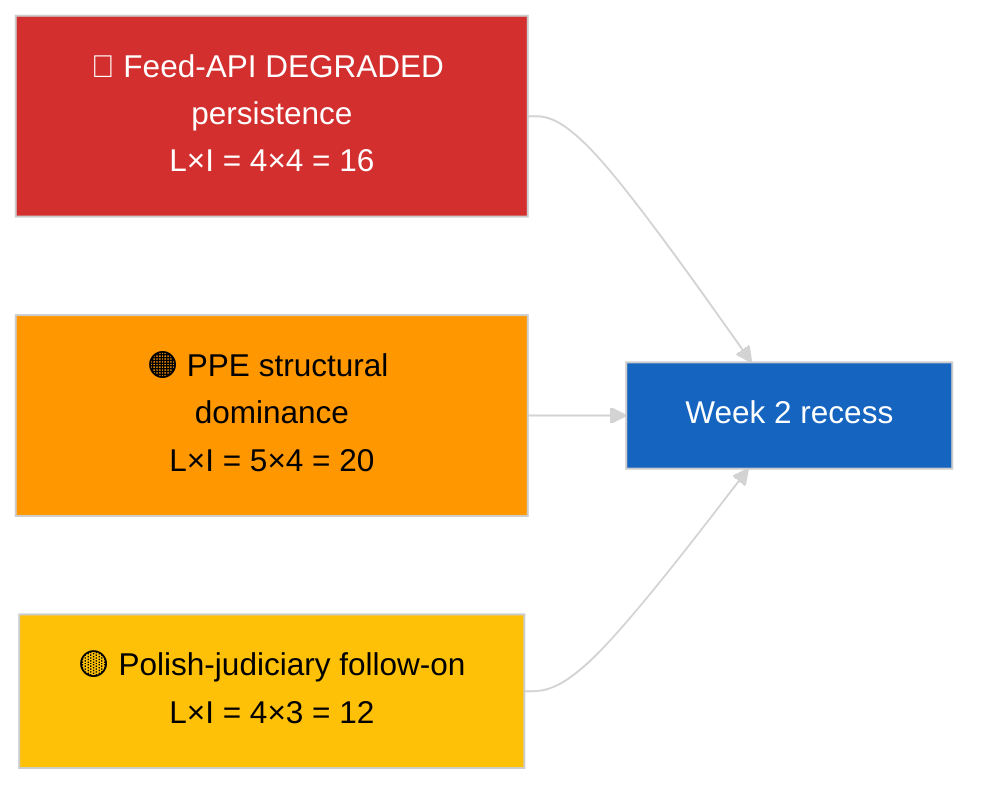

<!-- SPDX-FileCopyrightText: 2026 Hack23 AB -->
<!-- SPDX-License-Identifier: Apache-2.0 -->

# Führungszusammenfassung — Woche im Überblick | 2026-04-04

**Klassifizierung:** OSINT | Öffentliche parlamentarische Aufzeichnung  
**Vertrauensgrad:** 🟢 Hoch (Retrospektive 30. März → 4. April)  
**Erstellt:** 2026-04-04T00:00:00Z (Retrospektivbericht)  
**Artikeltyp:** Wochenbericht  
**Lauf-ID:** `e92a23d1-ea51-4917-b351-16f1f93fd4a3`  
**Quelle:** Offenes Datenportal des Europäischen Parlaments

---

## 🎯 BLUF

**Die Woche vom 30. März → 4. April 2026 war eine vollständige Recesswoche, wobei die zwei entscheidenden Geheimdienstsignale analytisch/operativ statt legislativ waren: (1) Bestätigung des EP-Feed-API-DEGRADIERTEN Zustands über 8 Endpunkte und (2) Formalisierung der EP10-Koalitionsarithmetik, die PPE 38% strukturelle Dominanz sowie das Renew–ECR-Kohäsionssignal von 0,95 zeigt.** Das dritte wiederkehrende Signal ist der Antikorruptions-/Institutionsreformcluster (TA-10-2026-0094 + 3 Unterstützungstexte), der vom Brüsseler Mini-Plenum am 26. März übertragen wird. Lauf `e92a23d1-ea51-4917-b351-16f1f93fd4a3` lieferte **"Quantitative risk scoring across 0 identified political dimensions"** — die Wochenübersichtssynthese wird daher aus substantiellen Geschwisterläufen und Vortagsläufen rekonstruiert. **🟢 HOHER Vertrauensgrad** für die drei Signale; die "kein Plenum, keine neuen Verfahren"-Basislinie der Woche ist kalenderverankert.

---

## 🧭 3 Entscheidungen, die dieser Brief unterstützt

| # | Entscheidung | Wer entscheidet | Frist | Belege |
|:-:|--------------|-----------------|:-----:|--------|
| 1 | **Redaktionell:** Wochenbericht als Drei-Signal-Synthese veröffentlichen (API-Gesundheit + Koalitionsarithmetik + Reformcluster) | Redakteur | +24h | Konvergenz der Geschwisterläufe |
| 2 | **Überwachung:** Tägliche Endpunkt-Probes während der Osterpause aufrechterhalten (bis 13. April) | Datenpipeline | täglich | Wiederherstellungserkennung |
| 3 | **Vorausschau:** Q2 beginnt am 7. April mit Kommissionsdienstag; erste Plenumswoche 13.–17. April Ausschussarbeitswoche | Analysebeauftragter | 2026-04-07 | Q1→Q2-Übergang |

---

## 📰 60-Sekunden-Lektüre

- 🔴 **EP-API DEGRADIERTER Zustand** bestätigt durch 3-Lauf-Probe am 2026-04-03; 5/8 Pflicht-Feeds fehlgeschlagen. (🟢 Hoch)
- 🟠 **Koalitionsarithmetik** formalisiert: PPE 38% strukturelle Dominanz; Renew–ECR 0,95 Kohäsionssignal; Große Koalition 60% Standard. (🟡 Mittel für Kohäsionsinterpretation; 🟢 Hoch für Sitzanteile)
- 🟢 **Antikorruptions-/Institutionsreformcluster** (TA-10-2026-0094 + 3) bleibt das dominante Q1-Gesetzgebungssignal. (🟢 Hoch)
- 🟡 **Kein Plenum, keine Ausschusssitzungen, keine neuen Verfahren** in der Woche. (🟢 Hoch)
- 🔵 **Wirtschaftlicher Kontext:** US-EU-Handelsweg setzt sich fort; Mercosur-EuGH-Gutachten erwartet. (🟢 Hoch)
- 🟣 **Querverweisungen:** Vier 2026-04-04-Geschwisterläufe konvergieren auf dieselbe Triade. (🟢 Hoch)
- 🩷 **Störungsvektor:** Polnisch-Justiz-Folgemaßnahmen (Braun-Präzedenzfall) ist der wahrscheinlichste Vektor für eine April-Plenum-Überraschung. (🟡 Mittel)
- ⚪ **Übertragen:** Transpositionsfenster für Tier-1-März-Annahmen erstrecken sich bis Q1 2028.

---

## 🗂️ Hauptbefunde — Woche vom 30. März → 4. April 2026

| Rang | Befund | Quelle | Bedeutung | Vertrauensgrad |
|:----:|--------|--------|:---------:|:--------------:|
| 1 | EP-Feed-API DEGRADIERT (5/8 Pflicht-Feeds) | `2026-04-03/breaking-2` | 8,0 | 🟢 HOCH |
| 2 | PPE 38% strukturelle Dominanz + Renew–ECR 0,95 Kohäsion | `2026-04-03/breaking` | 7,5 | 🟡 MITTEL |
| 3 | Antikorruptions-/Reformcluster (4 Texte) | `2026-04-03/breaking-3` | 9,0 | 🟢 HOCH |
| 4 | 85-Einträge angenommene-Texte Wochenfeed | `2026-04-04/breaking-4` | 6,0 | 🟢 HOCH |
| 5 | Q1-Pipeline-Retrospektive (9 hochbedeutsame Einträge) | `2026-04-04/breaking-2` | 7,0 | 🟡 MITTEL |

---

## ⚠️ Risiko- und Bedrohungsschnappschuss

| Risiko | W | A | Punkte | Auslöser | Quelle | Admiralität |
|--------|:-:|:-:|:------:|---------|--------|:-----------:|
| Feed-API DEGRADIERT bleibt | 4 | 4 | 16 | Über den 14. April | `2026-04-03/breaking-2` | A1 |
| PPE strukturelle Dominanz | 5 | 4 | 20 | Alle Mehrheiten erfordern PPE | Koalitionsarithmetik | A1 |
| Polnisch-Justiz-Folgemaßnahmen | 4 | 3 | 12 | Neuer Immunitätsfall | TA-10-2026-0088 | A1 |
| Tier-1-Transpositionsrisiko | 4 | 4 | 16 | Nationale Divergenz | TA-10-2026-0094 | A1 |

---

## 🔮 Wichtigster vorwärtiger Auslöser

**Osterpausenende 13. April + Kommissionsdienstag 7. April + Ausschussarbeitswoche 13.–17. April.** Das zusammengesetzte Q1→Q2-Übergangsfenster entscheidet, welcher Q1-übertragene Pfad dominiert: Handel (Szenario A), Rechtsstaat (Szenario B) oder Wirtschaft/Industrie (Szenario C).

---

## 🛡️ Quellenqualitätsbeurteilung

- **Primärquellen:** Geschwisterläufe 2026-04-03 und 2026-04-04; EP `get_adopted_texts_feed` Ein-Wochen-Fenster.
- **Datenbeschränkungen:** Dieser Wochenberichtslauf lieferte leere Klassifizierung; Synthese aus Geschwisterläufen rekonstruiert.
- **Vertrauensgrad:** 🟢 HOCH für die drei wochenbestimmenden Signale.

---

## 📎 Links

| Link | Pfad |
|------|------|
| Artikel | `./article.md` |
| Geschwisterläufe | `analysis/daily/2026-04-04/breaking/`, `breaking-2/`, `breaking-3/`, `breaking-4/` |
| Vorwochequelle | `analysis/daily/2026-04-03/breaking/`, `breaking-2/`, `breaking-3/` |
| Manifest | `./manifest.json` |

---

**Dokumentkontrolle**
- **Vorlage:** `/analysis/templates/executive-brief.md`
- **Artefaktpfad:** `analysis/daily/2026-04-04/week-in-review/executive-brief.md`
- **Klassifizierung:** Öffentlich
- **Retrospektive Erstellung:** Nachfüllungssitzung.
