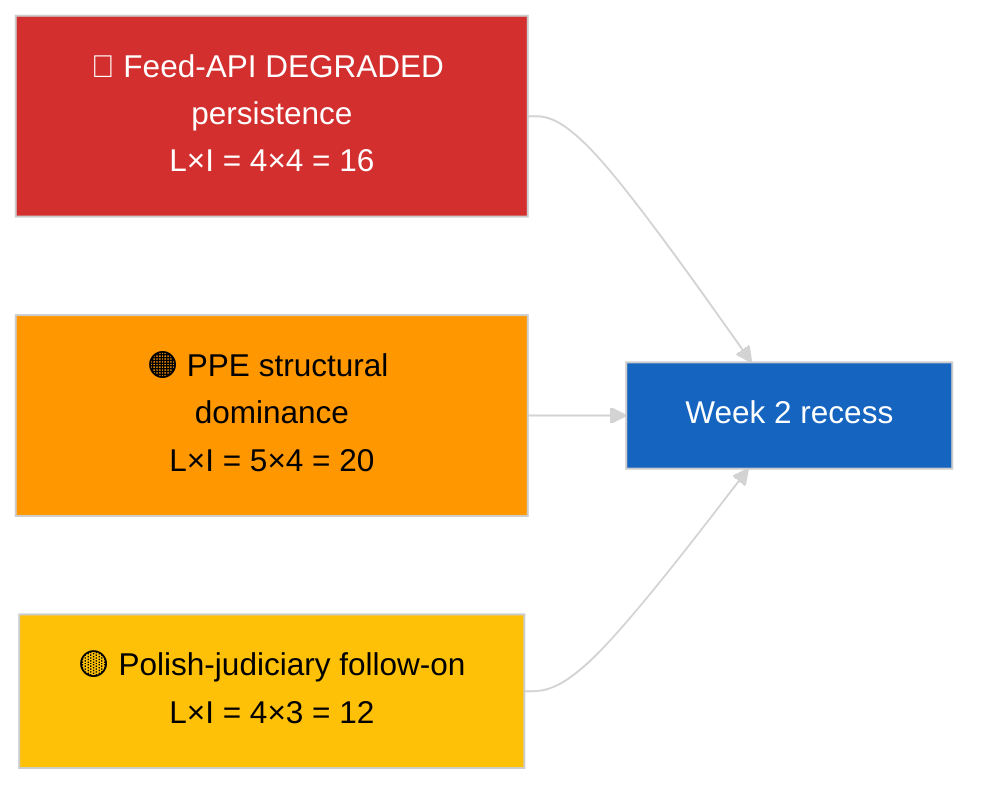

<!-- SPDX-FileCopyrightText: 2026 Hack23 AB -->
<!-- SPDX-License-Identifier: Apache-2.0 -->

# Resumen ejecutivo — La semana en resumen | 2026-04-04

**Clasificación:** OSINT | Registro parlamentario público  
**Nivel de confianza:** 🟢 Alto (retrospectiva 30 de marzo → 4 de abril)  
**Generado:** 2026-04-04T00:00:00Z (informe retrospectivo)  
**Tipo de artículo:** Revisión semanal  
**ID de ejecución:** `e92a23d1-ea51-4917-b351-16f1f93fd4a3`  
**Fuente:** Portal de datos abiertos del Parlamento Europeo

---

## 🎯 BLUF

**La semana del 30 de marzo → 4 de abril de 2026 fue una semana de receso completo con las dos señales de inteligencia determinantes analíticas/operativas en lugar de legislativas: (1) confirmación del estado DEGRADADO de la API de feeds del PE en 8 puntos finales y (2) formalización de la aritmética de coalición EP10 que muestra la dominancia estructural del PPE del 38% más la señal de cohesión Renew–ECR de 0,95.** La tercera señal recurrente es el clúster de anticorrupción/reforma institucional (TA-10-2026-0094 + 3 textos de apoyo) trasladado desde la mini-plenaria de Bruselas del 26 de marzo. La ejecución `e92a23d1-ea51-4917-b351-16f1f93fd4a3` devolvió **"Quantitative risk scoring across 0 identified political dimensions"** — la síntesis de la revisión semanal se reconstruye, por tanto, a partir de las ejecuciones paralelas sustanciales y las ejecuciones del día anterior. **🟢 ALTA confianza** en las tres señales; la línea base "sin plenaria, sin nuevos procedimientos" de la semana está anclada en el calendario.

---

## 🧭 3 Decisiones que apoya este informe

| # | Decisión | Quién decide | Plazo | Evidencia |
|:-:|----------|--------------|:-----:|-----------|
| 1 | **Editorial:** publicar revisión semanal como síntesis de tres señales (salud API + aritmética de coalición + clúster de reforma) | Editor | +24h | Convergencia de ejecuciones paralelas |
| 2 | **Monitoreo:** mantener sondas diarias de puntos finales durante el receso de Semana Santa (hasta el 13 de abril) | Pipeline de datos | diario | Detección de restauración |
| 3 | **Vigilancia prospectiva:** Q2 comienza el 7 de abril con el martes de la Comisión; primera semana plenaria 13–17 de abril semana de trabajo de comités | Responsable de análisis | 2026-04-07 | Transición Q1→Q2 |

---

## 📰 Lectura de 60 segundos

- 🔴 **Estado DEGRADADO de la API del PE** confirmado por sonda de 3 ejecuciones el 2026-04-03; 5/8 feeds obligatorios fallidos. (🟢 Alto)
- 🟠 **Aritmética de coalición** formalizada: dominancia estructural del PPE del 38%; señal de cohesión Renew–ECR de 0,95; Gran Coalición 60% predeterminada. (🟡 Medio para la interpretación de cohesión; 🟢 Alto para las cuotas de escaños)
- 🟢 **Clúster de anticorrupción/reforma institucional** (TA-10-2026-0094 + 3) sigue siendo la señal legislativa Q1 dominante. (🟢 Alto)
- 🟡 **Sin plenaria, sin reuniones de comité, sin nuevos procedimientos** durante la semana. (🟢 Alto)
- 🔵 **Contexto económico:** la trayectoria comercial UE-EE.UU. continúa; se espera opinión del TJUE sobre el Mercosur. (🟢 Alto)
- 🟣 **Referencia cruzada:** cuatro ejecuciones paralelas del 2026-04-04 convergen en la misma tríada. (🟢 Alto)
- 🩷 **Vector de perturbación:** el seguimiento judicial polaco (precedente Braun) es el vector de mayor probabilidad para una sorpresa en la plenaria de abril. (🟡 Medio)
- ⚪ **Traslado:** las ventanas de transposición para las adopciones de marzo de nivel 1 se extienden hasta Q1 2028.

---

## 🗂️ Principales hallazgos — Semana del 30 de marzo → 4 de abril de 2026

| Rango | Hallazgo | Fuente | Relevancia | Confianza |
|:-----:|---------|--------|:----------:|:---------:|
| 1 | API de feeds del PE DEGRADADA (5/8 feeds obligatorios) | `2026-04-03/breaking-2` | 8,0 | 🟢 ALTA |
| 2 | Dominancia estructural PPE 38% + cohesión Renew–ECR 0,95 | `2026-04-03/breaking` | 7,5 | 🟡 MEDIO |
| 3 | Clúster anticorrupción/reforma (4 textos) | `2026-04-03/breaking-3` | 9,0 | 🟢 ALTA |
| 4 | Feed semanal de 85 textos adoptados | `2026-04-04/breaking-4` | 6,0 | 🟢 ALTA |
| 5 | Retrospectiva pipeline Q1 (9 elementos de alta relevancia) | `2026-04-04/breaking-2` | 7,0 | 🟡 MEDIO |

---

## ⚠️ Instantánea de riesgos y amenazas

| Riesgo | V | I | Puntuación | Desencadenante | Fuente | Almirantazgo |
|--------|:-:|:-:|:----------:|----------------|--------|:------------:|
| Persistencia DEGRADADA de la API de feeds | 4 | 4 | 16 | Después del 14 de abril | `2026-04-03/breaking-2` | A1 |
| Dominancia estructural PPE | 5 | 4 | 20 | Todas las mayorías requieren PPE | Aritmética de coalición | A1 |
| Seguimiento judicial polaco | 4 | 3 | 12 | Nuevo caso de inmunidad | TA-10-2026-0088 | A1 |
| Riesgo de transposición nivel 1 | 4 | 4 | 16 | Divergencia nacional | TA-10-2026-0094 | A1 |

---

## 🔮 Principal desencadenante prospectivo

**Fin del receso de Semana Santa el 13 de abril + martes de la Comisión el 7 de abril + semana de trabajo de comités del 13 al 17 de abril.** La ventana de transición compuesta Q1→Q2 resolverá qué pista trasladada del Q1 domina: comercio (Escenario A), estado de derecho (Escenario B) o economía/industria (Escenario C).

---

## 🛡️ Evaluación de calidad de fuentes

- **Fuentes primarias:** Ejecuciones paralelas 2026-04-03 y 2026-04-04; EP `get_adopted_texts_feed` ventana de una semana.
- **Limitaciones de datos:** Esta ejecución de revisión semanal produjo clasificación vacía; síntesis reconstruida a partir de ejecuciones paralelas.
- **Nivel de confianza:** 🟢 ALTO para las tres señales que definen la semana.

---

## 📎 Enlaces

| Enlace | Ruta |
|--------|------|
| Artículo | `./article.md` |
| Ejecuciones paralelas | `analysis/daily/2026-04-04/breaking/`, `breaking-2/`, `breaking-3/`, `breaking-4/` |
| Fuente de la semana anterior | `analysis/daily/2026-04-03/breaking/`, `breaking-2/`, `breaking-3/` |
| Manifiesto | `./manifest.json` |

---

**Control del documento**
- **Plantilla:** `/analysis/templates/executive-brief.md`
- **Ruta del artefacto:** `analysis/daily/2026-04-04/week-in-review/executive-brief.md`
- **Clasificación:** Público
- **Generación retrospectiva:** Sesión de relleno retroactivo.
