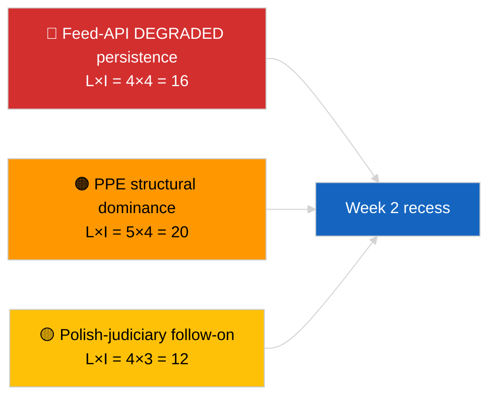

<!-- SPDX-FileCopyrightText: 2026 Hack23 AB -->
<!-- SPDX-License-Identifier: Apache-2.0 -->

# Johdon tiivistelmä — Viikon katsaus | 2026-04-04

**Luokittelu:** OSINT | Julkinen parlamentaarinen rekisteri  
**Luottamustaso:** 🟢 Korkea (retrospektiivinen 30. maaliskuuta → 4. huhtikuuta)  
**Luotu:** 2026-04-04T00:00:00Z (retrospektiivinen raportti)  
**Artikkelityyppi:** Viikkokatsaus  
**Ajokerran tunnus:** `e92a23d1-ea51-4917-b351-16f1f93fd4a3`  
**Lähde:** Euroopan parlamentin avoin tietoportaali

---

## 🎯 BLUF

**Viikko 30. maaliskuuta → 4. huhtikuuta 2026 oli täysi taukoviikko, ja kaksi määräävää tiedustelusignaalia olivat analyyttisia/operatiivisia eikä lainsäädännöllisiä: (1) EP:n syöterajapinnan HEIKENTYNYT tila vahvistettiin 8 päätepisteessä ja (2) EP10-koalitioaritmetiikka formalisoitiin, osoittaen PPE:n 38% rakenteellinen hallitsevuus sekä Renew–ECR-koheesiosignaali 0,95.** Kolmas toistuva signaali on korruptiontorjunta-/institutionaaliuudistusrypäs (TA-10-2026-0094 + 3 tukitekstiä), joka siirtyy 26. maaliskuuta Brysselissä pidetystä mini-täysistunnosta. Ajokerta `e92a23d1-ea51-4917-b351-16f1f93fd4a3` palautti **"Quantitative risk scoring across 0 identified political dimensions"** — viikkokatsauksen synteesi rekonstruoidaan siksi sisaruskierrosten ja edellisen päivän ajokertojen perusteella. **🟢 KORKEA luottamustaso** kolmelle signaalille; viikon "ei täysistuntoa, ei uusia menettelyjä" -peruslinja on kalenterisidonnainen.

---

## 🧭 3 päätöstä, joita tämä raportti tukee

| # | Päätös | Kuka päättää | Määräaika | Todisteet |
|:-:|--------|--------------|:---------:|-----------|
| 1 | **Toimituksellinen:** julkaise viikkokatsaus kolmen signaalin synteesina (rajapinnan terveys + koalitioaritmetiikka + uudistusrypäs) | Toimittaja | +24t | Sisaruskierrosten konvergenssi |
| 2 | **Seuranta:** ylläpidä päivittäisiä päätepistekoettoja pääsiäistauon ajan (13. huhtikuuta asti) | Dataputki | päivittäin | Palautumisdetektio |
| 3 | **Eteenpäinkatsominen:** K2 alkaa 7. huhtikuuta komission tiistain kanssa; ensimmäinen täysistuntaviikko 13.–17. huhtikuuta valiokuntatyöviikko | Analyysipäällikkö | 2026-04-07 | K1→K2-siirtymä |

---

## 📰 60 sekunnin lukeminen

- 🔴 **EP:n rajapinnan HEIKENTYNYT tila** vahvistettu 3-koettoa-ajokerta 2026-04-03; 5/8 pakollista syötettä epäonnistui. (🟢 Korkea)
- 🟠 **Koalitioaritmetiikka** formalisoitu: PPE 38% rakenteellinen hallitsevuus; Renew–ECR 0,95 koheesiosignaali; Suurkoalitio 60% oletus. (🟡 Keskikohdainen koheesiotulkinnalle; 🟢 Korkea paikkojen osuudelle)
- 🟢 **Korruptiontorjunta-/institutionaaliuudistusrypäs** (TA-10-2026-0094 + 3) jatkaa K1-lainsäädäntösignaalin hallitsevana elementtinä. (🟢 Korkea)
- 🟡 **Ei täysistuntoa, ei valiokuntakokouksia, ei uusia menettelyjä** viikon aikana. (🟢 Korkea)
- 🔵 **Taloudellinen konteksti:** USA-EU-kauppakehitys jatkuu; Mercosur EUT-lausunto odottaa. (🟢 Korkea)
- 🟣 **Ristikkäisviittaus:** neljä 2026-04-04-sisaruskierrosta supistuu samaan triadiin. (🟢 Korkea)
- 🩷 **Häiriövektori:** Puolan-oikeuslaitos-seuranta (Braun-ennakkotapaus) on todennäköisin vektori huhtikuun täysistunnon yllätykselle. (🟡 Keskikohdainen)
- ⚪ **Siirretty:** tier-1-maaliskuun hyväksyntöjen transponointioikkunat ulottuvat K1:een 2028.

---

## 🗂️ Tärkeimmät havainnot — Viikko 30. maaliskuuta → 4. huhtikuuta 2026

| Sija | Havainto | Lähde | Merkitys | Luottamustaso |
|:----:|---------|-------|:--------:|:------------:|
| 1 | EP syöterajapinta HEIKENTYNYT (5/8 pakollisesta syötteestä) | `2026-04-03/breaking-2` | 8,0 | 🟢 KORKEA |
| 2 | PPE 38% rakenteellinen hallitsevuus + Renew–ECR 0,95 koheesio | `2026-04-03/breaking` | 7,5 | 🟡 KESKIKOHDAINEN |
| 3 | Korruptiontorjunta-/uudistusrypäs (4 tekstiä) | `2026-04-03/breaking-3` | 9,0 | 🟢 KORKEA |
| 4 | 85-kohdan hyväksyttyjen tekstien viikkosyöte | `2026-04-04/breaking-4` | 6,0 | 🟢 KORKEA |
| 5 | K1-putki retrospektiivinen (9 merkittävää kohtaa) | `2026-04-04/breaking-2` | 7,0 | 🟡 KESKIKOHDAINEN |

---

## ⚠️ Riski- ja uhkahetkikuva

| Riski | T | V | Pisteet | Laukaisin | Lähde | Amiraalius |
|-------|:-:|:-:|:-------:|-----------|-------|:----------:|
| Syöterajapinta HEIKENTYNYT jatkuu | 4 | 4 | 16 | Ohi 14. huhtikuuta | `2026-04-03/breaking-2` | A1 |
| PPE rakenteellinen hallitsevuus | 5 | 4 | 20 | Kaikki enemmistöt vaativat PPE:tä | Koalitioaritmetiikka | A1 |
| Puolan-oikeuslaitos-seuranta | 4 | 3 | 12 | Uusi immuniteettiasia | TA-10-2026-0088 | A1 |
| Tier-1 transponointiriski | 4 | 4 | 16 | Kansallinen eroavaisuus | TA-10-2026-0094 | A1 |

---

## 🔮 Tärkein tulevaisuuden laukaisin

**Pääsiäistauon loppu 13. huhtikuuta + komission tiistai 7. huhtikuuta + valiokuntatyöviikko 13.–17. huhtikuuta.** Yhdistetty K1→K2-siirtymäoikkuna ratkaisee, mikä K1:stä siirretty polku hallitsee: kauppa (Skenaario A), oikeusvaltioperiaate (Skenaario B) vai talous/teollisuus (Skenaario C).

---

## 🛡️ Lähdekvaliteetin arviointi

- **Ensisijaiset lähteet:** Sisaruskierrokset 2026-04-03 ja 2026-04-04; EP:n `get_adopted_texts_feed` yhden viikon oikkuna.
- **Tietorajoitukset:** Tämä viikkokatsausajokerta tuotti tyhjän luokittelun; synteesi rekonstruoitu sisaruskierrosten perusteella.
- **Luottamustaso:** 🟢 KORKEA kolmelle viikon määräävälle signaalille.

---

## 📎 Linkit

| Linkki | Polku |
|--------|-------|
| Artikkeli | `./article.md` |
| Sisaruskierrokset | `analysis/daily/2026-04-04/breaking/`, `breaking-2/`, `breaking-3/`, `breaking-4/` |
| Edellisen viikon lähde | `analysis/daily/2026-04-03/breaking/`, `breaking-2/`, `breaking-3/` |
| Manifest | `./manifest.json` |

---

**Asiakirjahallinta**
- **Malli:** `/analysis/templates/executive-brief.md`
- **Artefaktipolku:** `analysis/daily/2026-04-04/week-in-review/executive-brief.md`
- **Luokittelu:** Julkinen
- **Retrospektiivinen generointi:** Täydennysistunto.
