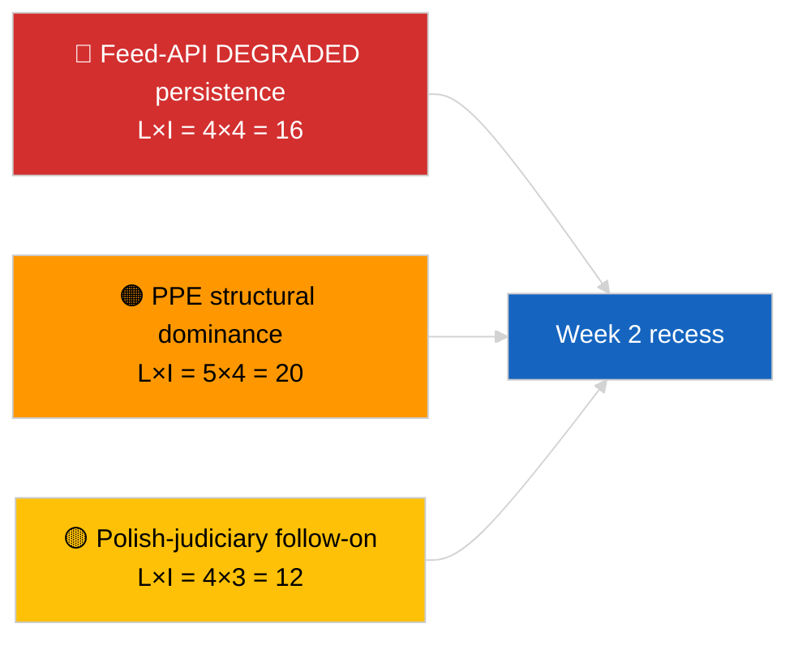

<!-- SPDX-FileCopyrightText: 2026 Hack23 AB -->
<!-- SPDX-License-Identifier: Apache-2.0 -->

# Synthèse de direction — La semaine en revue | 2026-04-04

**Classification :** OSINT | Registre parlementaire public  
**Niveau de confiance :** 🟢 Élevé (rétrospective 30 mars → 4 avril)  
**Généré :** 2026-04-04T00:00:00Z (rapport rétrospectif)  
**Type d'article :** Revue hebdomadaire  
**ID d'exécution :** `e92a23d1-ea51-4917-b351-16f1f93fd4a3`  
**Source :** Portail de données ouvertes du Parlement européen

---

## 🎯 BLUF

**La semaine du 30 mars → 4 avril 2026 était une semaine de session plénière complète avec les deux signaux de renseignement déterminants analytiques/opérationnels plutôt que législatifs : (1) confirmation de l'état DÉGRADÉ de l'API de flux du PE sur 8 points d'extrémité et (2) formalisation de l'arithmétique de la coalition EP10 montrant la dominance structurelle PPE à 38 % plus le signal de cohésion Renew–ECR de 0,95.** Le troisième signal récurrent est le cluster anti-corruption/réforme institutionnelle (TA-10-2026-0094 + 3 textes d'appui) reporté de la mini-plénière de Bruxelles du 26 mars. L'exécution `e92a23d1-ea51-4917-b351-16f1f93fd4a3` a retourné **"Quantitative risk scoring across 0 identified political dimensions"** — la synthèse de la revue hebdomadaire est donc reconstruite à partir des exécutions parallèles substantielles et des exécutions du jour précédent. **🟢 HAUTE confiance** pour les trois signaux ; la ligne de base "pas de plénière, pas de nouvelles procédures" de la semaine est ancrée dans le calendrier.

---

## 🧭 3 Décisions que ce brief soutient

| # | Décision | Qui décide | Délai | Preuves |
|:-:|----------|------------|:-----:|---------|
| 1 | **Éditorial :** publier la revue hebdomadaire comme synthèse à trois signaux (santé API + arithmétique de coalition + cluster de réforme) | Rédacteur | +24h | Convergence des exécutions parallèles |
| 2 | **Suivi :** maintenir des sondes quotidiennes des points d'extrémité pendant les vacances de Pâques (jusqu'au 13 avril) | Pipeline de données | quotidien | Détection de restauration |
| 3 | **Veille prospective :** Q2 commence le 7 avril avec le mardi de la Commission ; première semaine plénière 13–17 avril semaine de travail des commissions | Responsable de l'analyse | 2026-04-07 | Transition Q1→Q2 |

---

## 📰 Lecture de 60 secondes

- 🔴 **État DÉGRADÉ de l'API PE** confirmé par une sonde à 3 exécutions le 2026-04-03 ; 5/8 flux obligatoires en échec. (🟢 Élevé)
- 🟠 **Arithmétique de coalition** formalisée : dominance structurelle PPE à 38 % ; signal de cohésion Renew–ECR de 0,95 ; Grande Coalition à 60 % par défaut. (🟡 Moyen pour l'interprétation de la cohésion ; 🟢 Élevé pour les parts de sièges)
- 🟢 **Cluster anti-corruption/réforme institutionnelle** (TA-10-2026-0094 + 3) reste le signal législatif Q1 dominant. (🟢 Élevé)
- 🟡 **Pas de plénière, pas de réunions de commission, pas de nouvelles procédures** pendant la semaine. (🟢 Élevé)
- 🔵 **Contexte économique :** la trajectoire commerciale UE-États-Unis se poursuit ; avis CJE sur le Mercosur attendu. (🟢 Élevé)
- 🟣 **Référence croisée :** quatre exécutions parallèles du 2026-04-04 convergent vers la même triade. (🟢 Élevé)
- 🩷 **Vecteur de perturbation :** suivi judiciaire polonais (précédent Braun) est le vecteur le plus probable pour une surprise en session d'avril. (🟡 Moyen)
- ⚪ **Report :** les fenêtres de transposition pour les adoptions de mars de rang 1 s'étendent jusqu'au Q1 2028.

---

## 🗂️ Principales conclusions — Semaine du 30 mars → 4 avril 2026

| Rang | Conclusion | Source | Importance | Confiance |
|:----:|------------|--------|:----------:|:---------:|
| 1 | API de flux PE DÉGRADÉE (5/8 flux obligatoires) | `2026-04-03/breaking-2` | 8,0 | 🟢 ÉLEVÉE |
| 2 | Dominance structurelle PPE à 38 % + cohésion Renew–ECR 0,95 | `2026-04-03/breaking` | 7,5 | 🟡 MOYEN |
| 3 | Cluster anti-corruption/réforme (4 textes) | `2026-04-03/breaking-3` | 9,0 | 🟢 ÉLEVÉE |
| 4 | Flux hebdomadaire de 85 textes adoptés | `2026-04-04/breaking-4` | 6,0 | 🟢 ÉLEVÉE |
| 5 | Rétrospective pipeline Q1 (9 éléments à haute importance) | `2026-04-04/breaking-2` | 7,0 | 🟡 MOYEN |

---

## ⚠️ Instantané des risques et menaces

| Risque | V | I | Score | Déclencheur | Source | Amirauté |
|--------|:-:|:-:|:-----:|-------------|--------|:--------:|
| Persistance DÉGRADÉE de l'API de flux | 4 | 4 | 16 | Après le 14 avril | `2026-04-03/breaking-2` | A1 |
| Dominance structurelle PPE | 5 | 4 | 20 | Toutes les majorités nécessitent le PPE | Arithmétique de coalition | A1 |
| Suivi judiciaire polonais | 4 | 3 | 12 | Nouveau cas d'immunité | TA-10-2026-0088 | A1 |
| Risque de transposition rang 1 | 4 | 4 | 16 | Divergence nationale | TA-10-2026-0094 | A1 |

---

## 🔮 Principal déclencheur prospectif

**Fin des vacances de Pâques le 13 avril + mardi de la Commission le 7 avril + semaine de travail des commissions du 13 au 17 avril.** La fenêtre de transition Q1→Q2 composée déterminera quelle piste reportée du Q1 dominera : commerce (Scénario A), état de droit (Scénario B) ou économie/industrie (Scénario C).

---

## 🛡️ Évaluation de la qualité des sources

- **Sources primaires :** Exécutions parallèles 2026-04-03 et 2026-04-04 ; EP `get_adopted_texts_feed` fenêtre d'une semaine.
- **Limites des données :** Cette exécution de revue hebdomadaire a produit une classification vide ; synthèse reconstruite à partir des exécutions parallèles.
- **Niveau de confiance :** 🟢 ÉLEVÉ pour les trois signaux définissant la semaine.

---

## 📎 Liens

| Lien | Chemin |
|------|--------|
| Article | `./article.md` |
| Exécutions parallèles | `analysis/daily/2026-04-04/breaking/`, `breaking-2/`, `breaking-3/`, `breaking-4/` |
| Source de la semaine précédente | `analysis/daily/2026-04-03/breaking/`, `breaking-2/`, `breaking-3/` |
| Manifeste | `./manifest.json` |

---

**Contrôle du document**
- **Modèle :** `/analysis/templates/executive-brief.md`
- **Chemin de l'artefact :** `analysis/daily/2026-04-04/week-in-review/executive-brief.md`
- **Classification :** Public
- **Génération rétrospective :** Session de remplissage rétroactif.
