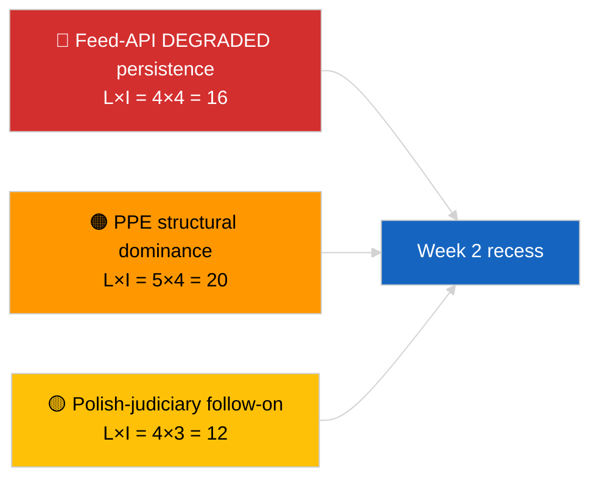

<!-- SPDX-FileCopyrightText: 2026 Hack23 AB -->
<!-- SPDX-License-Identifier: Apache-2.0 -->

# תקציר מנהלים — השבוע בסקירה | 2026-04-04

**סיווג:** OSINT | רישום פרלמנטרי ציבורי  
**רמת ביטחון:** 🟢 גבוהה (רטרוספקטיב 30 מרץ → 4 אפריל)  
**נוצר:** 2026-04-04T00:00:00Z (דו"ח רטרוספקטיבי)  
**סוג מאמר:** סקירה שבועית  
**מזהה ריצה:** `e92a23d1-ea51-4917-b351-16f1f93fd4a3`  
**מקור:** פורטל הנתונים הפתוחים של הפרלמנט האירופי

---

## 🎯 BLUF

**השבוע של 30 מרץ → 4 אפריל 2026 היה שבוע הפסקה מלא עם שני אותות המודיעין המכריעים אנליטיים/מבצעיים ולא חקיקתיים: (1) אישור המצב מושפל של ה-API של הפיד של הפרלמנט האירופי על 8 נקודות קצה ו-(2) פורמליזציה של אריתמטיקת הקואליציה EP10 המראה דומיננטיות מבנית PPE של 38% בתוספת אות הלכידות Renew–ECR של 0.95.** האות החוזר השלישי הוא קלאסטר האנטי-שחיתות/רפורמה מוסדית (TA-10-2026-0094 + 3 טקסטים תומכים) המועבר ממושב המיני-מליאה של בריסל מ-26 במרץ. הריצה `e92a23d1-ea51-4917-b351-16f1f93fd4a3` החזירה **"Quantitative risk scoring across 0 identified political dimensions"** — סינתזת סקירת השבוע מתוחזרת לפיכך מריצות הסיסטר הנמרצות ומריצות היום הקודם. **🟢 ביטחון גבוה** על שלושת האותות; קו הבסיס "ללא מליאה, ללא נהלים חדשים" של השבוע מעוגן בלוח השנה.

---

## 🧭 3 החלטות שמתקציר זה תומך בהן

| # | החלטה | מי מחליט | מועד אחרון | עדויות |
|:-:|-------|----------|:----------:|--------|
| 1 | **עריכתי:** פרסם סקירת שבוע כסינתזה של שלושה אותות (בריאות API + אריתמטיקת קואליציה + קלאסטר רפורמה) | עורך | +24ש | התכנסות ריצות הסיסטר |
| 2 | **ניטור:** שמור על בדיקות יומיות של נקודות קצה במהלך חופשת הפסחא (עד 13 אפריל) | צינור נתונים | יומי | זיהוי שחזור |
| 3 | **צפייה קדימה:** Q2 מתחיל ב-7 אפריל עם שלישי הנציבות; שבוע מליאה ראשון 13–17 אפריל שבוע עבודת ועדות | אחראי ניתוח | 2026-04-07 | מעבר Q1→Q2 |

---

## 📰 קריאה של 60 שניות

- 🔴 **מצב מושפל של ה-API של הפרלמנט האירופי** מאושר על ידי בדיקה של 3 ריצות ב-2026-04-03; 5/8 פידים חובה נכשלו. (🟢 גבוה)
- 🟠 **אריתמטיקת קואליציה** מפורמלת: דומיננטיות מבנית PPE 38%; אות לכידות Renew–ECR 0.95; קואליציה גדולה 60% ברירת מחדל. (🟡 בינוני לפרשנות לכידות; 🟢 גבוה לנתחי מושבים)
- 🟢 **קלאסטר אנטי-שחיתות/רפורמה מוסדית** (TA-10-2026-0094 + 3) ממשיך להיות אות החקיקה הדומיננטי של Q1. (🟢 גבוה)
- 🟡 **ללא מליאה, ללא ישיבות ועדה, ללא נהלים חדשים** בשבוע. (🟢 גבוה)
- 🔵 **הקשר כלכלי:** מסלול הסחר ארה"ב-האיחוד האירופי נמשך; חוות דעת בית משפט ה-EU על Mercosur מצופה. (🟢 גבוה)
- 🟣 **הפניה צולבת:** ארבע ריצות סיסטר מ-2026-04-04 מתכנסות לאותה טריאדה. (🟢 גבוה)
- 🩷 **וקטור שיבוש:** המשך שיפוט פולני (תקדים Braun) הוא הוקטור הסביר ביותר להפתעה במושב אפריל. (🟡 בינוני)
- ⚪ **מועבר:** חלונות טרנספוזיציה לאימוצים של מרץ רמה-1 מתארכים עד Q1 2028.

---

## 🗂️ ממצאים עיקריים — שבוע 30 מרץ → 4 אפריל 2026

| דירוג | ממצא | מקור | חשיבות | ביטחון |
|:-----:|------|------|:-------:|:------:|
| 1 | ה-API הפיד של הפרלמנט האירופי מושפל (5/8 פידים חובה) | `2026-04-03/breaking-2` | 8.0 | 🟢 גבוה |
| 2 | דומיננטיות מבנית PPE 38% + לכידות Renew–ECR 0.95 | `2026-04-03/breaking` | 7.5 | 🟡 בינוני |
| 3 | קלאסטר אנטי-שחיתות/רפורמה (4 טקסטים) | `2026-04-03/breaking-3` | 9.0 | 🟢 גבוה |
| 4 | פיד שבועי של 85 טקסטים שאומצו | `2026-04-04/breaking-4` | 6.0 | 🟢 גבוה |
| 5 | רטרוספקטיב צינור Q1 (9 פריטים בעלי חשיבות גבוהה) | `2026-04-04/breaking-2` | 7.0 | 🟡 בינוני |

---

## ⚠️ תמונת מצב סיכונים ואיומים

| סיכון | ס | ה | ציון | מפעיל | מקור | אדמירליות |
|-------|:-:|:-:|:----:|-------|------|:---------:|
| ה-API פיד מושפל מתמשך | 4 | 4 | 16 | אחרי 14 אפריל | `2026-04-03/breaking-2` | A1 |
| דומיננטיות מבנית PPE | 5 | 4 | 20 | כל הרוב דורשים PPE | אריתמטיקת קואליציה | A1 |
| המשך שיפוט פולני | 4 | 3 | 12 | מקרה חסינות חדש | TA-10-2026-0088 | A1 |
| סיכון טרנספוזיציה רמה-1 | 4 | 4 | 16 | דיברגנציה לאומית | TA-10-2026-0094 | A1 |

---

## 🔮 טריגר עתידי עיקרי

**סיום חופשת פסחא 13 אפריל + שלישי הנציבות 7 אפריל + שבוע עבודת ועדות 13–17 אפריל.** חלון המעבר המורכב Q1→Q2 יקבע איזה מסלול מועבר של Q1 ישלוט: מסחר (תרחיש A), שלטון חוק (תרחיש B) או כלכלה/תעשייה (תרחיש C).

---

## 🛡️ הערכת איכות מקורות

- **מקורות ראשוניים:** ריצות סיסטר 2026-04-03 ו-2026-04-04; חלון שבוע `get_adopted_texts_feed` של הפרלמנט האירופי.
- **מגבלות נתונים:** ריצת סקירת שבוע זו הפיקה סיווג ריק; סינתזה מתוחזרת מריצות הסיסטר.
- **רמת ביטחון:** 🟢 גבוה לשלושת האותות המגדירים את השבוע.

---

## 📎 קישורים

| קישור | נתיב |
|-------|------|
| מאמר | `./article.md` |
| ריצות סיסטר | `analysis/daily/2026-04-04/breaking/`, `breaking-2/`, `breaking-3/`, `breaking-4/` |
| מקור שבוע קודם | `analysis/daily/2026-04-03/breaking/`, `breaking-2/`, `breaking-3/` |
| מניפסט | `./manifest.json` |

---

**בקרת מסמכים**
- **תבנית:** `/analysis/templates/executive-brief.md`
- **נתיב ארטיפקט:** `analysis/daily/2026-04-04/week-in-review/executive-brief.md`
- **סיווג:** ציבורי
- **יצירה רטרוספקטיבית:** סשן מילוי לאחור.
