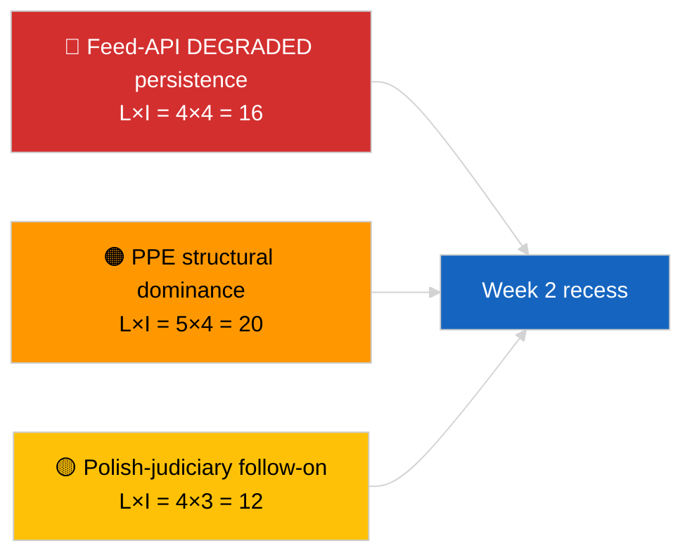

<!-- SPDX-FileCopyrightText: 2026 Hack23 AB -->
<!-- SPDX-License-Identifier: Apache-2.0 -->

# エグゼクティブ・ブリーフ — 週次レビュー | 2026-04-04

**分類:** OSINT | 公開議会記録  
**信頼度:** 🟢 高 (振り返り 3月30日 → 4月4日)  
**作成日:** 2026-04-04T00:00:00Z（振り返りレポート）  
**記事タイプ:** 週次レビュー  
**実行ID:** `e92a23d1-ea51-4917-b351-16f1f93fd4a3`  
**データソース:** 欧州議会オープンデータポータル

---

## 🎯 BLUF

**3月30日→4月4日の週は完全な休会期間であり、主要な分析/作戦上の知見は立法的なものではなく二つに集約される: (1) 欧州議会フィードAPIの8エンドポイントにおける低下状態の確認、(2) PPE構造的支配38%とRenew–ECR凝集シグナル0.95を示すEP10連立演算の形式化。** 第三の繰り返しシグナルは、3月26日ブリュッセル・ミニ本会議から進行中の腐敗防止/制度改革クラスター (TA-10-2026-0094 + 3件の補完テキスト) である。実行 `e92a23d1-ea51-4917-b351-16f1f93fd4a3` は **"Quantitative risk scoring across 0 identified political dimensions"** を返した — 週次レビューの統合は、姉妹実行と前日実行から復元する。三つのシグナルは **🟢 高信頼度**; 「本会議なし、新手続きなし」という週のベースラインは暦に根ざしている。

---

## 🧭 このブリーフが支援する3つの意思決定

| # | 意思決定 | 意思決定者 | 期限 | 根拠 |
|:-:|---------|-----------|:----:|------|
| 1 | **編集:** 週次レビューを三シグナル統合 (API健全性 + 連立演算 + 改革クラスター) として公表 | 編集者 | +24h | 姉妹実行の収束 |
| 2 | **監視:** 復活祭休暇中 (4月13日まで) の日次エンドポイント確認を維持 | データパイプライン | 日次 | 復旧検知 |
| 3 | **先読み:** Q2は4月7日の委員会火曜日から始まり、第1本会議週は4月13–17日で委員会作業週 | 分析担当 | 2026-04-07 | Q1→Q2移行 |

---

## 📰 60秒ブリーフィング

- 🔴 **欧州議会APIの低下状態**は2026-04-03の3実行での確認; 義務フィード8件中5件が失敗。 (🟢 高)
- 🟠 **連立演算**の形式化: PPE構造的支配38%; Renew–ECR凝集0.95; 大連立60%がデフォルト。 (🟡 凝集解釈は中; 🟢 議席比率は高)
- 🟢 **腐敗防止/制度改革クラスター** (TA-10-2026-0094 + 3) がQ1の支配的立法シグナルであり続けている。 (🟢 高)
- 🟡 **本会議なし、委員会会議なし、新手続きなし**の週。 (🟢 高)
- 🔵 **経済コンテキスト:** 米国–EU貿易ルートが継続; メルコスールに関するEU裁判所意見書が予定。 (🟢 高)
- 🟣 **クロスリファレンス:** 2026-04-04の4つの姉妹実行が同じ三位一体に収束。 (🟢 高)
- 🩷 **混乱ベクター:** ポーランド司法の継続 (Braun先例) が4月会議での最有力サプライズベクター。 (🟡 中)
- ⚪ **繰り越し:** 3月レベル1採択のトランスポジション窓が2028年Q1まで延長。

---

## 🗂️ 主要所見 — 2026年3月30日→4月4日週

| 順位 | 所見 | ソース | 重要度 | 信頼度 |
|:---:|------|------|:------:|:------:|
| 1 | 欧州議会フィードAPI低下 (義務フィード8件中5件) | `2026-04-03/breaking-2` | 8.0 | 🟢 高 |
| 2 | PPE構造的支配38% + Renew–ECR凝集0.95 | `2026-04-03/breaking` | 7.5 | 🟡 中 |
| 3 | 腐敗防止/制度改革クラスター (4テキスト) | `2026-04-03/breaking-3` | 9.0 | 🟢 高 |
| 4 | 週次85採択テキストフィード | `2026-04-04/breaking-4` | 6.0 | 🟢 高 |
| 5 | Q1パイプライン振り返り (高重要性9項目) | `2026-04-04/breaking-2` | 7.0 | 🟡 中 |

---

## ⚠️ リスク・脅威スナップショット

| リスク | L | I | スコア | トリガー | ソース | アドミラルティ |
|--------|:-:|:-:|:------:|--------|------|:----------:|
| フィードAPI低下継続 | 4 | 4 | 16 | 4月14日以降 | `2026-04-03/breaking-2` | A1 |
| PPE構造的支配 | 5 | 4 | 20 | 全過半数がPPEを要求 | 連立演算 | A1 |
| ポーランド司法継続 | 4 | 3 | 12 | 新たな免責事案 | TA-10-2026-0088 | A1 |
| レベル1トランスポジションリスク | 4 | 4 | 16 | 国内乖離 | TA-10-2026-0094 | A1 |

---

## 🔮 最重要先読みトリガー

**復活祭休暇終了4月13日 + 委員会火曜日4月7日 + 委員会作業週4月13–17日。** 複雑なQ1→Q2移行窓が、どのQ1引き継ぎトラックが支配的かを決定する: 貿易 (シナリオA)、法の支配 (シナリオB)、または経済/産業 (シナリオC)。

---

## 🛡️ ソース品質評価

- **一次ソース:** 2026-04-03および2026-04-04姉妹実行; 欧州議会 `get_adopted_texts_feed` 週次窓。
- **データ限界:** この週次レビュー実行は空の分類を生成; 統合は姉妹実行から復元。
- **信頼度:** 週を定義する三シグナルで 🟢 高。

---

## 📎 リンク

| リンク | パス |
|-------|------|
| 記事 | `./article.md` |
| 姉妹実行 | `analysis/daily/2026-04-04/breaking/`, `breaking-2/`, `breaking-3/`, `breaking-4/` |
| 前週ソース | `analysis/daily/2026-04-03/breaking/`, `breaking-2/`, `breaking-3/` |
| マニフェスト | `./manifest.json` |

---

**文書管理**
- **テンプレート:** `/analysis/templates/executive-brief.md`
- **アーティファクトパス:** `analysis/daily/2026-04-04/week-in-review/executive-brief.md`
- **分類:** 公開
- **遡及作成:** バックフィルセッション。
