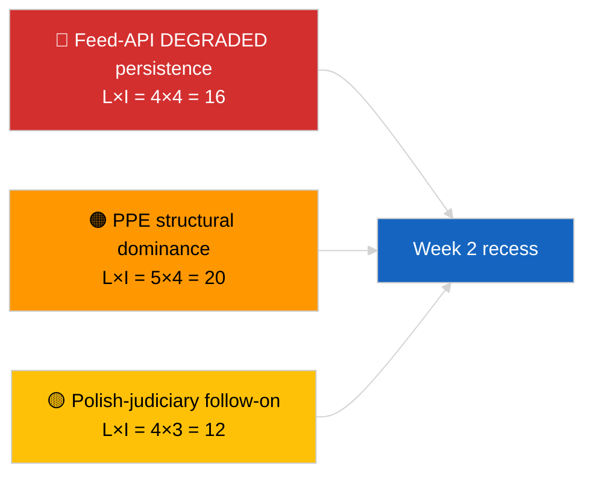

<!-- SPDX-FileCopyrightText: 2026 Hack23 AB -->
<!-- SPDX-License-Identifier: Apache-2.0 -->

# 임원 브리핑 — 주간 리뷰 | 2026-04-04

**분류:** OSINT | 공개 의회 기록  
**신뢰도:** 🟢 높음 (소급 3월 30일 → 4월 4일)  
**생성일:** 2026-04-04T00:00:00Z (소급 보고서)  
**기사 유형:** 주간 리뷰  
**실행 ID:** `e92a23d1-ea51-4917-b351-16f1f93fd4a3`  
**데이터 소스:** 유럽의회 공개 데이터 포털

---

## 🎯 BLUF

**3월 30일→4월 4일 주는 완전한 휴회 기간이었으며, 주요 분석/작전적 인텔리전스 발견은 입법적이 아닌 두 가지로 집약된다: (1) 유럽의회 피드 API 8개 엔드포인트의 저하 상태 확인, (2) PPE 구조적 지배 38%와 Renew–ECR 응집 신호 0.95를 보여주는 EP10 연립 산술의 공식화.** 세 번째 반복 신호는 3월 26일 브뤼셀 미니 본회의에서 진행 중인 반부패/제도 개혁 클러스터 (TA-10-2026-0094 + 3개 보완 텍스트)이다. 실행 `e92a23d1-ea51-4917-b351-16f1f93fd4a3`은 **"Quantitative risk scoring across 0 identified political dimensions"**를 반환했다 — 주간 리뷰 종합은 자매 실행 및 전날 실행에서 복원된다. 세 가지 신호 모두 **🟢 높은 신뢰도**; "본회의 없음, 새 절차 없음"이라는 주의 기준선은 달력에 기반한다.

---

## 🧭 이 브리핑이 지원하는 3가지 의사결정

| # | 의사결정 | 결정자 | 기한 | 근거 |
|:-:|---------|--------|:----:|------|
| 1 | **편집:** 주간 리뷰를 3가지 신호 종합 (API 상태 + 연립 산술 + 개혁 클러스터)으로 발행 | 편집자 | +24h | 자매 실행 수렴 |
| 2 | **모니터링:** 부활절 휴가 중 (4월 13일까지) 일별 엔드포인트 확인 유지 | 데이터 파이프라인 | 일별 | 복구 감지 |
| 3 | **선행 조회:** Q2는 4월 7일 위원회 화요일부터 시작; 첫 본회의 주는 4월 13–17일 위원회 작업 주 | 분석 담당 | 2026-04-07 | Q1→Q2 전환 |

---

## 📰 60초 브리핑

- 🔴 **유럽의회 API 저하 상태** 2026-04-03의 3개 실행에서 확인; 필수 피드 8개 중 5개 실패. (🟢 높음)
- 🟠 **연립 산술** 공식화: PPE 구조적 지배 38%; Renew–ECR 응집 0.95; 대연립 60% 기본값. (🟡 응집 해석 중간; 🟢 의석 비율 높음)
- 🟢 **반부패/제도 개혁 클러스터** (TA-10-2026-0094 + 3) Q1 지배적 입법 신호 지속. (🟢 높음)
- 🟡 **본회의 없음, 위원회 회의 없음, 새 절차 없음** 주. (🟢 높음)
- 🔵 **경제 맥락:** 미국–EU 무역 경로 지속; 메르코수르에 관한 EU 법원 의견서 예정. (🟢 높음)
- 🟣 **교차 참조:** 2026-04-04의 4개 자매 실행이 동일한 삼위일체에 수렴. (🟢 높음)
- 🩷 **혼란 벡터:** 폴란드 사법부 속편 (Braun 선례)가 4월 회기에서 가장 가능성 높은 서프라이즈 벡터. (🟡 중간)
- ⚪ **이월:** 3월 레벨-1 채택의 전치 창이 2028년 Q1까지 연장.

---

## 🗂️ 주요 발견사항 — 2026년 3월 30일→4월 4일 주

| 순위 | 발견 | 출처 | 중요도 | 신뢰도 |
|:---:|------|------|:------:|:------:|
| 1 | 유럽의회 피드 API 저하 (필수 피드 8개 중 5개) | `2026-04-03/breaking-2` | 8.0 | 🟢 높음 |
| 2 | PPE 구조적 지배 38% + Renew–ECR 응집 0.95 | `2026-04-03/breaking` | 7.5 | 🟡 중간 |
| 3 | 반부패/제도 개혁 클러스터 (4개 텍스트) | `2026-04-03/breaking-3` | 9.0 | 🟢 높음 |
| 4 | 주간 85개 채택 텍스트 피드 | `2026-04-04/breaking-4` | 6.0 | 🟢 높음 |
| 5 | Q1 파이프라인 소급 (높은 중요도 9개 항목) | `2026-04-04/breaking-2` | 7.0 | 🟡 중간 |

---

## ⚠️ 위험·위협 스냅샷

| 위험 | L | I | 점수 | 트리거 | 출처 | 해군 등급 |
|-----|:-:|:-:|:----:|-------|------|:--------:|
| 피드 API 저하 지속 | 4 | 4 | 16 | 4월 14일 이후 | `2026-04-03/breaking-2` | A1 |
| PPE 구조적 지배 | 5 | 4 | 20 | 모든 다수가 PPE 필요 | 연립 산술 | A1 |
| 폴란드 사법부 속편 | 4 | 3 | 12 | 새 면책 사건 | TA-10-2026-0088 | A1 |
| 레벨-1 전치 위험 | 4 | 4 | 16 | 국내 이탈 | TA-10-2026-0094 | A1 |

---

## 🔮 최상위 선행 트리거

**부활절 휴가 종료 4월 13일 + 위원회 화요일 4월 7일 + 위원회 작업 주 4월 13–17일.** 복잡한 Q1→Q2 전환 창이 어떤 Q1 이월 트랙이 지배적인지 결정할 것이다: 무역 (시나리오 A), 법치주의 (시나리오 B), 또는 경제/산업 (시나리오 C).

---

## 🛡️ 소스 품질 평가

- **1차 소스:** 2026-04-03 및 2026-04-04 자매 실행; 유럽의회 `get_adopted_texts_feed` 주간 창.
- **데이터 한계:** 이 주간 리뷰 실행은 빈 분류를 생성했음; 종합은 자매 실행에서 복원.
- **신뢰도:** 주를 정의하는 세 가지 신호에서 🟢 높음.

---

## 📎 링크

| 링크 | 경로 |
|------|------|
| 기사 | `./article.md` |
| 자매 실행 | `analysis/daily/2026-04-04/breaking/`, `breaking-2/`, `breaking-3/`, `breaking-4/` |
| 이전 주 소스 | `analysis/daily/2026-04-03/breaking/`, `breaking-2/`, `breaking-3/` |
| 매니페스트 | `./manifest.json` |

---

**문서 관리**
- **템플릿:** `/analysis/templates/executive-brief.md`
- **아티팩트 경로:** `analysis/daily/2026-04-04/week-in-review/executive-brief.md`
- **분류:** 공개
- **소급 생성:** 백필 세션.
