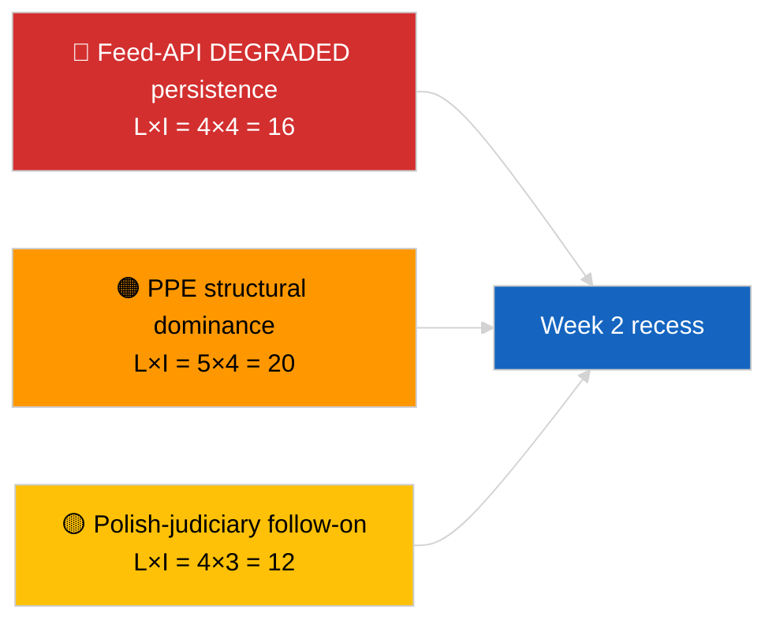

<!-- SPDX-FileCopyrightText: 2026 Hack23 AB -->
<!-- SPDX-License-Identifier: Apache-2.0 -->

# Managementsamenvatting — De week in review | 2026-04-04

**Classificatie:** OSINT | Openbaar parlementair register  
**Betrouwbaarheidsniveau:** 🟢 Hoog (retrospectief 30 maart → 4 april)  
**Gegenereerd:** 2026-04-04T00:00:00Z (retrospectief rapport)  
**Artikeltype:** Weekoverzicht  
**Uitvoerings-ID:** `e92a23d1-ea51-4917-b351-16f1f93fd4a3`  
**Bron:** Open dataportaal van het Europees Parlement

---

## 🎯 BLUF

**De week van 30 maart → 4 april 2026 was een volledige recessweek met de twee bepalende inlichtingensignalen analytisch/operationeel in plaats van wetgevend: (1) bevestiging van de GEDEGRADEERDE toestand van de EP-feed-API over 8 eindpunten en (2) formalisering van de EP10-coalitierekenkunde die PPE 38% structurele dominantie aantoont plus het Renew–ECR-cohesiesignaal van 0,95.** Het derde terugkerende signaal is het antikorruptie-/institutionele hervormingscluster (TA-10-2026-0094 + 3 ondersteunende teksten) dat wordt overgedragen van de Brusselse mini-plenaire vergadering op 26 maart. Uitvoering `e92a23d1-ea51-4917-b351-16f1f93fd4a3` retourneerde **"Quantitative risk scoring across 0 identified political dimensions"** — de weekoverzichtsynthese wordt daarom gereconstrueerd uit substantiële zusteruitvoeringen en uitvoeringen van de vorige dag. **🟢 HOOG betrouwbaarheidsniveau** voor de drie signalen; de basislijn "geen plenaire, geen nieuwe procedures" van de week is kalenderverankerd.

---

## 🧭 3 Beslissingen die dit rapport ondersteunt

| # | Beslissing | Wie beslist | Deadline | Bewijs |
|:-:|------------|-------------|:--------:|--------|
| 1 | **Redactioneel:** weekoverzicht publiceren als drie-signaalssynthese (API-gezondheid + coalitierekenkunde + hervormingscluster) | Redacteur | +24u | Convergentie zusteruitvoeringen |
| 2 | **Monitoring:** dagelijkse eindpuntprobes handhaven tijdens paasreces (tot 13 april) | Datapijplijn | dagelijks | Hersteldetectie |
| 3 | **Vooruitblik:** K2 begint op 7 april met Commissiedinsdag; eerste plenaire week 13–17 april commissiewerkweek | Analyseverantwoordelijke | 2026-04-07 | K1→K2-overgang |

---

## 📰 60-secondenlezing

- 🔴 **GEDEGRADEERDE toestand EP-API** bevestigd door 3-uitvoerings-probe op 2026-04-03; 5/8 verplichte feeds mislukt. (🟢 Hoog)
- 🟠 **Coalitierekenkunde** geformaliseerd: PPE 38% structurele dominantie; Renew–ECR 0,95 cohesiesignaal; Grote Coalitie 60% standaard. (🟡 Gemiddeld voor cohesie-interpretatie; 🟢 Hoog voor zetelverdelingen)
- 🟢 **Antikorruptie-/institutioneel hervormingscluster** (TA-10-2026-0094 + 3) blijft het dominante K1-wetgevingssignaal. (🟢 Hoog)
- 🟡 **Geen plenaire, geen commissievergaderingen, geen nieuwe procedures** gedurende de week. (🟢 Hoog)
- 🔵 **Economische context:** VS-EU-handelsroute zet voort; Mercosur HvJ-advies afgewacht. (🟢 Hoog)
- 🟣 **Kruisverwijzing:** vier zusteruitvoeringen van 2026-04-04 convergeren naar dezelfde triade. (🟢 Hoog)
- 🩷 **Storingsvector:** Pools-justitiële follow-up (Braun-precedent) is de meest waarschijnlijke vector voor een aprilplenaire verrassing. (🟡 Gemiddeld)
- ⚪ **Overgedragen:** transpositievensters voor tier-1-maartaannemingen strekken zich uit tot K1 2028.

---

## 🗂️ Topbevindingen — Week van 30 maart → 4 april 2026

| Rang | Bevinding | Bron | Belang | Betrouwbaarheid |
|:----:|-----------|------|:------:|:---------------:|
| 1 | EP-feed-API GEDEGRADEERD (5/8 verplichte feeds) | `2026-04-03/breaking-2` | 8,0 | 🟢 HOOG |
| 2 | PPE 38% structurele dominantie + Renew–ECR 0,95 cohesie | `2026-04-03/breaking` | 7,5 | 🟡 GEMIDDELD |
| 3 | Antikorruptie-/hervormingscluster (4 teksten) | `2026-04-03/breaking-3` | 9,0 | 🟢 HOOG |
| 4 | 85-item aangenomen-teksten weekfeed | `2026-04-04/breaking-4` | 6,0 | 🟢 HOOG |
| 5 | K1-pijplijn retrospectief (9 hoogbetekende items) | `2026-04-04/breaking-2` | 7,0 | 🟡 GEMIDDELD |

---

## ⚠️ Risico- en dreigingsmomentopname

| Risico | W | I | Score | Aanleiding | Bron | Admiraliteit |
|--------|:-:|:-:|:-----:|-----------|------|:-----------:|
| Feed-API GEDEGRADEERD aanhoudend | 4 | 4 | 16 | Na 14 april | `2026-04-03/breaking-2` | A1 |
| PPE structurele dominantie | 5 | 4 | 20 | Alle meerderheden vereisen PPE | Coalitierekenkunde | A1 |
| Pools-justitiële follow-up | 4 | 3 | 12 | Nieuwe immuniteitszaak | TA-10-2026-0088 | A1 |
| Tier-1 transpositierisico | 4 | 4 | 16 | Nationale divergentie | TA-10-2026-0094 | A1 |

---

## 🔮 Topaanleiding voor de toekomst

**Einde paasreces 13 april + Commissiedinsdag 7 april + commissiewerkweek 13–17 april.** Het samengestelde K1→K2-overgangsvenster bepaalt welk overgedragen K1-traject domineert: handel (Scenario A), rechtsstaat (Scenario B) of economie/industrie (Scenario C).

---

## 🛡️ Bronkwaliteitsbeoordeling

- **Primaire bronnen:** Zusteruitvoeringen 2026-04-03 en 2026-04-04; EP `get_adopted_texts_feed` één-week-venster.
- **Databeperkingen:** Deze weekoverzichtsuitvoering produceerde lege classificatie; synthese gereconstrueerd uit zusteruitvoeringen.
- **Betrouwbaarheidsniveau:** 🟢 HOOG voor de drie weekbepalende signalen.

---

## 📎 Links

| Link | Pad |
|------|-----|
| Artikel | `./article.md` |
| Zusteruitvoeringen | `analysis/daily/2026-04-04/breaking/`, `breaking-2/`, `breaking-3/`, `breaking-4/` |
| Bron van vorige week | `analysis/daily/2026-04-03/breaking/`, `breaking-2/`, `breaking-3/` |
| Manifest | `./manifest.json` |

---

**Documentbeheer**
- **Sjabloon:** `/analysis/templates/executive-brief.md`
- **Artefactpad:** `analysis/daily/2026-04-04/week-in-review/executive-brief.md`
- **Classificatie:** Openbaar
- **Retrospectieve generatie:** Aanvullende sessie.
