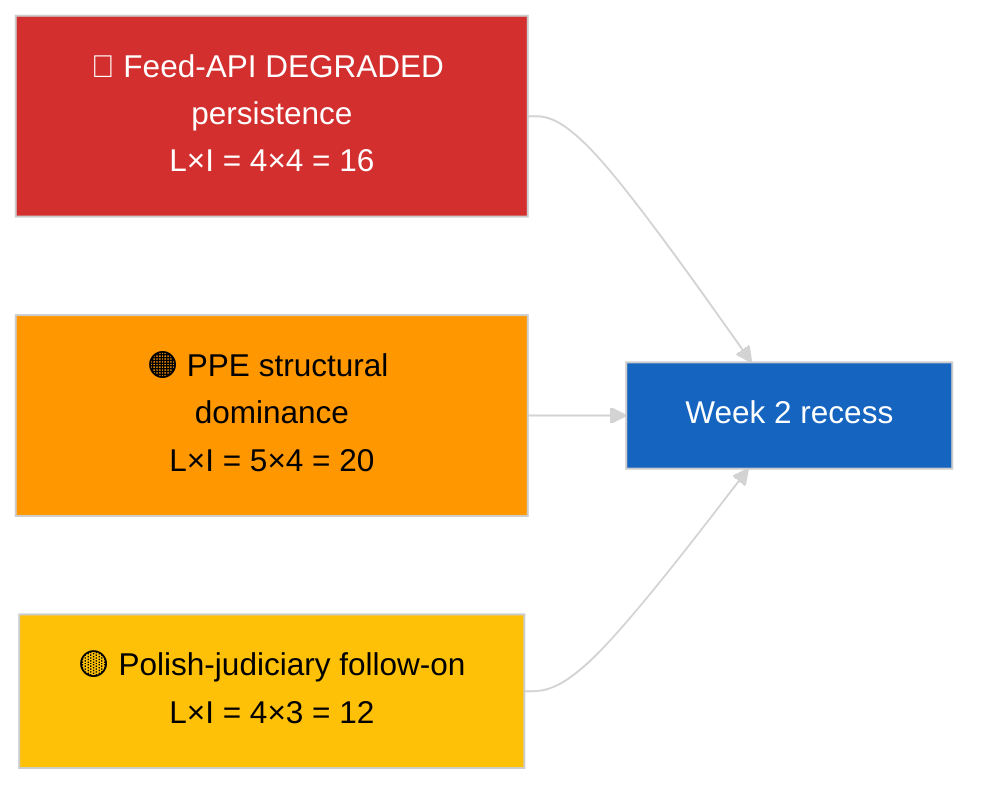

<!-- SPDX-FileCopyrightText: 2026 Hack23 AB -->
<!-- SPDX-License-Identifier: Apache-2.0 -->

# Ledersammendrag — Uken i korthet | 2026-04-04

**Klassifisering:** OSINT | Offentlig parlamentarisk registrering  
**Konfidensgrad:** 🟢 Høy (retrospektiv 30. mars → 4. april)  
**Generert:** 2026-04-04T00:00:00Z (retrospektiv rapport)  
**Artikkeltype:** Ukesgjennomgang  
**Kjørings-ID:** `e92a23d1-ea51-4917-b351-16f1f93fd4a3`  
**Kilde:** Europaparlamentets åpne dataportal

---

## 🎯 BLUF

**Uken 30. mars → 4. april 2026 var en full recessuke med de to avgjørende etterretningssignalene analytiske/operasjonelle snarere enn lovgivningsmessige: (1) bekreftelse av EP-feed-API DEGRADERT tilstand over 8 endepunkter og (2) formalisering av EP10-koalisjonsaritmetikken som viser PPE 38% strukturell dominans pluss Renew–ECR-samholdssignalet på 0,95.** Det tredje tilbakevendende signalet er antikorruptions-/institusjonsreformklyngen (TA-10-2026-0094 + 3 støttetekster), som overføres fra mini-plenumsmøtet i Brussel 26. mars. Kjøring `e92a23d1-ea51-4917-b351-16f1f93fd4a3` returnerte **"Quantitative risk scoring across 0 identified political dimensions"** — ukesgjennomgangssyntesen rekonstrueres derfor fra substansielle søskenkjøringer og foregående dags kjøringer. **🟢 HØY konfidensgrad** for de tre signalene; ukens "ingen plenum, ingen nye prosedyrer"-basislinje er kalenderforankret.

---

## 🧭 3 Beslutninger denne rapporten støtter

| # | Beslutning | Hvem beslutter | Frist | Bevis |
|:-:|------------|----------------|:-----:|-------|
| 1 | **Redaksjonelt:** publiser ukesgjennomgang som en tre-signalssyntese (API-helse + koalisjonsaritmetikk + reformklynge) | Redaktør | +24t | Konvergens søskenkjøringer |
| 2 | **Overvåking:** oppretthold daglige endepunktsprober gjennom påskepausen (til 13. april) | Datapipeline | daglig | Gjenopprettingsdeteksjon |
| 3 | **Fremoverskuende:** K2 begynner 7. april med Kommisjonens tirsdag; første plenarsuke 13.–17. april komitéarbeidsuke | Analyseansvarlig | 2026-04-07 | K1→K2-overgang |

---

## 📰 60-sekunders lesning

- 🔴 **EP API DEGRADERT tilstand** bekreftet av 3-kjøringsprobe 2026-04-03; 5/8 obligatoriske feeder feilet. (🟢 Høy)
- 🟠 **Koalisjonsaritmetikk** formalisert: PPE 38% strukturell dominans; Renew–ECR 0,95 samholdssignal; Storkoalisjon 60% standard. (🟡 Middels for samholdsfortolkning; 🟢 Høy for mandatandeler)
- 🟢 **Antikorruptions-/institusjonsreformklynge** (TA-10-2026-0094 + 3) fortsetter å være det dominerende K1-lovgivningssignalet. (🟢 Høy)
- 🟡 **Ingen plenum, ingen komitémøter, ingen nye prosedyrer** i løpet av uken. (🟢 Høy)
- 🔵 **Økonomisk kontekst:** USA-EU-handelsbane fortsetter; Mercosur EUD-uttalelse avventes. (🟢 Høy)
- 🟣 **Kryssreferanse:** fire søskenkjøringer fra 2026-04-04 konvergerer på den samme triaden. (🟢 Høy)
- 🩷 **Forstyrrelsesvektorer:** Polsk-rettsvesen-oppfølging (Braun-presedens) er den høyest sannsynlige vektoren for en aprilplenum-overraskelse. (🟡 Middels)
- ⚪ **Overført:** transposjonsvinduer for tier-1-marsvedtak strekker seg til K1 2028.

---

## 🗂️ Toppfunn — Uken 30. mars → 4. april 2026

| Rang | Funn | Kilde | Betydning | Konfidensgrad |
|:----:|------|-------|:---------:|:------------:|
| 1 | EP feed-API DEGRADERT (5/8 obligatoriske feeder) | `2026-04-03/breaking-2` | 8,0 | 🟢 HØY |
| 2 | PPE 38% strukturell dominans + Renew–ECR 0,95 samhold | `2026-04-03/breaking` | 7,5 | 🟡 MIDDELS |
| 3 | Antikorruptions-/reformklynge (4 tekster) | `2026-04-03/breaking-3` | 9,0 | 🟢 HØY |
| 4 | 85-post vedtatte-tekster ukefeed | `2026-04-04/breaking-4` | 6,0 | 🟢 HØY |
| 5 | K1-pipeline retrospektiv (9 høybetydende poster) | `2026-04-04/breaking-2` | 7,0 | 🟡 MIDDELS |

---

## ⚠️ Risiko- og trusselsbilde

| Risiko | S | I | Poeng | Utløser | Kilde | Admiralitet |
|--------|:-:|:-:|:-----:|---------|-------|:-----------:|
| Feed-API DEGRADERT vedvarer | 4 | 4 | 16 | Forbi 14. april | `2026-04-03/breaking-2` | A1 |
| PPE strukturell dominans | 5 | 4 | 20 | Alle flertall krever PPE | Koalisjonsaritmetikk | A1 |
| Polsk-rettsvesen-oppfølging | 4 | 3 | 12 | Ny immunitetsak | TA-10-2026-0088 | A1 |
| Tier-1 transposisonsrisiko | 4 | 4 | 16 | Nasjonal divergens | TA-10-2026-0094 | A1 |

---

## 🔮 Topp fremtidsutløser

**Påskepausens slutt 13. april + Kommisjonens tirsdag 7. april + komitéarbeidsuke 13.–17. april.** Det sammensatte K1→K2-overgangsvinduet avgjør hvilket K1-overført spor dominerer: handel (Scenario A), rettstat (Scenario B) eller økonomi/industri (Scenario C).

---

## 🛡️ Kildekvalitetsvurdering

- **Primærkilder:** Søskenkjøringer 2026-04-03 og 2026-04-04; EP `get_adopted_texts_feed` en-uke-vindu.
- **Databegrensninger:** Denne ukesgjennomgangskjøringen produserte tom klassifisering; syntese rekonstruert fra søskenkjøringer.
- **Konfidensgrad:** 🟢 HØY for de tre ukesdefinerende signalene.

---

## 📎 Lenker

| Lenke | Sti |
|-------|-----|
| Artikkel | `./article.md` |
| Søskenkjøringer | `analysis/daily/2026-04-04/breaking/`, `breaking-2/`, `breaking-3/`, `breaking-4/` |
| Forrige ukes kilde | `analysis/daily/2026-04-03/breaking/`, `breaking-2/`, `breaking-3/` |
| Manifest | `./manifest.json` |

---

**Dokumentkontroll**
- **Mal:** `/analysis/templates/executive-brief.md`
- **Artefaktsti:** `analysis/daily/2026-04-04/week-in-review/executive-brief.md`
- **Klassifisering:** Offentlig
- **Retrospektiv generering:** Bakfyllingssesjon.
