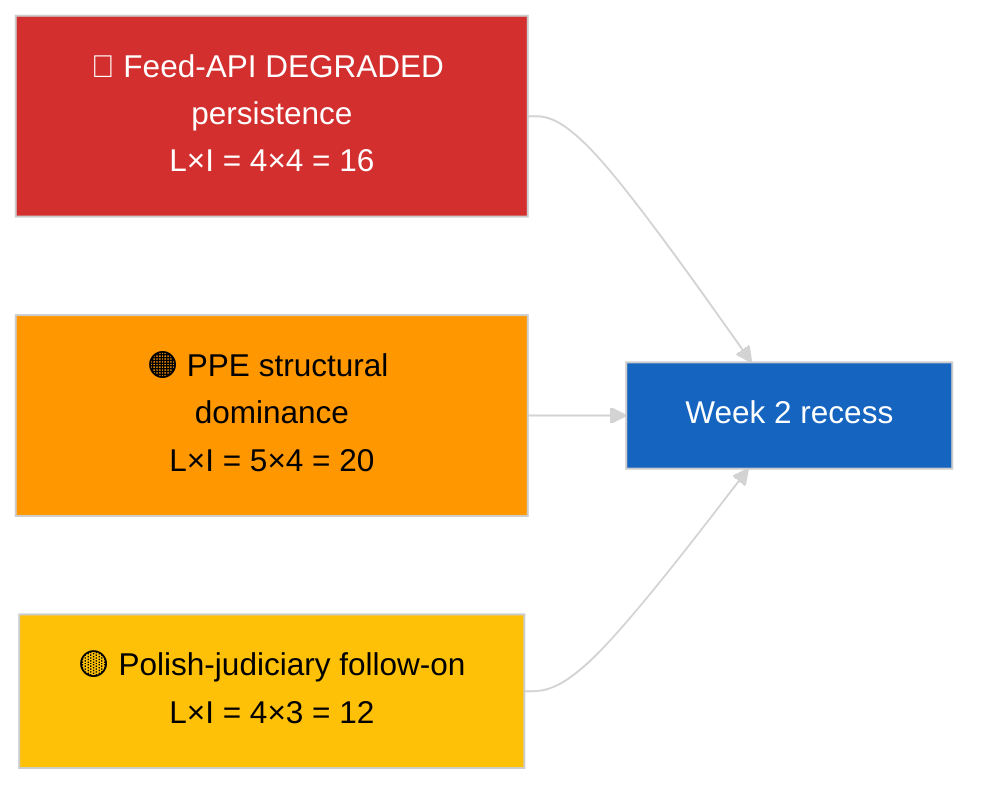

<!-- SPDX-FileCopyrightText: 2026 Hack23 AB -->
<!-- SPDX-License-Identifier: Apache-2.0 -->

# Verksamhetsöversikt — Veckan i korthet | 2026-04-04

**Klassificering:** OSINT | Offentligt parlamentariskt register  
**Konfidensgrad:** 🟢 Hög (retrospektiv 30 mars → 4 april)  
**Genererad:** 2026-04-04T00:00:00Z (retrospektiv rapport)  
**Artikeltyp:** Veckoöversikt  
**Körnings-ID:** `e92a23d1-ea51-4917-b351-16f1f93fd4a3`  
**Källa:** Europeiska parlamentets öppna dataportal

---

## 🎯 BLUF

**Veckan 30 mars → 4 april 2026 var en full recessvecka med de två avgörande underrättelsesignalerna analytiska/operativa snarare än lagstiftande: (1) bekräftelse av EP:s API-matning i DEGRADERAT tillstånd över 8 slutpunkter, och (2) formalisering av EP10-koalitionsaritmetiken som visar PPE 38% strukturell dominans plus Renew–ECR-sammanhållningssignalen på 0,95.** Den tredje återkommande signalen är antikorruptions-/institutionsreformklustret (TA-10-2026-0094 + 3 stödtexter) som övergår från mini-plenum i Bryssel den 26 mars. Körning `e92a23d1-ea51-4917-b351-16f1f93fd4a3` returnerade **"Quantitative risk scoring across 0 identified political dimensions"** — veckoöversiktssyntesen rekonstrueras därför från substantiella syskonkörningar och föregående dags körningar. **🟢 HÖG konfidensgrad** för de tre signalerna; veckans "inget plenum, inga nya procedurer"-baslinje är kalenderförankrad.

---

## 🧭 3 Beslut som denna rapport stöder

| # | Beslut | Vem beslutar | Tidsgräns | Bevis |
|:-:|--------|--------------|:---------:|-------|
| 1 | **Redaktionellt:** publicera veckoöversikt som en tre-signals-syntes (API-hälsa + koalitionsaritmetik + reformkluster) | Redaktör | +24h | Konvergens syskonkörningar |
| 2 | **Övervakning:** upprätthåll dagliga slutpunktsprober under påskuppehållet (till 13 april) | Datapipeline | dagligen | Återställningsdetektering |
| 3 | **Framåtbevakning:** K2 börjar 7 april med kommissionens tisdag; första plenumsveckan 13–17 april kommittéarbetsvecka | Analysansvarig | 2026-04-07 | K1→K2-övergång |

---

## 📰 60-sekunders läsning

- 🔴 **EP API DEGRADERAT tillstånd** bekräftat av 3-körningsprob den 2026-04-03; 5/8 obligatoriska matningar misslyckades. (🟢 Hög)
- 🟠 **Koalitionsaritmetik** formaliserad: PPE 38% strukturell dominans; Renew–ECR 0,95 sammanhållningssignal; Storkoalition 60% standard. (🟡 Medel för sammanhållningstolkning; 🟢 Hög för mandatandelar)
- 🟢 **Antikorruptions-/institutionsreformkluster** (TA-10-2026-0094 + 3) fortsätter att vara den dominerande K1-lagstiftningssignalen. (🟢 Hög)
- 🟡 **Inget plenum, inga kommittémöten, inga nya procedurer** under veckan. (🟢 Hög)
- 🔵 **Ekonomisk kontext:** USA-EU-handelsbana fortsätter; Mercosur EUD-yttrande inväntas. (🟢 Hög)
- 🟣 **Korsreferens:** fyra syskonkörningar från 2026-04-04 konvergerar på samma triad. (🟢 Hög)
- 🩷 **Störningsvektor:** Polsk-rättssystem-uppföljning (Braun-prejudikat) är den högst sannolika vektorn för en aprilplenum-överraskning. (🟡 Medel)
- ⚪ **Överfört:** transpositionsfönster för tier-1-marsantaganden sträcker sig till K1 2028.

---

## 🗂️ Toppfynd — Veckan 30 mars → 4 april 2026

| Rang | Fynd | Källa | Betydelse | Konfidensgrad |
|:----:|------|-------|:---------:|:------------:|
| 1 | EP matnings-API DEGRADERAT (5/8 obligatoriska matningar) | `2026-04-03/breaking-2` | 8,0 | 🟢 HÖG |
| 2 | PPE 38% strukturell dominans + Renew–ECR 0,95 sammanhållning | `2026-04-03/breaking` | 7,5 | 🟡 MEDEL |
| 3 | Antikorruptions-/reformkluster (4 texter) | `2026-04-03/breaking-3` | 9,0 | 🟢 HÖG |
| 4 | 85-post antagna-texter veckomatning | `2026-04-04/breaking-4` | 6,0 | 🟢 HÖG |
| 5 | K1-pipeline retrospektiv (9 högbetydande poster) | `2026-04-04/breaking-2` | 7,0 | 🟡 MEDEL |

---

## ⚠️ Risk- och hotöversikt

| Risk | S | I | Poäng | Utlösare | Källa | Amiralitet |
|------|:-:|:-:|:-----:|---------|-------|:---------:|
| Matnings-API DEGRADERAT kvarstår | 4 | 4 | 16 | Förbi 14 april | `2026-04-03/breaking-2` | A1 |
| PPE strukturell dominans | 5 | 4 | 20 | Alla majoriter kräver PPE | Koalitionsaritmetik | A1 |
| Polsk-rättssystem-uppföljning | 4 | 3 | 12 | Nytt immunitetsfall | TA-10-2026-0088 | A1 |
| Tier-1 transpositionsrisk | 4 | 4 | 16 | Nationell divergens | TA-10-2026-0094 | A1 |

---

## 🔮 Topp framåtutlösare

**Påskuppehållets slut 13 april + kommissionens tisdag 7 april + kommittéarbetsvecka 13–17 april.** Det sammansatta K1→K2-övergångsfönstret avgör vilket K1-överfört spår dominerar: handel (Scenario A), rättsstat (Scenario B) eller ekonomi/industri (Scenario C).

---

## 🛡️ Källkvalitetsbedömning

- **Primära källor:** Syskonkörningar 2026-04-03 och 2026-04-04; EP `get_adopted_texts_feed` en-vecka-fönster.
- **Databegränsningar:** Denna veckoöversiktskörning gav tom klassificering; syntes rekonstruerad från syskonkörningar.
- **Konfidensgrad:** 🟢 HÖG för de tre veckodefinierande signalerna.

---

## 📎 Länkar

| Länk | Sökväg |
|------|--------|
| Artikel | `./article.md` |
| Syskonkörningar | `analysis/daily/2026-04-04/breaking/`, `breaking-2/`, `breaking-3/`, `breaking-4/` |
| Föregående veckas källa | `analysis/daily/2026-04-03/breaking/`, `breaking-2/`, `breaking-3/` |
| Manifest | `./manifest.json` |

---

**Dokumentkontroll**
- **Mall:** `/analysis/templates/executive-brief.md`
- **Artefaktsökväg:** `analysis/daily/2026-04-04/week-in-review/executive-brief.md`
- **Klassificering:** Offentlig
- **Retrospektiv generering:** Bakåtfyllningssession.
