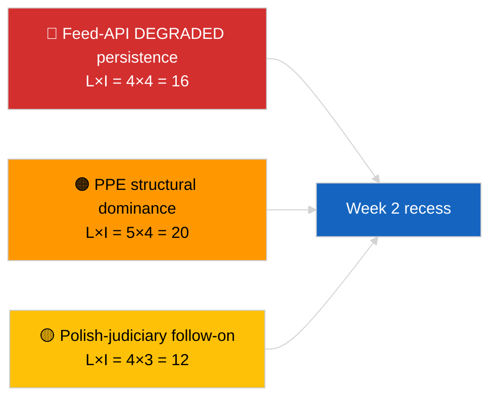

<!-- SPDX-FileCopyrightText: 2026 Hack23 AB -->
<!-- SPDX-License-Identifier: Apache-2.0 -->

# 执行简报 — 每周回顾 | 2026-04-04

**分类：** OSINT | 公开议会记录  
**置信度：** 🟢 高（回顾 3月30日 → 4月4日）  
**创建时间：** 2026-04-04T00:00:00Z（回顾报告）  
**文章类型：** 每周回顾  
**运行ID：** `e92a23d1-ea51-4917-b351-16f1f93fd4a3`  
**数据来源：** 欧洲议会开放数据门户

---

## 🎯 BLUF

**3月30日→4月4日这一周是完全的休会期，主要分析/行动情报发现并非立法性的，而是集中于两点：(1) 确认欧洲议会Feed API在8个端点上的降级状态，(2) EP10联合算术正式化，显示PPE结构性主导地位38%以及Renew–ECR凝聚信号0.95。** 第三个反复出现的信号是来自3月26日布鲁塞尔小型全会的持续反腐/制度改革集群（TA-10-2026-0094 + 3个补充文本）。运行 `e92a23d1-ea51-4917-b351-16f1f93fd4a3` 返回了 **"Quantitative risk scoring across 0 identified political dimensions"** — 周回顾综合从姐妹运行和前一天运行中恢复。三个信号均为 **🟢 高置信度**；本周"无全会、无新程序"的基准已由日历确认。

---

## 🧭 本简报支持的3项决策

| # | 决策 | 决策者 | 截止时间 | 依据 |
|:-:|-----|--------|:--------:|------|
| 1 | **编辑：** 将周回顾发布为三信号综合（API健康 + 联合算术 + 改革集群） | 编辑 | +24h | 姐妹运行收敛 |
| 2 | **监控：** 复活节假期期间（至4月13日）维持每日端点检查 | 数据管道 | 每日 | 恢复检测 |
| 3 | **前瞻：** Q2从4月7日委员会星期二开始；第一个全会周为4月13–17日委员会工作周 | 分析负责人 | 2026-04-07 | Q1→Q2过渡 |

---

## 📰 60秒简报

- 🔴 **欧洲议会API降级状态**经2026-04-03三次运行确认；必需Feed 8个中5个失败。 (🟢 高)
- 🟠 **联合算术**正式化：PPE结构性主导38%；Renew–ECR凝聚度0.95；大联合60%为默认。 (🟡 凝聚解读中等；🟢 议席比例高)
- 🟢 **反腐/制度改革集群**（TA-10-2026-0094 + 3件）持续为Q1主导立法信号。 (🟢 高)
- 🟡 **无全会、无委员会会议、无新程序**的一周。 (🟢 高)
- 🔵 **经济背景：** 美欧贸易轨道持续；关于南方共同市场的欧盟法院意见预期中。 (🟢 高)
- 🟣 **交叉参考：** 2026-04-04的4个姐妹运行收敛于同一三角。 (🟢 高)
- 🩷 **颠覆载体：** 波兰司法续集（Braun先例）是4月会期最可能的意外载体。 (🟡 中等)
- ⚪ **结转：** 3月一级采纳的转置窗延长至2028年Q1。

---

## 🗂️ 主要发现 — 2026年3月30日→4月4日周

| 排名 | 发现 | 来源 | 重要性 | 置信度 |
|:---:|------|------|:------:|:------:|
| 1 | 欧洲议会Feed API降级（必需Feed 8个中5个） | `2026-04-03/breaking-2` | 8.0 | 🟢 高 |
| 2 | PPE结构性主导38% + Renew–ECR凝聚度0.95 | `2026-04-03/breaking` | 7.5 | 🟡 中等 |
| 3 | 反腐/制度改革集群（4项文本） | `2026-04-03/breaking-3` | 9.0 | 🟢 高 |
| 4 | 每周85项采纳文本Feed | `2026-04-04/breaking-4` | 6.0 | 🟢 高 |
| 5 | Q1管道回顾（9项高重要性条目） | `2026-04-04/breaking-2` | 7.0 | 🟡 中等 |

---

## ⚠️ 风险与威胁快照

| 风险 | L | I | 得分 | 触发因素 | 来源 | 海军情报等级 |
|-----|:-:|:-:|:----:|---------|------|:----------:|
| Feed API降级持续 | 4 | 4 | 16 | 4月14日后 | `2026-04-03/breaking-2` | A1 |
| PPE结构性主导 | 5 | 4 | 20 | 所有多数需PPE | 联合算术 | A1 |
| 波兰司法续集 | 4 | 3 | 12 | 新豁免案件 | TA-10-2026-0088 | A1 |
| 一级转置风险 | 4 | 4 | 16 | 国内偏离 | TA-10-2026-0094 | A1 |

---

## 🔮 首要前瞻触发因素

**复活节假期结束4月13日 + 委员会星期二4月7日 + 委员会工作周4月13–17日。** 复杂的Q1→Q2过渡窗将决定哪个Q1结转轨道占主导：贸易（情景A）、法治（情景B）或经济/工业（情景C）。

---

## 🛡️ 来源质量评估

- **一级来源：** 2026-04-03和2026-04-04姐妹运行；欧洲议会 `get_adopted_texts_feed` 每周窗口。
- **数据限制：** 本周回顾运行产生了空分类；综合从姐妹运行恢复。
- **置信度：** 定义本周的三个信号均为 🟢 高。

---

## 📎 链接

| 链接 | 路径 |
|------|------|
| 文章 | `./article.md` |
| 姐妹运行 | `analysis/daily/2026-04-04/breaking/`, `breaking-2/`, `breaking-3/`, `breaking-4/` |
| 上周来源 | `analysis/daily/2026-04-03/breaking/`, `breaking-2/`, `breaking-3/` |
| 清单 | `./manifest.json` |

---

**文档管理**
- **模板：** `/analysis/templates/executive-brief.md`
- **工件路径：** `analysis/daily/2026-04-04/week-in-review/executive-brief.md`
- **分类：** 公开
- **追溯创建：** 补充会话。
