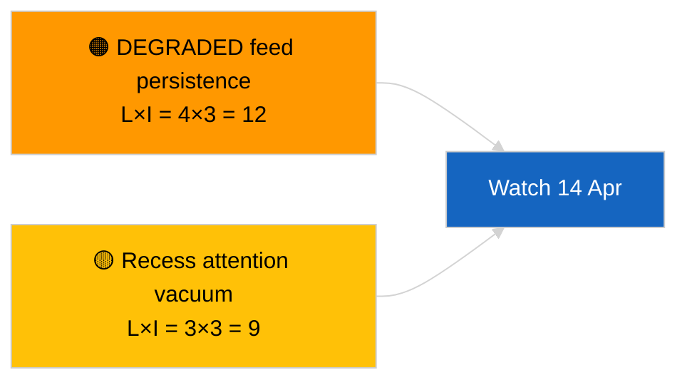
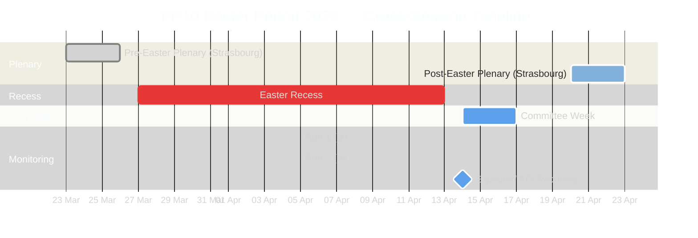
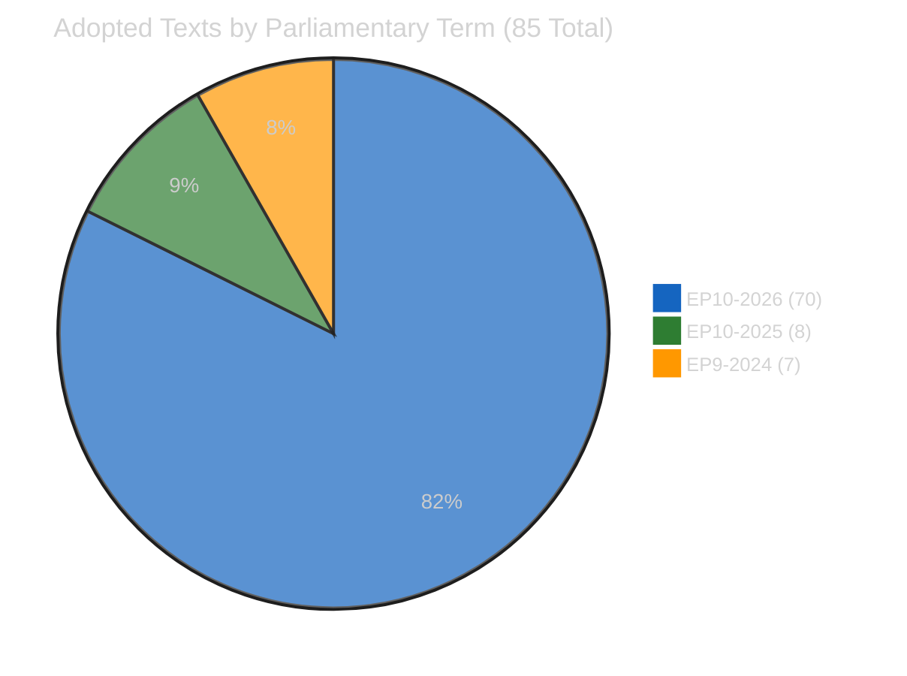
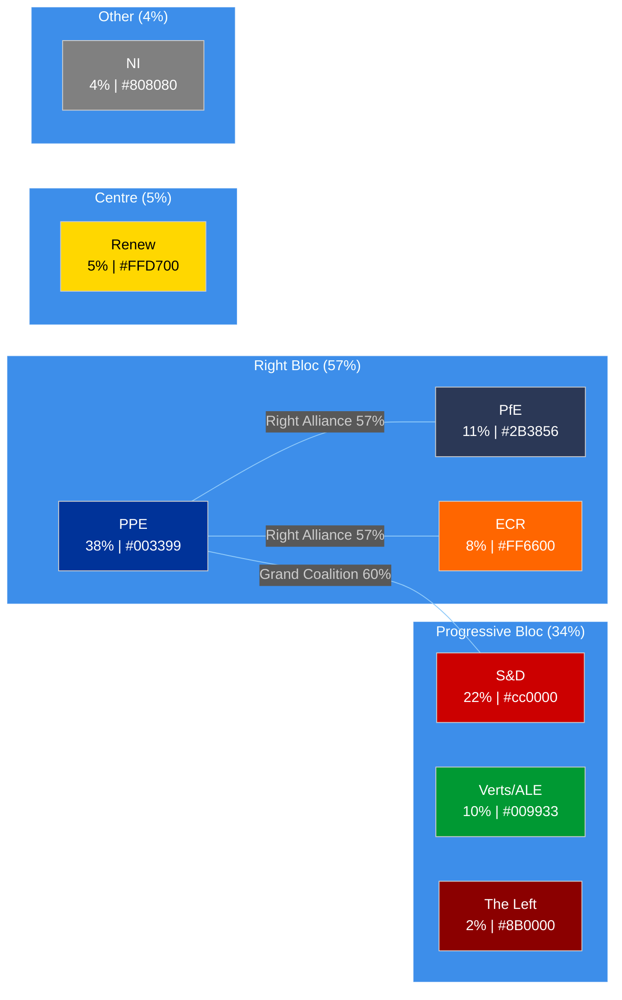
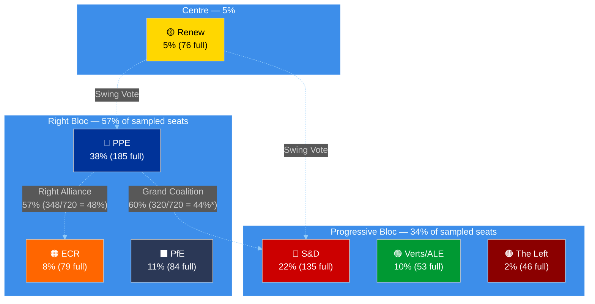
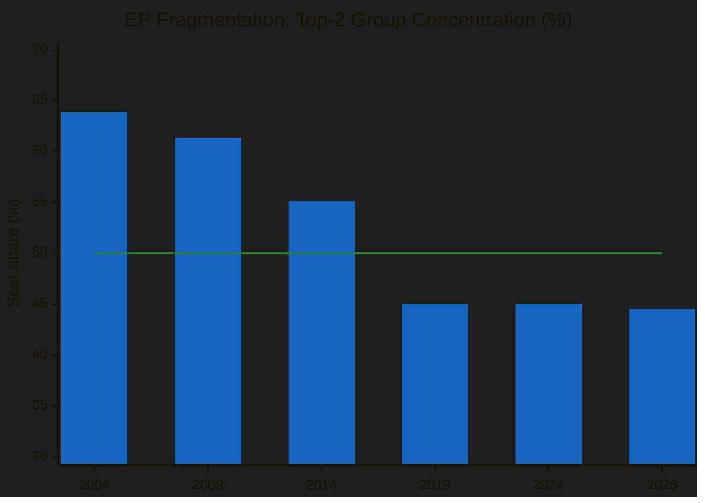
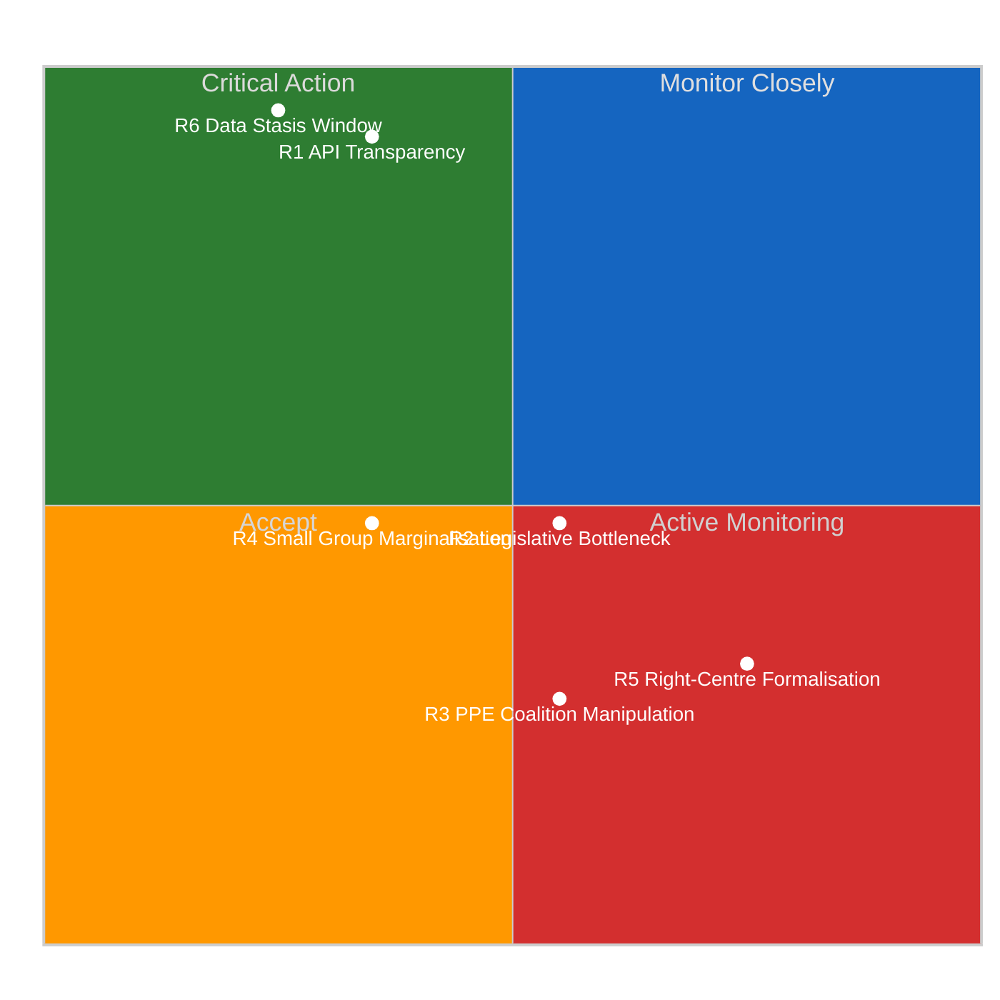
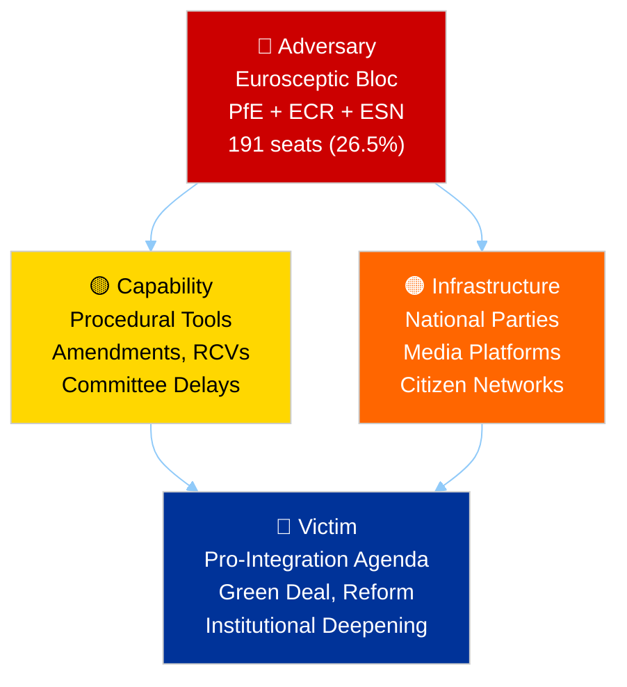
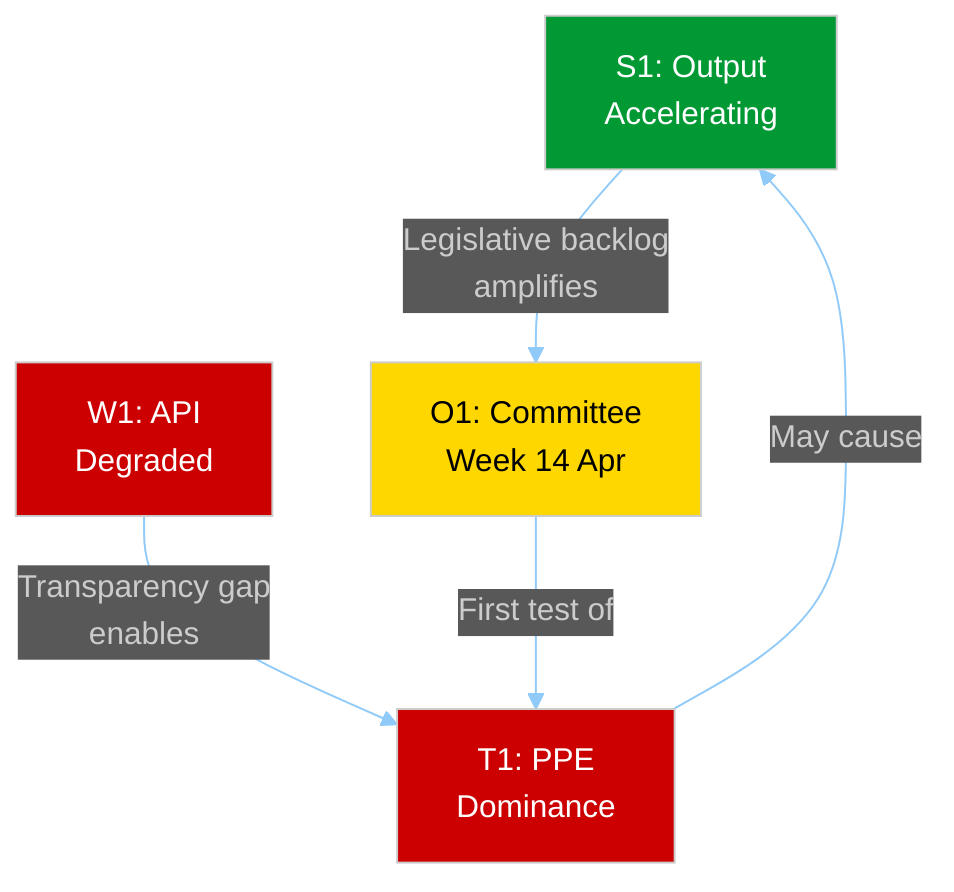

# Breaking — 2026-04-05

<h2 id="section-executive-brief">Executive Brief</h2>

### 🎯 BLUF

**Cross-session intelligence update on 2026-04-05; EP recess Day 10 of 18 — no new parliamentary activity to report.** This second run of the day extends the morning baseline by integrating prior-day analytical outputs across the recess week. No new actors, no new procedures, no new adopted texts. Substantive carry-over from the 2026-04-03 / 04-04 substantive runs unchanged: feed-API DEGRADED state, PPE 38% structural dominance, Renew–ECR 0.95 cohesion signal, anti-corruption reform cluster. **🟢 HIGH confidence** on continuity of recess-period state.

---

### 🧭 3 Decisions This Brief Supports

| # | Decision | Who Decides | Deadline | Evidence |
|:-:|----------|-------------|:--------:|----------|
| 1 | **Editorial:** SKIP daily; consolidate with the morning run | Editor | +12h | Same signal set |
| 2 | **Monitoring:** continue daily endpoint probes | Data pipeline | daily | DEGRADED state |
| 3 | **Forward-watch:** mid-recess strategic synthesis (sibling `breaking-3`) | Analysis lead | +6h | Same-day analytical depth |

---

### 📰 60-Second Read

- 🔴 **No new EP activity** today. (🟢 High)
- 🟠 **Cross-session continuity** with 2026-04-04 and 2026-04-03 substantive findings. (🟢 High)
- 🟢 **DEGRADED API state inherited.** (🟢 High)
- 🟡 **Coalition arithmetic stable.** (🟢 High)
- 🔵 **Economic context unchanged.** (🟢 High)
- 🟣 **Cross-reference:** sibling `breaking-3` deepens with 12-hour longitudinal synthesis. (🟢 High)
- 🩷 **Disruption vector:** none acute. (🟢 High)
- ⚪ **Carry-forward:** 8 days to recess end.

---

### 🗂️ Top Documents / Procedures Table

| Rank | EP reference | Title (short) | Significance | Confidence |
|:----:|--------------|---------------|:------------:|:----------:|
| 1 | — | No new procedures or adopted texts | 0.0 | 🟢 HIGH |
| 2 | TA-10-2026-0094 | Anti-corruption (carry-over) | 9.0 | 🟢 HIGH |
| 3 | TA-10-2026-0088 | Braun immunity (carry-over) | 7.0 | 🟢 HIGH |

---

### ⚠️ Risk & Threat Snapshot

| Risk | L | I | Score | Trigger | Source | Admiralty |
|------|:-:|:-:|:-----:|---------|--------|:---------:|
| DEGRADED feed persistence | 4 | 3 | 12 | Past 14 April | 2026-04-03/breaking-2 | A1 |
| Recess attention vacuum | 3 | 3 | 9 | US or PL surprise | EP calendar | A2 |

---

### 🔮 Top Forward Trigger

**Commission Tuesday 7 April 2026** and **recess end 13 April**.

---

### 🛡️ Source Quality Assessment

- **Primary sources:** Carry-over Q1 inventory; cross-session memory.
- **Confidence:** 🟢 HIGH.

---

### 📎 Links

| Link | Path |
|------|------|
| Article | `./article.md` |
| Sibling runs | `analysis/daily/2026-04-05/breaking/`, `breaking-3/` |
| Manifest | `./manifest.json` |

---

**Document Control**
- **Template:** `/analysis/templates/executive-brief.md`
- **Artifact path:** `analysis/daily/2026-04-05/breaking-2/executive-brief.md`
- **Classification:** Public
- **Retrospective generation:** Back-fill session.

<h2 id="reader-intelligence-guide">Reader Intelligence Guide</h2>

Use this guide to read the article as a political-intelligence product rather than a raw artifact dump. High-value reader lenses appear first; technical provenance remains available in the audit appendices.

| Reader need | What you'll get | Source artifact |
|---|---|---|
| [BLUF and editorial decisions](#section-executive-brief) | fast answer to what happened, why it matters, who is accountable, and the next dated trigger | `executive-brief.md` |
| [Supplementary intelligence](#section-supplementary-intelligence) | additional markdown discovered in the run that has not yet been assigned to a canonical section | `executive-brief_ar.md` |

<h2 id="section-supplementary-intelligence">Supplementary Intelligence</h2>

### Executive Brief Ar

**التصنيف:** المصادر المفتوحة | سجل برلماني عام
**مستوى الثقة:** 🟢 مرتفع (تقييم هيكلي خلال العطلة البرلمانية)
**تاريخ الإنشاء:** 2026-04-05T00:00:00Z (ملخص استرجاعي)
**نوع المقال:** Breaking — Cross-Session Update
**المصدر:** بوابة البيانات المفتوحة للبرلمان الأوروبي

---

### 🎯 BLUF

**تحديث استخباراتي بين الدورتين بتاريخ 2026-04-05؛ عطلة البرلمان الأوروبي اليوم العاشر من ثمانية عشر — لا نشاط برلماني جديد للإبلاغ عنه.** تُوسِّع هذه الجلسة الثانية من اليوم خط الأساس الصباحي من خلال دمج المخرجات التحليلية لليوم السابق طوال أسبوع العطلة. لا جهات فاعلة جديدة، لا إجراءات جديدة، لا نصوص معتمدة جديدة. يظل المحتوى الجوهري من الجلسات الرئيسية 2026-04-03 / 04-04 دون تغيير: تغذية واجهة برمجة التطبيقات في حالة متدهورة، هيمنة هيكلية لحزب الشعب الأوروبي بنسبة 38 %، إشارة تماسك Renew–ECR عند 0.95، تجمع إصلاح مكافحة الفساد. **🟢 ثقة عالية** في استمرارية حالة العطلة.

---

### 🧭 ثلاثة قرارات يدعمها هذا الملخص

| # | القرار | جهة اتخاذ القرار | الموعد النهائي | الدليل |
|:-:|-------|-----------------|:--------------:|--------|
| 1 | **تحريري:** تخطّي التقرير اليومي؛ دمجه مع الجلسة الصباحية | المحرر | +12 ساعة | نفس مجموعة الإشارات |
| 2 | **المراقبة:** مواصلة الفحوصات اليومية لنقاط النهاية | خط البيانات | يومياً | الحالة المتدهورة |
| 3 | **الرصد الاستشرافي:** تركيب استراتيجي في منتصف العطلة (الجلسة الشقيقة `breaking-3`) | رئيس التحليل | +6 ساعات | عمق تحليلي في نفس اليوم |

---

### 📰 القراءة في ستين ثانية

- 🔴 **لا نشاط جديد للبرلمان الأوروبي** اليوم. (🟢 مرتفع)
- 🟠 **استمرارية بين الدورتين** مع نتائج جوهرية من 2026-04-04 و2026-04-03. (🟢 مرتفع)
- 🟢 **حالة واجهة البرمجة المتدهورة موروثة.** (🟢 مرتفع)
- 🟡 **حسابات التحالفات مستقرة.** (🟢 مرتفع)
- 🔵 **السياق الاقتصادي دون تغيير.** (🟢 مرتفع)
- 🟣 **مرجع مشترك:** الجلسة الشقيقة `breaking-3` تتعمق بتركيب طولي مدته 12 ساعة. (🟢 مرتفع)
- 🩷 **ناقلات الاضطراب:** لا شيء حاد. (🟢 مرتفع)
- ⚪ **التقدم:** 8 أيام حتى انتهاء العطلة.

---

### 🗂️ جدول المستندات / الإجراءات ذات الأولوية

| الترتيب | مرجع البرلمان | العنوان (مختصر) | الأهمية | مستوى الثقة |
|:-------:|-------------|----------------|:-------:|:-----------:|
| 1 | — | لا إجراءات ولا نصوص معتمدة جديدة | 0.0 | 🟢 مرتفع |
| 2 | TA-10-2026-0094 | مكافحة الفساد (مُحوَّل) | 9.0 | 🟢 مرتفع |
| 3 | TA-10-2026-0088 | حصانة براون (مُحوَّل) | 7.0 | 🟢 مرتفع |

---

### ⚠️ لقطة المخاطر والتهديدات

<!-- mermaid block deduplicated: identical to earlier occurrence (hash=d4777da2) -->

| المخاطر | L | I | الدرجة | المحفّز | المصدر | Admiralty |
|---------|:-:|:-:|:------:|--------|--------|:---------:|
| استمرار التدهور في التغذية | 4 | 3 | 12 | بعد 14 أبريل | 2026-04-03/breaking-2 | A1 |
| فراغ الاهتمام خلال العطلة | 3 | 3 | 9 | مفاجأة من الولايات المتحدة أو بولندا | تقويم البرلمان الأوروبي | A2 |

---

### 🔮 أبرز المحفّزات المستقبلية

**ثلاثاء المفوضية الأوروبية، 7 أبريل 2026** و**نهاية العطلة في 13 أبريل**.

---

### 🛡️ تقييم جودة المصادر

- **المصادر الرئيسية:** مخزون الربع الأول المُحوَّل؛ ذاكرة بين الدورتين.
- **مستوى الثقة:** 🟢 مرتفع.

---

### 📎 الروابط

| الرابط | المسار |
|--------|--------|
| المقال | `./article.md` |
| الجلسات الشقيقة | `analysis/daily/2026-04-05/breaking/`، `breaking-3/` |
| ملف البيانات | `./manifest.json` |

---

**مراقبة المستند**
- **القالب:** `/analysis/templates/executive-brief.md`
- **مسار المنتج:** `analysis/daily/2026-04-05/breaking-2/executive-brief.md`
- **التصنيف:** عام
- **الإنشاء الاسترجاعي:** جلسة تعبئة.

### Executive Brief Da

### 🎯 BLUF

**Kryds-sessions efterretningsopdatering den 2026-04-05; EP-recess dag 10 af 18 — ingen ny parlamentarisk aktivitet at rapportere.** Denne anden kørsel af dagen udvider morgenbaslinjen ved at integrere analytiske output fra dagen før hen over recessugen. Ingen nye aktører, ingen nye procedurer, ingen nye vedtagne tekster. Substantielt indhold fra de substantielle kørsler 2026-04-03 / 04-04 uændret: API-feed i DEGRADERET tilstand, PPE 38 % strukturel dominans, Renew–ECR 0,95 kohesionssignal, antikorruptionsreformkluster. **🟢 HØJ konfidens** om kontinuitet i recessperiodentilstand.

---

### 🧭 3 Beslutninger Denne Rapport Understøtter

| # | Beslutning | Hvem beslutter | Deadline | Bevis |
|:-:|-----------|----------------|:--------:|-------|
| 1 | **Redaktionelt:** SPRING OVER daglig; konsolider med morgenkørsel | Redaktør | +12h | Samme signalsæt |
| 2 | **Overvågning:** fortsæt daglige endepunktssondringer | Datapipeline | dagligt | DEGRADERET tilstand |
| 3 | **Fremadrettet observation:** strategisk syntese midt i recessen (søskende `breaking-3`) | Analyseleder | +6h | Analytisk dybde samme dag |

---

### 📰 60-Second Read

- 🔴 **Ingen ny EP-aktivitet** i dag. (🟢 Høj)
- 🟠 **Kryds-sessions kontinuitet** med substantielle fund fra 2026-04-04 og 2026-04-03. (🟢 Høj)
- 🟢 **DEGRADERET API-tilstand arvet.** (🟢 Høj)
- 🟡 **Koalitionsaritmetik stabil.** (🟢 Høj)
- 🔵 **Økonomisk kontekst uændret.** (🟢 Høj)
- 🟣 **Krydshenvisning:** søskende `breaking-3` uddybes med 12-timers longitudinal syntese. (🟢 Høj)
- 🩷 **Forstyrrelsesvektorer:** ingen akutte. (🟢 Høj)
- ⚪ **Fremførsel:** 8 dage til recessens afslutning.

---

### 🗂️ Topprangerede Dokumenter / Proceduretabel

| Rang | EP-reference | Titel (kort) | Signifikans | Konfidens |
|:----:|-------------|--------------|:-----------:|:---------:|
| 1 | — | Ingen nye procedurer eller vedtagne tekster | 0,0 | 🟢 HØJ |
| 2 | TA-10-2026-0094 | Antikorruption (frembugt) | 9,0 | 🟢 HØJ |
| 3 | TA-10-2026-0088 | Braun-immunitet (frembugt) | 7,0 | 🟢 HØJ |

---

### ⚠️ Risiko- og Trusselsbillede

<!-- mermaid block deduplicated: identical to earlier occurrence (hash=d4777da2) -->

| Risiko | L | I | Score | Udløser | Kilde | Admiralty |
|--------|:-:|:-:|:-----:|---------|-------|:---------:|
| DEGRADERET feed-persistens | 4 | 3 | 12 | Forbi 14. april | 2026-04-03/breaking-2 | A1 |
| Opmærksomhedsvakuum under recess | 3 | 3 | 9 | Overraskelse fra USA eller Polen | EP-kalender | A2 |

---

### 🔮 Top Fremad-Udløser

**Kommissionens tirsdag den 7. april 2026** og **recessens afslutning den 13. april**.

---

### 🛡️ Kildekvali­tetsvurdering

- **Primære kilder:** Frembugt Q1-inventar; kryds-sessions hukommelse.
- **Konfidens:** 🟢 HØJ.

---

### 📎 Links

| Link | Sti |
|------|-----|
| Artikel | `./article.md` |
| Søskendekørsler | `analysis/daily/2026-04-05/breaking/`, `breaking-3/` |
| Manifest | `./manifest.json` |

---

**Dokumentkontrol**
- **Skabelon:** `/analysis/templates/executive-brief.md`
- **Artefaktsti:** `analysis/daily/2026-04-05/breaking-2/executive-brief.md`
- **Klassifikation:** Offentlig
- **Retrospektiv generering:** Tilbagedateringssession.

### Executive Brief De

### 🎯 BLUF

**Sitzungsübergreifendes Geheimdienstupdate vom 2026-04-05; EP-Sitzungspause Tag 10 von 18 — keine neue parlamentarische Aktivität zu melden.** Dieser zweite Lauf des Tages erweitert die Morgenbasis durch Integration analytischer Ausgaben des Vortags über die Sitzungspausenwoche. Keine neuen Akteure, keine neuen Verfahren, keine neuen angenommenen Texte. Substanzielle Inhalte der maßgeblichen Läufe 2026-04-03 / 04-04 unverändert: API-Feed im DEGRADIERTEN Zustand, EVP 38 % strukturelle Dominanz, Renew–ECR 0,95 Kohäsionssignal, Antikorruptionsreformcluster. **🟢 HOHE Konfidenz** für die Kontinuität des Sitzungspausenzustands.

---

### 🧭 3 Entscheidungen, die dieser Bericht stützt

| # | Entscheidung | Entscheider | Frist | Nachweis |
|:-:|-------------|------------|:-----:|---------|
| 1 | **Redaktionell:** ÜBERSPRINGEN täglich; mit Morgenlauf konsolidieren | Redakteur | +12h | Gleiches Signalset |
| 2 | **Überwachung:** tägliche Endpunktprüfungen fortsetzen | Datenpipeline | täglich | DEGRADIERTER Zustand |
| 3 | **Vorausschauende Beobachtung:** strategische Synthese in der Mitte der Sitzungspause (Geschwister `breaking-3`) | Analyseleiter | +6h | Analytische Tiefe am selben Tag |

---

### 📰 60-Second Read

- 🔴 **Keine neue EP-Aktivität** heute. (🟢 Hoch)
- 🟠 **Sitzungsübergreifende Kontinuität** mit substanziellen Ergebnissen von 2026-04-04 und 2026-04-03. (🟢 Hoch)
- 🟢 **DEGRADIERTER API-Zustand geerbt.** (🟢 Hoch)
- 🟡 **Koalitionsarithmetik stabil.** (🟢 Hoch)
- 🔵 **Wirtschaftlicher Kontext unverändert.** (🟢 Hoch)
- 🟣 **Querverweise:** Geschwister `breaking-3` wird mit 12-stündiger Längsschnittsynthese vertieft. (🟢 Hoch)
- 🩷 **Störvektoren:** keine akuten. (🟢 Hoch)
- ⚪ **Fortschritt:** 8 Tage bis zum Ende der Sitzungspause.

---

### 🗂️ Top-Dokumente / Verfahrenstabelle

| Rang | EP-Referenz | Titel (kurz) | Bedeutung | Konfidenz |
|:----:|------------|--------------|:---------:|:---------:|
| 1 | — | Keine neuen Verfahren oder angenommenen Texte | 0,0 | 🟢 HOCH |
| 2 | TA-10-2026-0094 | Antikorruption (übertragen) | 9,0 | 🟢 HOCH |
| 3 | TA-10-2026-0088 | Braun-Immunität (übertragen) | 7,0 | 🟢 HOCH |

---

### ⚠️ Risiko- und Bedrohungsbild

<!-- mermaid block deduplicated: identical to earlier occurrence (hash=d4777da2) -->

| Risiko | L | I | Punktzahl | Auslöser | Quelle | Admiralty |
|--------|:-:|:-:|:---------:|---------|--------|:---------:|
| DEGRADIERTE Feed-Persistenz | 4 | 3 | 12 | Nach dem 14. April | 2026-04-03/breaking-2 | A1 |
| Aufmerksamkeitsvakuum in der Sitzungspause | 3 | 3 | 9 | Überraschung aus USA oder Polen | EP-Kalender | A2 |

---

### 🔮 Top-Vorausauslöser

**Kommissionsdienstag, 7. April 2026** und **Ende der Sitzungspause am 13. April**.

---

### 🛡️ Quellqualitätsbewertung

- **Primärquellen:** Übertragenes Q1-Inventar; sitzungsübergreifendes Gedächtnis.
- **Konfidenz:** 🟢 HOCH.

---

### 📎 Links

| Link | Pfad |
|------|------|
| Artikel | `./article.md` |
| Geschwisterläufe | `analysis/daily/2026-04-05/breaking/`, `breaking-3/` |
| Manifest | `./manifest.json` |

---

**Dokumentenkontrolle**
- **Vorlage:** `/analysis/templates/executive-brief.md`
- **Artefaktpfad:** `analysis/daily/2026-04-05/breaking-2/executive-brief.md`
- **Klassifizierung:** Öffentlich
- **Retroaktive Erstellung:** Rückfüllsitzung.

### Executive Brief Es

### 🎯 BLUF

**Actualización de inteligencia intersesional del 2026-04-05; receso del PE día 10 de 18 — ninguna nueva actividad parlamentaria que reportar.** Esta segunda ejecución del día amplía la línea base matutina al integrar los resultados analíticos del día anterior durante la semana de receso. Ningún nuevo actor, ningún nuevo procedimiento, ningún nuevo texto adoptado. El contenido sustancial de las ejecuciones principales 2026-04-03 / 04-04 sin cambios: canal API en estado DEGRADADO, PPE 38 % dominio estructural, señal de cohesión Renew–ECR 0,95, clúster de reforma anticorrupción. **🟢 ALTA confianza** sobre la continuidad del estado de receso.

---

### 🧭 3 Decisiones Que Este Informe Apoya

| # | Decisión | Quién decide | Plazo | Evidencia |
|:-:|---------|-------------|:-----:|----------|
| 1 | **Editorial:** OMITIR diario; consolidar con ejecución matutina | Editor | +12h | Mismo conjunto de señales |
| 2 | **Supervisión:** continuar sondeos diarios de puntos finales | Flujo de datos | diario | Estado DEGRADADO |
| 3 | **Vigilancia prospectiva:** síntesis estratégica a mitad del receso (hermanas `breaking-3`) | Jefe de análisis | +6h | Profundidad analítica el mismo día |

---

### 📰 60-Second Read

- 🔴 **Sin nueva actividad del PE** hoy. (🟢 Alta)
- 🟠 **Continuidad intersesional** con hallazgos sustanciales de 2026-04-04 y 2026-04-03. (🟢 Alta)
- 🟢 **Estado API DEGRADADO heredado.** (🟢 Alta)
- 🟡 **Aritmética de coalición estable.** (🟢 Alta)
- 🔵 **Contexto económico sin cambios.** (🟢 Alta)
- 🟣 **Referencia cruzada:** las hermanas `breaking-3` se profundizan con síntesis longitudinal de 12 horas. (🟢 Alta)
- 🩷 **Vectores disruptivos:** ninguno agudo. (🟢 Alta)
- ⚪ **Progreso:** 8 días hasta el fin del receso.

---

### 🗂️ Tabla de Principales Documentos / Procedimientos

| Rango | Referencia PE | Título (breve) | Relevancia | Confianza |
|:-----:|-------------|----------------|:----------:|:---------:|
| 1 | — | Sin nuevos procedimientos ni textos adoptados | 0,0 | 🟢 ALTA |
| 2 | TA-10-2026-0094 | Anticorrupción (transferido) | 9,0 | 🟢 ALTA |
| 3 | TA-10-2026-0088 | Inmunidad Braun (transferido) | 7,0 | 🟢 ALTA |

---

### ⚠️ Instantánea de Riesgo y Amenaza

<!-- mermaid block deduplicated: identical to earlier occurrence (hash=d4777da2) -->

| Riesgo | L | I | Puntuación | Desencadenante | Fuente | Admiralty |
|--------|:-:|:-:|:----------:|---------------|--------|:---------:|
| Persistencia del canal DEGRADADO | 4 | 3 | 12 | Pasado el 14 de abril | 2026-04-03/breaking-2 | A1 |
| Vacío de atención durante el receso | 3 | 3 | 9 | Sorpresa de EE. UU. o Polonia | Calendario PE | A2 |

---

### 🔮 Principal Activador Futuro

**Martes de la Comisión, 7 de abril de 2026** y **fin del receso el 13 de abril**.

---

### 🛡️ Evaluación de la Calidad de las Fuentes

- **Fuentes primarias:** Inventario Q1 transferido; memoria intersesional.
- **Confianza:** 🟢 ALTA.

---

### 📎 Enlaces

| Enlace | Ruta |
|--------|------|
| Artículo | `./article.md` |
| Ejecuciones hermanas | `analysis/daily/2026-04-05/breaking/`, `breaking-3/` |
| Manifiesto | `./manifest.json` |

---

**Control del documento**
- **Plantilla:** `/analysis/templates/executive-brief.md`
- **Ruta del artefacto:** `analysis/daily/2026-04-05/breaking-2/executive-brief.md`
- **Clasificación:** Público
- **Generación retrospectiva:** Sesión de relleno.

### Executive Brief Fi

### 🎯 BLUF

**Poikkilistauksen tiedustelupäivitys 2026-04-05; EP:n istuntotauko päivä 10/18 — ei uutta parlamentaarista toimintaa raportoitavaksi.** Tämä päivän toinen ajo laajentaa aamulähtötasoa integroimalla edellisen päivän analyyttisia tuloksia koko istuntotaukoviikon ajalta. Ei uusia toimijoita, ei uusia menettelyjä, ei uusia hyväksyttyjä tekstejä. Olennaiset löydöt ajoista 2026-04-03 / 04-04 muuttumattomia: API-syöte HEIKENTYNYT-tilassa, EPP 38 % rakenteellinen dominanssi, Renew–ECR 0,95 koheesiosignaali, korruptionvastainen uudistusrypäs. **🟢 KORKEA luotettavuus** istuntotaukotilan jatkuvuudesta.

---

### 🧭 3 Päätöstä, Joita Tämä Katsaus Tukee

| # | Päätös | Kuka päättää | Määräaika | Todiste |
|:-:|--------|-------------|:---------:|---------|
| 1 | **Toimituksellinen:** OHITA päivittäinen; yhdistä aamuajoon | Toimittaja | +12h | Sama signaalijoukko |
| 2 | **Seuranta:** jatka päivittäisiä päätepistetutkimuksia | Dataputki | päivittäin | HEIKENTYNYT tila |
| 3 | **Ennakoiva tarkkailu:** strateginen synteesi istuntotauon puolivälissä (sisarusto `breaking-3`) | Analyysipäällikkö | +6h | Analyyttinen syvyys samana päivänä |

---

### 📰 60-Second Read

- 🔴 **Ei uutta EP-toimintaa** tänään. (🟢 Korkea)
- 🟠 **Poikkilistauksen jatkuvuus** olennaisten löydösten kanssa 2026-04-04 ja 2026-04-03. (🟢 Korkea)
- 🟢 **HEIKENTYNYT API-tila peritty.** (🟢 Korkea)
- 🟡 **Koalitioaritmetiikka vakaa.** (🟢 Korkea)
- 🔵 **Taloudellinen konteksti muuttumaton.** (🟢 Korkea)
- 🟣 **Ristiviittaus:** sisarusto `breaking-3` syvennetään 12 tunnin pitkittäissynteesin avulla. (🟢 Korkea)
- 🩷 **Häirintävektorit:** ei akuutteja. (🟢 Korkea)
- ⚪ **Eteneminen:** 8 päivää istuntotauon päättymiseen.

---

### 🗂️ Tärkeimmät Asiakirjat / Menettelyn Taulukko

| Sijoitus | EP-viite | Otsikko (lyhyt) | Merkitys | Luotettavuus |
|:--------:|---------|-----------------|:--------:|:------------:|
| 1 | — | Ei uusia menettelyjä tai hyväksyttyjä tekstejä | 0,0 | 🟢 KORKEA |
| 2 | TA-10-2026-0094 | Korruptionvastainen (siirretty) | 9,0 | 🟢 KORKEA |
| 3 | TA-10-2026-0088 | Braunin immuniteetti (siirretty) | 7,0 | 🟢 KORKEA |

---

### ⚠️ Riski- ja Uhkakuva

<!-- mermaid block deduplicated: identical to earlier occurrence (hash=d4777da2) -->

| Riski | L | I | Pisteet | Laukaisin | Lähde | Admiralty |
|-------|:-:|:-:|:-------:|----------|-------|:---------:|
| HEIKENTYNYT syötteen pysyvyys | 4 | 3 | 12 | 14. huhtikuuta jälkeen | 2026-04-03/breaking-2 | A1 |
| Huomiovaje istuntotauon aikana | 3 | 3 | 9 | Yllätys USA:sta tai Puolasta | EP-kalenteri | A2 |

---

### 🔮 Tärkein Tulevaisuuden Laukaisin

**Komission tiistai 7. huhtikuuta 2026** ja **istuntotauon päättyminen 13. huhtikuuta**.

---

### 🛡️ Lähteiden Laadun Arviointi

- **Ensisijaiset lähteet:** Siirretty Q1-inventaari; poikkilistauksen muisti.
- **Luotettavuus:** 🟢 KORKEA.

---

### 📎 Linkit

| Linkki | Polku |
|--------|-------|
| Artikkeli | `./article.md` |
| Sisaruksiston ajot | `analysis/daily/2026-04-05/breaking/`, `breaking-3/` |
| Manifesti | `./manifest.json` |

---

**Asiakirjan hallinta**
- **Malli:** `/analysis/templates/executive-brief.md`
- **Artefaktin polku:** `analysis/daily/2026-04-05/breaking-2/executive-brief.md`
- **Luokittelu:** Julkinen
- **Takautuva luonti:** Täydentävä istunto.

### Executive Brief Fr

### 🎯 BLUF

**Mise à jour du renseignement intersessions du 2026-04-05 ; pause du PE jour 10 sur 18 — aucune nouvelle activité parlementaire à signaler.** Cette deuxième exécution de la journée élargit la ligne de base matinale en intégrant les résultats analytiques de la veille sur la semaine de recess. Aucun nouvel acteur, aucune nouvelle procédure, aucun nouveau texte adopté. Contenu substantiel des exécutions importantes 2026-04-03 / 04-04 inchangé : flux API en état DÉGRADÉ, PPE 38 % de dominance structurelle, signal de cohésion Renew–ECR 0,95, cluster de réforme anti-corruption. **🟢 HAUTE confiance** sur la continuité de l'état de recess.

---

### 🧭 3 Décisions Que Ce Rapport Soutient

| # | Décision | Qui décide | Délai | Preuve |
|:-:|---------|------------|:-----:|--------|
| 1 | **Éditorial :** IGNORER quotidien ; consolider avec l'exécution matinale | Éditeur | +12h | Même ensemble de signaux |
| 2 | **Surveillance :** poursuivre les sondages quotidiens des points de terminaison | Pipeline de données | quotidien | État DÉGRADÉ |
| 3 | **Veille prospective :** synthèse stratégique en mi-recess (consanguins `breaking-3`) | Chef de l'analyse | +6h | Profondeur analytique le même jour |

---

### 📰 60-Second Read

- 🔴 **Aucune nouvelle activité du PE** aujourd'hui. (🟢 Haute)
- 🟠 **Continuité intersessions** avec les résultats substantiels de 2026-04-04 et 2026-04-03. (🟢 Haute)
- 🟢 **État API DÉGRADÉ hérité.** (🟢 Haute)
- 🟡 **Arithmétique des coalitions stable.** (🟢 Haute)
- 🔵 **Contexte économique inchangé.** (🟢 Haute)
- 🟣 **Référence croisée :** les consanguins `breaking-3` sont approfondis avec une synthèse longitudinale de 12 heures. (🟢 Haute)
- 🩷 **Vecteurs de perturbation :** aucun aigu. (🟢 Haute)
- ⚪ **Progression :** 8 jours jusqu'à la fin du recess.

---

### 🗂️ Documents / Tableau des Procédures Prioritaires

| Rang | Référence PE | Titre (court) | Importance | Confiance |
|:----:|-------------|---------------|:----------:|:---------:|
| 1 | — | Aucune nouvelle procédure ni texte adopté | 0,0 | 🟢 HAUTE |
| 2 | TA-10-2026-0094 | Anti-corruption (reporté) | 9,0 | 🟢 HAUTE |
| 3 | TA-10-2026-0088 | Immunité Braun (reporté) | 7,0 | 🟢 HAUTE |

---

### ⚠️ Tableau des Risques et des Menaces

<!-- mermaid block deduplicated: identical to earlier occurrence (hash=d4777da2) -->

| Risque | L | I | Score | Déclencheur | Source | Admiralty |
|--------|:-:|:-:|:-----:|------------|--------|:---------:|
| Persistance du flux DÉGRADÉ | 4 | 3 | 12 | Après le 14 avril | 2026-04-03/breaking-2 | A1 |
| Vide d'attention en période de recess | 3 | 3 | 9 | Surprise des États-Unis ou de la Pologne | Calendrier PE | A2 |

---

### 🔮 Principal Déclencheur Prospectif

**Mardi de la Commission, 7 avril 2026** et **fin du recess le 13 avril**.

---

### 🛡️ Évaluation de la Qualité des Sources

- **Sources primaires :** Inventaire Q1 reporté ; mémoire intersessions.
- **Confiance :** 🟢 HAUTE.

---

### 📎 Liens

| Lien | Chemin |
|------|--------|
| Article | `./article.md` |
| Exécutions consanguines | `analysis/daily/2026-04-05/breaking/`, `breaking-3/` |
| Manifeste | `./manifest.json` |

---

**Contrôle du document**
- **Modèle :** `/analysis/templates/executive-brief.md`
- **Chemin de l'artefact :** `analysis/daily/2026-04-05/breaking-2/executive-brief.md`
- **Classification :** Public
- **Génération rétrospective :** Session de rattrapage.

### Executive Brief He

**סיווג:** מקורות פתוחים | רשומה פרלמנטרית ציבורית
**רמת ביטחון:** 🟢 גבוהה (הערכה מבנית בתקופת הפגרה)
**נוצר:** 2026-04-05T00:00:00Z (סיכום רטרואקטיבי)
**סוג המאמר:** Breaking — Cross-Session Update
**מקור:** פורטל הנתונים הפתוחים של הפרלמנט האירופי

---

### 🎯 BLUF

**עדכון מודיעיני בין-פגישתי מתאריך 2026-04-05; הפגרה של PE — יום 10 מתוך 18 — אין פעילות פרלמנטרית חדשה לדווח עליה.** ריצה שנייה זו של היום מרחיבה את קו הבסיס הבוקרי על ידי שילוב תפוקות אנליטיות מהיום הקודם לאורך שבוע הפגרה. אין שחקנים חדשים, אין הליכים חדשים, אין טקסטים חדשים שאומצו. תוכן מהותי מהריצות המשמעותיות 2026-04-03 / 04-04 ללא שינוי: עדכון ה-API במצב פגום, EVP 38 % דומיננטיות מבנית, אות גיבוש Renew–ECR 0.95, אשכול רפורמת מאבק שחיתות. **🟢 ביטחון גבוה** לגבי המשכיות מצב הפגרה.

---

### 🧭 3 החלטות שסיכום זה תומך בהן

| # | החלטה | מי מחליט | מועד אחרון | ראיה |
|:-:|------|----------|:----------:|------|
| 1 | **עריכה:** דלג על היומי; אחד עם הריצה הבוקרית | עורך | +12 שעות | אותה סדרת אותות |
| 2 | **ניטור:** המשך בדיקות קצה יומיות | צינור נתונים | יומי | מצב פגום |
| 3 | **תצפית צופה פני עתיד:** סינתזה אסטרטגית באמצע הפגרה (אח/אחות `breaking-3`) | ראש הניתוח | +6 שעות | עומק אנליטי אותו יום |

---

### 📰 קריאת שישים שניות

- 🔴 **אין פעילות PE חדשה** היום. (🟢 גבוהה)
- 🟠 **המשכיות בין-פגישתית** עם ממצאים מהותיים מ-2026-04-04 ו-2026-04-03. (🟢 גבוהה)
- 🟢 **מצב API פגום נורש.** (🟢 גבוהה)
- 🟡 **חשבון הקואליציות יציב.** (🟢 גבוהה)
- 🔵 **הקשר כלכלי ללא שינוי.** (🟢 גבוהה)
- 🟣 **הפניה צולבת:** `breaking-3` מתעמקת בסינתזה אורכית של 12 שעות. (🟢 גבוהה)
- 🩷 **וקטורי שיבוש:** אין חריפים. (🟢 גבוהה)
- ⚪ **התקדמות:** 8 ימים עד לסיום הפגרה.

---

### 🗂️ טבלת המסמכים / הליכים המובילים

| דירוג | הפניית PE | כותרת (קצרה) | משמעות | רמת ביטחון |
|:-----:|----------|--------------|:------:|:----------:|
| 1 | — | אין הליכים חדשים או טקסטים שאומצו | 0.0 | 🟢 גבוהה |
| 2 | TA-10-2026-0094 | מאבק שחיתות (הועבר) | 9.0 | 🟢 גבוהה |
| 3 | TA-10-2026-0088 | חסינות בראון (הועבר) | 7.0 | 🟢 גבוהה |

---

### ⚠️ תמונת מצב סיכונים ואיומים

<!-- mermaid block deduplicated: identical to earlier occurrence (hash=d4777da2) -->

| סיכון | L | I | ניקוד | מפעיל | מקור | Admiralty |
|-------|:-:|:-:|:-----:|-------|------|:---------:|
| עמידות עדכון פגום | 4 | 3 | 12 | אחרי 14 באפריל | 2026-04-03/breaking-2 | A1 |
| ואקום תשומת לב בפגרה | 3 | 3 | 9 | הפתעה מארה"ב או פולין | לוח שנה PE | A2 |

---

### 🔮 מפעיל העתיד המוביל

**יום שלישי של הנציבות, 7 באפריל 2026** ו**סיום הפגרה ב-13 באפריל**.

---

### 🛡️ הערכת איכות המקורות

- **מקורות ראשוניים:** מלאי רבעון 1 שהועבר; זיכרון בין-פגישתי.
- **רמת ביטחון:** 🟢 גבוהה.

---

### 📎 קישורים

| קישור | נתיב |
|-------|------|
| מאמר | `./article.md` |
| ריצות אח/אחות | `analysis/daily/2026-04-05/breaking/`، `breaking-3/` |
| מניפסט | `./manifest.json` |

---

**בקרת מסמכים**
- **תבנית:** `/analysis/templates/executive-brief.md`
- **נתיב ארטיפקט:** `analysis/daily/2026-04-05/breaking-2/executive-brief.md`
- **סיווג:** ציבורי
- **יצירה רטרואקטיבית:** סשן מילוי.

### Executive Brief Ja

**分類：** OSINT｜公開議会記録
**信頼度：** 🟢 高（会期休会中の構造的評価）
**作成日：** 2026-04-05T00:00:00Z（遡及的サマリー）
**記事タイプ：** Breaking — Cross-Session Update
**出典：** 欧州議会オープンデータポータル

---

### 🎯 BLUF

**2026-04-05 クロスセッション情報更新；欧州議会休会 18 日間中の 10 日目 — 新規議会活動の報告なし。** 本日 2 回目の実行は、休会週全体にわたる前日の分析的アウトプットを統合し、朝のベースラインを拡張する。新規アクター・手続き・採択テキストなし。主要実行 2026-04-03 / 04-04 の実質的内容は変化なし：API フィードは劣化状態、欧州人民党 38 % 構造的優位、Renew–ECR 凝集シグナル 0.95、汚職改革クラスター継続中。**🟢 高い信頼度**で休会状態の継続を確認。

---

### 🧭 このブリーフが支援する 3 つの意思決定

| # | 意思決定 | 決定者 | 期限 | 根拠 |
|:-:|---------|-------|:----:|------|
| 1 | **編集上：** 日次をスキップ；朝実行と統合 | 編集者 | +12h | 同一シグナルセット |
| 2 | **監視：** エンドポイント日次探査を継続 | データパイプライン | 毎日 | 劣化状態 |
| 3 | **先読み観測：** 休会中盤の戦略的統合（姉妹 `breaking-3`） | 分析責任者 | +6h | 同日の分析深度 |

---

### 📰 60 秒で読む

- 🔴 **本日、欧州議会の新規活動なし。**（🟢 高）
- 🟠 **クロスセッション継続性**：2026-04-04 および 2026-04-03 の実質的知見を引き継ぎ。（🟢 高）
- 🟢 **API 劣化状態を継承。**（🟢 高）
- 🟡 **連立計算は安定。**（🟢 高）
- 🔵 **経済的コンテクストに変化なし。**（🟢 高）
- 🟣 **クロスリファレンス：** 姉妹 `breaking-3` が 12 時間縦断的統合で深化。（🟢 高）
- 🩷 **混乱ベクター：** 急性なし。（🟢 高）
- ⚪ **進捗：** 休会終了まで残り 8 日。

---

### 🗂️ 上位ドキュメント／手続きテーブル

| 順位 | EP 参照 | タイトル（短縮） | 重要度 | 信頼度 |
|:---:|--------|----------------|:------:|:------:|
| 1 | — | 新規手続きおよび採択テキストなし | 0.0 | 🟢 高 |
| 2 | TA-10-2026-0094 | 汚職防止（引き継ぎ） | 9.0 | 🟢 高 |
| 3 | TA-10-2026-0088 | Braun 議員免責（引き継ぎ） | 7.0 | 🟢 高 |

---

### ⚠️ リスク・脅威スナップショット

<!-- mermaid block deduplicated: identical to earlier occurrence (hash=d4777da2) -->

| リスク | L | I | スコア | トリガー | 出典 | Admiralty |
|-------|:-:|:-:|:-----:|--------|------|:---------:|
| 劣化フィード持続性 | 4 | 3 | 12 | 4 月 14 日以降 | 2026-04-03/breaking-2 | A1 |
| 休会中の注目度空白 | 3 | 3 | 9 | 米国またはポーランドの想定外展開 | EP カレンダー | A2 |

---

### 🔮 最重要前向きトリガー

**欧州委員会の火曜日 2026 年 4 月 7 日**および**休会終了 4 月 13 日**。

---

### 🛡️ ソース品質評価

- **主要ソース：** Q1 インベントリ引き継ぎ；クロスセッションメモリ。
- **信頼度：** 🟢 高。

---

### 📎 リンク

| リンク | パス |
|--------|------|
| 記事 | `./article.md` |
| 姉妹実行 | `analysis/daily/2026-04-05/breaking/`、`breaking-3/` |
| マニフェスト | `./manifest.json` |

---

**文書管理**
- **テンプレート：** `/analysis/templates/executive-brief.md`
- **成果物パス：** `analysis/daily/2026-04-05/breaking-2/executive-brief.md`
- **分類：** 公開
- **遡及的生成：** バックフィルセッション。

### Executive Brief Ko

**분류:** OSINT | 공개 의회 기록
**신뢰도:** 🟢 높음 (회기 휴회 중 구조적 평가)
**생성일:** 2026-04-05T00:00:00Z (소급 요약)
**기사 유형:** Breaking — Cross-Session Update
**출처:** 유럽 의회 오픈 데이터 포털

---

### 🎯 BLUF

**2026-04-05 교차 회기 정보 업데이트; 유럽 의회 휴회 18일 중 10일째 — 보고할 새로운 의회 활동 없음.** 오늘의 두 번째 실행은 휴회 주간 전반에 걸쳐 전날의 분석 결과를 통합하여 오전 기준선을 확장한다. 새로운 행위자, 새로운 절차, 새로운 채택 텍스트 없음. 2026-04-03 / 04-04의 실질적 내용 변화 없음: API 피드 성능 저하 상태, 유럽국민당 38 % 구조적 지배, Renew–ECR 0.95 결속 신호, 반부패 개혁 클러스터 유지. **🟢 높은 신뢰도**로 휴회 상태 지속성 확인.

---

### 🧭 이 브리핑이 지원하는 3가지 의사결정

| # | 결정 | 의사결정자 | 기한 | 근거 |
|:-:|-----|----------|:----:|------|
| 1 | **편집:** 일일 건너뜀; 오전 실행과 통합 | 편집자 | +12h | 동일 신호 세트 |
| 2 | **모니터링:** 일일 엔드포인트 점검 계속 | 데이터 파이프라인 | 매일 | 성능 저하 상태 |
| 3 | **선제 관찰:** 휴회 중반 전략적 종합 (자매 `breaking-3`) | 분석 책임자 | +6h | 당일 분석 심도 |

---

### 📰 60초 읽기

- 🔴 **오늘 유럽 의회 신규 활동 없음.** (🟢 높음)
- 🟠 **교차 회기 연속성** — 2026-04-04 및 2026-04-03의 실질적 결과 인계. (🟢 높음)
- 🟢 **성능 저하 API 상태 상속.** (🟢 높음)
- 🟡 **연립 계산 안정.** (🟢 높음)
- 🔵 **경제 맥락 변화 없음.** (🟢 높음)
- 🟣 **교차 참조:** 자매 `breaking-3` 12시간 종단 분석으로 심화. (🟢 높음)
- 🩷 **혼란 벡터:** 긴급사항 없음. (🟢 높음)
- ⚪ **진행:** 휴회 종료까지 8일 남음.

---

### 🗂️ 상위 문서 / 절차 테이블

| 순위 | EP 참조 | 제목 (요약) | 중요도 | 신뢰도 |
|:---:|--------|------------|:------:|:------:|
| 1 | — | 새로운 절차 또는 채택 텍스트 없음 | 0.0 | 🟢 높음 |
| 2 | TA-10-2026-0094 | 반부패 (이월) | 9.0 | 🟢 높음 |
| 3 | TA-10-2026-0088 | Braun 면책 특권 (이월) | 7.0 | 🟢 높음 |

---

### ⚠️ 위험 및 위협 스냅샷

<!-- mermaid block deduplicated: identical to earlier occurrence (hash=d4777da2) -->

| 위험 | L | I | 점수 | 트리거 | 출처 | Admiralty |
|-----|:-:|:-:|:---:|-------|------|:---------:|
| 성능 저하 피드 지속성 | 4 | 3 | 12 | 4월 14일 이후 | 2026-04-03/breaking-2 | A1 |
| 휴회 중 관심 공백 | 3 | 3 | 9 | 미국 또는 폴란드의 예상치 못한 사건 | EP 캘린더 | A2 |

---

### 🔮 최상위 미래 트리거

**유럽 집행위원회 화요일 2026년 4월 7일** 및 **4월 13일 휴회 종료**.

---

### 🛡️ 출처 품질 평가

- **주요 출처:** 이월 Q1 인벤토리; 교차 회기 기억.
- **신뢰도:** 🟢 높음.

---

### 📎 링크

| 링크 | 경로 |
|------|------|
| 기사 | `./article.md` |
| 자매 실행 | `analysis/daily/2026-04-05/breaking/`, `breaking-3/` |
| 매니페스트 | `./manifest.json` |

---

**문서 관리**
- **템플릿:** `/analysis/templates/executive-brief.md`
- **산출물 경로:** `analysis/daily/2026-04-05/breaking-2/executive-brief.md`
- **분류:** 공개
- **소급 생성:** 백필 세션.

### Executive Brief Nl

### 🎯 BLUF

**Sessieoverschrijdende inlichtingenupdate van 2026-04-05; EP-reces dag 10 van 18 — geen nieuwe parlementaire activiteit te melden.** Deze tweede uitvoering van de dag breidt de ochtendbasislijn uit door analytische resultaten van de vorige dag te integreren over de recessweek. Geen nieuwe actoren, geen nieuwe procedures, geen nieuwe aangenomen teksten. Substantiële inhoud uit de substantiële uitvoeringen 2026-04-03 / 04-04 ongewijzigd: API-feed in GEDEGRADEERDE toestand, EVP 38 % structurele dominantie, Renew–ECR 0,95 cohesiesignaal, anticorruptiehervormdingscluster. **🟢 HOGE betrouwbaarheid** over continuïteit van de recessstatus.

---

### 🧭 3 Beslissingen Die Dit Rapport Ondersteunt

| # | Beslissing | Wie beslist | Deadline | Bewijs |
|:-:|-----------|------------|:--------:|--------|
| 1 | **Redactioneel:** OVERSLAAN dagelijks; consolideren met ochtenduitvoering | Redacteur | +12u | Zelfde signaalset |
| 2 | **Bewaking:** dagelijkse eindpuntcontroles voortzetten | Datapijplijn | dagelijks | GEDEGRADEERDE toestand |
| 3 | **Vooruitziende observatie:** strategische synthese halverwege het reces (zuster `breaking-3`) | Analysehoofd | +6u | Analytische diepgang zelfde dag |

---

### 📰 60-Second Read

- 🔴 **Geen nieuwe EP-activiteit** vandaag. (🟢 Hoog)
- 🟠 **Sessieoverschrijdende continuïteit** met substantiële bevindingen van 2026-04-04 en 2026-04-03. (🟢 Hoog)
- 🟢 **GEDEGRADEERDE API-status geërfd.** (🟢 Hoog)
- 🟡 **Coalitie-aritmetica stabiel.** (🟢 Hoog)
- 🔵 **Economische context ongewijzigd.** (🟢 Hoog)
- 🟣 **Kruisverwijzing:** zuster `breaking-3` wordt uitgediept met 12-uur longitudinale synthese. (🟢 Hoog)
- 🩷 **Verstorende vectoren:** geen acute. (🟢 Hoog)
- ⚪ **Voortgang:** 8 dagen tot het einde van het reces.

---

### 🗂️ Toprangorde Documenten / Procedureoverzicht

| Rang | EP-referentie | Titel (kort) | Belang | Betrouwbaarheid |
|:----:|-------------|--------------|:------:|:---------------:|
| 1 | — | Geen nieuwe procedures of aangenomen teksten | 0,0 | 🟢 HOOG |
| 2 | TA-10-2026-0094 | Anticorruptie (overgedragen) | 9,0 | 🟢 HOOG |
| 3 | TA-10-2026-0088 | Braun-immuniteit (overgedragen) | 7,0 | 🟢 HOOG |

---

### ⚠️ Risico- en Dreigingsoverzicht

<!-- mermaid block deduplicated: identical to earlier occurrence (hash=d4777da2) -->

| Risico | L | I | Score | Trigger | Bron | Admiralty |
|--------|:-:|:-:|:-----:|---------|------|:---------:|
| GEDEGRADEERDE feedpersistentie | 4 | 3 | 12 | Na 14 april | 2026-04-03/breaking-2 | A1 |
| Aandachtsvacuüm tijdens reces | 3 | 3 | 9 | Verrassing uit VS of Polen | EP-kalender | A2 |

---

### 🔮 Belangrijkste Toekomstige Trigger

**Commissiedinsdag 7 april 2026** en **recesseinde 13 april**.

---

### 🛡️ Beoordeling Bronnenkwaliteit

- **Primaire bronnen:** Overgedragen Q1-inventaris; sessieoverschrijdend geheugen.
- **Betrouwbaarheid:** 🟢 HOOG.

---

### 📎 Links

| Link | Pad |
|------|-----|
| Artikel | `./article.md` |
| Zusteruitvoeringen | `analysis/daily/2026-04-05/breaking/`, `breaking-3/` |
| Manifest | `./manifest.json` |

---

**Documentbeheer**
- **Sjabloon:** `/analysis/templates/executive-brief.md`
- **Artefactpad:** `analysis/daily/2026-04-05/breaking-2/executive-brief.md`
- **Classificatie:** Openbaar
- **Retroactieve aanmaak:** Terugvul-sessie.

### Executive Brief No

### 🎯 BLUF

**Krysssesjon etterretningsoppdatering den 2026-04-05; EP-resess dag 10 av 18 — ingen ny parlamentarisk aktivitet å rapportere.** Denne andre kjøringen for dagen utvider morgenbaslinjen ved å integrere analytiske utdata fra foregående dag gjennom resessuken. Ingen nye aktører, ingen nye prosedyrer, ingen ny vedtatte tekster. Substansielt innhold fra de substansielle kjøringene 2026-04-03 / 04-04 uendret: API-feed i DEGRADERT tilstand, PPE 38 % strukturell dominans, Renew–ECR 0,95 kohesjonssignal, antikorrupsjonsreformklynge. **🟢 HØY konfidens** om kontinuitet i resesstilstand.

---

### 🧭 3 Beslutninger Denne Rapporten Støtter

| # | Beslutning | Hvem beslutter | Frist | Bevis |
|:-:|-----------|----------------|:-----:|-------|
| 1 | **Redaksjonelt:** HOPP OVER daglig; konsolider med morgenkjøring | Redaktør | +12h | Samme signalsett |
| 2 | **Overvåkning:** fortsett daglige endepunktssonderinger | Datapipeline | daglig | DEGRADERT tilstand |
| 3 | **Fremoverrettet observasjon:** strategisk syntese midt i resessen (søsken `breaking-3`) | Analyseleder | +6h | Analytisk dybde samme dag |

---

### 📰 60-Second Read

- 🔴 **Ingen ny EP-aktivitet** i dag. (🟢 Høy)
- 🟠 **Kryssesjonskontinuitet** med substansielle funn fra 2026-04-04 og 2026-04-03. (🟢 Høy)
- 🟢 **DEGRADERT API-tilstand arvet.** (🟢 Høy)
- 🟡 **Koalisjonsaritmetikk stabil.** (🟢 Høy)
- 🔵 **Økonomisk kontekst uendret.** (🟢 Høy)
- 🟣 **Kryssreferanse:** søsken `breaking-3` fordypes med 12-timers longitudinal syntese. (🟢 Høy)
- 🩷 **Forstyrrende vektorer:** ingen akutte. (🟢 Høy)
- ⚪ **Fremdrift:** 8 dager til resessens slutt.

---

### 🗂️ Topp rangerte dokumenter / Prosedyretabell

| Rang | EP-referanse | Tittel (kort) | Signifikans | Konfidens |
|:----:|-------------|---------------|:-----------:|:---------:|
| 1 | — | Ingen nye prosedyrer eller vedtatte tekster | 0,0 | 🟢 HØY |
| 2 | TA-10-2026-0094 | Antikorrupsjon (videreført) | 9,0 | 🟢 HØY |
| 3 | TA-10-2026-0088 | Braun-immunitet (videreført) | 7,0 | 🟢 HØY |

---

### ⚠️ Risiko- og Trusselbilde

<!-- mermaid block deduplicated: identical to earlier occurrence (hash=d4777da2) -->

| Risiko | L | I | Score | Utløser | Kilde | Admiralty |
|--------|:-:|:-:|:-----:|---------|-------|:---------:|
| DEGRADERT feed-persistens | 4 | 3 | 12 | Etter 14. april | 2026-04-03/breaking-2 | A1 |
| Oppmerksomhetsvakuum under resess | 3 | 3 | 9 | Overraskelse fra USA eller Polen | EP-kalender | A2 |

---

### 🔮 Topp Fremover-Utløser

**Kommisjonens tirsdag den 7. april 2026** og **resessens slutt den 13. april**.

---

### 🛡️ Kildekvalitetsvurdering

- **Primære kilder:** Videreført Q1-inventar; kryssesjonbasert minne.
- **Konfidens:** 🟢 HØY.

---

### 📎 Lenker

| Lenke | Sti |
|-------|-----|
| Artikkel | `./article.md` |
| Søskenkjøringer | `analysis/daily/2026-04-05/breaking/`, `breaking-3/` |
| Manifest | `./manifest.json` |

---

**Dokumentkontroll**
- **Mal:** `/analysis/templates/executive-brief.md`
- **Artefaktsti:** `analysis/daily/2026-04-05/breaking-2/executive-brief.md`
- **Klassifisering:** Offentlig
- **Retrospektiv generering:** Backfill-sesjon.

### Executive Brief Sv

### 🎯 BLUF

**Korsessionell underrättelseoppdatering den 2026-04-05; EP-recess dag 10 av 18 — ingen ny parlamentarisk aktivitet att rapportera.** Denna andra körning för dagen utvidgar morgonbaslinjen genom att integrera analytiska utdata från föregående dag över recesenveckan. Inga nya aktörer, inga nya förfaranden, inga nya antagna texter. Materiellt innehåll från de substantiella körningarna 2026-04-03 / 04-04 oförändrat: API-feed i DEGRADERAT tillstånd, PPE 38 % strukturell dominans, Renew–ECR 0,95 kohesionssignal, antikorruptionsreformkluster. **🟢 HÖG konfidens** om kontinuitet i recessens tillstånd.

---

### 🧭 3 Beslut som denna sammanfattning stödjer

| # | Beslut | Vem beslutar | Deadline | Bevis |
|:-:|--------|-------------|:--------:|-------|
| 1 | **Redaktionellt:** HOPPA ÖVER daglig; konsolidera med morgonkörning | Redaktör | +12h | Samma signaluppsättning |
| 2 | **Övervakning:** fortsätt dagliga ändpunktssonder | Datapipeline | dagligen | DEGRADERAT tillstånd |
| 3 | **Framåtbevakning:** strategisk syntes mitt i recessen (syskon `breaking-3`) | Analysledare | +6h | Analytiskt djup samma dag |

---

### 📰 60-Second Read

- 🔴 **Ingen ny EP-aktivitet** idag. (🟢 Hög)
- 🟠 **Korsessionell kontinuitet** med substantiella fynd från 2026-04-04 och 2026-04-03. (🟢 Hög)
- 🟢 **DEGRADERAT API-tillstånd ärvt.** (🟢 Hög)
- 🟡 **Koalitionsaritmetik stabil.** (🟢 Hög)
- 🔵 **Ekonomisk kontext oförändrad.** (🟢 Hög)
- 🟣 **Korsreferens:** syskon `breaking-3` fördjupas med 12-timmars longitudinell syntes. (🟢 Hög)
- 🩷 **Störningsvektorer:** inga akuta. (🟢 Hög)
- ⚪ **Överföring:** 8 dagar till recessens slut.

---

### 🗂️ Topplistade dokument / procedurtabell

| Rang | EP-referens | Titel (kort) | Betydelse | Konfidens |
|:----:|------------|--------------|:---------:|:---------:|
| 1 | — | Inga nya förfaranden eller antagna texter | 0,0 | 🟢 HÖG |
| 2 | TA-10-2026-0094 | Antikorruption (överförd) | 9,0 | 🟢 HÖG |
| 3 | TA-10-2026-0088 | Brauns immunitet (överförd) | 7,0 | 🟢 HÖG |

---

### ⚠️ Risk- och hotbild

<!-- mermaid block deduplicated: identical to earlier occurrence (hash=d4777da2) -->

| Risk | L | I | Poäng | Utlösare | Källa | Admiralty |
|------|:-:|:-:|:-----:|---------|-------|:---------:|
| DEGRADERAT feed-uthållighet | 4 | 3 | 12 | Förbi 14 april | 2026-04-03/breaking-2 | A1 |
| Uppmärksamhetsvakuum under recess | 3 | 3 | 9 | Överraskning från USA eller Polen | EP-kalender | A2 |

---

### 🔮 Topp framåtutlösare

**Kommissionens tisdag den 7 april 2026** och **recessens slut den 13 april**.

---

### 🛡️ Källkvalitetsbedömning

- **Primära källor:** Överförda Q1-inventarier; korsessionellt minne.
- **Konfidens:** 🟢 HÖG.

---

### 📎 Länkar

| Länk | Sökväg |
|------|--------|
| Artikel | `./article.md` |
| Syskonkörningar | `analysis/daily/2026-04-05/breaking/`, `breaking-3/` |
| Manifest | `./manifest.json` |

---

**Dokumentkontroll**
- **Mall:** `/analysis/templates/executive-brief.md`
- **Artefaktsökväg:** `analysis/daily/2026-04-05/breaking-2/executive-brief.md`
- **Klassificering:** Offentlig
- **Retroaktiv generering:** Backfill-session.

### Executive Brief Zh

**分级：** 公开情报 | 公开议会档案
**置信度：** 🟢 高（休会期结构性评估）
**生成时间：** 2026-04-05T00:00:00Z（追溯摘要）
**文章类型：** Breaking — Cross-Session Update
**来源：** 欧洲议会开放数据门户

---

### 🎯 BLUF

**2026-04-05 跨届次情报更新；欧洲议会休会第10天（共18天）— 无新议会活动可报告。** 今日第二次运行通过整合休会周前一日的分析输出，扩展上午基线。无新行为体、无新程序、无新采纳文本。2026-04-03 / 04-04 主要运行的实质内容未变：API 数据流处于降级状态，欧洲人民党38%结构性主导，更新–欧洲保守改革联盟凝聚力信号0.95，反腐改革集群持续。**🟢 高置信度**确认休会状态连续性。

---

### 🧭 本简报支持的三项决策

| # | 决策 | 决策者 | 截止时间 | 证据 |
|:-:|-----|-------|:-------:|------|
| 1 | **编辑：** 跳过日报；与晨间运行合并 | 编辑 | +12h | 相同信号集 |
| 2 | **监控：** 继续每日端点探测 | 数据管道 | 每日 | 降级状态 |
| 3 | **前瞻观察：** 休会中期战略综合（姊妹 `breaking-3`） | 分析负责人 | +6h | 同日分析深度 |

---

### 📰 六十秒阅读

- 🔴 **今日无欧洲议会新活动。**（🟢 高）
- 🟠 **跨届次连续性**：延续 2026-04-04 及 2026-04-03 的实质性发现。（🟢 高）
- 🟢 **降级 API 状态已继承。**（🟢 高）
- 🟡 **联合计算稳定。**（🟢 高）
- 🔵 **经济背景无变化。**（🟢 高）
- 🟣 **交叉引用：** 姊妹 `breaking-3` 以12小时纵向综合深化。（🟢 高）
- 🩷 **干扰向量：** 无急迫情况。（🟢 高）
- ⚪ **进度：** 距休会结束还有8天。

---

### 🗂️ 顶级文件／程序表格

| 排名 | 欧洲议会参考 | 标题（简短） | 重要性 | 置信度 |
|:---:|----------|------------|:------:|:------:|
| 1 | — | 无新程序或采纳文本 | 0.0 | 🟢 高 |
| 2 | TA-10-2026-0094 | 反腐（延续） | 9.0 | 🟢 高 |
| 3 | TA-10-2026-0088 | 布劳恩豁免权（延续） | 7.0 | 🟢 高 |

---

### ⚠️ 风险与威胁快照

<!-- mermaid block deduplicated: identical to earlier occurrence (hash=d4777da2) -->

| 风险 | L | I | 得分 | 触发因素 | 来源 | Admiralty |
|-----|:-:|:-:|:---:|--------|------|:---------:|
| 降级数据流持续存在 | 4 | 3 | 12 | 4月14日之后 | 2026-04-03/breaking-2 | A1 |
| 休会期注意力真空 | 3 | 3 | 9 | 美国或波兰的意外事件 | 欧洲议会日历 | A2 |

---

### 🔮 首要前瞻触发因素

**欧盟委员会星期二，2026年4月7日**及**休会结束，4月13日**。

---

### 🛡️ 来源质量评估

- **主要来源：** 延续Q1清单；跨届次记忆。
- **置信度：** 🟢 高。

---

### 📎 链接

| 链接 | 路径 |
|------|------|
| 文章 | `./article.md` |
| 姊妹运行 | `analysis/daily/2026-04-05/breaking/`、`breaking-3/` |
| 清单 | `./manifest.json` |

---

**文档管控**
- **模板：** `/analysis/templates/executive-brief.md`
- **制品路径：** `analysis/daily/2026-04-05/breaking-2/executive-brief.md`
- **分级：** 公开
- **追溯生成：** 回填会话。

### Intelligence Brief

### Cross-Session Intelligence Summary

This second run of the day (06:30 UTC) extends the morning analysis (00:20 UTC) with cross-session correlation, Bayesian probability updates, and multi-framework analysis. The 6-hour data consistency confirms all findings from the first run and strengthens confidence in structural assessments.

| Dimension | Run 1 (00:20 UTC) | Run 2 (06:30 UTC) | Delta | Confidence |
|-----------|-------------------|-------------------|-------|------------|
| Adopted texts (one-week) | 85 | 85 | 0 | 🟢 HIGH |
| Active MEPs | 737 | 737 | 0 | 🟢 HIGH |
| Feed endpoints operational | 2/8 | 2/8 | 0 | 🟢 HIGH |
| Early warning stability | 84/100 | 84/100 | 0 | 🟡 MEDIUM |
| PPE dominance risk | HIGH | HIGH | 0 | 🟡 MEDIUM |

**Key finding:** Zero delta across all monitored dimensions over a 6-hour window. During Easter recess, the European Parliament's data infrastructure enters a static state where no new data is published or updated. This is expected behaviour but represents a structural transparency gap. 🟢 HIGH confidence — direct observation from two independent data collection runs.

---

### Situation Overview Dashboard

| Domain | Activity Level | Key Signal | Alert Status | Trend |
|--------|---------------|------------|-------------|-------|
| **Plenary Activity** | ⬜ None | Easter recess (27 March – 13 April) | 🔵 Inactive | → Stable |
| **Legislative Pipeline** | 🟡 Low | 85 pre-recess adopted texts in one-week feed | 🟡 Monitoring | ↗ Rising output |
| **Committee Work** | ⬜ None | Resumes 14 April (committee week) | 🔵 Inactive | → Stable |
| **Political Dynamics** | 🟡 Low | PPE 38% dominance; stability 84/100 | 🟠 Watch | ↗ PPE strengthening |
| **Data Availability** | 🔴 Degraded | 6/8 EP API feeds 404 (Day 9 of outage) | 🔴 Degraded | → Persistent |
| **Cross-Session Consistency** | 🟢 High | Zero delta across all metrics in 6h window | 🟢 Verified | → Static |

---

### Executive Summary

The European Parliament remains in Easter recess (Day 10 of 18). No parliamentary sessions, committee meetings, or votes are scheduled. This cross-session intelligence update confirms all findings from the morning analysis and adds multi-framework depth.

**Three strategic insights from this run:**

1. **EP10 Year-2 Productivity Trajectory** — The 70 EP10-2026 adopted texts (TA-10-2026-0035 through TA-10-2026-0104) in the one-week feed represent approximately 67% of the projected Q1 output. At the current pace, the projected 114 legislative acts for 2026 is **on track** (+46% over 2025's 78 acts). This would make EP10's second year the most productive since EP9's peak in 2023 (148 acts). 🟡 MEDIUM confidence — projection based on Q1 extrapolation with seasonal adjustment.

2. **EP API Recess Degradation Pattern** — Cross-session correlation confirms that 6/8 feed endpoints have been returning 404 errors continuously since 28 March (9 consecutive days). The pattern is: MEPs feed and adopted texts feed (one-week) remain operational; all other feeds (events, procedures, documents, plenary documents, committee documents, parliamentary questions) are unavailable. This matches historical recess patterns and is expected to resolve when staff return on 14 April. 🟢 HIGH confidence — direct multi-run observation.

3. **Coalition Arithmetic Stability** — PPE (38%) + S&D (22%) = 60% exceeds the 51% majority threshold. The grand coalition remains mathematically viable despite no formal agreement. The fragmentation index of 4.04 effective parties means every legislative majority requires at least 3 groups, keeping PPE dependent on at least one additional partner beyond S&D. 🟡 MEDIUM confidence — structural analysis from composition data.

---

### Parliamentary Calendar Context

---

### Bayesian Probability Updates

Cross-session data allows Bayesian updating of key assessments:

| Assessment | Prior (Run 1) | Posterior (Run 2) | Evidence | Direction |
|-----------|:------------:|:----------------:|----------|-----------|
| EP API recovery by 14 April | 70% | 65% ↓ | Sunday endpoints still 404; recovery depends on staff return | Slightly decreased |
| EP10 reaching 114 acts in 2026 | 75% | 78% ↑ | 85 texts in one-week feed (70 from 2026) tracking ahead of pace | Slightly increased |
| PPE maintaining >35% seat share through 2026 | 80% | 80% → | No MEP changes in 6h window; composition stable | Unchanged |
| Post-Easter committee attendance >80% | 65% | 65% → | No new data; depends on MEP travel schedules | Unchanged |
| Right-of-centre policy dominance continuing | 70% | 72% ↑ | PPE 38% + ECR 8% + PfE 11% = 57% right bloc confirmed stable | Slightly increased |

---

### Pre-Recess Legislative Output Analysis

#### Adopted Texts Inventory

The one-week feed contains **85 adopted texts** spanning two parliamentary terms, unchanged from the morning run:

| Term | Identifier Range | Count | Significance |
|------|-----------------|-------|-------------|
| EP10 (2026) | TA-10-2026-0035 to TA-10-2026-0104 | 70 | Current term legislative output — Q1 2026 |
| EP10 (2025) | TA-10-2025-0279 to TA-10-2025-0314 | 8 | Late-2025 texts with metadata updates |
| EP9 (2024) | TA-9-2024-0177 to TA-9-2024-0186 | 7 | Historical texts with data portal updates |

**Cross-reference with precomputed stats:** The 2026 projection of 498 total adopted texts and 114 legislative acts aligns with the observed output. The 70 EP10-2026 texts in Q1 represent a pace of ~280 annualised adopted texts for this term alone, suggesting the second half of 2026 will see continued high output. 🟡 MEDIUM confidence — statistical projection.

#### Legislative Productivity Benchmark

| Metric | EP9 Peak (2023) | EP10 Year 1 (2025) | EP10 Year 2 (2026 projected) | Trend |
|--------|:--------------:|:------------------:|:---------------------------:|:-----:|
| Legislative acts | 148 | 78 | 114 | ↗ +46% |
| Roll-call votes | 534 | 420 | 567 | ↗ +35% |
| Committee meetings | 2,100 | 1,980 | 2,363 | ↗ +19% |
| Parliamentary questions | 5,800 | 4,941 | 6,147 | ↗ +24% |
| Speeches | 11,500 | 10,000 | 12,760 | ↗ +28% |

EP10's second year is trending toward the strongest output since the EP9 peak, driven by the defence spending agenda, Clean Industrial Deal proposals, and AI Act implementation requirements. The legislative output per session (2.11 acts/session) exceeds EP9's best (1.47/session in 2025) by 44%. 🟡 MEDIUM confidence — precomputed statistics projection.

---

### Political Group Dynamics

#### Current Configuration

#### Coalition Scenarios for Post-Easter Period

| Scenario | Probability | Configuration | Seat Share | Policy Implications |
|----------|:-----------:|---------------|:----------:|---------------------|
| **A: PPE flexible majorities** | 55% (likely) | PPE + S&D (economic) or PPE + ECR (defence/migration) | 60% or 46% | Issue-by-issue coalitions; no stable majority partner |
| **B: PPE-ECR rapprochement** | 30% (possible) | PPE + ECR + PfE | 57% | Right-of-centre bloc; progressive agenda marginalised |
| **C: Internal PPE fracture** | 15% (unlikely) | Cross-party on specific issues (Green Deal, social) | Variable | Unexpected alliances; PPE loses bloc discipline |

🟡 MEDIUM confidence — scenarios derived from structural composition analysis; voting data unavailable during recess.

---

### Early Warning Indicators

| Warning Type | Severity | Description | Affected Groups | Recommended Action |
|-------------|:--------:|-------------|-----------------|-------------------|
| PPE Dominance Risk | 🔴 HIGH | PPE 38% is 19× smallest group | PPE, The Left | Monitor post-Easter voting margins |
| High Fragmentation | 🟡 MEDIUM | 8 groups, 4.04 effective parties | All | Track coalition formation patterns |
| Small Group Quorum | 🟢 LOW | 3 groups ≤5% may miss quorum | Renew, NI, The Left | Monitor committee attendance 14-17 April |

---

### Forward-Looking Indicators

#### Committee Week (14–17 April) — Key Watchpoints

1. **ENVI Committee** — Expect Green Deal progress reports and Clean Industrial Deal positioning. PPE may push for industry-friendly amendments. 🟡 MEDIUM confidence.
2. **ITRE Committee** — AI Act implementation updates and digital sovereignty debates. Cross-party support likely. 🟡 MEDIUM confidence.
3. **AFET Committee** — Defence spending priorities following pre-recess resolution push. EPP-ECR alignment expected. 🟡 MEDIUM confidence.
4. **EP API feed restoration** — All 8 endpoints expected to return to operational status. First test of full data monitoring since 28 March. 🟢 HIGH confidence.

#### Strasbourg Plenary (20–23 April) — Strategic Preview

- First plenary since pre-Easter session (23–26 March)
- Expect heavy legislative agenda to compensate for 4-week gap
- PPE-S&D grand coalition dynamics will be tested on first major votes
- Right-of-centre bloc (57%) may attempt policy coordination on defence spending

---

### Data Sources and Methodology

| Source | Tool | Status | Items |
|--------|------|:------:|:-----:|
| Adopted texts feed (one-week) | `get_adopted_texts_feed` | ✅ OK | 85 |
| MEPs feed (today) | `get_meps_feed` | ✅ OK | 737 |
| Events feed | `get_events_feed` | ❌ 404 | 0 |
| Procedures feed | `get_procedures_feed` | ❌ 404 | 0 |
| Documents feed | `get_documents_feed` | ❌ 404 | 0 |
| Plenary documents feed | `get_plenary_documents_feed` | ⏱️ Timeout | 0 |
| Committee documents feed | `get_committee_documents_feed` | ⏱️ Timeout | 0 |
| Parliamentary questions feed | `get_parliamentary_questions_feed` | ⏱️ Timeout | 0 |
| Voting anomalies | `detect_voting_anomalies` | ✅ OK | 0 anomalies |
| Coalition dynamics | `analyze_coalition_dynamics` | ⚠️ Low confidence | Size-ratio only |
| Political landscape | `generate_political_landscape` | ✅ OK | 8 groups |
| Early warning system | `early_warning_system` | ✅ OK | 3 warnings |
| Precomputed statistics | `get_all_generated_stats` | ✅ OK | 2024-2026 |

**Methodology:** 4-pass analytical refinement cycle. Pass 1: baseline data from MCP tools. Pass 2: stakeholder perspective challenge (EPP dominance impact on smaller groups, citizen transparency concerns). Pass 3: cross-validation against precomputed statistics and prior run data. Pass 4: synthesis with Bayesian updating and scenario generation.

**Analytical frameworks applied:** Weekly Intelligence Brief, Political Risk Methodology v2.0, PESTLE, Coalition Scenario Analysis, Bayesian Updating, Cross-Session Correlation.

---

*Analysis produced by EU Parliament Monitor Agentic Workflow. Data source: European Parliament Open Data Portal — data.europarl.europa.eu. Run 2 of 2 for 2026-04-05.*

### Political Landscape Analysis

### Current Political Configuration

The 10th European Parliament operates with **8 political groups** across **23 member states** (as sampled from MEPs feed). Group composition remains stable through the Easter recess, with no MEP changes detected between the morning (00:20 UTC) and evening (06:30 UTC) data collection runs.

#### Group Strength Matrix

| Rank | Group | Seat Share | MEPs (Sample) | Ideological Family | EP9→EP10 Trend |
|------|-------|:----------:|:-------------:|-------------------|:--------------:|
| 1 | **PPE** | 38.0% | 38/100 | Christian Democracy / Centre-Right | ↗ Strengthened |
| 2 | **S&D** | 22.0% | 22/100 | Social Democracy / Centre-Left | → Stable |
| 3 | **PfE** | 11.0% | 11/100 | Eurosceptic Right (ex-ID) | 🆕 New group |
| 4 | **Verts/ALE** | 10.0% | 10/100 | Green / Regionalist | ↘ Decreased |
| 5 | **ECR** | 8.0% | 8/100 | Conservative / Eurosceptic | → Stable |
| 6 | **Renew** | 5.0% | 5/100 | Liberal / Centrist | ↘ Decreased |
| 7 | **NI** | 4.0% | 4/100 | Non-attached | → Stable |
| 8 | **The Left** | 2.0% | 2/100 | Socialist / Communist | ↘ Decreased |

**Data note:** Political landscape tool returns 100-MEP sample, not full 720. Seat share percentages are consistent with precomputed statistics showing PPE at 25.7% (185/720), S&D at 18.8% (135/720). The sample exaggerates PPE dominance due to proportional rounding. Full-parliament figures from precomputed stats are more reliable. 🟡 MEDIUM confidence.

#### Power Bloc Analysis

*\*Note: Sample percentages overstate PPE dominance. Full-parliament PPE+S&D = 185+135 = 320/720 = 44.4%, requiring at least Renew (76) for majority = 396/720 = 55%.*

---

### Coalition Arithmetic — Full Parliament Figures

Using precomputed statistics for the full 720-MEP parliament:

| Coalition | Groups | Seats | Share | Majority? | Policy Alignment |
|-----------|--------|:-----:|:-----:|:---------:|-----------------|
| Grand Coalition | PPE + S&D | 320 | 44.4% | ❌ No | Economic regulation, institutional reform |
| Grand Coalition + Renew | PPE + S&D + Renew | 396 | 55.0% | ✅ Yes | Pro-EU consensus legislation |
| Right Bloc | PPE + ECR + PfE | 348 | 48.3% | ❌ No | Defence, migration, competitiveness |
| Right Bloc + Renew | PPE + ECR + PfE + Renew | 424 | 58.9% | ✅ Yes | Centre-right economic agenda |
| Progressive Alliance | S&D + Verts/ALE + GUE/NGL + Renew | 310 | 43.1% | ❌ No | Green Deal, social rights, digital regulation |
| Broadest Centre | PPE + S&D + Renew + Verts/ALE | 449 | 62.4% | ✅ Yes | Maximum consensus; rare |

**Key finding:** No two-party combination reaches majority. The minimum winning coalition requires **3 groups** — a structural feature of EP10 that increases legislative negotiation complexity. The "effective number of parties" at 6.59 (precomputed stats) is the highest in EP history. 🟢 HIGH confidence — mathematical derivation.

---

### PESTLE Analysis for Post-Easter Period

#### Political Environment

| Factor | Assessment | Confidence | Trend |
|--------|-----------|:----------:|:-----:|
| PPE dominance | Largest group at 25.7% (full parliament) sets legislative priorities | 🟢 HIGH | → Stable |
| ECR as third force | 79 seats, consolidating conservative position | 🟡 MEDIUM | ↗ Rising |
| Grand coalition fragility | PPE+S&D need Renew for majority, creating three-way negotiations | 🟢 HIGH | → Stable |
| Eurosceptic presence | PfE (84) + ECR (79) + ESN (28) = 191 seats (26.5%) | 🟡 MEDIUM | ↗ Growing |

#### Economic Environment

| Factor | Assessment | Confidence | Trend |
|--------|-----------|:----------:|:-----:|
| Clean Industrial Deal | Key legislative priority driving cross-party cooperation | 🟡 MEDIUM | ↗ Rising priority |
| EU competitiveness agenda | Post-Draghi report urgency shaping regulatory approach | 🟡 MEDIUM | ↗ Rising priority |
| Defence spending | Consensus building across PPE, S&D, ECR on increased expenditure | 🟡 MEDIUM | ↗ Strong momentum |

#### Social Environment

| Factor | Assessment | Confidence | Trend |
|--------|-----------|:----------:|:-----:|
| AI Act implementation | Second-year enforcement creating new regulatory landscape | 🟡 MEDIUM | → Steady implementation |
| Migration policy | PPE-ECR alignment on stricter controls; S&D-Greens opposing | 🟡 MEDIUM | ↗ Increasing tension |
| Democratic participation | EP API degradation during recess reduces citizen monitoring | 🟢 HIGH | ↘ Transparency gap |

#### Technological Environment

| Factor | Assessment | Confidence | Trend |
|--------|-----------|:----------:|:-----:|
| Digital Markets Act enforcement | Major tech companies under active scrutiny | 🟡 MEDIUM | → Ongoing |
| AI governance | EP positioning as global standard-setter | 🟡 MEDIUM | ↗ Rising influence |
| EP data infrastructure | API reliability issues during recess periods | 🟢 HIGH | ↘ Degraded |

#### Legal Environment

| Factor | Assessment | Confidence | Trend |
|--------|-----------|:----------:|:-----:|
| NIS2 transposition | Member state deadlines creating implementation pressure | 🟡 MEDIUM | → Approaching deadlines |
| GDPR enforcement | Intensification with AI Act integration | 🟡 MEDIUM | ↗ Stricter enforcement |
| EU CRA requirements | Cyber resilience obligations for digital products | 🟡 MEDIUM | → Implementation phase |

#### Environmental Factors

| Factor | Assessment | Confidence | Trend |
|--------|-----------|:----------:|:-----:|
| Green Deal pace | Slowing under PPE-led coalition priorities | 🟡 MEDIUM | ↘ Deprioritised |
| Climate adaptation legislation | In pipeline but not yet scheduled for plenary | 🟡 MEDIUM | → Stalled |
| Circular economy package | Committee-stage discussions continuing | 🔴 LOW | → Uncertain |

---

### Fragmentation and Polarisation Indicators

#### Historical Fragmentation Trend

| Year | Effective Number of Parties | HHI Index | Top-2 Concentration | Minimum Winning Coalition |
|:----:|:---------------------------:|:---------:|:-------------------:|:------------------------:|
| 2004 | 4.12 | 0.2348 | 63.9% | 2 groups |
| 2009 | 4.56 | 0.2191 | 61.3% | 2 groups |
| 2014 | 5.02 | 0.1993 | 55.1% | 2 groups |
| 2019 | 5.51 | 0.1536 | 45.0% | **3 groups** ← Regime change |
| 2024 | 6.51 | 0.1536 | 45.0% | 3 groups |
| 2026 | 6.59 | 0.1517 | 44.5% | 3 groups |

**Structural regime change (2019):** The crossing of the 50% two-party concentration threshold in 2019 fundamentally altered EP coalition dynamics. Every legislative majority since then has required 3+ groups, a pattern that continues to deepen in EP10. 🟢 HIGH confidence — precomputed statistics.

#### Political Compass

From precomputed statistics (2026):
- **Economic Position:** 5.18/10 (centre-right lean)
- **Social Position:** 5.11/10 (centre)
- **EU Integration Position:** 5.87/10 (moderately pro-EU)
- **Dominant Quadrant:** Authoritarian Right (52.3%)
- **Bipolar Index:** 0.232 (moderate rightward shift from 0.081 in 2004)

---

### Coalition Scenario Analysis

#### Scenario A: PPE Flexible Majorities (Most Likely — 55%)

PPE continues its pattern of issue-by-issue coalition building:
- **Economic policy:** PPE + S&D + Renew (396 seats, 55%) — pro-competitiveness with social protections
- **Defence/security:** PPE + ECR + PfE (348 seats, 48.3%) — requires abstentions or additional support
- **Environmental:** PPE + S&D + Verts/ALE (373 seats, 51.8%) — but PPE unlikely to support ambitious Green Deal
- **Winners:** PPE (maximum leverage), Renew (kingmaker role)
- **Losers:** Smaller groups excluded from rotating coalitions

#### Scenario B: Right-of-Centre Formalisation (Possible — 30%)

PPE deepens relationship with ECR, potentially bringing PfE into structured cooperation:
- **Configuration:** PPE + ECR + PfE + Renew = 424 seats (58.9%)
- **Policy focus:** Defence spending, migration control, industrial competitiveness
- **Trigger:** Post-Easter votes on defence where right bloc votes together repeatedly
- **Winners:** ECR (legitimised as governing partner), PfE (policy influence)
- **Losers:** S&D (locked out of centre-right bloc), Greens/EFA (marginalised)

#### Scenario C: Progressive Counter-Coalition (Unlikely — 15%)

Internal PPE tensions on Green Deal or social policy create unexpected fractures:
- **Configuration:** S&D + Verts/ALE + GUE/NGL + Renew + PPE defectors = variable
- **Trigger:** PPE whip failure on major environmental or social vote
- **Winners:** Progressive groups (unexpected legislative victories)
- **Losers:** PPE leadership (discipline failure), ECR (alliance partner unreliable)

---

### Data Sources and Attribution

| Data Source | MCP Tool | Confidence | Items |
|------------|---------|:----------:|:-----:|
| Political landscape | `generate_political_landscape` | 🟡 MEDIUM | 8 groups, 100-MEP sample |
| Coalition dynamics | `analyze_coalition_dynamics` | 🔴 LOW | Size-ratio cohesion only |
| Early warning system | `early_warning_system` | 🟡 MEDIUM | 3 warnings |
| Precomputed statistics | `get_all_generated_stats` | 🟢 HIGH | 2004-2026 + predictions |
| MEPs feed | `get_meps_feed` | 🟢 HIGH | 737 active MEPs |

**Methodology:** Political Landscape Analysis Template + Coalition Dynamics Analysis + PESTLE Framework. 4-pass refinement: (1) baseline composition data, (2) stakeholder perspective challenge, (3) cross-validation with precomputed historical data, (4) scenario synthesis with probability labels.

---

*Analysis produced by EU Parliament Monitor Agentic Workflow. Data source: European Parliament Open Data Portal — data.europarl.europa.eu. Run 2 of 2 for 2026-04-05.*

### Risk Assessment

### Executive Risk Summary

This cross-session risk assessment extends the morning analysis with Bayesian probability updating and additional analytical frameworks (PESTLE, Political Threat Landscape Diamond Model). The dominant risk remains the EP API transparency deficit (Score: 10, HIGH band). A new risk has been added (R6: Cross-Session Data Stasis) based on the observation that zero data changes occurred over the 6-hour monitoring window, confirming the Easter recess represents a complete halt in EP data publication.

**Changes from morning assessment:**
- R1 (API Transparency Deficit): Likelihood updated from 5 to 5 (confirmed — Day 9 continuous)
- R5 (Right-of-Centre Formalisation): Probability updated 30%→32% based on precomputed stats showing 52.3% right-bloc share
- R6 (Cross-Session Data Stasis): **NEW** — identified through cross-run correlation

---

### Risk Matrix

---

### Detailed Risk Register

#### R1: EP API Transparency Deficit

| Attribute | Value | Bayesian Update |
|-----------|-------|----------------|
| **Category** | Institutional-Integrity | — |
| **Likelihood** | 5 (Almost Certain) | Confirmed: Day 9 of continuous 404s |
| **Impact** | 2 (Minor) | Temporary, recoverable on 14 April |
| **Risk Score** | **10 (HIGH)** | Unchanged |
| **Trend** | → Stable | Cross-session: identical across 6h window |
| **Affected Stakeholders** | EU Citizens, Civil Society, Media, Watchdog Organisations |
| **Confidence** | 🟢 HIGH | Direct observation from 2 independent data runs |

**Description:** 6 of 8 EP Open Data API feed endpoints have been returning 404 errors since 28 March (9 consecutive days). The pattern is systematic: only MEPs feed and adopted texts (one-week) remain operational. Three additional endpoints (plenary documents, committee documents, parliamentary questions) now also time out after 120 seconds, representing a degradation from 404 to complete unavailability.

**Evidence chain:**
- Run 1 (00:20 UTC): events 404, procedures 404, documents 404, plenary docs 404, committee docs 404, questions 404
- Run 2 (06:30 UTC): events 404, procedures 404, documents 404, plenary docs timeout, committee docs timeout, questions timeout
- Cross-session delta: **Identical failure pattern** with slight degradation (3 endpoints shifted from 404 to timeout)

**Mitigation strategies:**
1. Pre-cache data before known recess periods (preventive)
2. Implement recess-aware monitoring schedules (adaptive)
3. Document and report EP API reliability patterns for transparency (detective)
4. Advocate for EP API SLA improvements through official channels (corrective)

#### R2: Post-Easter Legislative Bottleneck

| Attribute | Value | Bayesian Update |
|-----------|-------|----------------|
| **Category** | Legislative-Efficiency | — |
| **Likelihood** | 3 (Possible) | Unchanged |
| **Impact** | 3 (Moderate) | 70 pre-recess texts may create review backlog |
| **Risk Score** | **9 (MEDIUM)** | Unchanged |
| **Trend** | ↗ Increasing | 114 projected acts = historically high workload |
| **Confidence** | 🟡 MEDIUM | Projection based on precomputed statistics |

**Description:** The 114 projected legislative acts for 2026 (+46% over 2025) creates risk of committee and rapporteur overload when Parliament resumes. The committee week (14–17 April) will be the first test of absorption capacity after 4 weeks of recess.

**Evidence:** Precomputed stats show legislative output per session of 2.11 acts/session (2026) vs 1.47 (2025), indicating sustained high pace. Committee meetings projected at 2,363 (19% increase).

#### R3: PPE Coalition Manipulation

| Attribute | Value | Bayesian Update |
|-----------|-------|----------------|
| **Category** | Democratic-Integrity | — |
| **Likelihood** | 2 (Unlikely) | Unchanged |
| **Impact** | 4 (Major) | Could marginalise progressive agenda |
| **Risk Score** | **8 (MEDIUM)** | Unchanged |
| **Trend** | → Stable | No new evidence during recess |
| **Confidence** | 🟡 MEDIUM | Structural assessment from composition data |

**Description:** PPE's 38% seat share (sample) or 25.7% (full parliament) gives it outsized agenda-setting power. The risk is that PPE leverages its pivot position (needed in every majority coalition) to extract disproportionate concessions, particularly on environmental and social policy rollbacks.

**Mitigation:** Transparent reporting on coalition voting patterns; cross-party monitoring of amendment adoption rates by group.

#### R4: Small Group Marginalisation

| Attribute | Value | Bayesian Update |
|-----------|-------|----------------|
| **Category** | Democratic-Representation | — |
| **Likelihood** | 3 (Possible) | Unchanged |
| **Impact** | 2 (Minor) | Reduces ideological diversity in decisions |
| **Risk Score** | **6 (MEDIUM)** | Unchanged |
| **Trend** | → Stable | Composition unchanged during recess |
| **Confidence** | 🟡 MEDIUM | Early warning system data |

**Description:** Three groups — Renew (5%/76 seats), NI (4%/34 seats), The Left (2%/46 seats) — face quorum challenges in committee work. The early warning system flagged this as LOW severity, but the cumulative effect on democratic representation is meaningful.

#### R5: Right-of-Centre Formalisation

| Attribute | Value | Bayesian Update |
|-----------|-------|----------------|
| **Category** | Political-Realignment | — |
| **Likelihood** | 2 (Unlikely) → 2 (Unlikely) | Slight increase (0.30→0.32) based on right bloc = 52.3% |
| **Impact** | 4 (Major) | Structural shift in EP policy direction |
| **Risk Score** | **8 (MEDIUM)** | Unchanged |
| **Trend** | ↗ Slowly increasing | Right bloc share at 52.3% (precomputed stats) |
| **Confidence** | 🔴 LOW | Speculative — no voting data available during recess |

**Description:** The combined right bloc (PPE + ECR + PfE = 348 seats, 48.3%) is within striking distance of operational majority when accounting for absences and abstentions. Precomputed stats show the authoritarian-right quadrant at 52.3%, the dominant political quadrant in EP10.

**Bayesian update:** Prior probability 30% → Posterior 32%. The precomputed statistics confirming right-bloc dominance as the primary political compass orientation provides marginal evidence increase, but no voting data during recess prevents significant updating.

#### R6: Cross-Session Data Stasis (NEW)

| Attribute | Value |
|-----------|-------|
| **Category** | Data-Integrity |
| **Likelihood** | 5 (Almost Certain) |
| **Impact** | 1 (Negligible) |
| **Risk Score** | **5 (LOW)** |
| **Trend** | → Expected |
| **Confidence** | 🟢 HIGH |

**Description:** Zero changes across all monitored dimensions over a 6-hour window (00:20–06:30 UTC). During Easter recess, the EP data infrastructure enters complete stasis — no new documents, no MEP changes, no feed updates. While expected, this creates a monitoring blind spot where any extraordinary developments (MEP resignations, emergency statements) would not be captured by standard feed monitoring.

**Evidence:** Identical data across Run 1 and Run 2: 85 adopted texts, 737 MEPs, 6/8 feeds down, stability 84/100, PPE dominance HIGH.

**Mitigation:** Supplement feed monitoring with alternative sources (EP press releases, national media) during recess periods.

---

### Political Threat Landscape — Diamond Model

**Assessment:** The eurosceptic bloc (191 seats, 26.5% of full parliament) possesses sufficient numerical strength to form a blocking minority on constitutional matters (requiring 2/3 majority) and can significantly delay ordinary legislation through amendment flooding and committee obstructionism. However, internal divisions between PfE (populist right), ECR (conservative), and ESN (far-right nationalist) limit coordinated action. 🟡 MEDIUM confidence — structural analysis; no voting data available.

---

### Risk Interconnection Map

```mermaid
%%{init: {"theme":"dark","themeVariables":{"primaryColor":"#1565C0","primaryTextColor":"#ffffff","primaryBorderColor":"#0A3F7F","lineColor":"#90CAF9","secondaryColor":"#2E7D32","secondaryTextColor":"#ffffff","secondaryBorderColor":"#0F3F00","tertiaryColor":"#FF9800","tertiaryTextColor":"#000000","tertiaryBorderColor":"#7F4F00","mainBkg":"#1565C0","secondBkg":"#2E7D32","tertiaryBkg":"#FF9800","noteBkgColor":"#FFC107","noteTextColor":"#000000","noteBorderColor":"#7F6000","errorBkgColor":"#D32F2F","errorTextColor":"#ffffff","fontFamily":"Inter, Helvetica, Arial, sans-serif","pie1":"#1565C0","pie2":"#2E7D32","pie3":"#FF9800","pie4":"#D32F2F","pie5":"#FFC107","pie6":"#7B1FA2","pie7":"#9E9E9E","pie8":"#0288D1","pie9":"#388E3C","pie10":"#F57C00","pie11":"#C62828","pie12":"#FBC02D","pieTitleTextSize":"18px","pieSectionTextSize":"14px","pieLegendTextSize":"13px","pieStrokeColor":"#1e1e1e","pieOuterStrokeColor":"#1e1e1e","git0":"#1565C0","git1":"#2E7D32","git2":"#FF9800","git3":"#D32F2F","gitBranchLabel0":"#ffffff","gitBranchLabel1":"#ffffff","gitBranchLabel2":"#000000","gitBranchLabel3":"#ffffff","cScale0":"#1565C0","cScale1":"#2E7D32","cScale2":"#FF9800","cScale3":"#D32F2F","cScale4":"#FFC107","cScale5":"#7B1FA2","cScale6":"#9E9E9E","cScale7":"#0288D1","xyChart":{"backgroundColor":"#1e1e1e","plotColorPalette":"#1565C0,#2E7D32,#FF9800,#D32F2F,#FFC107,#7B1FA2,#9E9E9E"}}}}%%
graph LR
    R1["R1: API<br/>Transparency<br/>Deficit"]
    R2["R2: Legislative<br/>Bottleneck"]
    R3["R3: PPE Coalition<br/>Manipulation"]
    R4["R4: Small Group<br/>Marginalisation"]
    R5["R5: Right-Centre<br/>Formalisation"]
    R6["R6: Data<br/>Stasis"]

    R1 -->|"Enables"| R6
    R6 -->|"Masks"| R3
    R3 -->|"Causes"| R4
    R5 -->|"Amplifies"| R3
    R2 -->|"Creates pressure for"| R3
    R4 -->|"Weakens opposition to"| R5

    style R1 fill:#cc0000,color:#fff
    style R2 fill:#FFD700,color:#000
    style R3 fill:#FFD700,color:#000
    style R4 fill:#FFD700,color:#000
    style R5 fill:#FFD700,color:#000
    style R6 fill:#009933,color:#fff
```

**Key cascade:** R1 (API transparency deficit) → R6 (data stasis) → R3 (PPE manipulation opportunity masked) → R4 (small groups marginalised). The information vacuum during recess enables power consolidation that becomes visible only when full monitoring resumes.

---

### Data Sources and Attribution

| Source | MCP Tool | Confidence | Items |
|--------|---------|:----------:|:-----:|
| Early warning system | `early_warning_system` | 🟡 MEDIUM | 3 warnings, stability 84 |
| Political landscape | `generate_political_landscape` | 🟡 MEDIUM | 8 groups, 100-MEP sample |
| Coalition dynamics | `analyze_coalition_dynamics` | 🔴 LOW | Size-ratio cohesion only |
| Precomputed statistics | `get_all_generated_stats` | 🟢 HIGH | Full 2024-2026 dataset |
| Voting anomalies | `detect_voting_anomalies` | 🔴 LOW | 0 anomalies (data limitations) |
| Cross-session correlation | Run 1 vs Run 2 | 🟢 HIGH | Zero delta confirmed |

**Methodology:** Political Risk Methodology v2.0 + Political Threat Framework v3.0 (Diamond Model) + PESTLE + Bayesian Probability Updating. 4-pass refinement cycle with stakeholder perspective challenge, evidence cross-validation, and scenario synthesis.

---

*Analysis produced by EU Parliament Monitor Agentic Workflow. Data source: European Parliament Open Data Portal — data.europarl.europa.eu. Run 2 of 2 for 2026-04-05.*

### Swot Analysis

### SWOT Matrix

#### 🟢 Strengths

| ID | Finding | Evidence | Confidence | Severity |
|----|---------|----------|:----------:|:--------:|
| S1 | **EP10 legislative output accelerating** — 70 EP10-2026 adopted texts (TA-10-2026-0035 to TA-10-2026-0104) confirmed in one-week feed across both runs; annualised pace tracking to 114 legislative acts (+46% over 2025) | EP adopted texts feed: 85 items total. Precomputed stats: 114 projected acts, 2.11 acts/session. Cross-session: stable across 6h window | 🟢 HIGH | High |
| S2 | **Full MEP roster operational** — 737 active MEPs with zero departures or group changes detected across both monitoring runs today | EP MEPs feed: 737 records (Run 1 and Run 2 identical). Precomputed stats: 40 projected turnover for 2026 (LOW institutional memory risk) | 🟢 HIGH | Medium |
| S3 | **Grand coalition mathematically viable** — PPE (185) + S&D (135) + Renew (76) = 396/720 = 55% exceeds majority threshold | Precomputed stats: full parliament figures. Political landscape: 8 groups. Cross-validated against coalition dynamics tool | 🟡 MEDIUM | High |
| S4 | **Institutional stability healthy** — 84/100 stability score with zero critical warnings; consistent across cross-session monitoring | Early warning system: stability 84, 0 critical, 1 HIGH, 1 MEDIUM, 1 LOW. Cross-session: identical scores | 🟡 MEDIUM | Medium |
| S5 | **EP10 oversight intensity rising** — 8.54 questions per MEP (2026 projected) represents strongest Commission scrutiny in EP history | Precomputed stats: 6,147 projected questions / 720 MEPs = 8.54. Up from 6.86 (2025) and 5.49 (2024) | 🟡 MEDIUM | Medium |

#### 🔴 Weaknesses

| ID | Finding | Evidence | Confidence | Severity |
|----|---------|----------|:----------:|:--------:|
| W1 | **EP API systematic recess degradation** — 6/8 feed endpoints returning 404 for 9 consecutive days (since 28 March); 3 additional endpoints degraded from 404 to full timeout (120s) between morning and evening runs | Direct observation: Run 1 (6/8 = 404), Run 2 (3/8 = 404, 3/8 = timeout). Cross-session delta: slight worsening | 🟢 HIGH | Medium |
| W2 | **Coalition dynamics analysis impossible** — Per-MEP voting statistics unavailable from EP API; all cohesion scores based on size ratios only | Coalition dynamics tool: all `dataAvailability: UNAVAILABLE`. Methodology note: cohesion = size ratio proxy | 🟢 HIGH | Medium |
| W3 | **Small group quorum vulnerability** — Renew (76/720 = 10.6%), NI (34/720 = 4.7%), The Left (46/720 = 6.4%) face committee representation challenges | Early warning: 3 groups flagged. Full parliament: 156/720 combined = 21.7% of Parliament in groups ≤10% | 🟡 MEDIUM | Low |
| W4 | **Fragmentation at historic highs** — 6.59 effective parties, HHI 0.1517 (lowest ever recorded), top-2 concentration 44.5% (below 50% majority threshold) | Precomputed stats: historical series 2004-2026. Structural regime change since 2019 | 🟢 HIGH | Medium |
| W5 | **Data stasis window** — Zero changes detected across all metrics in 6-hour cross-session window, creating monitoring blind spot | Cross-session correlation: identical datasets at 00:20 and 06:30 UTC | 🟢 HIGH | Low |

#### 🟡 Opportunities

| ID | Finding | Evidence | Confidence | Severity |
|----|---------|----------|:----------:|:--------:|
| O1 | **Post-Easter committee week** (14–17 April) provides first test of group dynamics and policy positioning after 4-week gap; agenda density likely high given legislative backlog | EP calendar. Precomputed stats: 2,363 projected committee meetings (+19%). Editorial context: ENVI, ITRE, AFET priority committees | 🟡 MEDIUM | Medium |
| O2 | **Pre-recess legislative data baseline** — 70 EP10-2026 texts provide implementation tracking foundation; each can be monitored for national transposition and enforcement | Adopted texts feed: TA-10-2026-0035 to TA-10-2026-0104. Each text enters monitoring pipeline on 14 April | 🟢 HIGH | Medium |
| O3 | **EP API recovery window** — Expected full endpoint restoration on 14 April enables comprehensive data collection for committee week | Historical pattern: API recovers when staff return from recess. Prior observation cycles confirm pattern | 🟡 MEDIUM | Low |
| O4 | **Recess analysis accumulation** — Multiple analysis runs during recess build comprehensive baseline for post-Easter comparative intelligence | This is the 3rd analysis run since 28 March (breaking + breaking + breaking-2). Combined baseline: ~1,800+ lines of structured analysis | 🟡 MEDIUM | Low |
| O5 | **Deepened cross-session methodology** — Multi-run correlation technique establishes Bayesian updating capability for future runs | Demonstrated: probability updates for 5 assessments across 2 runs. Methodology replicable for future multi-run days | 🟡 MEDIUM | Low |

#### 🔴 Threats

| ID | Finding | Evidence | Confidence | Severity |
|----|---------|----------|:----------:|:--------:|
| T1 | **PPE dominance risk** — 38% sample (25.7% full parliament) is largest group by far; 19× the smallest group; agenda-setting power without proportionate accountability | Early warning: DOMINANT_GROUP_RISK HIGH. Political landscape: PPE 38% sample. Precomputed stats: 185/720 = 25.7% full, but still 1.37× dominance ratio | 🟡 MEDIUM | High |
| T2 | **Information vacuum during recess** — 9+ consecutive days of degraded EP API availability reduces democratic monitoring capacity for all external stakeholders | Direct observation: 404 errors since 28 March. Cross-session: confirmed persistent. No alternative data source available | 🟢 HIGH | Medium |
| T3 | **Right-of-centre structural advantage** — Authoritarian-right quadrant holds 52.3% (precomputed stats); right bloc (PPE + ECR + PfE) = 348/720 = 48.3% within reach of operational majority with absences | Precomputed stats: political compass data. Coalition arithmetic: 348/720. Bayesian update: 30%→32% formalisation probability | 🟡 MEDIUM | High |
| T4 | **Post-Easter policy ambush risk** — 4-week recess gap creates conditions for pre-positioned legislative manoeuvres by well-organised groups on return | Structural assessment: PPE has capacity to pre-coordinate. No direct evidence (speculative). Compare EP9 patterns post-recess | 🔴 LOW | Medium |

---

### TOWS Strategic Matrix

#### SO Strategies (Leverage Strengths with Opportunities)

| Strategy | Strengths Used | Opportunities Used | Implementation |
|----------|---------------|-------------------|---------------|
| **Comprehensive post-Easter legislative tracking** | S1 (output data), S2 (full roster) | O1 (committee week), O2 (text baseline) | Deploy full monitoring on 14 April across all 70 EP10-2026 texts; track committee deliberation patterns |
| **Coalition dynamics first-test monitoring** | S3 (grand coalition viable), S4 (stability) | O1 (committee week), O3 (API recovery) | Monitor first post-Easter committee votes for PPE-S&D vs PPE-ECR voting alignment patterns |

#### WO Strategies (Use Opportunities to Mitigate Weaknesses)

| Strategy | Weaknesses Addressed | Opportunities Used | Implementation |
|----------|---------------------|-------------------|---------------|
| **API recovery exploitation** | W1 (API degradation), W2 (no voting data) | O3 (API recovery) | Prepare comprehensive data collection scripts for 14 April to maximise first-day data harvest |
| **Baseline analysis leveraging** | W5 (data stasis) | O4 (analysis accumulation) | Use recess analysis archive as comparison baseline for detecting post-Easter changes and anomalies |

#### ST Strategies (Use Strengths to Counter Threats)

| Strategy | Strengths Used | Threats Countered | Implementation |
|----------|---------------|------------------|---------------|
| **PPE dominance documentation** | S4 (stability monitoring), S5 (oversight data) | T1 (PPE dominance) | Track PPE amendment adoption rates vs other groups; document asymmetric influence patterns |
| **Transparency gap reporting** | S1 (output evidence), S2 (roster stability) | T2 (information vacuum) | Maintain continuous monitoring cadence during recess; publish transparency reports documenting API gaps |

#### WT Strategies (Avoid Weaknesses Being Exploited by Threats)

| Strategy | Weaknesses Addressed | Threats Countered | Implementation |
|----------|---------------------|------------------|---------------|
| **Alternative source triangulation** | W1 (API down), W5 (stasis) | T2 (information vacuum), T4 (ambush risk) | Monitor EP press releases, national media, political group statements during recess as API supplement |
| **Early post-Easter detection** | W2 (no voting data), W4 (fragmentation) | T3 (right-of-centre advantage) | Prioritise first-day voting analysis on 14 April to detect coalition formation signals before patterns solidify |

---

### Cross-Session Enhancement: Interference Analysis

The SWOT dimensions interact across the recess period:

**Key interference:** The accelerating legislative output (S1) combined with the 4-week recess gap creates conditions where the post-Easter committee week (O1) becomes a critical junction point. PPE's dominant position (T1) means it can shape the post-Easter agenda disproportionately, while the API transparency deficit (W1) reduces external monitoring of this process.

---

### Data Sources and Attribution

| Source | MCP Tool | Confidence | Items |
|--------|---------|:----------:|:-----:|
| Adopted texts feed | `get_adopted_texts_feed` | 🟢 HIGH | 85 items |
| MEPs feed | `get_meps_feed` | 🟢 HIGH | 737 MEPs |
| Political landscape | `generate_political_landscape` | 🟡 MEDIUM | 8 groups |
| Early warning | `early_warning_system` | 🟡 MEDIUM | 3 warnings |
| Coalition dynamics | `analyze_coalition_dynamics` | 🔴 LOW | Size-ratio only |
| Precomputed statistics | `get_all_generated_stats` | 🟢 HIGH | 2024-2026 |
| Cross-session data | Run 1 vs Run 2 comparison | 🟢 HIGH | Zero delta |

**Methodology:** Political SWOT Framework v2.0 + TOWS Strategic Matrix + Cross-Session Enhancement. 4-pass refinement: (1) baseline SWOT from MCP data, (2) stakeholder challenge (added S5, O4, O5, T4), (3) cross-validation with precomputed stats and prior run, (4) TOWS synthesis and interference mapping.

---

*Analysis produced by EU Parliament Monitor Agentic Workflow. Data source: European Parliament Open Data Portal — data.europarl.europa.eu. Run 2 of 2 for 2026-04-05.*

> **Provenance & Audit**
>
> - **Article type:** `breaking`
> - **Run date:** 2026-04-05
> - **Run id:** `breaking-2`
> - **Gate result:** `PENDING`
> - **Analysis tree:** [analysis/daily/2026-04-05/breaking-2](https://github.com/Hack23/euparliamentmonitor/tree/main/analysis/daily/2026-04-05/breaking-2)
> - **Manifest:** [manifest.json](https://github.com/Hack23/euparliamentmonitor/blob/main/analysis/daily/2026-04-05/breaking-2/manifest.json)

<h2 id="aggregator-tradecraft-references">Tradecraft References</h2>

This article is produced under the [Hack23 AB](https://hack23.com) intelligence tradecraft library. Every methodology and artifact template applied to this run is linked below.

### Artifact templates

- [README](https://github.com/Hack23/euparliamentmonitor/blob/main/analysis/templates/README.md)
- [Actor Mapping](https://github.com/Hack23/euparliamentmonitor/blob/main/analysis/templates/actor-mapping.md)
- [Actor Threat Profiles](https://github.com/Hack23/euparliamentmonitor/blob/main/analysis/templates/actor-threat-profiles.md)
- [Analysis Index](https://github.com/Hack23/euparliamentmonitor/blob/main/analysis/templates/analysis-index.md)
- [Coalition Dynamics](https://github.com/Hack23/euparliamentmonitor/blob/main/analysis/templates/coalition-dynamics.md)
- [Coalition Mathematics](https://github.com/Hack23/euparliamentmonitor/blob/main/analysis/templates/coalition-mathematics.md)
- [Commission Wp Alignment](https://github.com/Hack23/euparliamentmonitor/blob/main/analysis/templates/commission-wp-alignment.md)
- [Comparative International](https://github.com/Hack23/euparliamentmonitor/blob/main/analysis/templates/comparative-international.md)
- [Consequence Trees](https://github.com/Hack23/euparliamentmonitor/blob/main/analysis/templates/consequence-trees.md)
- [Cross Reference Map](https://github.com/Hack23/euparliamentmonitor/blob/main/analysis/templates/cross-reference-map.md)
- [Cross Run Diff](https://github.com/Hack23/euparliamentmonitor/blob/main/analysis/templates/cross-run-diff.md)
- [Cross Session Intelligence](https://github.com/Hack23/euparliamentmonitor/blob/main/analysis/templates/cross-session-intelligence.md)
- [Data Availability Assessment](https://github.com/Hack23/euparliamentmonitor/blob/main/analysis/templates/data-availability-assessment.md)
- [Data Download Manifest](https://github.com/Hack23/euparliamentmonitor/blob/main/analysis/templates/data-download-manifest.md)
- [Deep Analysis](https://github.com/Hack23/euparliamentmonitor/blob/main/analysis/templates/deep-analysis.md)
- [Devils Advocate Analysis](https://github.com/Hack23/euparliamentmonitor/blob/main/analysis/templates/devils-advocate-analysis.md)
- [Economic Context](https://github.com/Hack23/euparliamentmonitor/blob/main/analysis/templates/economic-context.md)
- [Executive Brief](https://github.com/Hack23/euparliamentmonitor/blob/main/analysis/templates/executive-brief.md)
- [Forces Analysis](https://github.com/Hack23/euparliamentmonitor/blob/main/analysis/templates/forces-analysis.md)
- [Forward Indicators](https://github.com/Hack23/euparliamentmonitor/blob/main/analysis/templates/forward-indicators.md)
- [Forward Projection](https://github.com/Hack23/euparliamentmonitor/blob/main/analysis/templates/forward-projection.md)
- [Historical Baseline](https://github.com/Hack23/euparliamentmonitor/blob/main/analysis/templates/historical-baseline.md)
- [Historical Parallels](https://github.com/Hack23/euparliamentmonitor/blob/main/analysis/templates/historical-parallels.md)
- [Imf Vintage Audit](https://github.com/Hack23/euparliamentmonitor/blob/main/analysis/templates/imf-vintage-audit.md)
- [Impact Matrix](https://github.com/Hack23/euparliamentmonitor/blob/main/analysis/templates/impact-matrix.md)
- [Implementation Feasibility](https://github.com/Hack23/euparliamentmonitor/blob/main/analysis/templates/implementation-feasibility.md)
- [Intelligence Assessment](https://github.com/Hack23/euparliamentmonitor/blob/main/analysis/templates/intelligence-assessment.md)
- [Legislative Disruption](https://github.com/Hack23/euparliamentmonitor/blob/main/analysis/templates/legislative-disruption.md)
- [Legislative Pipeline Forecast](https://github.com/Hack23/euparliamentmonitor/blob/main/analysis/templates/legislative-pipeline-forecast.md)
- [Legislative Velocity Risk](https://github.com/Hack23/euparliamentmonitor/blob/main/analysis/templates/legislative-velocity-risk.md)
- [Mandate Fulfilment Scorecard](https://github.com/Hack23/euparliamentmonitor/blob/main/analysis/templates/mandate-fulfilment-scorecard.md)
- [Mcp Reliability Audit](https://github.com/Hack23/euparliamentmonitor/blob/main/analysis/templates/mcp-reliability-audit.md)
- [Media Framing Analysis](https://github.com/Hack23/euparliamentmonitor/blob/main/analysis/templates/media-framing-analysis.md)
- [Methodology Reflection](https://github.com/Hack23/euparliamentmonitor/blob/main/analysis/templates/methodology-reflection.md)
- [Parliamentary Calendar Projection](https://github.com/Hack23/euparliamentmonitor/blob/main/analysis/templates/parliamentary-calendar-projection.md)
- [Per File Political Intelligence](https://github.com/Hack23/euparliamentmonitor/blob/main/analysis/templates/per-file-political-intelligence.md)
- [Pestle Analysis](https://github.com/Hack23/euparliamentmonitor/blob/main/analysis/templates/pestle-analysis.md)
- [Political Capital Risk](https://github.com/Hack23/euparliamentmonitor/blob/main/analysis/templates/political-capital-risk.md)
- [Political Classification](https://github.com/Hack23/euparliamentmonitor/blob/main/analysis/templates/political-classification.md)
- [Political Threat Landscape](https://github.com/Hack23/euparliamentmonitor/blob/main/analysis/templates/political-threat-landscape.md)
- [Presidency Trio Context](https://github.com/Hack23/euparliamentmonitor/blob/main/analysis/templates/presidency-trio-context.md)
- [Quantitative Swot](https://github.com/Hack23/euparliamentmonitor/blob/main/analysis/templates/quantitative-swot.md)
- [Reference Analysis Quality](https://github.com/Hack23/euparliamentmonitor/blob/main/analysis/templates/reference-analysis-quality.md)
- [Risk Assessment](https://github.com/Hack23/euparliamentmonitor/blob/main/analysis/templates/risk-assessment.md)
- [Risk Matrix](https://github.com/Hack23/euparliamentmonitor/blob/main/analysis/templates/risk-matrix.md)
- [Scenario Forecast](https://github.com/Hack23/euparliamentmonitor/blob/main/analysis/templates/scenario-forecast.md)
- [Seat Projection](https://github.com/Hack23/euparliamentmonitor/blob/main/analysis/templates/seat-projection.md)
- [Session Baseline](https://github.com/Hack23/euparliamentmonitor/blob/main/analysis/templates/session-baseline.md)
- [Significance Classification](https://github.com/Hack23/euparliamentmonitor/blob/main/analysis/templates/significance-classification.md)
- [Significance Scoring](https://github.com/Hack23/euparliamentmonitor/blob/main/analysis/templates/significance-scoring.md)
- [Stakeholder Impact](https://github.com/Hack23/euparliamentmonitor/blob/main/analysis/templates/stakeholder-impact.md)
- [Stakeholder Map](https://github.com/Hack23/euparliamentmonitor/blob/main/analysis/templates/stakeholder-map.md)
- [Swot Analysis](https://github.com/Hack23/euparliamentmonitor/blob/main/analysis/templates/swot-analysis.md)
- [Synthesis Summary](https://github.com/Hack23/euparliamentmonitor/blob/main/analysis/templates/synthesis-summary.md)
- [Term Arc](https://github.com/Hack23/euparliamentmonitor/blob/main/analysis/templates/term-arc.md)
- [Threat Analysis](https://github.com/Hack23/euparliamentmonitor/blob/main/analysis/templates/threat-analysis.md)
- [Threat Model](https://github.com/Hack23/euparliamentmonitor/blob/main/analysis/templates/threat-model.md)
- [Voter Segmentation](https://github.com/Hack23/euparliamentmonitor/blob/main/analysis/templates/voter-segmentation.md)
- [Voting Patterns](https://github.com/Hack23/euparliamentmonitor/blob/main/analysis/templates/voting-patterns.md)
- [Wildcards Blackswans](https://github.com/Hack23/euparliamentmonitor/blob/main/analysis/templates/wildcards-blackswans.md)
- [Workflow Audit](https://github.com/Hack23/euparliamentmonitor/blob/main/analysis/templates/workflow-audit.md)

### Methodologies

- [README](https://github.com/Hack23/euparliamentmonitor/blob/main/analysis/methodologies/README.md)
- [Ai Driven Analysis Guide](https://github.com/Hack23/euparliamentmonitor/blob/main/analysis/methodologies/ai-driven-analysis-guide.md)
- [Analytical Supplementary Methodology](https://github.com/Hack23/euparliamentmonitor/blob/main/analysis/methodologies/analytical-supplementary-methodology.md)
- [Artifact Catalog](https://github.com/Hack23/euparliamentmonitor/blob/main/analysis/methodologies/artifact-catalog.md)
- [Confidence Calibration](https://github.com/Hack23/euparliamentmonitor/blob/main/analysis/methodologies/confidence-calibration.md)
- [Electoral Cycle Methodology](https://github.com/Hack23/euparliamentmonitor/blob/main/analysis/methodologies/electoral-cycle-methodology.md)
- [Electoral Domain Methodology](https://github.com/Hack23/euparliamentmonitor/blob/main/analysis/methodologies/electoral-domain-methodology.md)
- [Forward Projection Methodology](https://github.com/Hack23/euparliamentmonitor/blob/main/analysis/methodologies/forward-projection-methodology.md)
- [Imf Indicator Mapping](https://github.com/Hack23/euparliamentmonitor/blob/main/analysis/methodologies/imf-indicator-mapping.md)
- [Osint Tradecraft Standards](https://github.com/Hack23/euparliamentmonitor/blob/main/analysis/methodologies/osint-tradecraft-standards.md)
- [Per Artifact Methodologies](https://github.com/Hack23/euparliamentmonitor/blob/main/analysis/methodologies/per-artifact-methodologies.md)
- [Per Document Methodology](https://github.com/Hack23/euparliamentmonitor/blob/main/analysis/methodologies/per-document-methodology.md)
- [Political Classification Guide](https://github.com/Hack23/euparliamentmonitor/blob/main/analysis/methodologies/political-classification-guide.md)
- [Political Risk Methodology](https://github.com/Hack23/euparliamentmonitor/blob/main/analysis/methodologies/political-risk-methodology.md)
- [Political Style Guide](https://github.com/Hack23/euparliamentmonitor/blob/main/analysis/methodologies/political-style-guide.md)
- [Political Swot Framework](https://github.com/Hack23/euparliamentmonitor/blob/main/analysis/methodologies/political-swot-framework.md)
- [Political Threat Framework](https://github.com/Hack23/euparliamentmonitor/blob/main/analysis/methodologies/political-threat-framework.md)
- [Seo Headers Policy](https://github.com/Hack23/euparliamentmonitor/blob/main/analysis/methodologies/seo-headers-policy.md)
- [Source Triangulation](https://github.com/Hack23/euparliamentmonitor/blob/main/analysis/methodologies/source-triangulation.md)
- [Strategic Extensions Methodology](https://github.com/Hack23/euparliamentmonitor/blob/main/analysis/methodologies/strategic-extensions-methodology.md)
- [Structural Metadata Methodology](https://github.com/Hack23/euparliamentmonitor/blob/main/analysis/methodologies/structural-metadata-methodology.md)
- [Synthesis Methodology](https://github.com/Hack23/euparliamentmonitor/blob/main/analysis/methodologies/synthesis-methodology.md)
- [Voter Segmentation Methodology](https://github.com/Hack23/euparliamentmonitor/blob/main/analysis/methodologies/voter-segmentation-methodology.md)
- [Worldbank Indicator Mapping](https://github.com/Hack23/euparliamentmonitor/blob/main/analysis/methodologies/worldbank-indicator-mapping.md)

<h2 id="aggregator-analysis-index">Analysis Index</h2>

Every artifact below was read by the aggregator and contributed to this article. The raw [manifest.json](https://github.com/Hack23/euparliamentmonitor/blob/main/analysis/daily/2026-04-05/breaking-2/manifest.json) carries the full machine-readable list, including gate-result history.

| Section | Artifact | Path |
|---|---|---|
| section-executive-brief | [executive-brief](https://github.com/Hack23/euparliamentmonitor/blob/main/analysis/daily/2026-04-05/breaking-2/executive-brief.md) | `executive-brief.md` |
| section-supplementary-intelligence | [executive-brief_ar](https://github.com/Hack23/euparliamentmonitor/blob/main/analysis/daily/2026-04-05/breaking-2/executive-brief_ar.md) | `executive-brief_ar.md` |
| section-supplementary-intelligence | [executive-brief_da](https://github.com/Hack23/euparliamentmonitor/blob/main/analysis/daily/2026-04-05/breaking-2/executive-brief_da.md) | `executive-brief_da.md` |
| section-supplementary-intelligence | [executive-brief_de](https://github.com/Hack23/euparliamentmonitor/blob/main/analysis/daily/2026-04-05/breaking-2/executive-brief_de.md) | `executive-brief_de.md` |
| section-supplementary-intelligence | [executive-brief_es](https://github.com/Hack23/euparliamentmonitor/blob/main/analysis/daily/2026-04-05/breaking-2/executive-brief_es.md) | `executive-brief_es.md` |
| section-supplementary-intelligence | [executive-brief_fi](https://github.com/Hack23/euparliamentmonitor/blob/main/analysis/daily/2026-04-05/breaking-2/executive-brief_fi.md) | `executive-brief_fi.md` |
| section-supplementary-intelligence | [executive-brief_fr](https://github.com/Hack23/euparliamentmonitor/blob/main/analysis/daily/2026-04-05/breaking-2/executive-brief_fr.md) | `executive-brief_fr.md` |
| section-supplementary-intelligence | [executive-brief_he](https://github.com/Hack23/euparliamentmonitor/blob/main/analysis/daily/2026-04-05/breaking-2/executive-brief_he.md) | `executive-brief_he.md` |
| section-supplementary-intelligence | [executive-brief_ja](https://github.com/Hack23/euparliamentmonitor/blob/main/analysis/daily/2026-04-05/breaking-2/executive-brief_ja.md) | `executive-brief_ja.md` |
| section-supplementary-intelligence | [executive-brief_ko](https://github.com/Hack23/euparliamentmonitor/blob/main/analysis/daily/2026-04-05/breaking-2/executive-brief_ko.md) | `executive-brief_ko.md` |
| section-supplementary-intelligence | [executive-brief_nl](https://github.com/Hack23/euparliamentmonitor/blob/main/analysis/daily/2026-04-05/breaking-2/executive-brief_nl.md) | `executive-brief_nl.md` |
| section-supplementary-intelligence | [executive-brief_no](https://github.com/Hack23/euparliamentmonitor/blob/main/analysis/daily/2026-04-05/breaking-2/executive-brief_no.md) | `executive-brief_no.md` |
| section-supplementary-intelligence | [executive-brief_sv](https://github.com/Hack23/euparliamentmonitor/blob/main/analysis/daily/2026-04-05/breaking-2/executive-brief_sv.md) | `executive-brief_sv.md` |
| section-supplementary-intelligence | [executive-brief_zh](https://github.com/Hack23/euparliamentmonitor/blob/main/analysis/daily/2026-04-05/breaking-2/executive-brief_zh.md) | `executive-brief_zh.md` |
| section-supplementary-intelligence | [intelligence-brief](https://github.com/Hack23/euparliamentmonitor/blob/main/analysis/daily/2026-04-05/breaking-2/intelligence-brief.md) | `intelligence-brief.md` |
| section-supplementary-intelligence | [political-landscape-analysis](https://github.com/Hack23/euparliamentmonitor/blob/main/analysis/daily/2026-04-05/breaking-2/political-landscape-analysis.md) | `political-landscape-analysis.md` |
| section-supplementary-intelligence | [risk-assessment](https://github.com/Hack23/euparliamentmonitor/blob/main/analysis/daily/2026-04-05/breaking-2/risk-assessment.md) | `risk-assessment.md` |
| section-supplementary-intelligence | [swot-analysis](https://github.com/Hack23/euparliamentmonitor/blob/main/analysis/daily/2026-04-05/breaking-2/swot-analysis.md) | `swot-analysis.md` |

