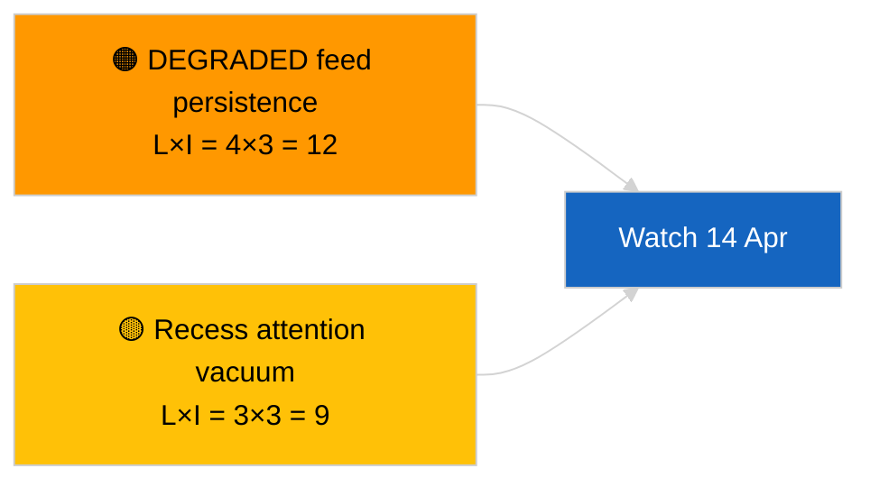

<!-- SPDX-FileCopyrightText: 2026 Hack23 AB -->
<!-- SPDX-License-Identifier: Apache-2.0 -->

# Executive Brief — Breaking (Cross-Session Update) | 2026-04-05

**Classification:** OSINT | Public Parliamentary Record
**Confidence:** 🟢 High (recess-period structural assessment)
**Generated:** 2026-04-05T00:00:00Z (retrospective brief)
**Article Type:** Breaking — Cross-Session Update
**Source:** European Parliament Open Data Portal

---

## 🎯 BLUF

**Cross-session intelligence update on 2026-04-05; EP recess Day 10 of 18 — no new parliamentary activity to report.** This second run of the day extends the morning baseline by integrating prior-day analytical outputs across the recess week. No new actors, no new procedures, no new adopted texts. Substantive carry-over from the 2026-04-03 / 04-04 substantive runs unchanged: feed-API DEGRADED state, PPE 38% structural dominance, Renew–ECR 0.95 cohesion signal, anti-corruption reform cluster. **🟢 HIGH confidence** on continuity of recess-period state.

---

## 🧭 3 Decisions This Brief Supports

| # | Decision | Who Decides | Deadline | Evidence |
|:-:|----------|-------------|:--------:|----------|
| 1 | **Editorial:** SKIP daily; consolidate with the morning run | Editor | +12h | Same signal set |
| 2 | **Monitoring:** continue daily endpoint probes | Data pipeline | daily | DEGRADED state |
| 3 | **Forward-watch:** mid-recess strategic synthesis (sibling `breaking-3`) | Analysis lead | +6h | Same-day analytical depth |

---

## 📰 60-Second Read

- 🔴 **No new EP activity** today. (🟢 High)
- 🟠 **Cross-session continuity** with 2026-04-04 and 2026-04-03 substantive findings. (🟢 High)
- 🟢 **DEGRADED API state inherited.** (🟢 High)
- 🟡 **Coalition arithmetic stable.** (🟢 High)
- 🔵 **Economic context unchanged.** (🟢 High)
- 🟣 **Cross-reference:** sibling `breaking-3` deepens with 12-hour longitudinal synthesis. (🟢 High)
- 🩷 **Disruption vector:** none acute. (🟢 High)
- ⚪ **Carry-forward:** 8 days to recess end.

---

## 🗂️ Top Documents / Procedures Table

| Rank | EP reference | Title (short) | Significance | Confidence |
|:----:|--------------|---------------|:------------:|:----------:|
| 1 | — | No new procedures or adopted texts | 0.0 | 🟢 HIGH |
| 2 | TA-10-2026-0094 | Anti-corruption (carry-over) | 9.0 | 🟢 HIGH |
| 3 | TA-10-2026-0088 | Braun immunity (carry-over) | 7.0 | 🟢 HIGH |

---

## ⚠️ Risk & Threat Snapshot

| Risk | L | I | Score | Trigger | Source | Admiralty |
|------|:-:|:-:|:-----:|---------|--------|:---------:|
| DEGRADED feed persistence | 4 | 3 | 12 | Past 14 April | 2026-04-03/breaking-2 | A1 |
| Recess attention vacuum | 3 | 3 | 9 | US or PL surprise | EP calendar | A2 |

---

## 🔮 Top Forward Trigger

**Commission Tuesday 7 April 2026** and **recess end 13 April**.

---

## 🛡️ Source Quality Assessment

- **Primary sources:** Carry-over Q1 inventory; cross-session memory.
- **Confidence:** 🟢 HIGH.

---

## 📎 Links

| Link | Path |
|------|------|
| Article | `./article.md` |
| Sibling runs | `analysis/daily/2026-04-05/breaking/`, `breaking-3/` |
| Manifest | `./manifest.json` |

---

**Document Control**
- **Template:** `/analysis/templates/executive-brief.md`
- **Artifact path:** `analysis/daily/2026-04-05/breaking-2/executive-brief.md`
- **Classification:** Public
- **Retrospective generation:** Back-fill session.
