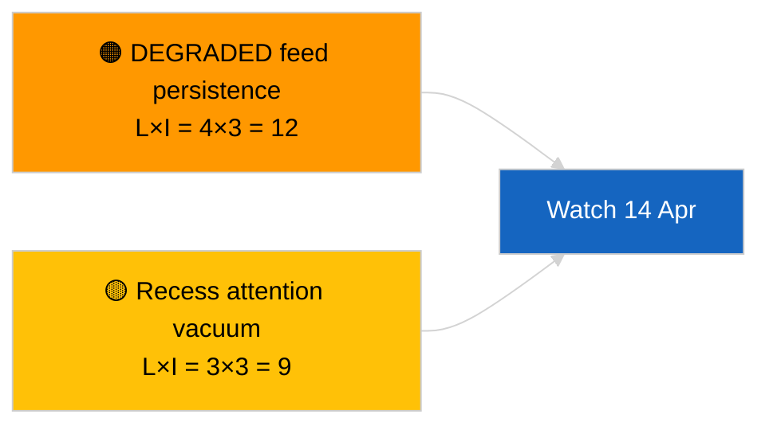

<!-- SPDX-FileCopyrightText: 2026 Hack23 AB -->
<!-- SPDX-License-Identifier: Apache-2.0 -->

# الملخص التنفيذي — نبأ عاجل (تحديث ما بين الدورتين) | 2026-04-05

**التصنيف:** المصادر المفتوحة | سجل برلماني عام
**مستوى الثقة:** 🟢 مرتفع (تقييم هيكلي خلال العطلة البرلمانية)
**تاريخ الإنشاء:** 2026-04-05T00:00:00Z (ملخص استرجاعي)
**نوع المقال:** Breaking — Cross-Session Update
**المصدر:** بوابة البيانات المفتوحة للبرلمان الأوروبي

---

## 🎯 BLUF

**تحديث استخباراتي بين الدورتين بتاريخ 2026-04-05؛ عطلة البرلمان الأوروبي اليوم العاشر من ثمانية عشر — لا نشاط برلماني جديد للإبلاغ عنه.** تُوسِّع هذه الجلسة الثانية من اليوم خط الأساس الصباحي من خلال دمج المخرجات التحليلية لليوم السابق طوال أسبوع العطلة. لا جهات فاعلة جديدة، لا إجراءات جديدة، لا نصوص معتمدة جديدة. يظل المحتوى الجوهري من الجلسات الرئيسية 2026-04-03 / 04-04 دون تغيير: تغذية واجهة برمجة التطبيقات في حالة متدهورة، هيمنة هيكلية لحزب الشعب الأوروبي بنسبة 38 %، إشارة تماسك Renew–ECR عند 0.95، تجمع إصلاح مكافحة الفساد. **🟢 ثقة عالية** في استمرارية حالة العطلة.

---

## 🧭 ثلاثة قرارات يدعمها هذا الملخص

| # | القرار | جهة اتخاذ القرار | الموعد النهائي | الدليل |
|:-:|-------|-----------------|:--------------:|--------|
| 1 | **تحريري:** تخطّي التقرير اليومي؛ دمجه مع الجلسة الصباحية | المحرر | +12 ساعة | نفس مجموعة الإشارات |
| 2 | **المراقبة:** مواصلة الفحوصات اليومية لنقاط النهاية | خط البيانات | يومياً | الحالة المتدهورة |
| 3 | **الرصد الاستشرافي:** تركيب استراتيجي في منتصف العطلة (الجلسة الشقيقة `breaking-3`) | رئيس التحليل | +6 ساعات | عمق تحليلي في نفس اليوم |

---

## 📰 القراءة في ستين ثانية

- 🔴 **لا نشاط جديد للبرلمان الأوروبي** اليوم. (🟢 مرتفع)
- 🟠 **استمرارية بين الدورتين** مع نتائج جوهرية من 2026-04-04 و2026-04-03. (🟢 مرتفع)
- 🟢 **حالة واجهة البرمجة المتدهورة موروثة.** (🟢 مرتفع)
- 🟡 **حسابات التحالفات مستقرة.** (🟢 مرتفع)
- 🔵 **السياق الاقتصادي دون تغيير.** (🟢 مرتفع)
- 🟣 **مرجع مشترك:** الجلسة الشقيقة `breaking-3` تتعمق بتركيب طولي مدته 12 ساعة. (🟢 مرتفع)
- 🩷 **ناقلات الاضطراب:** لا شيء حاد. (🟢 مرتفع)
- ⚪ **التقدم:** 8 أيام حتى انتهاء العطلة.

---

## 🗂️ جدول المستندات / الإجراءات ذات الأولوية

| الترتيب | مرجع البرلمان | العنوان (مختصر) | الأهمية | مستوى الثقة |
|:-------:|-------------|----------------|:-------:|:-----------:|
| 1 | — | لا إجراءات ولا نصوص معتمدة جديدة | 0.0 | 🟢 مرتفع |
| 2 | TA-10-2026-0094 | مكافحة الفساد (مُحوَّل) | 9.0 | 🟢 مرتفع |
| 3 | TA-10-2026-0088 | حصانة براون (مُحوَّل) | 7.0 | 🟢 مرتفع |

---

## ⚠️ لقطة المخاطر والتهديدات

| المخاطر | L | I | الدرجة | المحفّز | المصدر | Admiralty |
|---------|:-:|:-:|:------:|--------|--------|:---------:|
| استمرار التدهور في التغذية | 4 | 3 | 12 | بعد 14 أبريل | 2026-04-03/breaking-2 | A1 |
| فراغ الاهتمام خلال العطلة | 3 | 3 | 9 | مفاجأة من الولايات المتحدة أو بولندا | تقويم البرلمان الأوروبي | A2 |

---

## 🔮 أبرز المحفّزات المستقبلية

**ثلاثاء المفوضية الأوروبية، 7 أبريل 2026** و**نهاية العطلة في 13 أبريل**.

---

## 🛡️ تقييم جودة المصادر

- **المصادر الرئيسية:** مخزون الربع الأول المُحوَّل؛ ذاكرة بين الدورتين.
- **مستوى الثقة:** 🟢 مرتفع.

---

## 📎 الروابط

| الرابط | المسار |
|--------|--------|
| المقال | `./article.md` |
| الجلسات الشقيقة | `analysis/daily/2026-04-05/breaking/`، `breaking-3/` |
| ملف البيانات | `./manifest.json` |

---

**مراقبة المستند**
- **القالب:** `/analysis/templates/executive-brief.md`
- **مسار المنتج:** `analysis/daily/2026-04-05/breaking-2/executive-brief.md`
- **التصنيف:** عام
- **الإنشاء الاسترجاعي:** جلسة تعبئة.
