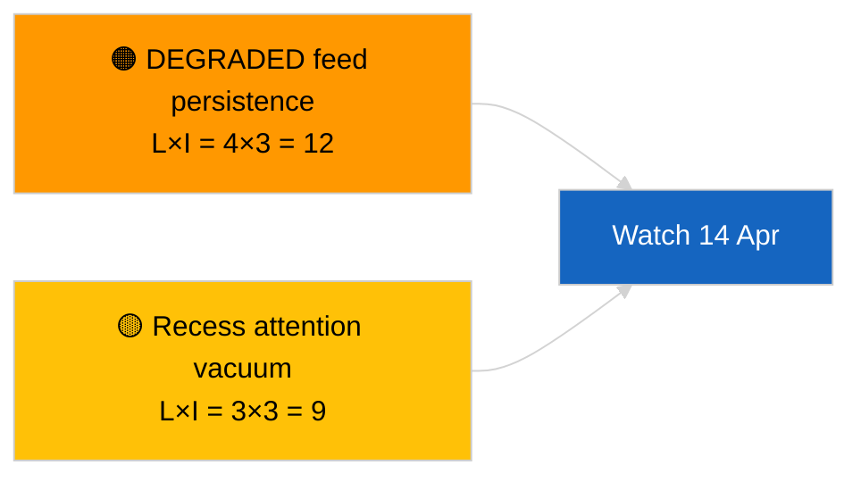

<!-- SPDX-FileCopyrightText: 2026 Hack23 AB -->
<!-- SPDX-License-Identifier: Apache-2.0 -->

# Eksekutiv rapport — Nyhedsflash (Kryds-sessions-opdatering) | 2026-04-05

**Klassifikation:** OSINT | Offentligt parlamentarisk optegnelse
**Konfidens:** 🟢 Høj (strukturel vurdering i recessperiode)
**Genereret:** 2026-04-05T00:00:00Z (retrospektiv rapport)
**Artikeltype:** Breaking — Cross-Session Update
**Kilde:** Europa-Parlamentets Open Data Portal

---

## 🎯 BLUF

**Kryds-sessions efterretningsopdatering den 2026-04-05; EP-recess dag 10 af 18 — ingen ny parlamentarisk aktivitet at rapportere.** Denne anden kørsel af dagen udvider morgenbaslinjen ved at integrere analytiske output fra dagen før hen over recessugen. Ingen nye aktører, ingen nye procedurer, ingen nye vedtagne tekster. Substantielt indhold fra de substantielle kørsler 2026-04-03 / 04-04 uændret: API-feed i DEGRADERET tilstand, PPE 38 % strukturel dominans, Renew–ECR 0,95 kohesionssignal, antikorruptionsreformkluster. **🟢 HØJ konfidens** om kontinuitet i recessperiodentilstand.

---

## 🧭 3 Beslutninger Denne Rapport Understøtter

| # | Beslutning | Hvem beslutter | Deadline | Bevis |
|:-:|-----------|----------------|:--------:|-------|
| 1 | **Redaktionelt:** SPRING OVER daglig; konsolider med morgenkørsel | Redaktør | +12h | Samme signalsæt |
| 2 | **Overvågning:** fortsæt daglige endepunktssondringer | Datapipeline | dagligt | DEGRADERET tilstand |
| 3 | **Fremadrettet observation:** strategisk syntese midt i recessen (søskende `breaking-3`) | Analyseleder | +6h | Analytisk dybde samme dag |

---

## 📰 60-Second Read

- 🔴 **Ingen ny EP-aktivitet** i dag. (🟢 Høj)
- 🟠 **Kryds-sessions kontinuitet** med substantielle fund fra 2026-04-04 og 2026-04-03. (🟢 Høj)
- 🟢 **DEGRADERET API-tilstand arvet.** (🟢 Høj)
- 🟡 **Koalitionsaritmetik stabil.** (🟢 Høj)
- 🔵 **Økonomisk kontekst uændret.** (🟢 Høj)
- 🟣 **Krydshenvisning:** søskende `breaking-3` uddybes med 12-timers longitudinal syntese. (🟢 Høj)
- 🩷 **Forstyrrelsesvektorer:** ingen akutte. (🟢 Høj)
- ⚪ **Fremførsel:** 8 dage til recessens afslutning.

---

## 🗂️ Topprangerede Dokumenter / Proceduretabel

| Rang | EP-reference | Titel (kort) | Signifikans | Konfidens |
|:----:|-------------|--------------|:-----------:|:---------:|
| 1 | — | Ingen nye procedurer eller vedtagne tekster | 0,0 | 🟢 HØJ |
| 2 | TA-10-2026-0094 | Antikorruption (frembugt) | 9,0 | 🟢 HØJ |
| 3 | TA-10-2026-0088 | Braun-immunitet (frembugt) | 7,0 | 🟢 HØJ |

---

## ⚠️ Risiko- og Trusselsbillede

| Risiko | L | I | Score | Udløser | Kilde | Admiralty |
|--------|:-:|:-:|:-----:|---------|-------|:---------:|
| DEGRADERET feed-persistens | 4 | 3 | 12 | Forbi 14. april | 2026-04-03/breaking-2 | A1 |
| Opmærksomhedsvakuum under recess | 3 | 3 | 9 | Overraskelse fra USA eller Polen | EP-kalender | A2 |

---

## 🔮 Top Fremad-Udløser

**Kommissionens tirsdag den 7. april 2026** og **recessens afslutning den 13. april**.

---

## 🛡️ Kildekvali­tetsvurdering

- **Primære kilder:** Frembugt Q1-inventar; kryds-sessions hukommelse.
- **Konfidens:** 🟢 HØJ.

---

## 📎 Links

| Link | Sti |
|------|-----|
| Artikel | `./article.md` |
| Søskendekørsler | `analysis/daily/2026-04-05/breaking/`, `breaking-3/` |
| Manifest | `./manifest.json` |

---

**Dokumentkontrol**
- **Skabelon:** `/analysis/templates/executive-brief.md`
- **Artefaktsti:** `analysis/daily/2026-04-05/breaking-2/executive-brief.md`
- **Klassifikation:** Offentlig
- **Retrospektiv generering:** Tilbagedateringssession.
