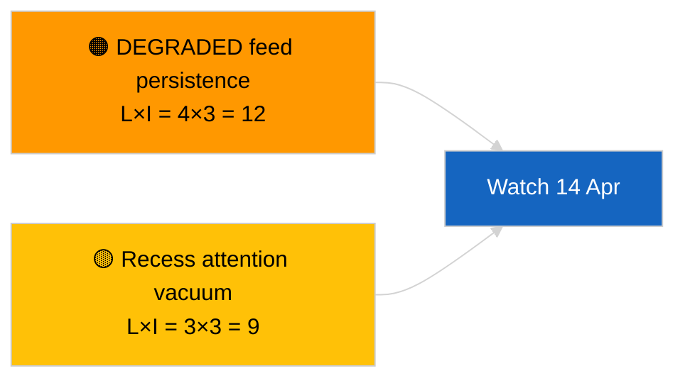

<!-- SPDX-FileCopyrightText: 2026 Hack23 AB -->
<!-- SPDX-License-Identifier: Apache-2.0 -->

# Exekutivbericht — Eilmeldung (Sitzungsübergreifendes Update) | 2026-04-05

**Klassifizierung:** OSINT | Öffentliches Parlamentsprotokoll
**Konfidenz:** 🟢 Hoch (Strukturbewertung in Sitzungspause)
**Erstellt:** 2026-04-05T00:00:00Z (Retroaktive Zusammenfassung)
**Artikeltyp:** Breaking — Cross-Session Update
**Quelle:** Datenportal des Europäischen Parlaments (Open Data)

---

## 🎯 BLUF

**Sitzungsübergreifendes Geheimdienstupdate vom 2026-04-05; EP-Sitzungspause Tag 10 von 18 — keine neue parlamentarische Aktivität zu melden.** Dieser zweite Lauf des Tages erweitert die Morgenbasis durch Integration analytischer Ausgaben des Vortags über die Sitzungspausenwoche. Keine neuen Akteure, keine neuen Verfahren, keine neuen angenommenen Texte. Substanzielle Inhalte der maßgeblichen Läufe 2026-04-03 / 04-04 unverändert: API-Feed im DEGRADIERTEN Zustand, EVP 38 % strukturelle Dominanz, Renew–ECR 0,95 Kohäsionssignal, Antikorruptionsreformcluster. **🟢 HOHE Konfidenz** für die Kontinuität des Sitzungspausenzustands.

---

## 🧭 3 Entscheidungen, die dieser Bericht stützt

| # | Entscheidung | Entscheider | Frist | Nachweis |
|:-:|-------------|------------|:-----:|---------|
| 1 | **Redaktionell:** ÜBERSPRINGEN täglich; mit Morgenlauf konsolidieren | Redakteur | +12h | Gleiches Signalset |
| 2 | **Überwachung:** tägliche Endpunktprüfungen fortsetzen | Datenpipeline | täglich | DEGRADIERTER Zustand |
| 3 | **Vorausschauende Beobachtung:** strategische Synthese in der Mitte der Sitzungspause (Geschwister `breaking-3`) | Analyseleiter | +6h | Analytische Tiefe am selben Tag |

---

## 📰 60-Second Read

- 🔴 **Keine neue EP-Aktivität** heute. (🟢 Hoch)
- 🟠 **Sitzungsübergreifende Kontinuität** mit substanziellen Ergebnissen von 2026-04-04 und 2026-04-03. (🟢 Hoch)
- 🟢 **DEGRADIERTER API-Zustand geerbt.** (🟢 Hoch)
- 🟡 **Koalitionsarithmetik stabil.** (🟢 Hoch)
- 🔵 **Wirtschaftlicher Kontext unverändert.** (🟢 Hoch)
- 🟣 **Querverweise:** Geschwister `breaking-3` wird mit 12-stündiger Längsschnittsynthese vertieft. (🟢 Hoch)
- 🩷 **Störvektoren:** keine akuten. (🟢 Hoch)
- ⚪ **Fortschritt:** 8 Tage bis zum Ende der Sitzungspause.

---

## 🗂️ Top-Dokumente / Verfahrenstabelle

| Rang | EP-Referenz | Titel (kurz) | Bedeutung | Konfidenz |
|:----:|------------|--------------|:---------:|:---------:|
| 1 | — | Keine neuen Verfahren oder angenommenen Texte | 0,0 | 🟢 HOCH |
| 2 | TA-10-2026-0094 | Antikorruption (übertragen) | 9,0 | 🟢 HOCH |
| 3 | TA-10-2026-0088 | Braun-Immunität (übertragen) | 7,0 | 🟢 HOCH |

---

## ⚠️ Risiko- und Bedrohungsbild

| Risiko | L | I | Punktzahl | Auslöser | Quelle | Admiralty |
|--------|:-:|:-:|:---------:|---------|--------|:---------:|
| DEGRADIERTE Feed-Persistenz | 4 | 3 | 12 | Nach dem 14. April | 2026-04-03/breaking-2 | A1 |
| Aufmerksamkeitsvakuum in der Sitzungspause | 3 | 3 | 9 | Überraschung aus USA oder Polen | EP-Kalender | A2 |

---

## 🔮 Top-Vorausauslöser

**Kommissionsdienstag, 7. April 2026** und **Ende der Sitzungspause am 13. April**.

---

## 🛡️ Quellqualitätsbewertung

- **Primärquellen:** Übertragenes Q1-Inventar; sitzungsübergreifendes Gedächtnis.
- **Konfidenz:** 🟢 HOCH.

---

## 📎 Links

| Link | Pfad |
|------|------|
| Artikel | `./article.md` |
| Geschwisterläufe | `analysis/daily/2026-04-05/breaking/`, `breaking-3/` |
| Manifest | `./manifest.json` |

---

**Dokumentenkontrolle**
- **Vorlage:** `/analysis/templates/executive-brief.md`
- **Artefaktpfad:** `analysis/daily/2026-04-05/breaking-2/executive-brief.md`
- **Klassifizierung:** Öffentlich
- **Retroaktive Erstellung:** Rückfüllsitzung.
