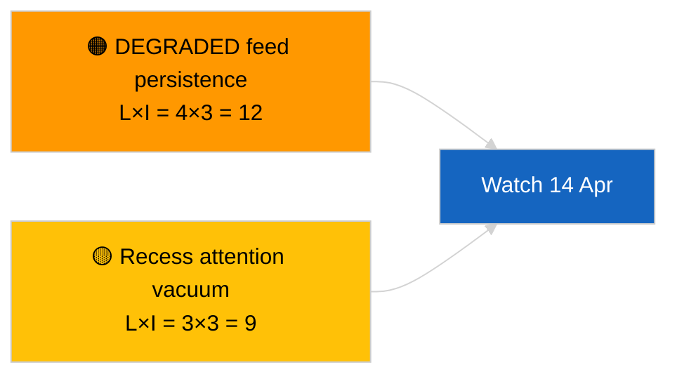

<!-- SPDX-FileCopyrightText: 2026 Hack23 AB -->
<!-- SPDX-License-Identifier: Apache-2.0 -->

# Informe Ejecutivo — Flash Informativo (Actualización Intersesional) | 2026-04-05

**Clasificación:** OSINT | Registro parlamentario público
**Confianza:** 🟢 Alta (evaluación estructural en período de receso)
**Generado:** 2026-04-05T00:00:00Z (resumen retrospectivo)
**Tipo de artículo:** Breaking — Cross-Session Update
**Fuente:** Portal de datos abiertos del Parlamento Europeo

---

## 🎯 BLUF

**Actualización de inteligencia intersesional del 2026-04-05; receso del PE día 10 de 18 — ninguna nueva actividad parlamentaria que reportar.** Esta segunda ejecución del día amplía la línea base matutina al integrar los resultados analíticos del día anterior durante la semana de receso. Ningún nuevo actor, ningún nuevo procedimiento, ningún nuevo texto adoptado. El contenido sustancial de las ejecuciones principales 2026-04-03 / 04-04 sin cambios: canal API en estado DEGRADADO, PPE 38 % dominio estructural, señal de cohesión Renew–ECR 0,95, clúster de reforma anticorrupción. **🟢 ALTA confianza** sobre la continuidad del estado de receso.

---

## 🧭 3 Decisiones Que Este Informe Apoya

| # | Decisión | Quién decide | Plazo | Evidencia |
|:-:|---------|-------------|:-----:|----------|
| 1 | **Editorial:** OMITIR diario; consolidar con ejecución matutina | Editor | +12h | Mismo conjunto de señales |
| 2 | **Supervisión:** continuar sondeos diarios de puntos finales | Flujo de datos | diario | Estado DEGRADADO |
| 3 | **Vigilancia prospectiva:** síntesis estratégica a mitad del receso (hermanas `breaking-3`) | Jefe de análisis | +6h | Profundidad analítica el mismo día |

---

## 📰 60-Second Read

- 🔴 **Sin nueva actividad del PE** hoy. (🟢 Alta)
- 🟠 **Continuidad intersesional** con hallazgos sustanciales de 2026-04-04 y 2026-04-03. (🟢 Alta)
- 🟢 **Estado API DEGRADADO heredado.** (🟢 Alta)
- 🟡 **Aritmética de coalición estable.** (🟢 Alta)
- 🔵 **Contexto económico sin cambios.** (🟢 Alta)
- 🟣 **Referencia cruzada:** las hermanas `breaking-3` se profundizan con síntesis longitudinal de 12 horas. (🟢 Alta)
- 🩷 **Vectores disruptivos:** ninguno agudo. (🟢 Alta)
- ⚪ **Progreso:** 8 días hasta el fin del receso.

---

## 🗂️ Tabla de Principales Documentos / Procedimientos

| Rango | Referencia PE | Título (breve) | Relevancia | Confianza |
|:-----:|-------------|----------------|:----------:|:---------:|
| 1 | — | Sin nuevos procedimientos ni textos adoptados | 0,0 | 🟢 ALTA |
| 2 | TA-10-2026-0094 | Anticorrupción (transferido) | 9,0 | 🟢 ALTA |
| 3 | TA-10-2026-0088 | Inmunidad Braun (transferido) | 7,0 | 🟢 ALTA |

---

## ⚠️ Instantánea de Riesgo y Amenaza

| Riesgo | L | I | Puntuación | Desencadenante | Fuente | Admiralty |
|--------|:-:|:-:|:----------:|---------------|--------|:---------:|
| Persistencia del canal DEGRADADO | 4 | 3 | 12 | Pasado el 14 de abril | 2026-04-03/breaking-2 | A1 |
| Vacío de atención durante el receso | 3 | 3 | 9 | Sorpresa de EE. UU. o Polonia | Calendario PE | A2 |

---

## 🔮 Principal Activador Futuro

**Martes de la Comisión, 7 de abril de 2026** y **fin del receso el 13 de abril**.

---

## 🛡️ Evaluación de la Calidad de las Fuentes

- **Fuentes primarias:** Inventario Q1 transferido; memoria intersesional.
- **Confianza:** 🟢 ALTA.

---

## 📎 Enlaces

| Enlace | Ruta |
|--------|------|
| Artículo | `./article.md` |
| Ejecuciones hermanas | `analysis/daily/2026-04-05/breaking/`, `breaking-3/` |
| Manifiesto | `./manifest.json` |

---

**Control del documento**
- **Plantilla:** `/analysis/templates/executive-brief.md`
- **Ruta del artefacto:** `analysis/daily/2026-04-05/breaking-2/executive-brief.md`
- **Clasificación:** Público
- **Generación retrospectiva:** Sesión de relleno.
