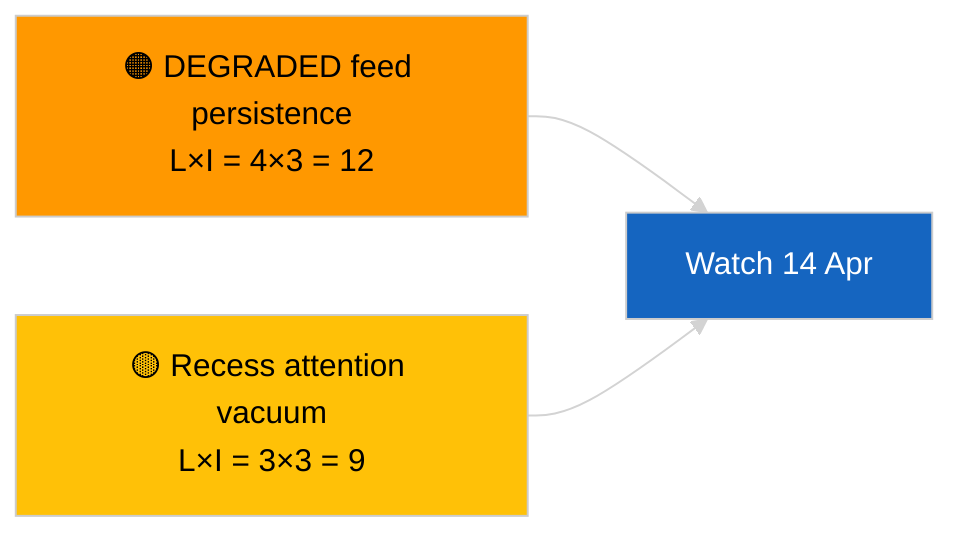

<!-- SPDX-FileCopyrightText: 2026 Hack23 AB -->
<!-- SPDX-License-Identifier: Apache-2.0 -->

# Toimeenpaneva katsaus — Pika-uutinen (poikkilistauksen päivitys) | 2026-04-05

**Luokittelu:** AVOIN LÄHDE | Julkinen parlamentaarinen asiakirja
**Luotettavuus:** 🟢 Korkea (rakenteellinen arviointi istuntotauon aikana)
**Luotu:** 2026-04-05T00:00:00Z (takautuva yhteenveto)
**Artikkelityyppi:** Breaking — Cross-Session Update
**Lähde:** Euroopan parlamentin Open Data Portal

---

## 🎯 BLUF

**Poikkilistauksen tiedustelupäivitys 2026-04-05; EP:n istuntotauko päivä 10/18 — ei uutta parlamentaarista toimintaa raportoitavaksi.** Tämä päivän toinen ajo laajentaa aamulähtötasoa integroimalla edellisen päivän analyyttisia tuloksia koko istuntotaukoviikon ajalta. Ei uusia toimijoita, ei uusia menettelyjä, ei uusia hyväksyttyjä tekstejä. Olennaiset löydöt ajoista 2026-04-03 / 04-04 muuttumattomia: API-syöte HEIKENTYNYT-tilassa, EPP 38 % rakenteellinen dominanssi, Renew–ECR 0,95 koheesiosignaali, korruptionvastainen uudistusrypäs. **🟢 KORKEA luotettavuus** istuntotaukotilan jatkuvuudesta.

---

## 🧭 3 Päätöstä, Joita Tämä Katsaus Tukee

| # | Päätös | Kuka päättää | Määräaika | Todiste |
|:-:|--------|-------------|:---------:|---------|
| 1 | **Toimituksellinen:** OHITA päivittäinen; yhdistä aamuajoon | Toimittaja | +12h | Sama signaalijoukko |
| 2 | **Seuranta:** jatka päivittäisiä päätepistetutkimuksia | Dataputki | päivittäin | HEIKENTYNYT tila |
| 3 | **Ennakoiva tarkkailu:** strateginen synteesi istuntotauon puolivälissä (sisarusto `breaking-3`) | Analyysipäällikkö | +6h | Analyyttinen syvyys samana päivänä |

---

## 📰 60-Second Read

- 🔴 **Ei uutta EP-toimintaa** tänään. (🟢 Korkea)
- 🟠 **Poikkilistauksen jatkuvuus** olennaisten löydösten kanssa 2026-04-04 ja 2026-04-03. (🟢 Korkea)
- 🟢 **HEIKENTYNYT API-tila peritty.** (🟢 Korkea)
- 🟡 **Koalitioaritmetiikka vakaa.** (🟢 Korkea)
- 🔵 **Taloudellinen konteksti muuttumaton.** (🟢 Korkea)
- 🟣 **Ristiviittaus:** sisarusto `breaking-3` syvennetään 12 tunnin pitkittäissynteesin avulla. (🟢 Korkea)
- 🩷 **Häirintävektorit:** ei akuutteja. (🟢 Korkea)
- ⚪ **Eteneminen:** 8 päivää istuntotauon päättymiseen.

---

## 🗂️ Tärkeimmät Asiakirjat / Menettelyn Taulukko

| Sijoitus | EP-viite | Otsikko (lyhyt) | Merkitys | Luotettavuus |
|:--------:|---------|-----------------|:--------:|:------------:|
| 1 | — | Ei uusia menettelyjä tai hyväksyttyjä tekstejä | 0,0 | 🟢 KORKEA |
| 2 | TA-10-2026-0094 | Korruptionvastainen (siirretty) | 9,0 | 🟢 KORKEA |
| 3 | TA-10-2026-0088 | Braunin immuniteetti (siirretty) | 7,0 | 🟢 KORKEA |

---

## ⚠️ Riski- ja Uhkakuva

| Riski | L | I | Pisteet | Laukaisin | Lähde | Admiralty |
|-------|:-:|:-:|:-------:|----------|-------|:---------:|
| HEIKENTYNYT syötteen pysyvyys | 4 | 3 | 12 | 14. huhtikuuta jälkeen | 2026-04-03/breaking-2 | A1 |
| Huomiovaje istuntotauon aikana | 3 | 3 | 9 | Yllätys USA:sta tai Puolasta | EP-kalenteri | A2 |

---

## 🔮 Tärkein Tulevaisuuden Laukaisin

**Komission tiistai 7. huhtikuuta 2026** ja **istuntotauon päättyminen 13. huhtikuuta**.

---

## 🛡️ Lähteiden Laadun Arviointi

- **Ensisijaiset lähteet:** Siirretty Q1-inventaari; poikkilistauksen muisti.
- **Luotettavuus:** 🟢 KORKEA.

---

## 📎 Linkit

| Linkki | Polku |
|--------|-------|
| Artikkeli | `./article.md` |
| Sisaruksiston ajot | `analysis/daily/2026-04-05/breaking/`, `breaking-3/` |
| Manifesti | `./manifest.json` |

---

**Asiakirjan hallinta**
- **Malli:** `/analysis/templates/executive-brief.md`
- **Artefaktin polku:** `analysis/daily/2026-04-05/breaking-2/executive-brief.md`
- **Luokittelu:** Julkinen
- **Takautuva luonti:** Täydentävä istunto.
