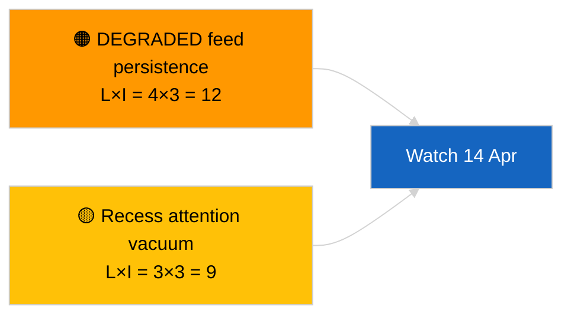

<!-- SPDX-FileCopyrightText: 2026 Hack23 AB -->
<!-- SPDX-License-Identifier: Apache-2.0 -->

# Rapport exécutif — Flash d'information (Mise à jour intersessions) | 2026-04-05

**Classification :** OSINT | Procès-verbal parlementaire public
**Confiance :** 🟢 Haute (évaluation structurelle pendant la session de recess)
**Généré :** 2026-04-05T00:00:00Z (rapport rétrospectif)
**Type d'article :** Breaking — Cross-Session Update
**Source :** Portail Open Data du Parlement européen

---

## 🎯 BLUF

**Mise à jour du renseignement intersessions du 2026-04-05 ; pause du PE jour 10 sur 18 — aucune nouvelle activité parlementaire à signaler.** Cette deuxième exécution de la journée élargit la ligne de base matinale en intégrant les résultats analytiques de la veille sur la semaine de recess. Aucun nouvel acteur, aucune nouvelle procédure, aucun nouveau texte adopté. Contenu substantiel des exécutions importantes 2026-04-03 / 04-04 inchangé : flux API en état DÉGRADÉ, PPE 38 % de dominance structurelle, signal de cohésion Renew–ECR 0,95, cluster de réforme anti-corruption. **🟢 HAUTE confiance** sur la continuité de l'état de recess.

---

## 🧭 3 Décisions Que Ce Rapport Soutient

| # | Décision | Qui décide | Délai | Preuve |
|:-:|---------|------------|:-----:|--------|
| 1 | **Éditorial :** IGNORER quotidien ; consolider avec l'exécution matinale | Éditeur | +12h | Même ensemble de signaux |
| 2 | **Surveillance :** poursuivre les sondages quotidiens des points de terminaison | Pipeline de données | quotidien | État DÉGRADÉ |
| 3 | **Veille prospective :** synthèse stratégique en mi-recess (consanguins `breaking-3`) | Chef de l'analyse | +6h | Profondeur analytique le même jour |

---

## 📰 60-Second Read

- 🔴 **Aucune nouvelle activité du PE** aujourd'hui. (🟢 Haute)
- 🟠 **Continuité intersessions** avec les résultats substantiels de 2026-04-04 et 2026-04-03. (🟢 Haute)
- 🟢 **État API DÉGRADÉ hérité.** (🟢 Haute)
- 🟡 **Arithmétique des coalitions stable.** (🟢 Haute)
- 🔵 **Contexte économique inchangé.** (🟢 Haute)
- 🟣 **Référence croisée :** les consanguins `breaking-3` sont approfondis avec une synthèse longitudinale de 12 heures. (🟢 Haute)
- 🩷 **Vecteurs de perturbation :** aucun aigu. (🟢 Haute)
- ⚪ **Progression :** 8 jours jusqu'à la fin du recess.

---

## 🗂️ Documents / Tableau des Procédures Prioritaires

| Rang | Référence PE | Titre (court) | Importance | Confiance |
|:----:|-------------|---------------|:----------:|:---------:|
| 1 | — | Aucune nouvelle procédure ni texte adopté | 0,0 | 🟢 HAUTE |
| 2 | TA-10-2026-0094 | Anti-corruption (reporté) | 9,0 | 🟢 HAUTE |
| 3 | TA-10-2026-0088 | Immunité Braun (reporté) | 7,0 | 🟢 HAUTE |

---

## ⚠️ Tableau des Risques et des Menaces

| Risque | L | I | Score | Déclencheur | Source | Admiralty |
|--------|:-:|:-:|:-----:|------------|--------|:---------:|
| Persistance du flux DÉGRADÉ | 4 | 3 | 12 | Après le 14 avril | 2026-04-03/breaking-2 | A1 |
| Vide d'attention en période de recess | 3 | 3 | 9 | Surprise des États-Unis ou de la Pologne | Calendrier PE | A2 |

---

## 🔮 Principal Déclencheur Prospectif

**Mardi de la Commission, 7 avril 2026** et **fin du recess le 13 avril**.

---

## 🛡️ Évaluation de la Qualité des Sources

- **Sources primaires :** Inventaire Q1 reporté ; mémoire intersessions.
- **Confiance :** 🟢 HAUTE.

---

## 📎 Liens

| Lien | Chemin |
|------|--------|
| Article | `./article.md` |
| Exécutions consanguines | `analysis/daily/2026-04-05/breaking/`, `breaking-3/` |
| Manifeste | `./manifest.json` |

---

**Contrôle du document**
- **Modèle :** `/analysis/templates/executive-brief.md`
- **Chemin de l'artefact :** `analysis/daily/2026-04-05/breaking-2/executive-brief.md`
- **Classification :** Public
- **Génération rétrospective :** Session de rattrapage.
