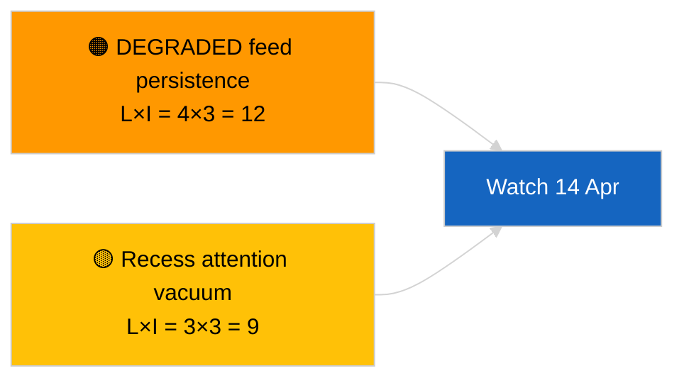

<!-- SPDX-FileCopyrightText: 2026 Hack23 AB -->
<!-- SPDX-License-Identifier: Apache-2.0 -->

# סיכום מנהלים — ידיעה דחופה (עדכון בין-פגישתי) | 2026-04-05

**סיווג:** מקורות פתוחים | רשומה פרלמנטרית ציבורית
**רמת ביטחון:** 🟢 גבוהה (הערכה מבנית בתקופת הפגרה)
**נוצר:** 2026-04-05T00:00:00Z (סיכום רטרואקטיבי)
**סוג המאמר:** Breaking — Cross-Session Update
**מקור:** פורטל הנתונים הפתוחים של הפרלמנט האירופי

---

## 🎯 BLUF

**עדכון מודיעיני בין-פגישתי מתאריך 2026-04-05; הפגרה של PE — יום 10 מתוך 18 — אין פעילות פרלמנטרית חדשה לדווח עליה.** ריצה שנייה זו של היום מרחיבה את קו הבסיס הבוקרי על ידי שילוב תפוקות אנליטיות מהיום הקודם לאורך שבוע הפגרה. אין שחקנים חדשים, אין הליכים חדשים, אין טקסטים חדשים שאומצו. תוכן מהותי מהריצות המשמעותיות 2026-04-03 / 04-04 ללא שינוי: עדכון ה-API במצב פגום, EVP 38 % דומיננטיות מבנית, אות גיבוש Renew–ECR 0.95, אשכול רפורמת מאבק שחיתות. **🟢 ביטחון גבוה** לגבי המשכיות מצב הפגרה.

---

## 🧭 3 החלטות שסיכום זה תומך בהן

| # | החלטה | מי מחליט | מועד אחרון | ראיה |
|:-:|------|----------|:----------:|------|
| 1 | **עריכה:** דלג על היומי; אחד עם הריצה הבוקרית | עורך | +12 שעות | אותה סדרת אותות |
| 2 | **ניטור:** המשך בדיקות קצה יומיות | צינור נתונים | יומי | מצב פגום |
| 3 | **תצפית צופה פני עתיד:** סינתזה אסטרטגית באמצע הפגרה (אח/אחות `breaking-3`) | ראש הניתוח | +6 שעות | עומק אנליטי אותו יום |

---

## 📰 קריאת שישים שניות

- 🔴 **אין פעילות PE חדשה** היום. (🟢 גבוהה)
- 🟠 **המשכיות בין-פגישתית** עם ממצאים מהותיים מ-2026-04-04 ו-2026-04-03. (🟢 גבוהה)
- 🟢 **מצב API פגום נורש.** (🟢 גבוהה)
- 🟡 **חשבון הקואליציות יציב.** (🟢 גבוהה)
- 🔵 **הקשר כלכלי ללא שינוי.** (🟢 גבוהה)
- 🟣 **הפניה צולבת:** `breaking-3` מתעמקת בסינתזה אורכית של 12 שעות. (🟢 גבוהה)
- 🩷 **וקטורי שיבוש:** אין חריפים. (🟢 גבוהה)
- ⚪ **התקדמות:** 8 ימים עד לסיום הפגרה.

---

## 🗂️ טבלת המסמכים / הליכים המובילים

| דירוג | הפניית PE | כותרת (קצרה) | משמעות | רמת ביטחון |
|:-----:|----------|--------------|:------:|:----------:|
| 1 | — | אין הליכים חדשים או טקסטים שאומצו | 0.0 | 🟢 גבוהה |
| 2 | TA-10-2026-0094 | מאבק שחיתות (הועבר) | 9.0 | 🟢 גבוהה |
| 3 | TA-10-2026-0088 | חסינות בראון (הועבר) | 7.0 | 🟢 גבוהה |

---

## ⚠️ תמונת מצב סיכונים ואיומים

| סיכון | L | I | ניקוד | מפעיל | מקור | Admiralty |
|-------|:-:|:-:|:-----:|-------|------|:---------:|
| עמידות עדכון פגום | 4 | 3 | 12 | אחרי 14 באפריל | 2026-04-03/breaking-2 | A1 |
| ואקום תשומת לב בפגרה | 3 | 3 | 9 | הפתעה מארה"ב או פולין | לוח שנה PE | A2 |

---

## 🔮 מפעיל העתיד המוביל

**יום שלישי של הנציבות, 7 באפריל 2026** ו**סיום הפגרה ב-13 באפריל**.

---

## 🛡️ הערכת איכות המקורות

- **מקורות ראשוניים:** מלאי רבעון 1 שהועבר; זיכרון בין-פגישתי.
- **רמת ביטחון:** 🟢 גבוהה.

---

## 📎 קישורים

| קישור | נתיב |
|-------|------|
| מאמר | `./article.md` |
| ריצות אח/אחות | `analysis/daily/2026-04-05/breaking/`، `breaking-3/` |
| מניפסט | `./manifest.json` |

---

**בקרת מסמכים**
- **תבנית:** `/analysis/templates/executive-brief.md`
- **נתיב ארטיפקט:** `analysis/daily/2026-04-05/breaking-2/executive-brief.md`
- **סיווג:** ציבורי
- **יצירה רטרואקטיבית:** סשן מילוי.
