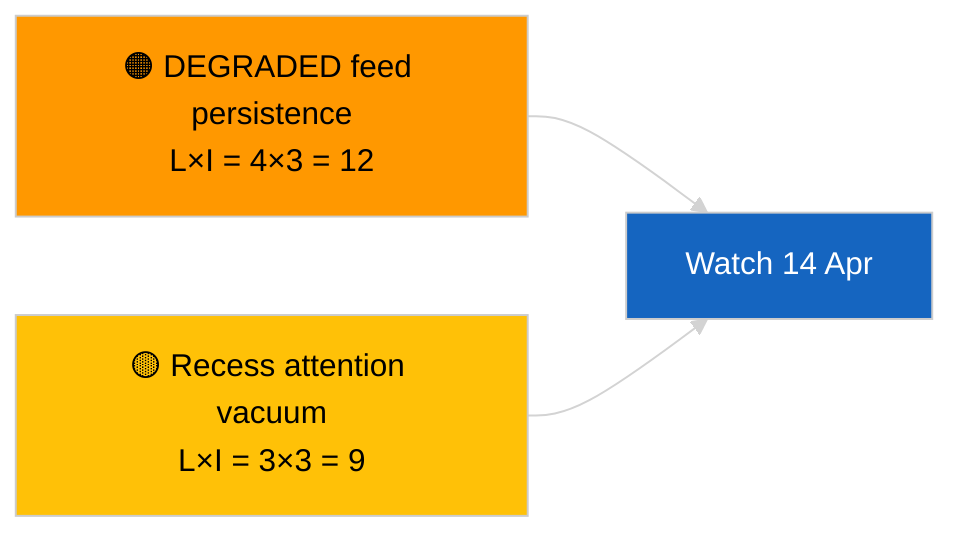

<!-- SPDX-FileCopyrightText: 2026 Hack23 AB -->
<!-- SPDX-License-Identifier: Apache-2.0 -->

# エグゼクティブ・ブリーフ — 速報（クロスセッション更新）| 2026-04-05

**分類：** OSINT｜公開議会記録
**信頼度：** 🟢 高（会期休会中の構造的評価）
**作成日：** 2026-04-05T00:00:00Z（遡及的サマリー）
**記事タイプ：** Breaking — Cross-Session Update
**出典：** 欧州議会オープンデータポータル

---

## 🎯 BLUF

**2026-04-05 クロスセッション情報更新；欧州議会休会 18 日間中の 10 日目 — 新規議会活動の報告なし。** 本日 2 回目の実行は、休会週全体にわたる前日の分析的アウトプットを統合し、朝のベースラインを拡張する。新規アクター・手続き・採択テキストなし。主要実行 2026-04-03 / 04-04 の実質的内容は変化なし：API フィードは劣化状態、欧州人民党 38 % 構造的優位、Renew–ECR 凝集シグナル 0.95、汚職改革クラスター継続中。**🟢 高い信頼度**で休会状態の継続を確認。

---

## 🧭 このブリーフが支援する 3 つの意思決定

| # | 意思決定 | 決定者 | 期限 | 根拠 |
|:-:|---------|-------|:----:|------|
| 1 | **編集上：** 日次をスキップ；朝実行と統合 | 編集者 | +12h | 同一シグナルセット |
| 2 | **監視：** エンドポイント日次探査を継続 | データパイプライン | 毎日 | 劣化状態 |
| 3 | **先読み観測：** 休会中盤の戦略的統合（姉妹 `breaking-3`） | 分析責任者 | +6h | 同日の分析深度 |

---

## 📰 60 秒で読む

- 🔴 **本日、欧州議会の新規活動なし。**（🟢 高）
- 🟠 **クロスセッション継続性**：2026-04-04 および 2026-04-03 の実質的知見を引き継ぎ。（🟢 高）
- 🟢 **API 劣化状態を継承。**（🟢 高）
- 🟡 **連立計算は安定。**（🟢 高）
- 🔵 **経済的コンテクストに変化なし。**（🟢 高）
- 🟣 **クロスリファレンス：** 姉妹 `breaking-3` が 12 時間縦断的統合で深化。（🟢 高）
- 🩷 **混乱ベクター：** 急性なし。（🟢 高）
- ⚪ **進捗：** 休会終了まで残り 8 日。

---

## 🗂️ 上位ドキュメント／手続きテーブル

| 順位 | EP 参照 | タイトル（短縮） | 重要度 | 信頼度 |
|:---:|--------|----------------|:------:|:------:|
| 1 | — | 新規手続きおよび採択テキストなし | 0.0 | 🟢 高 |
| 2 | TA-10-2026-0094 | 汚職防止（引き継ぎ） | 9.0 | 🟢 高 |
| 3 | TA-10-2026-0088 | Braun 議員免責（引き継ぎ） | 7.0 | 🟢 高 |

---

## ⚠️ リスク・脅威スナップショット

| リスク | L | I | スコア | トリガー | 出典 | Admiralty |
|-------|:-:|:-:|:-----:|--------|------|:---------:|
| 劣化フィード持続性 | 4 | 3 | 12 | 4 月 14 日以降 | 2026-04-03/breaking-2 | A1 |
| 休会中の注目度空白 | 3 | 3 | 9 | 米国またはポーランドの想定外展開 | EP カレンダー | A2 |

---

## 🔮 最重要前向きトリガー

**欧州委員会の火曜日 2026 年 4 月 7 日**および**休会終了 4 月 13 日**。

---

## 🛡️ ソース品質評価

- **主要ソース：** Q1 インベントリ引き継ぎ；クロスセッションメモリ。
- **信頼度：** 🟢 高。

---

## 📎 リンク

| リンク | パス |
|--------|------|
| 記事 | `./article.md` |
| 姉妹実行 | `analysis/daily/2026-04-05/breaking/`、`breaking-3/` |
| マニフェスト | `./manifest.json` |

---

**文書管理**
- **テンプレート：** `/analysis/templates/executive-brief.md`
- **成果物パス：** `analysis/daily/2026-04-05/breaking-2/executive-brief.md`
- **分類：** 公開
- **遡及的生成：** バックフィルセッション。
