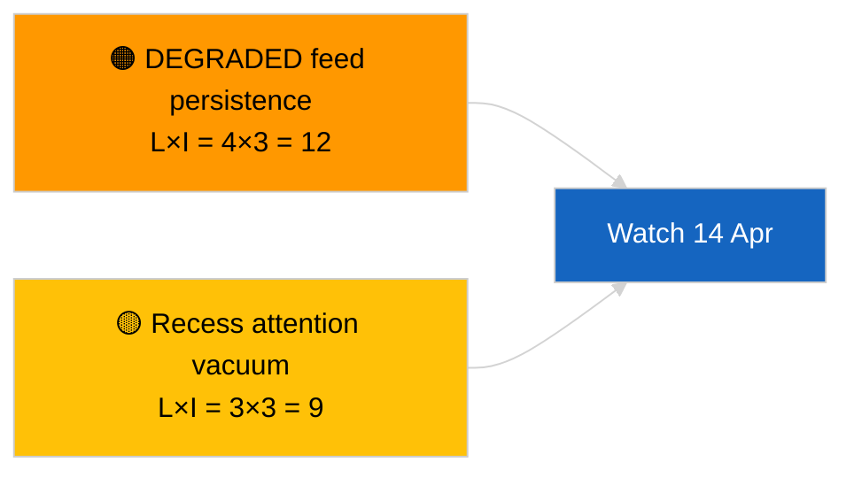

<!-- SPDX-FileCopyrightText: 2026 Hack23 AB -->
<!-- SPDX-License-Identifier: Apache-2.0 -->

# 집행 브리핑 — 속보 (교차 회기 업데이트) | 2026-04-05

**분류:** OSINT | 공개 의회 기록
**신뢰도:** 🟢 높음 (회기 휴회 중 구조적 평가)
**생성일:** 2026-04-05T00:00:00Z (소급 요약)
**기사 유형:** Breaking — Cross-Session Update
**출처:** 유럽 의회 오픈 데이터 포털

---

## 🎯 BLUF

**2026-04-05 교차 회기 정보 업데이트; 유럽 의회 휴회 18일 중 10일째 — 보고할 새로운 의회 활동 없음.** 오늘의 두 번째 실행은 휴회 주간 전반에 걸쳐 전날의 분석 결과를 통합하여 오전 기준선을 확장한다. 새로운 행위자, 새로운 절차, 새로운 채택 텍스트 없음. 2026-04-03 / 04-04의 실질적 내용 변화 없음: API 피드 성능 저하 상태, 유럽국민당 38 % 구조적 지배, Renew–ECR 0.95 결속 신호, 반부패 개혁 클러스터 유지. **🟢 높은 신뢰도**로 휴회 상태 지속성 확인.

---

## 🧭 이 브리핑이 지원하는 3가지 의사결정

| # | 결정 | 의사결정자 | 기한 | 근거 |
|:-:|-----|----------|:----:|------|
| 1 | **편집:** 일일 건너뜀; 오전 실행과 통합 | 편집자 | +12h | 동일 신호 세트 |
| 2 | **모니터링:** 일일 엔드포인트 점검 계속 | 데이터 파이프라인 | 매일 | 성능 저하 상태 |
| 3 | **선제 관찰:** 휴회 중반 전략적 종합 (자매 `breaking-3`) | 분석 책임자 | +6h | 당일 분석 심도 |

---

## 📰 60초 읽기

- 🔴 **오늘 유럽 의회 신규 활동 없음.** (🟢 높음)
- 🟠 **교차 회기 연속성** — 2026-04-04 및 2026-04-03의 실질적 결과 인계. (🟢 높음)
- 🟢 **성능 저하 API 상태 상속.** (🟢 높음)
- 🟡 **연립 계산 안정.** (🟢 높음)
- 🔵 **경제 맥락 변화 없음.** (🟢 높음)
- 🟣 **교차 참조:** 자매 `breaking-3` 12시간 종단 분석으로 심화. (🟢 높음)
- 🩷 **혼란 벡터:** 긴급사항 없음. (🟢 높음)
- ⚪ **진행:** 휴회 종료까지 8일 남음.

---

## 🗂️ 상위 문서 / 절차 테이블

| 순위 | EP 참조 | 제목 (요약) | 중요도 | 신뢰도 |
|:---:|--------|------------|:------:|:------:|
| 1 | — | 새로운 절차 또는 채택 텍스트 없음 | 0.0 | 🟢 높음 |
| 2 | TA-10-2026-0094 | 반부패 (이월) | 9.0 | 🟢 높음 |
| 3 | TA-10-2026-0088 | Braun 면책 특권 (이월) | 7.0 | 🟢 높음 |

---

## ⚠️ 위험 및 위협 스냅샷

| 위험 | L | I | 점수 | 트리거 | 출처 | Admiralty |
|-----|:-:|:-:|:---:|-------|------|:---------:|
| 성능 저하 피드 지속성 | 4 | 3 | 12 | 4월 14일 이후 | 2026-04-03/breaking-2 | A1 |
| 휴회 중 관심 공백 | 3 | 3 | 9 | 미국 또는 폴란드의 예상치 못한 사건 | EP 캘린더 | A2 |

---

## 🔮 최상위 미래 트리거

**유럽 집행위원회 화요일 2026년 4월 7일** 및 **4월 13일 휴회 종료**.

---

## 🛡️ 출처 품질 평가

- **주요 출처:** 이월 Q1 인벤토리; 교차 회기 기억.
- **신뢰도:** 🟢 높음.

---

## 📎 링크

| 링크 | 경로 |
|------|------|
| 기사 | `./article.md` |
| 자매 실행 | `analysis/daily/2026-04-05/breaking/`, `breaking-3/` |
| 매니페스트 | `./manifest.json` |

---

**문서 관리**
- **템플릿:** `/analysis/templates/executive-brief.md`
- **산출물 경로:** `analysis/daily/2026-04-05/breaking-2/executive-brief.md`
- **분류:** 공개
- **소급 생성:** 백필 세션.
