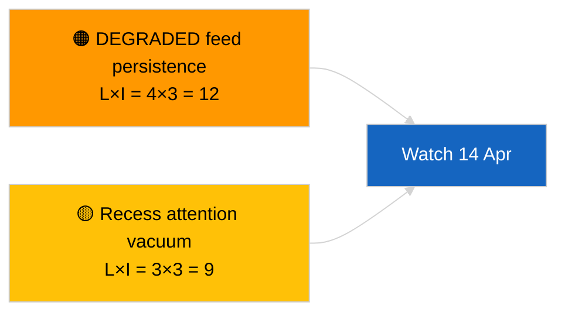

<!-- SPDX-FileCopyrightText: 2026 Hack23 AB -->
<!-- SPDX-License-Identifier: Apache-2.0 -->

# Uitvoerend Rapport — Nieuwsflits (Sessieoverschrijdende Update) | 2026-04-05

**Classificatie:** OSINT | Openbaar parlementair register
**Betrouwbaarheid:** 🟢 Hoog (structurele beoordeling tijdens recessperiode)
**Gegenereerd:** 2026-04-05T00:00:00Z (retrospectieve samenvatting)
**Artikeltype:** Breaking — Cross-Session Update
**Bron:** Open Data Portal van het Europees Parlement

---

## 🎯 BLUF

**Sessieoverschrijdende inlichtingenupdate van 2026-04-05; EP-reces dag 10 van 18 — geen nieuwe parlementaire activiteit te melden.** Deze tweede uitvoering van de dag breidt de ochtendbasislijn uit door analytische resultaten van de vorige dag te integreren over de recessweek. Geen nieuwe actoren, geen nieuwe procedures, geen nieuwe aangenomen teksten. Substantiële inhoud uit de substantiële uitvoeringen 2026-04-03 / 04-04 ongewijzigd: API-feed in GEDEGRADEERDE toestand, EVP 38 % structurele dominantie, Renew–ECR 0,95 cohesiesignaal, anticorruptiehervormdingscluster. **🟢 HOGE betrouwbaarheid** over continuïteit van de recessstatus.

---

## 🧭 3 Beslissingen Die Dit Rapport Ondersteunt

| # | Beslissing | Wie beslist | Deadline | Bewijs |
|:-:|-----------|------------|:--------:|--------|
| 1 | **Redactioneel:** OVERSLAAN dagelijks; consolideren met ochtenduitvoering | Redacteur | +12u | Zelfde signaalset |
| 2 | **Bewaking:** dagelijkse eindpuntcontroles voortzetten | Datapijplijn | dagelijks | GEDEGRADEERDE toestand |
| 3 | **Vooruitziende observatie:** strategische synthese halverwege het reces (zuster `breaking-3`) | Analysehoofd | +6u | Analytische diepgang zelfde dag |

---

## 📰 60-Second Read

- 🔴 **Geen nieuwe EP-activiteit** vandaag. (🟢 Hoog)
- 🟠 **Sessieoverschrijdende continuïteit** met substantiële bevindingen van 2026-04-04 en 2026-04-03. (🟢 Hoog)
- 🟢 **GEDEGRADEERDE API-status geërfd.** (🟢 Hoog)
- 🟡 **Coalitie-aritmetica stabiel.** (🟢 Hoog)
- 🔵 **Economische context ongewijzigd.** (🟢 Hoog)
- 🟣 **Kruisverwijzing:** zuster `breaking-3` wordt uitgediept met 12-uur longitudinale synthese. (🟢 Hoog)
- 🩷 **Verstorende vectoren:** geen acute. (🟢 Hoog)
- ⚪ **Voortgang:** 8 dagen tot het einde van het reces.

---

## 🗂️ Toprangorde Documenten / Procedureoverzicht

| Rang | EP-referentie | Titel (kort) | Belang | Betrouwbaarheid |
|:----:|-------------|--------------|:------:|:---------------:|
| 1 | — | Geen nieuwe procedures of aangenomen teksten | 0,0 | 🟢 HOOG |
| 2 | TA-10-2026-0094 | Anticorruptie (overgedragen) | 9,0 | 🟢 HOOG |
| 3 | TA-10-2026-0088 | Braun-immuniteit (overgedragen) | 7,0 | 🟢 HOOG |

---

## ⚠️ Risico- en Dreigingsoverzicht

| Risico | L | I | Score | Trigger | Bron | Admiralty |
|--------|:-:|:-:|:-----:|---------|------|:---------:|
| GEDEGRADEERDE feedpersistentie | 4 | 3 | 12 | Na 14 april | 2026-04-03/breaking-2 | A1 |
| Aandachtsvacuüm tijdens reces | 3 | 3 | 9 | Verrassing uit VS of Polen | EP-kalender | A2 |

---

## 🔮 Belangrijkste Toekomstige Trigger

**Commissiedinsdag 7 april 2026** en **recesseinde 13 april**.

---

## 🛡️ Beoordeling Bronnenkwaliteit

- **Primaire bronnen:** Overgedragen Q1-inventaris; sessieoverschrijdend geheugen.
- **Betrouwbaarheid:** 🟢 HOOG.

---

## 📎 Links

| Link | Pad |
|------|-----|
| Artikel | `./article.md` |
| Zusteruitvoeringen | `analysis/daily/2026-04-05/breaking/`, `breaking-3/` |
| Manifest | `./manifest.json` |

---

**Documentbeheer**
- **Sjabloon:** `/analysis/templates/executive-brief.md`
- **Artefactpad:** `analysis/daily/2026-04-05/breaking-2/executive-brief.md`
- **Classificatie:** Openbaar
- **Retroactieve aanmaak:** Terugvul-sessie.
