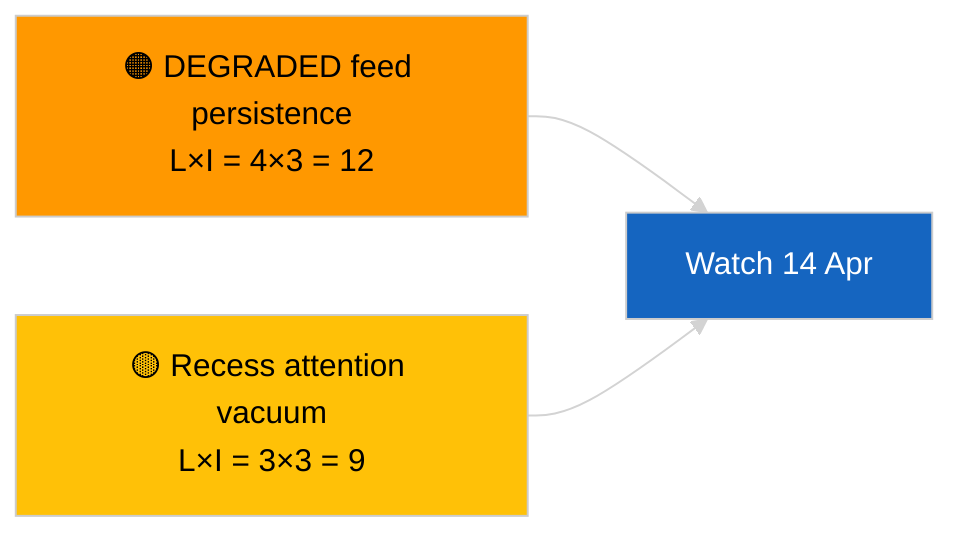

<!-- SPDX-FileCopyrightText: 2026 Hack23 AB -->
<!-- SPDX-License-Identifier: Apache-2.0 -->

# Eksekutiv kortrapport — Siste nytt (Krysssesjon-oppdatering) | 2026-04-05

**Klassifisering:** OSINT | Offentlig parlamentarisk opptegnelse
**Konfidens:** 🟢 Høy (strukturell vurdering i resesseperiode)
**Generert:** 2026-04-05T00:00:00Z (retrospektiv rapport)
**Artikkeltype:** Breaking — Cross-Session Update
**Kilde:** Europaparlamentets Open Data Portal

---

## 🎯 BLUF

**Krysssesjon etterretningsoppdatering den 2026-04-05; EP-resess dag 10 av 18 — ingen ny parlamentarisk aktivitet å rapportere.** Denne andre kjøringen for dagen utvider morgenbaslinjen ved å integrere analytiske utdata fra foregående dag gjennom resessuken. Ingen nye aktører, ingen nye prosedyrer, ingen ny vedtatte tekster. Substansielt innhold fra de substansielle kjøringene 2026-04-03 / 04-04 uendret: API-feed i DEGRADERT tilstand, PPE 38 % strukturell dominans, Renew–ECR 0,95 kohesjonssignal, antikorrupsjonsreformklynge. **🟢 HØY konfidens** om kontinuitet i resesstilstand.

---

## 🧭 3 Beslutninger Denne Rapporten Støtter

| # | Beslutning | Hvem beslutter | Frist | Bevis |
|:-:|-----------|----------------|:-----:|-------|
| 1 | **Redaksjonelt:** HOPP OVER daglig; konsolider med morgenkjøring | Redaktør | +12h | Samme signalsett |
| 2 | **Overvåkning:** fortsett daglige endepunktssonderinger | Datapipeline | daglig | DEGRADERT tilstand |
| 3 | **Fremoverrettet observasjon:** strategisk syntese midt i resessen (søsken `breaking-3`) | Analyseleder | +6h | Analytisk dybde samme dag |

---

## 📰 60-Second Read

- 🔴 **Ingen ny EP-aktivitet** i dag. (🟢 Høy)
- 🟠 **Kryssesjonskontinuitet** med substansielle funn fra 2026-04-04 og 2026-04-03. (🟢 Høy)
- 🟢 **DEGRADERT API-tilstand arvet.** (🟢 Høy)
- 🟡 **Koalisjonsaritmetikk stabil.** (🟢 Høy)
- 🔵 **Økonomisk kontekst uendret.** (🟢 Høy)
- 🟣 **Kryssreferanse:** søsken `breaking-3` fordypes med 12-timers longitudinal syntese. (🟢 Høy)
- 🩷 **Forstyrrende vektorer:** ingen akutte. (🟢 Høy)
- ⚪ **Fremdrift:** 8 dager til resessens slutt.

---

## 🗂️ Topp rangerte dokumenter / Prosedyretabell

| Rang | EP-referanse | Tittel (kort) | Signifikans | Konfidens |
|:----:|-------------|---------------|:-----------:|:---------:|
| 1 | — | Ingen nye prosedyrer eller vedtatte tekster | 0,0 | 🟢 HØY |
| 2 | TA-10-2026-0094 | Antikorrupsjon (videreført) | 9,0 | 🟢 HØY |
| 3 | TA-10-2026-0088 | Braun-immunitet (videreført) | 7,0 | 🟢 HØY |

---

## ⚠️ Risiko- og Trusselbilde

| Risiko | L | I | Score | Utløser | Kilde | Admiralty |
|--------|:-:|:-:|:-----:|---------|-------|:---------:|
| DEGRADERT feed-persistens | 4 | 3 | 12 | Etter 14. april | 2026-04-03/breaking-2 | A1 |
| Oppmerksomhetsvakuum under resess | 3 | 3 | 9 | Overraskelse fra USA eller Polen | EP-kalender | A2 |

---

## 🔮 Topp Fremover-Utløser

**Kommisjonens tirsdag den 7. april 2026** og **resessens slutt den 13. april**.

---

## 🛡️ Kildekvalitetsvurdering

- **Primære kilder:** Videreført Q1-inventar; kryssesjonbasert minne.
- **Konfidens:** 🟢 HØY.

---

## 📎 Lenker

| Lenke | Sti |
|-------|-----|
| Artikkel | `./article.md` |
| Søskenkjøringer | `analysis/daily/2026-04-05/breaking/`, `breaking-3/` |
| Manifest | `./manifest.json` |

---

**Dokumentkontroll**
- **Mal:** `/analysis/templates/executive-brief.md`
- **Artefaktsti:** `analysis/daily/2026-04-05/breaking-2/executive-brief.md`
- **Klassifisering:** Offentlig
- **Retrospektiv generering:** Backfill-sesjon.
