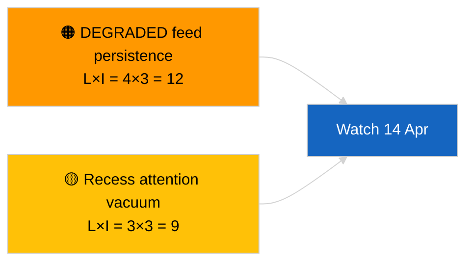

<!-- SPDX-FileCopyrightText: 2026 Hack23 AB -->
<!-- SPDX-License-Identifier: Apache-2.0 -->

# Exekutiv sammanfattning — Snabbnyhet (korsessionell uppdatering) | 2026-04-05

**Klassificering:** OSINT | Offentligt parlamentariskt protokoll
**Konfidens:** 🟢 Hög (strukturell bedömning under riksdagens recess)
**Genererad:** 2026-04-05T00:00:00Z (retroaktiv sammanfattning)
**Artikeltyp:** Breaking — Cross-Session Update
**Källa:** Europaparlamentets öppna dataportal

---

## 🎯 BLUF

**Korsessionell underrättelseoppdatering den 2026-04-05; EP-recess dag 10 av 18 — ingen ny parlamentarisk aktivitet att rapportera.** Denna andra körning för dagen utvidgar morgonbaslinjen genom att integrera analytiska utdata från föregående dag över recesenveckan. Inga nya aktörer, inga nya förfaranden, inga nya antagna texter. Materiellt innehåll från de substantiella körningarna 2026-04-03 / 04-04 oförändrat: API-feed i DEGRADERAT tillstånd, PPE 38 % strukturell dominans, Renew–ECR 0,95 kohesionssignal, antikorruptionsreformkluster. **🟢 HÖG konfidens** om kontinuitet i recessens tillstånd.

---

## 🧭 3 Beslut som denna sammanfattning stödjer

| # | Beslut | Vem beslutar | Deadline | Bevis |
|:-:|--------|-------------|:--------:|-------|
| 1 | **Redaktionellt:** HOPPA ÖVER daglig; konsolidera med morgonkörning | Redaktör | +12h | Samma signaluppsättning |
| 2 | **Övervakning:** fortsätt dagliga ändpunktssonder | Datapipeline | dagligen | DEGRADERAT tillstånd |
| 3 | **Framåtbevakning:** strategisk syntes mitt i recessen (syskon `breaking-3`) | Analysledare | +6h | Analytiskt djup samma dag |

---

## 📰 60-Second Read

- 🔴 **Ingen ny EP-aktivitet** idag. (🟢 Hög)
- 🟠 **Korsessionell kontinuitet** med substantiella fynd från 2026-04-04 och 2026-04-03. (🟢 Hög)
- 🟢 **DEGRADERAT API-tillstånd ärvt.** (🟢 Hög)
- 🟡 **Koalitionsaritmetik stabil.** (🟢 Hög)
- 🔵 **Ekonomisk kontext oförändrad.** (🟢 Hög)
- 🟣 **Korsreferens:** syskon `breaking-3` fördjupas med 12-timmars longitudinell syntes. (🟢 Hög)
- 🩷 **Störningsvektorer:** inga akuta. (🟢 Hög)
- ⚪ **Överföring:** 8 dagar till recessens slut.

---

## 🗂️ Topplistade dokument / procedurtabell

| Rang | EP-referens | Titel (kort) | Betydelse | Konfidens |
|:----:|------------|--------------|:---------:|:---------:|
| 1 | — | Inga nya förfaranden eller antagna texter | 0,0 | 🟢 HÖG |
| 2 | TA-10-2026-0094 | Antikorruption (överförd) | 9,0 | 🟢 HÖG |
| 3 | TA-10-2026-0088 | Brauns immunitet (överförd) | 7,0 | 🟢 HÖG |

---

## ⚠️ Risk- och hotbild

| Risk | L | I | Poäng | Utlösare | Källa | Admiralty |
|------|:-:|:-:|:-----:|---------|-------|:---------:|
| DEGRADERAT feed-uthållighet | 4 | 3 | 12 | Förbi 14 april | 2026-04-03/breaking-2 | A1 |
| Uppmärksamhetsvakuum under recess | 3 | 3 | 9 | Överraskning från USA eller Polen | EP-kalender | A2 |

---

## 🔮 Topp framåtutlösare

**Kommissionens tisdag den 7 april 2026** och **recessens slut den 13 april**.

---

## 🛡️ Källkvalitetsbedömning

- **Primära källor:** Överförda Q1-inventarier; korsessionellt minne.
- **Konfidens:** 🟢 HÖG.

---

## 📎 Länkar

| Länk | Sökväg |
|------|--------|
| Artikel | `./article.md` |
| Syskonkörningar | `analysis/daily/2026-04-05/breaking/`, `breaking-3/` |
| Manifest | `./manifest.json` |

---

**Dokumentkontroll**
- **Mall:** `/analysis/templates/executive-brief.md`
- **Artefaktsökväg:** `analysis/daily/2026-04-05/breaking-2/executive-brief.md`
- **Klassificering:** Offentlig
- **Retroaktiv generering:** Backfill-session.
