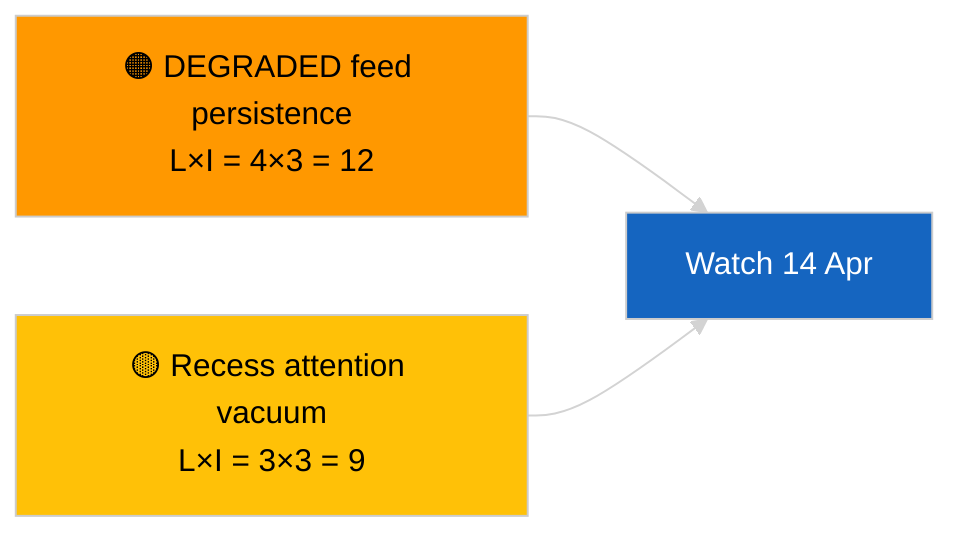

<!-- SPDX-FileCopyrightText: 2026 Hack23 AB -->
<!-- SPDX-License-Identifier: Apache-2.0 -->

# 执行摘要 — 快讯（跨届次更新）| 2026-04-05

**分级：** 公开情报 | 公开议会档案
**置信度：** 🟢 高（休会期结构性评估）
**生成时间：** 2026-04-05T00:00:00Z（追溯摘要）
**文章类型：** Breaking — Cross-Session Update
**来源：** 欧洲议会开放数据门户

---

## 🎯 BLUF

**2026-04-05 跨届次情报更新；欧洲议会休会第10天（共18天）— 无新议会活动可报告。** 今日第二次运行通过整合休会周前一日的分析输出，扩展上午基线。无新行为体、无新程序、无新采纳文本。2026-04-03 / 04-04 主要运行的实质内容未变：API 数据流处于降级状态，欧洲人民党38%结构性主导，更新–欧洲保守改革联盟凝聚力信号0.95，反腐改革集群持续。**🟢 高置信度**确认休会状态连续性。

---

## 🧭 本简报支持的三项决策

| # | 决策 | 决策者 | 截止时间 | 证据 |
|:-:|-----|-------|:-------:|------|
| 1 | **编辑：** 跳过日报；与晨间运行合并 | 编辑 | +12h | 相同信号集 |
| 2 | **监控：** 继续每日端点探测 | 数据管道 | 每日 | 降级状态 |
| 3 | **前瞻观察：** 休会中期战略综合（姊妹 `breaking-3`） | 分析负责人 | +6h | 同日分析深度 |

---

## 📰 六十秒阅读

- 🔴 **今日无欧洲议会新活动。**（🟢 高）
- 🟠 **跨届次连续性**：延续 2026-04-04 及 2026-04-03 的实质性发现。（🟢 高）
- 🟢 **降级 API 状态已继承。**（🟢 高）
- 🟡 **联合计算稳定。**（🟢 高）
- 🔵 **经济背景无变化。**（🟢 高）
- 🟣 **交叉引用：** 姊妹 `breaking-3` 以12小时纵向综合深化。（🟢 高）
- 🩷 **干扰向量：** 无急迫情况。（🟢 高）
- ⚪ **进度：** 距休会结束还有8天。

---

## 🗂️ 顶级文件／程序表格

| 排名 | 欧洲议会参考 | 标题（简短） | 重要性 | 置信度 |
|:---:|----------|------------|:------:|:------:|
| 1 | — | 无新程序或采纳文本 | 0.0 | 🟢 高 |
| 2 | TA-10-2026-0094 | 反腐（延续） | 9.0 | 🟢 高 |
| 3 | TA-10-2026-0088 | 布劳恩豁免权（延续） | 7.0 | 🟢 高 |

---

## ⚠️ 风险与威胁快照

| 风险 | L | I | 得分 | 触发因素 | 来源 | Admiralty |
|-----|:-:|:-:|:---:|--------|------|:---------:|
| 降级数据流持续存在 | 4 | 3 | 12 | 4月14日之后 | 2026-04-03/breaking-2 | A1 |
| 休会期注意力真空 | 3 | 3 | 9 | 美国或波兰的意外事件 | 欧洲议会日历 | A2 |

---

## 🔮 首要前瞻触发因素

**欧盟委员会星期二，2026年4月7日**及**休会结束，4月13日**。

---

## 🛡️ 来源质量评估

- **主要来源：** 延续Q1清单；跨届次记忆。
- **置信度：** 🟢 高。

---

## 📎 链接

| 链接 | 路径 |
|------|------|
| 文章 | `./article.md` |
| 姊妹运行 | `analysis/daily/2026-04-05/breaking/`、`breaking-3/` |
| 清单 | `./manifest.json` |

---

**文档管控**
- **模板：** `/analysis/templates/executive-brief.md`
- **制品路径：** `analysis/daily/2026-04-05/breaking-2/executive-brief.md`
- **分级：** 公开
- **追溯生成：** 回填会话。
