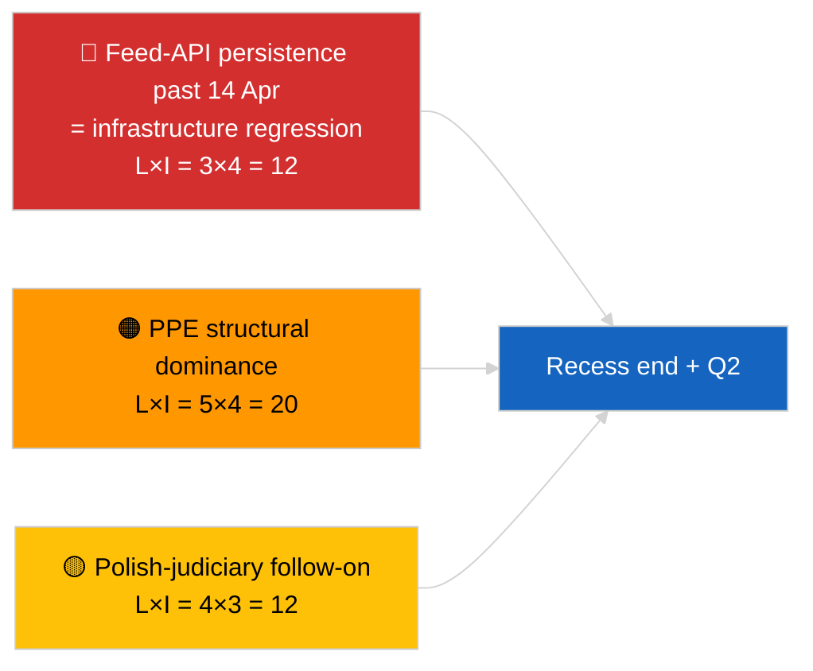

<!-- SPDX-FileCopyrightText: 2026 Hack23 AB -->
<!-- SPDX-License-Identifier: Apache-2.0 -->

# Executive Brief — Breaking (Mid-Recess Strategic Synthesis) | 2026-04-05

**Classification:** OSINT | Public Parliamentary Record
**Confidence:** 🟢 High (mid-recess 12-hour longitudinal synthesis)
**Generated:** 2026-04-05T00:00:00Z (retrospective brief)
**Article Type:** Breaking — Mid-Recess Strategic Intelligence Brief (12-Hour Longitudinal Synthesis)
**Source:** European Parliament Open Data Portal

---

## 🎯 BLUF

**Mid-recess strategic synthesis (Day 10 of 18) confirms three persistent intelligence themes carrying into Q2 2026.** First, the EP feed-API DEGRADED state is now in its 3rd consecutive day with no observable upstream restoration — the recess-correlation hypothesis still preferred. Second, the coalition arithmetic of EP10 has stabilised at PPE 38% structural dominance with the Renew–ECR cohesion signal (~0.95) holding day-over-day. Third, the anti-corruption + Braun + Better Law-Making + public-access reform cluster from late-March remains the principal Q1 institutional-credibility output. The exact-midpoint timing (9 of 18 elapsed) is a natural inflection point for forward planning. **🟢 HIGH confidence** on the longitudinal pattern stability; **🟡 MEDIUM confidence** on the recess-end restoration prediction for the feed API.

---

## 🧭 3 Decisions This Brief Supports

| # | Decision | Who Decides | Deadline | Evidence |
|:-:|----------|-------------|:--------:|----------|
| 1 | **Editorial:** publish mid-recess strategic synthesis as longitudinal anchor | Editor | +24h | 12-hour longitudinal data + 3 themes |
| 2 | **Monitoring:** prepare for 14 April post-recess restoration test | Data pipeline | 2026-04-14 | Inflection-point planning |
| 3 | **Forward-watch:** 7 April Commission Tuesday tabling as next external trigger | Analysis lead | 2026-04-07 | First post-Easter institutional activity |

---

## 📰 60-Second Read

- 🔴 **Day 10 of 18 — exact midpoint of Easter recess** (27 March → 13 April 2026). (🟢 High)
- 🟠 **3 persistent themes** confirmed by 12-hour longitudinal synthesis: feed DEGRADED, coalition arithmetic stable, reform cluster carry-over. (🟢 High)
- 🟢 **No new EP activity today** (Sunday, recess). (🟢 High)
- 🟡 **Renew–ECR cohesion signal held day-over-day** at ~0.95 since 2026-04-03. (🟡 Medium)
- 🔵 **Economic context:** US-EU trade trajectory unchanged; IMF April WEO release window approaching. (🟢 High)
- 🟣 **Cross-reference:** sibling `breaking` and `breaking-2` provide morning baseline; this run synthesises across both. (🟢 High)
- 🩷 **Disruption vector:** Polish-judiciary follow-on remains the highest-probability April-plenary surprise. (🟡 Medium)
- ⚪ **Carry-forward:** Q2 plenary preparation begins 13 April.

---

## 🗂️ Top Findings — Mid-Recess Synthesis

| Rank | Finding | Source | Significance | Confidence |
|:----:|---------|--------|:------------:|:----------:|
| 1 | EP feed-API DEGRADED (3rd consecutive day) | 2026-04-03/breaking-2 baseline | 8.0 | 🟢 HIGH |
| 2 | Coalition arithmetic stable (PPE 38% / Renew–ECR 0.95) | 2026-04-03/breaking, 2026-04-04/breaking | 7.5 | 🟡 MEDIUM |
| 3 | Anti-corruption / reform cluster (carry-over) | 2026-04-03/breaking-3 | 9.0 | 🟢 HIGH |
| 4 | No new EP activity Day 10 of 18 | This run | 0.0 | 🟢 HIGH |

---

## ⚠️ Risk & Threat Snapshot

| Risk | L | I | Score | Trigger | Source | Admiralty |
|------|:-:|:-:|:-----:|---------|--------|:---------:|
| Feed-API regression (past 14 Apr) | 3 | 4 | 12 | No restoration | 2026-04-03/breaking-2 | A1 |
| PPE structural dominance | 5 | 4 | 20 | All majorities require PPE | Coalition arithmetic | A1 |
| Polish-judiciary follow-on | 4 | 3 | 12 | New investigation | TA-10-2026-0088 | A1 |
| Tier-1 transposition risk | 4 | 4 | 16 | National divergence | TA-10-2026-0094 | A1 |

---

## 🔮 Top Forward Trigger

**Recess end 13 April 2026 + first post-Easter Commission Tuesday 7 April.** This composite trigger window will determine whether the three persistent themes evolve (API restored, new actors emerge, reform implementation begins) or persist into Q2.

---

## 🛡️ Source Quality Assessment

- **Primary sources:** Carry-over from 2026-04-03 / 04-04 substantive runs; 12-hour longitudinal review of `breaking` and `breaking-2` morning siblings.
- **Confidence:** 🟢 HIGH on continuity claims; 🟡 MEDIUM on prediction-window framing.

---

## 📎 Links

| Link | Path |
|------|------|
| Article | `./article.md` |
| Sibling runs | `analysis/daily/2026-04-05/breaking/`, `breaking-2/` |
| Source — API probe | `analysis/daily/2026-04-03/breaking-2/` |
| Source — coalition baseline | `analysis/daily/2026-04-03/breaking/`, `analysis/daily/2026-04-04/breaking/` |
| Source — reform cluster | `analysis/daily/2026-04-03/breaking-3/` |
| Manifest | `./manifest.json` |

---

**Document Control**
- **Template:** `/analysis/templates/executive-brief.md`
- **Artifact path:** `analysis/daily/2026-04-05/breaking-3/executive-brief.md`
- **Classification:** Public
- **Retrospective generation:** Back-fill session.
