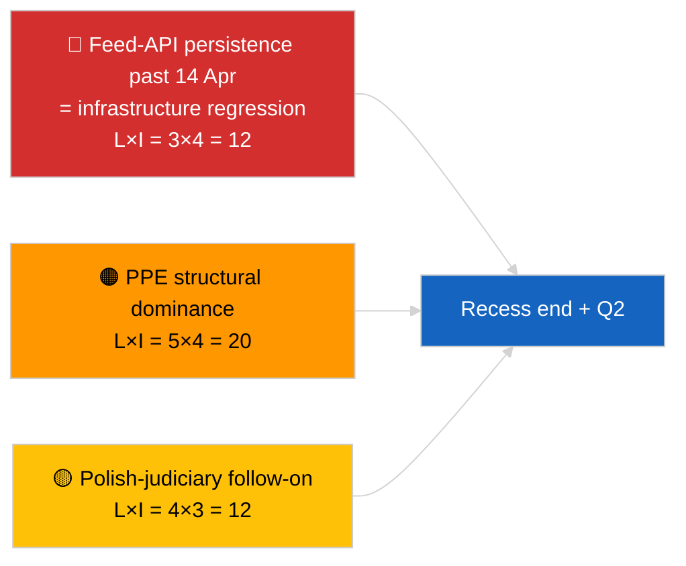

<!-- SPDX-FileCopyrightText: 2026 Hack23 AB -->
<!-- SPDX-License-Identifier: Apache-2.0 -->

# الملخص التنفيذي — عاجل (تحليل استراتيجي في منتصف الاستراحة) | 2026-04-05

**التصنيف:** OSINT | السجلات البرلمانية العامة
**مستوى الثقة:** 🟢 عالٍ (تحليل طولي لـ12 ساعة في منتصف الاستراحة)
**تاريخ الإنشاء:** 2026-04-05T00:00:00Z (تقرير استرجاعي)
**نوع المقالة:** عاجل — تقرير استخباراتي استراتيجي خلال الاستراحة (تحليل طولي لـ12 ساعة)
**المصدر:** البوابة المفتوحة للبيانات للبرلمان الأوروبي

---

## 🎯 BLUF

**يؤكد التحليل الاستراتيجي في منتصف الاستراحة (اليوم 10 من 18) ثلاثة موضوعات استخباراتية مستمرة تمتد إلى الربع الثاني من عام 2026.** أولاً، واجهة برمجة التطبيقات لتغذية البرلمان الأوروبي في حالة تدهور لليوم الثالث على التوالي دون استعادة ملحوظة من المصدر — تظل فرضية ارتباط الاستراحة هي المفضلة. ثانياً، استقرت حسابات التحالف في EP10 عند هيمنة PPE الهيكلية بنسبة 38% مع إشارة التماسك بين Renew–ECR (~0.95) التي تحافظ على مستواها يوماً بعد يوم. ثالثاً، يبقى مجموعة مكافحة الفساد + براون + التشريع الأفضل + إصلاح الوصول العام من أواخر مارس أبرز مخرجات المصداقية المؤسسية للربع الأول. يُعدّ التوقيت الدقيق للنقطة المتوسطة (9 من 18 قد مضت) نقطة انعطاف طبيعية للتخطيط المستقبلي. **🟢 ثقة عالية** في استقرار النمط الطولي؛ **🟡 ثقة متوسطة** في توقع استعادة واجهة برمجة التطبيقات للتغذية في نهاية الاستراحة.

---

## 🧭 3 قرارات يدعمها هذا الملخص

| # | القرار | صاحب القرار | الموعد النهائي | الأدلة |
|:-:|--------|------------|:--------------:|--------|
| 1 | **تحريري:** نشر التحليل الاستراتيجي لمنتصف الاستراحة كمرساة طولية | هيئة التحرير | +24 ساعة | بيانات طولية 12 ساعة + 3 موضوعات |
| 2 | **المراقبة:** التحضير لاختبار الاستعادة في 14 أبريل بعد الاستراحة | خط البيانات | 2026-04-14 | تخطيط نقطة الانعطاف |
| 3 | **الرصد المستقبلي:** جدول أعمال ثلاثاء المفوضية في 7 أبريل كمحفز خارجي قادم | رئيس التحليل | 2026-04-07 | أول نشاط مؤسسي بعد عيد الفصح |

---

## 📰 القراءة في 60 ثانية

- 🔴 **اليوم 10 من 18 — النقطة المتوسطة الدقيقة لاستراحة عيد الفصح** (27 مارس ← 13 أبريل 2026). (🟢 عالٍ)
- 🟠 **3 موضوعات مستمرة** تم تأكيدها بالتحليل الطولي لـ12 ساعة: التغذية متدهورة، حسابات التحالف مستقرة، مجموعة الإصلاح مستمرة. (🟢 عالٍ)
- 🟢 **لا نشاط جديد للبرلمان الأوروبي اليوم** (الأحد، استراحة). (🟢 عالٍ)
- 🟡 **إشارة تماسك Renew–ECR حافظت على مستواها يوماً بعد يوم** عند ~0.95 منذ 2026-04-03. (🟡 متوسط)
- 🔵 **السياق الاقتصادي:** مسار التجارة بين الولايات المتحدة والاتحاد الأوروبي دون تغيير؛ نافذة نشر IMF أبريل WEO تقترب. (🟢 عالٍ)
- 🟣 **الإسناد المتقاطع:** التقارير الشقيقة `breaking` و`breaking-2` توفر خط الأساس الصباحي؛ هذه الجلسة تجمع كليهما. (🟢 عالٍ)
- 🩷 **متجه الاضطراب:** المتابعة القضائية البولندية تبقى المفاجأة الأكثر احتمالاً في جلسة أبريل العامة. (🟡 متوسط)
- ⚪ **الاستمرار:** التحضير للجلسة العامة للربع الثاني يبدأ في 13 أبريل.

---

## 🗂️ أبرز النتائج — تحليل منتصف الاستراحة

| الترتيب | النتيجة | المصدر | الأهمية | الثقة |
|:-------:|---------|--------|:-------:|:-----:|
| 1 | واجهة برمجة التطبيقات للتغذية متدهورة (اليوم الثالث على التوالي) | خط أساس 2026-04-03/breaking-2 | 8.0 | 🟢 عالية |
| 2 | حسابات التحالف مستقرة (PPE 38% / Renew–ECR 0.95) | 2026-04-03/breaking, 2026-04-04/breaking | 7.5 | 🟡 متوسطة |
| 3 | مجموعة مكافحة الفساد / الإصلاح (مستمرة) | 2026-04-03/breaking-3 | 9.0 | 🟢 عالية |
| 4 | لا نشاط جديد للبرلمان الأوروبي في اليوم 10 من 18 | هذه الجلسة | 0.0 | 🟢 عالية |

---

## ⚠️ لمحة المخاطر والتهديدات

| المخاطرة | الاحتمال | التأثير | النقاط | المحفز | المصدر | الأميرالية |
|---------|:--------:|:-------:|:------:|--------|--------|:----------:|
| تراجع واجهة برمجة التطبيقات للتغذية (بعد 14 أبريل) | 3 | 4 | 12 | لا استعادة | 2026-04-03/breaking-2 | A1 |
| هيمنة PPE الهيكلية | 5 | 4 | 20 | جميع الأغلبيات تتطلب PPE | حسابات التحالف | A1 |
| المتابعة القضائية البولندية | 4 | 3 | 12 | تحقيق جديد | TA-10-2026-0088 | A1 |
| خطر النقل من المستوى الأول | 4 | 4 | 16 | التباعد الوطني | TA-10-2026-0094 | A1 |

---

## 🔮 المحفز المستقبلي الرئيسي

**نهاية الاستراحة في 13 أبريل 2026 + أول ثلاثاء للمفوضية بعد عيد الفصح في 7 أبريل.** ستحدد هذه النافذة المركبة للمحفزات ما إذا كانت الموضوعات الثلاثة المستمرة ستتطور (استعادة الواجهة، وظهور جهات فاعلة جديدة، وبدء تنفيذ الإصلاحات) أو تستمر في الربع الثاني.

---

## 🛡️ تقييم جودة المصادر

- **المصادر الأولية:** منقولة من جلسات 2026-04-03 / 04-04 الجوهرية؛ مراجعة طولية لـ12 ساعة للتقارير الشقيقة الصباحية `breaking` و`breaking-2`.
- **الثقة:** 🟢 عالية لادعاءات الاستمرارية؛ 🟡 متوسطة لإطار نافذة التنبؤ.

---

## 📎 الروابط

| الرابط | المسار |
|--------|--------|
| المقالة | `./article.md` |
| الجلسات الشقيقة | `analysis/daily/2026-04-05/breaking/`, `breaking-2/` |
| المصدر — مسبار الواجهة | `analysis/daily/2026-04-03/breaking-2/` |
| المصدر — خط أساس التحالف | `analysis/daily/2026-04-03/breaking/`, `analysis/daily/2026-04-04/breaking/` |
| المصدر — مجموعة الإصلاح | `analysis/daily/2026-04-03/breaking-3/` |
| البيان | `./manifest.json` |

---

**ضبط الوثيقة**
- **النموذج:** `/analysis/templates/executive-brief.md`
- **مسار الملف:** `analysis/daily/2026-04-05/breaking-3/executive-brief.md`
- **التصنيف:** عام
- **التوليد الاستراجعي:** جلسة ملء استرجاعي.
