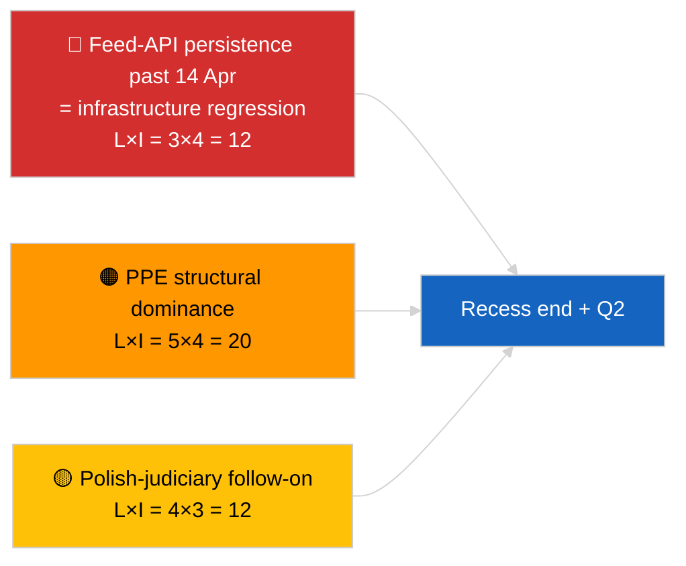

<!-- SPDX-FileCopyrightText: 2026 Hack23 AB -->
<!-- SPDX-License-Identifier: Apache-2.0 -->

# Eksekutivrapport — Breaking (Strategisk Midtpausesyntese) | 2026-04-05

**Klassifikation:** OSINT | Offentlige parlamentariske optegnelser
**Tillid:** 🟢 Høj (12-timers longitudinal midtpausesyntese)
**Genereret:** 2026-04-05T00:00:00Z (retrospektiv rapport)
**Artikeltype:** Breaking — Strategisk efterretningsrapport under midtpause (12-timers longitudinal syntese)
**Kilde:** Det Europæiske Parlaments åbne dataportal

---

## 🎯 BLUF

**Strategisk syntese ved midtpause (dag 10 af 18) bekræfter tre vedvarende efterretningstemaer ind i 2. kvartal 2026.** For det første er EP-feed-API FORRINGET i sin 3. dag i træk uden observerbar opstrømsgenoprettelse — hypotesen om pausekorrelation foretrækkes stadig. For det andet er koalitionsaritmetikken for EP10 stabiliseret ved PPE's 38% strukturelle dominans med Renew–ECR-kohærenssignalet (~0,95) der holder dag-for-dag. For det tredje er anti-korruption + Braun + Bedre lovgivning + offentlig adgangsreformklustret fra slutningen af marts fortsat det vigtigste institutionelle troværdighedsoutput for 1. kvartal. Den nøjagtige midtpunktstiming (9 af 18 forløbet) er et naturligt vendepunkt for fremtidsplanlægning. **🟢 HØJ tillid** til longitudinal mønsterstabilitet; **🟡 MIDDEL tillid** til forudsigelse om feed-API-genoprettelse ved pauseslut.

---

## 🧭 3 Beslutninger Dette Dokument Understøtter

| # | Beslutning | Beslutningstager | Frist | Dokumentation |
|:-:|------------|-----------------|:-----:|---------------|
| 1 | **Redaktionelt:** publicer strategisk midtpausesyntese som longitudinelt anker | Redaktør | +24t | 12-timers longitudinal data + 3 temaer |
| 2 | **Overvågning:** forbered til 14. april genoprettelsestest efter pause | Datapipeline | 2026-04-14 | Vendepunktsplanlægning |
| 3 | **Fremadskuende:** 7. april Kommissionens tirsdagsagenda som næste eksterne udløser | Analyseansvarlig | 2026-04-07 | Første institutionelle aktivitet efter påske |

---

## 📰 60-Sekunders Læsning

- 🔴 **Dag 10 af 18 — nøjagtigt midtpunkt af påskepausen** (27. marts → 13. april 2026). (🟢 Høj)
- 🟠 **3 vedvarende temaer** bekræftet af 12-timers longitudinal syntese: feed FORRINGET, koalitionsaritmetik stabil, reformkluster videreføres. (🟢 Høj)
- 🟢 **Ingen ny EP-aktivitet i dag** (søndag, pause). (🟢 Høj)
- 🟡 **Renew–ECR-kohærenssignal holdt dag-for-dag** ved ~0,95 siden 2026-04-03. (🟡 Middel)
- 🔵 **Økonomisk kontekst:** USA–EU-handelsbane uændret; IMF April WEO-udgivelsesvindue nærmer sig. (🟢 Høj)
- 🟣 **Krydsreference:** søskenrapporterne `breaking` og `breaking-2` giver morgenbasislinje; denne kørsel syntetiserer begge. (🟢 Høj)
- 🩷 **Forstyrrelsesvektorer:** Polsk-retsvæsen-opfølgning er fortsat den mest sandsynlige april-plenum-overraskelse. (🟡 Middel)
- ⚪ **Videreføres:** Forberedelse til 2. kvartal-plenum begynder 13. april.

---

## 🗂️ Topfund — Midtpausesyntese

| Rang | Fund | Kilde | Signifikans | Tillid |
|:----:|------|-------|:-----------:|:------:|
| 1 | EP feed-API FORRINGET (3. dag i træk) | 2026-04-03/breaking-2 baslinje | 8,0 | 🟢 HØJ |
| 2 | Koalitionsaritmetik stabil (PPE 38% / Renew–ECR 0,95) | 2026-04-03/breaking, 2026-04-04/breaking | 7,5 | 🟡 MIDDEL |
| 3 | Anti-korruption / reformkluster (videreføres) | 2026-04-03/breaking-3 | 9,0 | 🟢 HØJ |
| 4 | Ingen ny EP-aktivitet dag 10 af 18 | Denne kørsel | 0,0 | 🟢 HØJ |

---

## ⚠️ Risiko & Trusselsbillede

| Risiko | S | K | Score | Udløser | Kilde | Admiralitet |
|--------|:-:|:-:|:-----:|---------|-------|:-----------:|
| Feed-API-regression (efter 14. apr) | 3 | 4 | 12 | Ingen genoprettelse | 2026-04-03/breaking-2 | A1 |
| PPE strukturel dominans | 5 | 4 | 20 | Alle flertal kræver PPE | Koalitionsaritmetik | A1 |
| Polsk-retsvæsen-opfølgning | 4 | 3 | 12 | Ny undersøgelse | TA-10-2026-0088 | A1 |
| Niveau-1 transponeringsrisiko | 4 | 4 | 16 | National divergens | TA-10-2026-0094 | A1 |

---

## 🔮 Ledende Fremtidsudløser

**Pauseslut 13. april 2026 + første kommissionstirsdagen efter påske 7. april.** Dette sammensatte udløservindue vil afgøre, om de tre vedvarende temaer udvikler sig (API genoprettet, nye aktører fremtræder, reformimplementering begynder) eller fortsætter ind i 2. kvartal.

---

## 🛡️ Kildekvali tetsvurdering

- **Primære kilder:** Videreføres fra 2026-04-03 / 04-04 substantielle kørsler; 12-timers longitudinal gennemgang af `breaking` og `breaking-2` morgensøskener.
- **Tillid:** 🟢 HØJ for kontinuitetspåstande; 🟡 MIDDEL for forudsigelsesvinduesramme.

---

## 📎 Links

| Link | Sti |
|------|-----|
| Artikel | `./article.md` |
| Søskenkørsler | `analysis/daily/2026-04-05/breaking/`, `breaking-2/` |
| Kilde — API-sonde | `analysis/daily/2026-04-03/breaking-2/` |
| Kilde — koalitionsbaslinje | `analysis/daily/2026-04-03/breaking/`, `analysis/daily/2026-04-04/breaking/` |
| Kilde — reformkluster | `analysis/daily/2026-04-03/breaking-3/` |
| Manifest | `./manifest.json` |

---

**Dokumentkontrol**
- **Skabelon:** `/analysis/templates/executive-brief.md`
- **Artefaktsti:** `analysis/daily/2026-04-05/breaking-3/executive-brief.md`
- **Klassifikation:** Offentlig
- **Retrospektiv generering:** Baglæns-udfyldningssession.
