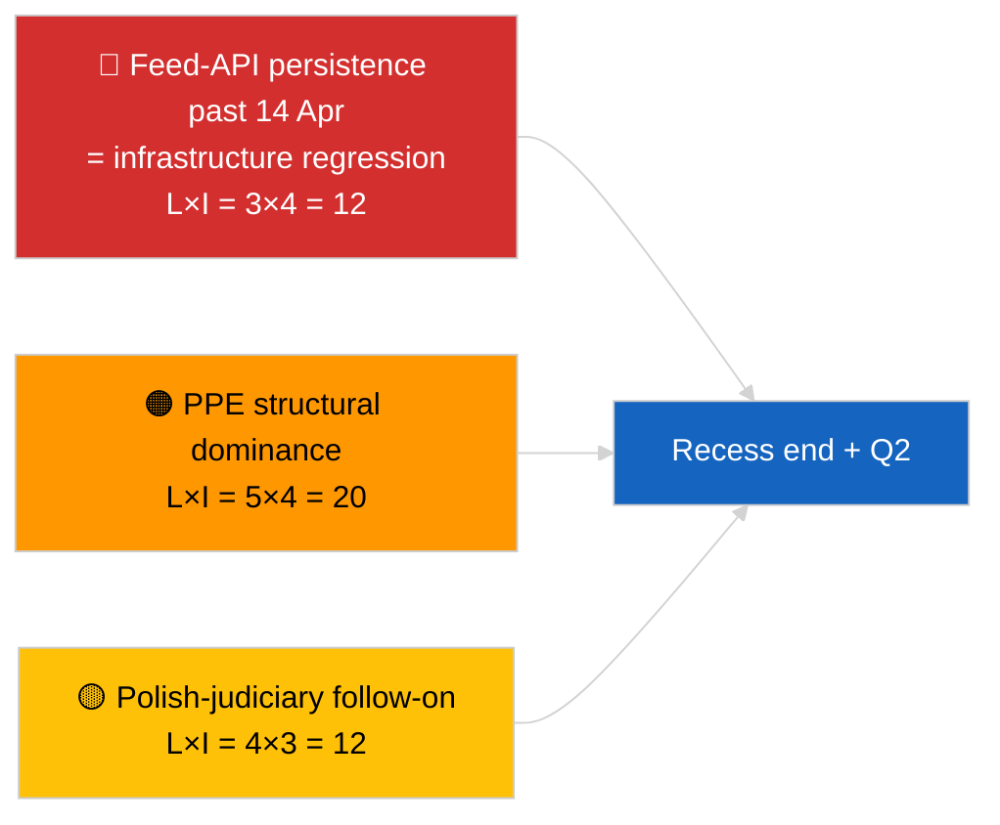

<!-- SPDX-FileCopyrightText: 2026 Hack23 AB -->
<!-- SPDX-License-Identifier: Apache-2.0 -->

# Kurzbericht — Breaking (Strategische Halbzeitpausensynthese) | 2026-04-05

**Klassifizierung:** OSINT | Öffentliche Parlamentsunterlagen
**Vertrauen:** 🟢 Hoch (12-stündige longitudinale Halbzeitpausensynthese)
**Erstellt:** 2026-04-05T00:00:00Z (retrospektiver Bericht)
**Artikeltyp:** Breaking — Strategischer Nachrichtenbericht während der Pause (12-stündige longitudinale Synthese)
**Quelle:** Offenes Datenportal des Europäischen Parlaments

---

## 🎯 BLUF

**Strategische Synthese zur Halbzeit der Pause (Tag 10 von 18) bestätigt drei anhaltende Nachrichtenthemen für Q2 2026.** Erstens ist die EP-Feed-API nun am 3. aufeinanderfolgenden Tag im DEGRADIERTEN Zustand ohne beobachtbare Wiederherstellung vorgelagert — die Pausenkorrelationshypothese wird weiterhin bevorzugt. Zweitens hat sich die Koalitionsarithmetik für EP10 bei PPE's 38%-struktureller Dominanz mit dem Renew–ECR-Kohärenzsignal (~0,95) stabilisiert, das sich Tag für Tag hält. Drittens bleibt das Antikorruptions- + Braun- + Bessere-Rechtsetzung- + Öffentlichkeitszugangsreformcluster vom Ende März der wichtigste institutionelle Glaubwürdigkeitsoutput für Q1. Der genaue Halbzeitpunkt (9 von 18 verstrichen) ist ein natürlicher Wendepunkt für die Zukunftsplanung. **🟢 HOHES Vertrauen** in die longitudinale Musterstabilität; **🟡 MITTLERES Vertrauen** in die Vorhersage der Feed-API-Wiederherstellung am Pausenende.

---

## 🧭 3 Entscheidungen, die dieser Bericht unterstützt

| # | Entscheidung | Entscheidungsträger | Frist | Belege |
|:-:|-------------|--------------------:|:----:|--------|
| 1 | **Redaktionell:** strategische Halbzeitpausensynthese als longitudinalen Anker veröffentlichen | Redaktion | +24h | 12-stündige longitudinale Daten + 3 Themen |
| 2 | **Überwachung:** Vorbereitung auf den 14. April Wiederherstellungstest nach der Pause | Datenpipeline | 2026-04-14 | Wendepunktplanung |
| 3 | **Vorausschau:** 7. April Kommissions-Dienstagagenda als nächster externer Auslöser | Analyseleitung | 2026-04-07 | Erste institutionelle Aktivität nach Ostern |

---

## 📰 60-Sekunden-Lektüre

- 🔴 **Tag 10 von 18 — genauer Mittelpunkt der Osterpause** (27. März → 13. April 2026). (🟢 Hoch)
- 🟠 **3 anhaltende Themen** durch 12-stündige longitudinale Synthese bestätigt: Feed DEGRADIERT, Koalitionsarithmetik stabil, Reformcluster carry-over. (🟢 Hoch)
- 🟢 **Keine neue EP-Aktivität heute** (Sonntag, Pause). (🟢 Hoch)
- 🟡 **Renew–ECR-Kohärenzsignal Tag für Tag gehalten** bei ~0,95 seit 2026-04-03. (🟡 Mittel)
- 🔵 **Wirtschaftlicher Kontext:** USA–EU-Handelsrichtung unverändert; IMF April WEO-Veröffentlichungsfenster nähert sich. (🟢 Hoch)
- 🟣 **Querverweise:** Geschwisterberichte `breaking` und `breaking-2` liefern die Morgenbasisline; dieser Lauf synthetisiert beide. (🟢 Hoch)
- 🩷 **Störungsvektor:** Polnische-Justiz-Nachfolge bleibt die wahrscheinlichste April-Plenum-Überraschung. (🟡 Mittel)
- ⚪ **Carry-forward:** Q2-Plenumsvorbereitung beginnt am 13. April.

---

## 🗂️ Wichtigste Erkenntnisse — Halbzeitpausensynthese

| Rang | Erkenntnis | Quelle | Bedeutung | Vertrauen |
|:----:|-----------|--------|:---------:|:---------:|
| 1 | EP Feed-API DEGRADIERT (3. aufeinanderfolgender Tag) | 2026-04-03/breaking-2 Basislinie | 8,0 | 🟢 HOCH |
| 2 | Koalitionsarithmetik stabil (PPE 38% / Renew–ECR 0,95) | 2026-04-03/breaking, 2026-04-04/breaking | 7,5 | 🟡 MITTEL |
| 3 | Antikorruptions- / Reformcluster (carry-over) | 2026-04-03/breaking-3 | 9,0 | 🟢 HOCH |
| 4 | Keine neue EP-Aktivität Tag 10 von 18 | Dieser Lauf | 0,0 | 🟢 HOCH |

---

## ⚠️ Risiko & Bedrohungsbild

| Risiko | W | A | Punktzahl | Auslöser | Quelle | Admiralität |
|--------|:-:|:-:|:---------:|---------|--------|:-----------:|
| Feed-API-Regression (nach 14. Apr) | 3 | 4 | 12 | Keine Wiederherstellung | 2026-04-03/breaking-2 | A1 |
| PPE strukturelle Dominanz | 5 | 4 | 20 | Alle Mehrheiten erfordern PPE | Koalitionsarithmetik | A1 |
| Polnische-Justiz-Nachfolge | 4 | 3 | 12 | Neue Untersuchung | TA-10-2026-0088 | A1 |
| Stufe-1-Transpositionsrisiko | 4 | 4 | 16 | Nationale Divergenz | TA-10-2026-0094 | A1 |

---

## 🔮 Führender Zukunftsauslöser

**Pausenende 13. April 2026 + erster Post-Oster-Kommissionsdienstag 7. April.** Dieses zusammengesetzte Auslösefenster wird bestimmen, ob sich die drei anhaltenden Themen weiterentwickeln (API wiederhergestellt, neue Akteure tauchen auf, Reformumsetzung beginnt) oder in Q2 fortbestehen.

---

## 🛡️ Quellenqualitätsbewertung

- **Primärquellen:** Carry-over von 2026-04-03 / 04-04 substanziellen Läufen; 12-stündige longitudinale Überprüfung der `breaking`- und `breaking-2`-Morgengeschwister.
- **Vertrauen:** 🟢 HOCH für Kontinuitätsaussagen; 🟡 MITTEL für Prognoserahmung.

---

## 📎 Links

| Link | Pfad |
|------|------|
| Artikel | `./article.md` |
| Geschwisterläufe | `analysis/daily/2026-04-05/breaking/`, `breaking-2/` |
| Quelle — API-Sonde | `analysis/daily/2026-04-03/breaking-2/` |
| Quelle — Koalitionsbasisline | `analysis/daily/2026-04-03/breaking/`, `analysis/daily/2026-04-04/breaking/` |
| Quelle — Reformcluster | `analysis/daily/2026-04-03/breaking-3/` |
| Manifest | `./manifest.json` |

---

**Dokumentkontrolle**
- **Vorlage:** `/analysis/templates/executive-brief.md`
- **Artefaktpfad:** `analysis/daily/2026-04-05/breaking-3/executive-brief.md`
- **Klassifizierung:** Öffentlich
- **Retrospektive Generierung:** Rückwärtsbefüllungssitzung.
