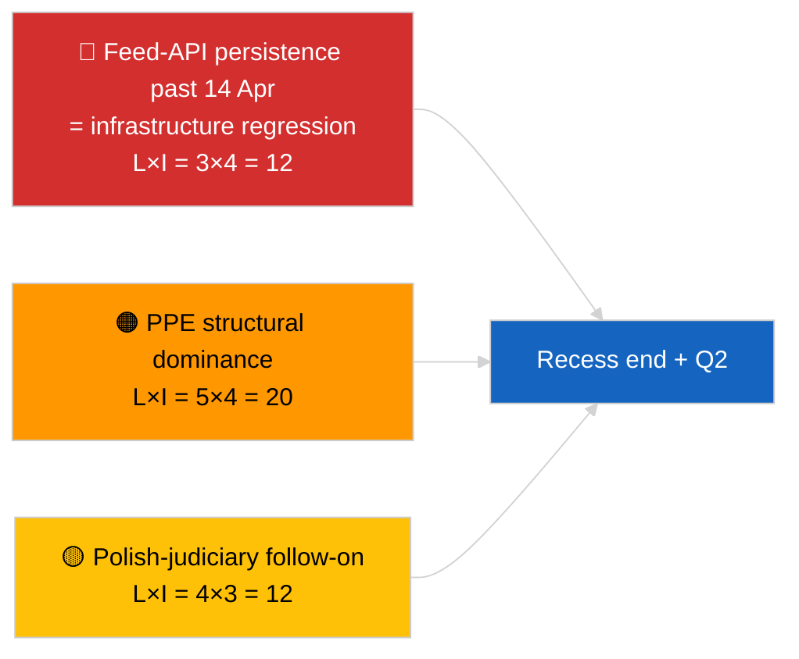

<!-- SPDX-FileCopyrightText: 2026 Hack23 AB -->
<!-- SPDX-License-Identifier: Apache-2.0 -->

# Nota Ejecutiva — Breaking (Síntesis Estratégica a Mitad del Receso) | 2026-04-05

**Clasificación:** OSINT | Registros parlamentarios públicos
**Confianza:** 🟢 Alta (síntesis longitudinal de 12 horas a mitad del receso)
**Generada:** 2026-04-05T00:00:00Z (nota retrospectiva)
**Tipo de artículo:** Breaking — Nota de inteligencia estratégica durante el receso (síntesis longitudinal de 12 horas)
**Fuente:** Portal de datos abiertos del Parlamento Europeo

---

## 🎯 BLUF

**La síntesis estratégica a mitad del receso (día 10 de 18) confirma tres temas de inteligencia persistentes que se proyectan en el T2 2026.** En primer lugar, la API de feed del PE lleva 3 días consecutivos en estado DEGRADADO sin restauración observable aguas arriba — la hipótesis de correlación con el receso sigue siendo la preferida. En segundo lugar, la aritmética de coalición de EP10 se ha estabilizado con la dominancia estructural del PPE al 38 % y la señal de cohesión Renew–ECR (~0,95) manteniéndose día a día. En tercer lugar, el clúster anticorrupción + Braun + mejor regulación + reforma de acceso público de finales de marzo sigue siendo el principal resultado de credibilidad institucional del T1. El momento exacto del punto medio (9 de 18 transcurridos) es un punto de inflexión natural para la planificación prospectiva. **🟢 ALTA confianza** en la estabilidad del patrón longitudinal; **🟡 MEDIA confianza** en la predicción de restauración de la API de feed al final del receso.

---

## 🧭 3 Decisiones que Apoya Esta Nota

| # | Decisión | Responsable | Plazo | Evidencia |
|:-:|----------|------------|:-----:|-----------|
| 1 | **Editorial:** publicar la síntesis estratégica a mitad del receso como ancla longitudinal | Redacción | +24h | Datos longitudinales 12h + 3 temas |
| 2 | **Monitoreo:** preparar la prueba de restauración del 14 de abril tras el receso | Pipeline de datos | 2026-04-14 | Planificación del punto de inflexión |
| 3 | **Vigilancia prospectiva:** agenda del martes de la Comisión del 7 de abril como próximo desencadenante externo | Jefe de análisis | 2026-04-07 | Primera actividad institucional post-Pascua |

---

## 📰 Lectura de 60 Segundos

- 🔴 **Día 10 de 18 — punto medio exacto del receso de Pascua** (27 de marzo → 13 de abril de 2026). (🟢 Alta)
- 🟠 **3 temas persistentes** confirmados por síntesis longitudinal de 12 horas: feed DEGRADADO, aritmética de coalición estable, clúster de reformas en carry-over. (🟢 Alta)
- 🟢 **Sin nueva actividad del PE hoy** (domingo, receso). (🟢 Alta)
- 🟡 **Señal de cohesión Renew–ECR mantenida día a día** en ~0,95 desde el 2026-04-03. (🟡 Media)
- 🔵 **Contexto económico:** trayectoria comercial USA–UE sin cambios; ventana de publicación del WEO de abril del IMF aproximándose. (🟢 Alta)
- 🟣 **Referencia cruzada:** los informes hermanos `breaking` y `breaking-2` proporcionan la línea base matutina; esta ejecución sintetiza ambos. (🟢 Alta)
- 🩷 **Vector de disrupción:** el seguimiento judicial polaco sigue siendo la sorpresa más probable del pleno de abril. (🟡 Media)
- ⚪ **Carry-forward:** la preparación del pleno T2 comienza el 13 de abril.

---

## 🗂️ Principales Hallazgos — Síntesis a Mitad del Receso

| Rango | Hallazgo | Fuente | Significancia | Confianza |
|:-----:|---------|--------|:------------:|:---------:|
| 1 | API de feed del PE DEGRADADA (3.er día consecutivo) | Línea base 2026-04-03/breaking-2 | 8,0 | 🟢 ALTA |
| 2 | Aritmética de coalición estable (PPE 38 % / Renew–ECR 0,95) | 2026-04-03/breaking, 2026-04-04/breaking | 7,5 | 🟡 MEDIA |
| 3 | Clúster anticorrupción / reformas (carry-over) | 2026-04-03/breaking-3 | 9,0 | 🟢 ALTA |
| 4 | Sin nueva actividad del PE día 10 de 18 | Esta ejecución | 0,0 | 🟢 ALTA |

---

## ⚠️ Riesgos y Amenazas

| Riesgo | V | I | Puntuación | Desencadenante | Fuente | Almirantazgo |
|--------|:-:|:-:|:----------:|--------------|--------|:------------:|
| Regresión API de feed (tras 14 abr) | 3 | 4 | 12 | Sin restauración | 2026-04-03/breaking-2 | A1 |
| Dominancia estructural PPE | 5 | 4 | 20 | Todas las mayorías requieren PPE | Aritmética de coalición | A1 |
| Seguimiento judicial polaco | 4 | 3 | 12 | Nueva investigación | TA-10-2026-0088 | A1 |
| Riesgo de transposición de nivel 1 | 4 | 4 | 16 | Divergencia nacional | TA-10-2026-0094 | A1 |

---

## 🔮 Principal Desencadenante Prospectivo

**Fin del receso el 13 de abril de 2026 + primer martes de la Comisión post-Pascua el 7 de abril.** Esta ventana de desencadenante compuesto determinará si los tres temas persistentes evolucionan (API restaurada, nuevos actores emergen, implementación de reformas comienza) o persisten en el T2.

---

## 🛡️ Evaluación de Calidad de las Fuentes

- **Fuentes primarias:** Carry-over de las ejecuciones sustantivas de 2026-04-03 / 04-04; revisión longitudinal de 12 horas de los informes hermanos matutinos `breaking` y `breaking-2`.
- **Confianza:** 🟢 ALTA para afirmaciones de continuidad; 🟡 MEDIA para el encuadre de la ventana de predicción.

---

## 📎 Enlaces

| Enlace | Ruta |
|--------|------|
| Artículo | `./article.md` |
| Ejecuciones hermanas | `analysis/daily/2026-04-05/breaking/`, `breaking-2/` |
| Fuente — sonda API | `analysis/daily/2026-04-03/breaking-2/` |
| Fuente — línea base de coalición | `analysis/daily/2026-04-03/breaking/`, `analysis/daily/2026-04-04/breaking/` |
| Fuente — clúster de reformas | `analysis/daily/2026-04-03/breaking-3/` |
| Manifiesto | `./manifest.json` |

---

**Control documental**
- **Plantilla:** `/analysis/templates/executive-brief.md`
- **Ruta del artefacto:** `analysis/daily/2026-04-05/breaking-3/executive-brief.md`
- **Clasificación:** Público
- **Generación retrospectiva:** Sesión de relleno retroactivo.
