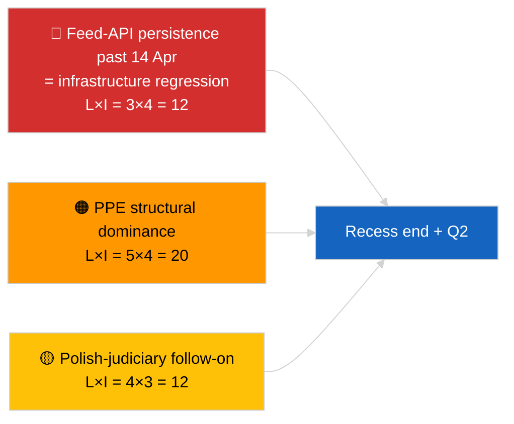

<!-- SPDX-FileCopyrightText: 2026 Hack23 AB -->
<!-- SPDX-License-Identifier: Apache-2.0 -->

# Toimeenpanevat Tiedot — Breaking (Strateginen Taukosynteesi) | 2026-04-05

**Luokittelu:** OSINT | Julkiset parlamenttiasiakirjat
**Luotettavuus:** 🟢 Korkea (12 tunnin longitudinaalinen taukosynteesi)
**Luotu:** 2026-04-05T00:00:00Z (retrospektiivinen tiedote)
**Artikkelityyppi:** Breaking — Strateginen tiedustelutiedote tauon aikana (12 tunnin longitudinaalinen synteesi)
**Lähde:** Euroopan parlamentin avoin dataporttali

---

## 🎯 BLUF

**Strateginen synteesi kesken tauon (päivä 10/18) vahvistaa kolme jatkuvaa tiedusteluteemaa Q2 2026:een siirryttäessä.** Ensinnäkin EP:n syöte-API on ollut HEIKENTYNYT kolmantena peräkkäisenä päivänä ilman havaittavaa palautumista ylävirtaan — taukokorrelaatiohypoteesi edelleen suosittu. Toiseksi EP10:n koalitioaritmetiikka on vakautunut PPE:n 38 %:n rakenteellisen herruuden kanssa, ja Renew–ECR-koheesiosignaali (~0,95) pitää päivästä toiseen. Kolmanneksi maaliskuun lopun korruption vastainen + Braun + parempi lainsäädäntö + julkiseen saatavuuteen liittyvä uudistusklusteri on edelleen Q1:n merkittävin institutionaalinen uskottavuustuotos. Täsmällinen puoliväliajankohta (9/18 kulunut) on luonnollinen käännekohtia tulevaisuuden suunnittelulle. **🟢 KORKEA luotettavuus** longitudinaalisen kuvion vakaudelle; **🟡 KESKIKOKOINEN luotettavuus** syöte-API:n palautumisennusteelle tauon lopussa.

---

## 🧭 3 Päätöstä, Joita Tämä Asiakirja Tukee

| # | Päätös | Päättäjä | Määräaika | Näyttö |
|:-:|--------|---------|:--------:|--------|
| 1 | **Toimituksellinen:** julkaise strateginen taukosynteesi longitudinaalisena ankkurina | Toimittaja | +24h | 12 tunnin longitudinaaliset tiedot + 3 teemaa |
| 2 | **Seuranta:** valmistaudu 14. huhtikuuta tauon jälkeiseen palautumistestiin | Datapipeline | 2026-04-14 | Käännekohtasuunnittelu |
| 3 | **Ennakoiva seuranta:** 7. huhtikuuta komission tiistaiagenda seuraavana ulkoisena käynnistimena | Analyysipäällikkö | 2026-04-07 | Ensimmäinen institutionaalinen toiminta pääsiäisen jälkeen |

---

## 📰 60 Sekunnin Lukeminen

- 🔴 **Päivä 10/18 — pääsiäistauon täsmällinen puoliväli** (27. maaliskuuta → 13. huhtikuuta 2026). (🟢 Korkea)
- 🟠 **3 jatkuvaa teemaa** vahvistettu 12 tunnin longitudinaalisella synteesillä: syöte HEIKENTYNYT, koalitioaritmetiikka vakaa, uudistusklusteri jatkuu. (🟢 Korkea)
- 🟢 **Ei uutta EP-toimintaa tänään** (sunnuntai, tauko). (🟢 Korkea)
- 🟡 **Renew–ECR-koheesiosignaali piti päivästä toiseen** ~0,95:ssä vuodesta 2026-04-03. (🟡 Keskikokoinen)
- 🔵 **Taloudellinen konteksti:** USA–EU-kaupan kehityssuunta muuttumaton; IMF huhtikuu WEO-julkaisuikkuna lähestyy. (🟢 Korkea)
- 🟣 **Ristiviittaus:** sisarusraportit `breaking` ja `breaking-2` tarjoavat aamulähtötason; tämä ajo syntetisoi molemmat. (🟢 Korkea)
- 🩷 **Häiriövektori:** Puolan oikeuslaitoksen jatkoseuranta pysyy todennäköisimpänä huhtikuun täysistuntoyllätyksenä. (🟡 Keskikokoinen)
- ⚪ **Jatkuu:** Q2-täysistunnon valmistelu alkaa 13. huhtikuuta.

---

## 🗂️ Tärkeimmät Havainnot — Taukosynteesi

| Sija | Havainto | Lähde | Merkitsevyys | Luotettavuus |
|:----:|---------|-------|:-----------:|:------------:|
| 1 | EP syöte-API HEIKENTYNYT (3. peräkkäinen päivä) | 2026-04-03/breaking-2 lähtötaso | 8,0 | 🟢 KORKEA |
| 2 | Koalitioaritmetiikka vakaa (PPE 38% / Renew–ECR 0,95) | 2026-04-03/breaking, 2026-04-04/breaking | 7,5 | 🟡 KESKIKOKOINEN |
| 3 | Korruption vastainen / uudistusklusteri (jatkuu) | 2026-04-03/breaking-3 | 9,0 | 🟢 KORKEA |
| 4 | Ei uutta EP-toimintaa päivänä 10/18 | Tämä ajo | 0,0 | 🟢 KORKEA |

---

## ⚠️ Riski & Uhkakuva

| Riski | T | V | Pisteet | Käynnistin | Lähde | Admiraliteetti |
|-------|:-:|:-:|:-------:|-----------|-------|:--------------:|
| Syöte-API-regressio (14. huhtikuuta jälkeen) | 3 | 4 | 12 | Ei palautumista | 2026-04-03/breaking-2 | A1 |
| PPE rakenteellinen herruus | 5 | 4 | 20 | Kaikki enemmistöt vaativat PPE:n | Koalitioaritmetiikka | A1 |
| Puolan oikeuslaitoksen jatkoseuranta | 4 | 3 | 12 | Uusi tutkinta | TA-10-2026-0088 | A1 |
| Taso-1 täytäntöönpanoriski | 4 | 4 | 16 | Kansallinen eriytyminen | TA-10-2026-0094 | A1 |

---

## 🔮 Johtava Tulevaisuuden Käynnistin

**Tauon päätös 13. huhtikuuta 2026 + ensimmäinen pääsiäisen jälkeinen komission tiistai 7. huhtikuuta.** Tämä yhdistetty käynnistinikkuna ratkaisee, kehittyvätkö kolme jatkuvaa teemaa (API palautettu, uudet toimijat ilmaantuvat, uudistuksen täytäntöönpano alkaa) vai jatkuvatko ne Q2:een.

---

## 🛡️ Lähteen Laadun Arviointi

- **Ensisijaiset lähteet:** Jatkuu 2026-04-03 / 04-04 sisällöllisistä ajoista; 12 tunnin longitudinaalinen katsaus `breaking`- ja `breaking-2`-aamusisaruksiin.
- **Luotettavuus:** 🟢 KORKEA jatkuvuusväitteille; 🟡 KESKIKOKOINEN ennusteikkunan kehystämiselle.

---

## 📎 Linkit

| Linkki | Polku |
|--------|-------|
| Artikkeli | `./article.md` |
| Sisarusajot | `analysis/daily/2026-04-05/breaking/`, `breaking-2/` |
| Lähde — API-luotaus | `analysis/daily/2026-04-03/breaking-2/` |
| Lähde — koalitiolähtötaso | `analysis/daily/2026-04-03/breaking/`, `analysis/daily/2026-04-04/breaking/` |
| Lähde — uudistusklusteri | `analysis/daily/2026-04-03/breaking-3/` |
| Manifesti | `./manifest.json` |

---

**Asiakirjahallinta**
- **Malli:** `/analysis/templates/executive-brief.md`
- **Artefaktipolku:** `analysis/daily/2026-04-05/breaking-3/executive-brief.md`
- **Luokittelu:** Julkinen
- **Retrospektiivinen generointi:** Takautuvastäyttöistunto.
