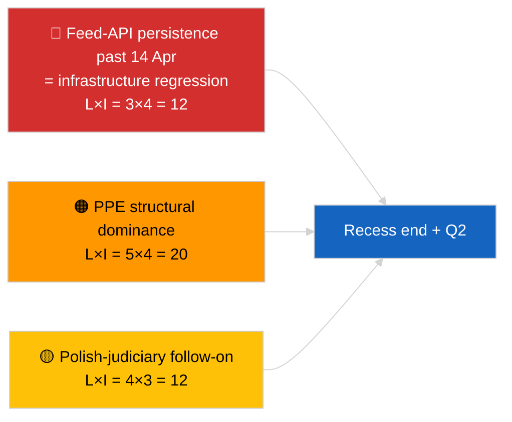

<!-- SPDX-FileCopyrightText: 2026 Hack23 AB -->
<!-- SPDX-License-Identifier: Apache-2.0 -->

# Note de synthèse — Breaking (Synthèse stratégique à mi-pause) | 2026-04-05

**Classification :** OSINT | Archives parlementaires publiques
**Confiance :** 🟢 Élevée (synthèse longitudinale de 12 heures à mi-pause)
**Générée :** 2026-04-05T00:00:00Z (note rétrospective)
**Type d'article :** Breaking — Note de renseignement stratégique en période de pause (synthèse longitudinale de 12 heures)
**Source :** Portail de données ouvertes du Parlement européen

---

## 🎯 BLUF

**La synthèse stratégique à mi-pause (jour 10 sur 18) confirme trois thèmes de renseignement persistants qui se projettent sur le T2 2026.** Premièrement, l'API de flux EP est en état DÉGRADÉ pour la 3e journée consécutive sans restauration observable en amont — l'hypothèse de corrélation avec la pause demeure privilégiée. Deuxièmement, l'arithmétique coalitionnelle d'EP10 s'est stabilisée à la dominance structurelle de 38 % du PPE avec le signal de cohésion Renew–ECR (~0,95) se maintenant jour après jour. Troisièmement, le cluster anticorruption + Braun + meilleure réglementation + réforme de l'accès public de fin mars reste la principale production de crédibilité institutionnelle du T1. Le timing exact au point médian (9 sur 18 écoulés) constitue un point d'inflexion naturel pour la planification prospective. **🟢 CONFIANCE ÉLEVÉE** sur la stabilité longitudinale des modèles ; **🟡 CONFIANCE MOYENNE** sur la prévision de restauration de l'API de flux en fin de pause.

---

## 🧭 3 Décisions que cette Note Éclaire

| # | Décision | Décideur | Échéance | Éléments probants |
|:-:|----------|---------|:--------:|------------------|
| 1 | **Éditorial :** publier la synthèse stratégique à mi-pause comme ancrage longitudinal | Rédaction | +24h | Données longitudinales 12h + 3 thèmes |
| 2 | **Suivi :** préparer le test de restauration du 14 avril après la pause | Pipeline de données | 2026-04-14 | Planification du point d'inflexion |
| 3 | **Veille prospective :** agenda du mardi Commission du 7 avril comme prochain déclencheur externe | Responsable analyse | 2026-04-07 | Première activité institutionnelle post-Pâques |

---

## 📰 Lecture en 60 secondes

- 🔴 **Jour 10 sur 18 — point médian exact de la pause pascale** (27 mars → 13 avril 2026). (🟢 Élevée)
- 🟠 **3 thèmes persistants** confirmés par synthèse longitudinale 12h : flux DÉGRADÉ, arithmétique coalitionnelle stable, cluster de réformes en report. (🟢 Élevée)
- 🟢 **Aucune nouvelle activité PE aujourd'hui** (dimanche, pause). (🟢 Élevée)
- 🟡 **Signal de cohésion Renew–ECR maintenu jour après jour** à ~0,95 depuis le 2026-04-03. (🟡 Moyenne)
- 🔵 **Contexte économique :** trajectoire commerciale USA–UE inchangée ; fenêtre de publication du WEO d'avril du IMF qui approche. (🟢 Élevée)
- 🟣 **Référence croisée :** les notes jumelles `breaking` et `breaking-2` fournissent la base matinale ; cette exécution synthétise les deux. (🟢 Élevée)
- 🩷 **Vecteur de perturbation :** le suivi judiciaire polonais reste la surprise la plus probable de la plénière d'avril. (🟡 Moyenne)
- ⚪ **Report :** la préparation de la plénière T2 commence le 13 avril.

---

## 🗂️ Principales Conclusions — Synthèse à mi-pause

| Rang | Conclusion | Source | Importance | Confiance |
|:----:|-----------|--------|:----------:|:---------:|
| 1 | API de flux EP DÉGRADÉE (3e jour consécutif) | Ligne de base 2026-04-03/breaking-2 | 8,0 | 🟢 ÉLEVÉE |
| 2 | Arithmétique coalitionnelle stable (PPE 38 % / Renew–ECR 0,95) | 2026-04-03/breaking, 2026-04-04/breaking | 7,5 | 🟡 MOYENNE |
| 3 | Cluster anticorruption / réformes (report) | 2026-04-03/breaking-3 | 9,0 | 🟢 ÉLEVÉE |
| 4 | Aucune nouvelle activité PE jour 10 sur 18 | Cette exécution | 0,0 | 🟢 ÉLEVÉE |

---

## ⚠️ Risques & Menaces

| Risque | V | I | Score | Déclencheur | Source | Amirauté |
|--------|:-:|:-:|:-----:|------------|--------|:--------:|
| Régression API de flux (après 14 avr) | 3 | 4 | 12 | Pas de restauration | 2026-04-03/breaking-2 | A1 |
| Dominance structurelle PPE | 5 | 4 | 20 | Toutes les majorités requièrent le PPE | Arithmétique coalitionnelle | A1 |
| Suivi judiciaire polonais | 4 | 3 | 12 | Nouvelle enquête | TA-10-2026-0088 | A1 |
| Risque de transposition de niveau 1 | 4 | 4 | 16 | Divergence nationale | TA-10-2026-0094 | A1 |

---

## 🔮 Principal Déclencheur Prospectif

**Fin de pause le 13 avril 2026 + premier mardi Commission post-Pâques le 7 avril.** Cette fenêtre de déclenchement composite déterminera si les trois thèmes persistants évoluent (API restaurée, nouveaux acteurs émergent, mise en œuvre des réformes commence) ou perdurent en T2.

---

## 🛡️ Évaluation de la Qualité des Sources

- **Sources primaires :** Report des exécutions substantielles de 2026-04-03 / 04-04 ; revue longitudinale de 12 heures des notes jumelles matinales `breaking` et `breaking-2`.
- **Confiance :** 🟢 ÉLEVÉE pour les affirmations de continuité ; 🟡 MOYENNE pour le cadrage de la fenêtre de prévision.

---

## 📎 Liens

| Lien | Chemin |
|------|--------|
| Article | `./article.md` |
| Exécutions jumelles | `analysis/daily/2026-04-05/breaking/`, `breaking-2/` |
| Source — sonde API | `analysis/daily/2026-04-03/breaking-2/` |
| Source — base coalitionnelle | `analysis/daily/2026-04-03/breaking/`, `analysis/daily/2026-04-04/breaking/` |
| Source — cluster réformes | `analysis/daily/2026-04-03/breaking-3/` |
| Manifeste | `./manifest.json` |

---

**Contrôle documentaire**
- **Modèle :** `/analysis/templates/executive-brief.md`
- **Chemin de l'artefact :** `analysis/daily/2026-04-05/breaking-3/executive-brief.md`
- **Classification :** Public
- **Génération rétrospective :** Session de remplissage rétrospectif.
