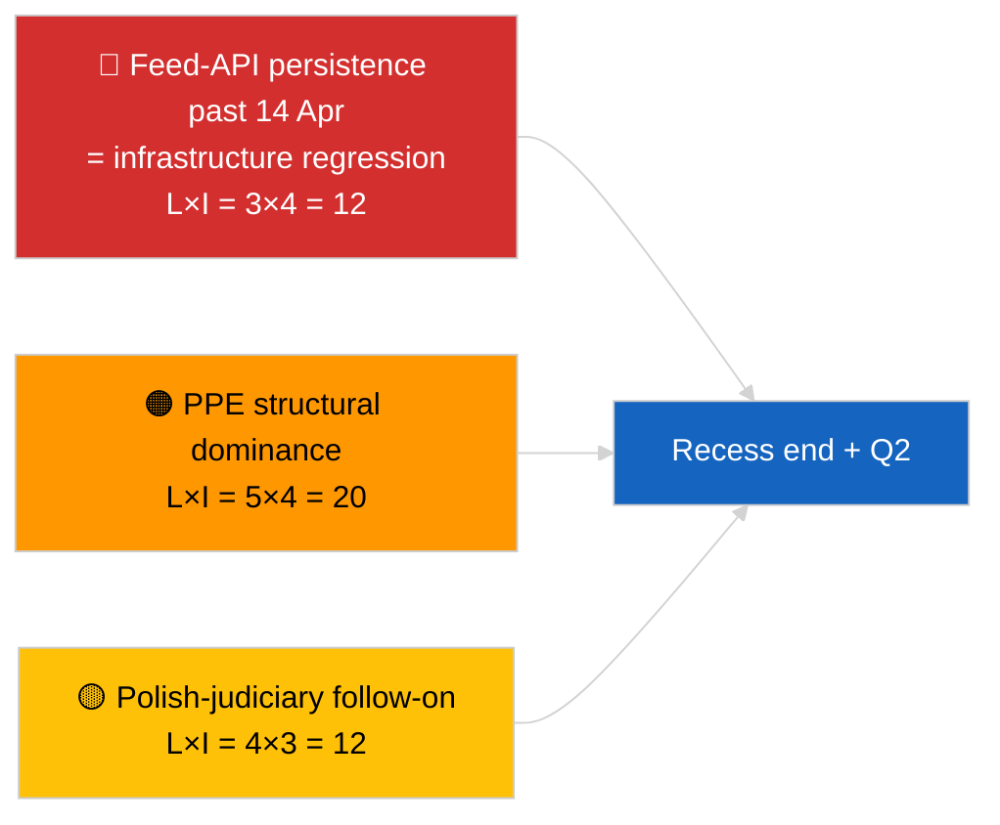

<!-- SPDX-FileCopyrightText: 2026 Hack23 AB -->
<!-- SPDX-License-Identifier: Apache-2.0 -->

# סיכום מנהלים — בריקינג (סינתזה אסטרטגית באמצע ההפסקה) | 2026-04-05

**סיווג:** OSINT | רשומות פרלמנטריות ציבוריות
**אמינות:** 🟢 גבוהה (סינתזה אורכית של 12 שעות באמצע ההפסקה)
**נוצר:** 2026-04-05T00:00:00Z (דוח רטרוספקטיבי)
**סוג המאמר:** בריקינג — דוח מודיעין אסטרטגי בזמן ההפסקה (סינתזה אורכית של 12 שעות)
**מקור:** פורטל הנתונים הפתוח של הפרלמנט האירופי

---

## 🎯 BLUF

**הסינתזה האסטרטגית באמצע ההפסקה (יום 10 מתוך 18) מאשרת שלושה נושאי מודיעין מתמשכים המתפרסים לרבעון השני של 2026.** ראשית, ממשק ה-API לעדכוני הפרלמנט האירופי נמצא במצב מדורדר ביום השלישי ברצף ללא שחזור נצפה במקור — השערת הקורלציה עם ההפסקה עדיין מועדפת. שנית, חשבון הקואליציה של EP10 התייצב בשליטה המבנית של PPE בשיעור 38% עם איתות הלכידות של Renew–ECR (~0.95) שמחזיק יום אחרי יום. שלישית, אשכול נגד-שחיתות + בראון + חקיקה טובה יותר + רפורמת גישה ציבורית מסוף מרץ נשאר הפלט העיקרי של אמינות מוסדית ברבעון הראשון. העיתוי המדויק של נקודת האמצע (9 מתוך 18 חלפו) הוא נקודת מפנה טבעית לתכנון עתידי. **🟢 אמינות גבוהה** על יציבות דפוס אורכי; **🟡 אמינות בינונית** על תחזית שחזור ה-API בסוף ההפסקה.

---

## 🧭 3 החלטות שמסמך זה תומך בהן

| # | החלטה | מקבל החלטה | מועד אחרון | ראיות |
|:-:|-------|-----------|:---------:|-------|
| 1 | **עריכה:** פרסום הסינתזה האסטרטגית כעוגן אורכי | מערכת | +24 שעות | נתונים אורכיים 12 שעות + 3 נושאים |
| 2 | **ניטור:** הכנה לבדיקת שחזור ב-14 באפריל לאחר ההפסקה | צינור נתונים | 2026-04-14 | תכנון נקודת מפנה |
| 3 | **מעקב עתידי:** סדר יום של יום שלישי הנציבות ב-7 באפריל כמפעיל חיצוני הבא | ראש ניתוח | 2026-04-07 | פעילות מוסדית ראשונה לאחר הפסחא |

---

## 📰 קריאה של 60 שניות

- 🔴 **יום 10 מתוך 18 — נקודת אמצע מדויקת של חופשת הפסחא** (27 במרץ ← 13 באפריל 2026). (🟢 גבוהה)
- 🟠 **3 נושאים מתמשכים** אושרו בסינתזה אורכית של 12 שעות: עדכונים מדורדרים, חשבון קואליציה יציב, אשכול רפורמות נמשך. (🟢 גבוהה)
- 🟢 **אין פעילות חדשה בפרלמנט האירופי היום** (ראשון, הפסקה). (🟢 גבוהה)
- 🟡 **איתות לכידות Renew–ECR נשמר יום אחרי יום** ב-~0.95 מאז 2026-04-03. (🟡 בינונית)
- 🔵 **הקשר כלכלי:** מסלול סחר ארה"ב–אירופה ללא שינוי; חלון פרסום IMF אפריל WEO מתקרב. (🟢 גבוהה)
- 🟣 **הפנייה צולבת:** הדוחות האחים `breaking` ו-`breaking-2` מספקים קו בסיס בוקר; ריצה זו מסנתזת את שניהם. (🟢 גבוהה)
- 🩷 **וקטור שיבוש:** המעקב השיפוטי הפולני נשאר ההפתעה הסבירה ביותר במשמרת אפריל. (🟡 בינונית)
- ⚪ **המשך:** הכנת מושב רבעון שני מתחילה ב-13 באפריל.

---

## 🗂️ הממצאים המובילים — סינתזת אמצע ההפסקה

| דירוג | ממצא | מקור | חשיבות | אמינות |
|:-----:|------|------|:------:|:------:|
| 1 | API עדכוני פרלמנט אירופי מדורדר (יום שלישי ברצף) | קו בסיס 2026-04-03/breaking-2 | 8.0 | 🟢 גבוהה |
| 2 | חשבון קואליציה יציב (PPE 38% / Renew–ECR 0.95) | 2026-04-03/breaking, 2026-04-04/breaking | 7.5 | 🟡 בינונית |
| 3 | אשכול נגד-שחיתות / רפורמות (נמשך) | 2026-04-03/breaking-3 | 9.0 | 🟢 גבוהה |
| 4 | אין פעילות חדשה ביום 10 מתוך 18 | ריצה זו | 0.0 | 🟢 גבוהה |

---

## ⚠️ תמונת סיכונים ואיומים

| סיכון | א | ה | ציון | מפעיל | מקור | אדמירליות |
|-------|:-:|:-:|:----:|-------|------|:---------:|
| נסיגת API עדכונים (לאחר 14 באפריל) | 3 | 4 | 12 | אין שחזור | 2026-04-03/breaking-2 | A1 |
| שליטה מבנית של PPE | 5 | 4 | 20 | כל הרוב דורשים PPE | חשבון קואליציה | A1 |
| המעקב השיפוטי הפולני | 4 | 3 | 12 | חקירה חדשה | TA-10-2026-0088 | A1 |
| סיכון טרנספוזיציה רמה 1 | 4 | 4 | 16 | פיצול לאומי | TA-10-2026-0094 | A1 |

---

## 🔮 המפעיל העתידי המוביל

**סיום ההפסקה ב-13 באפריל 2026 + יום שלישי הנציבות הראשון לאחר הפסחא ב-7 באפריל.** חלון המפעיל המרוכב הזה יקבע האם שלושת הנושאים המתמשכים יתפתחו (API משוחזר, שחקנים חדשים מופיעים, יישום רפורמות מתחיל) או ימשיכו לרבעון השני.

---

## 🛡️ הערכת איכות מקורות

- **מקורות ראשיים:** נמשכים מריצות המהות של 2026-04-03 / 04-04; סקירה אורכית של 12 שעות לדוחות האחים הבוקריים `breaking` ו-`breaking-2`.
- **אמינות:** 🟢 גבוהה לטענות המשכיות; 🟡 בינונית לניסוח חלון התחזית.

---

## 📎 קישורים

| קישור | נתיב |
|-------|------|
| מאמר | `./article.md` |
| ריצות אחיות | `analysis/daily/2026-04-05/breaking/`, `breaking-2/` |
| מקור — בדיקת API | `analysis/daily/2026-04-03/breaking-2/` |
| מקור — קו בסיס קואליציה | `analysis/daily/2026-04-03/breaking/`, `analysis/daily/2026-04-04/breaking/` |
| מקור — אשכול רפורמות | `analysis/daily/2026-04-03/breaking-3/` |
| מניפסט | `./manifest.json` |

---

**בקרת מסמכים**
- **תבנית:** `/analysis/templates/executive-brief.md`
- **נתיב קובץ:** `analysis/daily/2026-04-05/breaking-3/executive-brief.md`
- **סיווג:** ציבורי
- **יצירה רטרוספקטיבית:** סשן מילוי לאחור.
