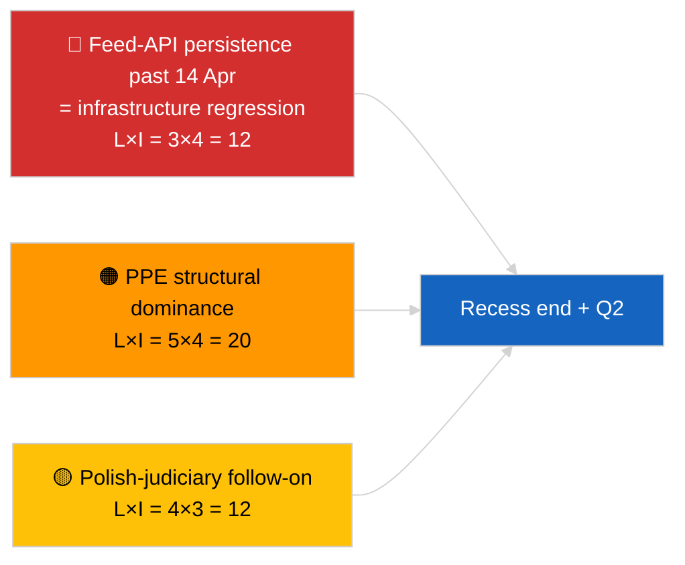

<!-- SPDX-FileCopyrightText: 2026 Hack23 AB -->
<!-- SPDX-License-Identifier: Apache-2.0 -->

# エグゼクティブ・ブリーフ — 速報（休会中期戦略統合）| 2026-04-05

**分類：** OSINT｜公開議会記録
**信頼度：** 🟢 高（休会中期12時間縦断的統合）
**生成日時：** 2026-04-05T00:00:00Z（遡及ブリーフ）
**記事タイプ：** 速報 — 休会期間中の戦略的情報ブリーフ（12時間縦断的統合）
**情報源：** 欧州議会オープンデータポータル

---

## 🎯 BLUF

**休会中期（18日中10日目）の戦略的統合により、2026年第2四半期に持ち越される3つの持続的な情報テーマが確認されました。** 第1に、EP フィードAPIは上流での復旧が確認されないまま3日連続で「劣化」状態が続いており、休会との相関仮説が依然として有力です。第2に、EP10の連立算術はPPEの38%構造的優位性で安定しており、Renew–ECR結束シグナル（~0.95）が日々維持されています。第3に、3月末の汚職対策 + ブラウン + より良い立法 + 公開アクセス改革クラスターが、第1四半期の主要な制度的信頼性成果として残っています。正確な中間時点（18日中9日経過）は将来計画の自然な変曲点です。縦断的パターン安定性への**🟢 高信頼度**；休会終了時のフィードAPI復旧予測への**🟡 中程度の信頼度**。

---

## 🧭 このブリーフが支援する3つの意思決定

| # | 意思決定 | 決定者 | 期限 | 根拠 |
|:-:|---------|------|:---:|------|
| 1 | **編集：** 戦略的休会中期統合を縦断的アンカーとして公開 | 編集局 | +24時間 | 12時間縦断データ + 3テーマ |
| 2 | **監視：** 4月14日の休会後復旧テストへの準備 | データパイプライン | 2026-04-14 | 変曲点計画 |
| 3 | **先行監視：** 4月7日欧州委員会の火曜日議題を次の外部トリガーとして設定 | 分析責任者 | 2026-04-07 | 復活祭後初の制度的活動 |

---

## 📰 60秒リーディング

- 🔴 **18日中10日目 — イースター休会の正確な中間地点**（2026年3月27日 → 4月13日）。(🟢 高)
- 🟠 **3つの持続テーマ**が12時間縦断的統合で確認：フィード劣化、連立算術安定、改革クラスター持越し。(🟢 高)
- 🟢 **本日のEP新規活動なし**（日曜日、休会）。(🟢 高)
- 🟡 **Renew–ECR結束シグナルが日々維持**、2026-04-03以降~0.95。(🟡 中)
- 🔵 **経済的文脈：** 米国–EU貿易軌道変化なし；IMF 4月WEO公開窓口接近。(🟢 高)
- 🟣 **相互参照：** 姉妹レポート`breaking`と`breaking-2`が朝のベースラインを提供；この実行が両方を統合。(🟢 高)
- 🩷 **混乱ベクター：** ポーランド司法フォローアップが4月本会議の最も可能性の高いサプライズとして残存。(🟡 中)
- ⚪ **繰越：** 第2四半期本会議準備が4月13日に開始。

---

## 🗂️ 主要所見 — 休会中期統合

| 順位 | 所見 | 情報源 | 重要度 | 信頼度 |
|:---:|------|------|:-----:|:-----:|
| 1 | EPフィードAPI劣化（3日連続） | 2026-04-03/breaking-2 ベースライン | 8.0 | 🟢 高 |
| 2 | 連立算術安定（PPE 38% / Renew–ECR 0.95） | 2026-04-03/breaking, 2026-04-04/breaking | 7.5 | 🟡 中 |
| 3 | 汚職対策／改革クラスター（持越し） | 2026-04-03/breaking-3 | 9.0 | 🟢 高 |
| 4 | 18日中10日目にEP新規活動なし | この実行 | 0.0 | 🟢 高 |

---

## ⚠️ リスク・脅威スナップショット

| リスク | 可 | 影 | スコア | トリガー | 情報源 | 海軍省 |
|-------|:-:|:-:|:-----:|--------|------|:-----:|
| フィードAPI劣化（4月14日以降） | 3 | 4 | 12 | 復旧なし | 2026-04-03/breaking-2 | A1 |
| PPE構造的優位性 | 5 | 4 | 20 | すべての過半数がPPEを必要 | 連立算術 | A1 |
| ポーランド司法フォローアップ | 4 | 3 | 12 | 新規調査 | TA-10-2026-0088 | A1 |
| 第1層転置リスク | 4 | 4 | 16 | 各国間乖離 | TA-10-2026-0094 | A1 |

---

## 🔮 主要な先行トリガー

**2026年4月13日の休会終了 + 復活祭後初の欧州委員会火曜日4月7日。** この複合トリガー窓口が、3つの持続テーマが発展（API復旧、新規主体出現、改革実施開始）するか、第2四半期に持続するかを決定します。

---

## 🛡️ 情報源品質評価

- **一次情報源：** 2026-04-03 / 04-04の実質的な実行からの持越し；`breaking`および`breaking-2`朝の姉妹の12時間縦断的レビュー。
- **信頼度：** 継続性の主張に対して🟢 高；予測窓口フレーミングに対して🟡 中。

---

## 📎 リンク

| リンク | パス |
|-------|-----|
| 記事 | `./article.md` |
| 姉妹実行 | `analysis/daily/2026-04-05/breaking/`, `breaking-2/` |
| 情報源 — APIプローブ | `analysis/daily/2026-04-03/breaking-2/` |
| 情報源 — 連立ベースライン | `analysis/daily/2026-04-03/breaking/`, `analysis/daily/2026-04-04/breaking/` |
| 情報源 — 改革クラスター | `analysis/daily/2026-04-03/breaking-3/` |
| マニフェスト | `./manifest.json` |

---

**文書管理**
- **テンプレート：** `/analysis/templates/executive-brief.md`
- **成果物パス：** `analysis/daily/2026-04-05/breaking-3/executive-brief.md`
- **分類：** 公開
- **遡及生成：** バックフィルセッション。
