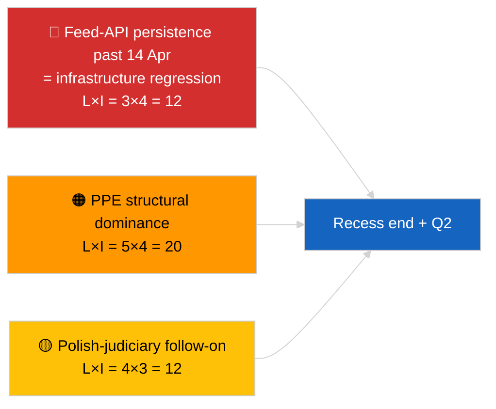

<!-- SPDX-FileCopyrightText: 2026 Hack23 AB -->
<!-- SPDX-License-Identifier: Apache-2.0 -->

# 집행 요약 — 속보 (휴회 중반기 전략 통합) | 2026-04-05

**분류:** OSINT | 공개 의회 기록
**신뢰도:** 🟢 높음 (12시간 종단적 휴회 중반기 통합)
**작성일:** 2026-04-05T00:00:00Z (소급 보고서)
**기사 유형:** 속보 — 휴회 기간 중 전략 정보 보고서 (12시간 종단적 통합)
**출처:** 유럽의회 개방 데이터 포털

---

## 🎯 BLUF

**휴회 중반기 전략 통합 (18일 중 10일차)은 2026년 2분기로 이어지는 세 가지 지속적인 정보 주제를 확인합니다.** 첫째, EP 피드 API가 업스트림 복구 없이 3일 연속 성능 저하 상태를 유지하고 있으며, 휴회 상관 가설이 여전히 선호됩니다. 둘째, EP10의 연립 산술은 PPE의 38% 구조적 우위와 Renew–ECR 결속 신호 (~0.95)가 매일 유지되며 안정화되었습니다. 셋째, 3월 말의 반부패 + 브라운 + 더 나은 입법 + 공개 접근 개혁 클러스터가 1분기 주요 제도적 신뢰도 성과로 남아 있습니다. 정확한 중간 지점 타이밍 (18일 중 9일 경과)은 미래 계획의 자연스러운 변곡점입니다. 종단적 패턴 안정성에 대해 **🟢 높은 신뢰도**; 휴회 종료 시 피드 API 복구 예측에 대해 **🟡 중간 신뢰도**.

---

## 🧭 이 요약이 지원하는 3가지 결정

| # | 결정 | 결정자 | 마감일 | 근거 |
|:-:|------|------|:-----:|------|
| 1 | **편집:** 전략적 휴회 중반기 통합을 종단적 앵커로 게시 | 편집부 | +24시간 | 12시간 종단 데이터 + 3가지 주제 |
| 2 | **모니터링:** 4월 14일 휴회 후 복구 테스트 준비 | 데이터 파이프라인 | 2026-04-14 | 변곡점 계획 |
| 3 | **선행 모니터링:** 4월 7일 집행위원회 화요일 의제를 다음 외부 트리거로 설정 | 분석 책임자 | 2026-04-07 | 부활절 이후 첫 제도적 활동 |

---

## 📰 60초 읽기

- 🔴 **18일 중 10일차 — 부활절 휴회의 정확한 중간 지점** (2026년 3월 27일 → 4월 13일). (🟢 높음)
- 🟠 **3가지 지속적인 주제**가 12시간 종단 통합으로 확인: 피드 성능 저하, 연립 산술 안정, 개혁 클러스터 이월. (🟢 높음)
- 🟢 **오늘 새로운 EP 활동 없음** (일요일, 휴회). (🟢 높음)
- 🟡 **Renew–ECR 결속 신호가 매일 유지됨** 2026-04-03 이후 ~0.95. (🟡 중간)
- 🔵 **경제적 맥락:** 미국–EU 무역 궤도 변화 없음; IMF 4월 WEO 발표 창구 접근. (🟢 높음)
- 🟣 **교차 참조:** 형제 보고서 `breaking`과 `breaking-2`가 아침 기준선 제공; 이번 실행이 양쪽 통합. (🟢 높음)
- 🩷 **혼란 벡터:** 폴란드 사법 후속 조치가 4월 본회의의 가장 가능성 높은 서프라이즈로 남음. (🟡 중간)
- ⚪ **이월:** 2분기 본회의 준비가 4월 13일부터 시작.

---

## 🗂️ 주요 발견 — 휴회 중반기 통합

| 순위 | 발견 | 출처 | 중요성 | 신뢰도 |
|:---:|------|------|:-----:|:-----:|
| 1 | EP 피드 API 성능 저하 (3일 연속) | 2026-04-03/breaking-2 기준선 | 8.0 | 🟢 높음 |
| 2 | 연립 산술 안정 (PPE 38% / Renew–ECR 0.95) | 2026-04-03/breaking, 2026-04-04/breaking | 7.5 | 🟡 중간 |
| 3 | 반부패 / 개혁 클러스터 (이월) | 2026-04-03/breaking-3 | 9.0 | 🟢 높음 |
| 4 | 18일 중 10일차에 새 EP 활동 없음 | 이번 실행 | 0.0 | 🟢 높음 |

---

## ⚠️ 위험 및 위협 스냅샷

| 위험 | 가 | 영 | 점수 | 트리거 | 출처 | 해군성 |
|-----|:-:|:-:|:---:|-------|------|:-----:|
| 피드 API 저하 (4월 14일 이후) | 3 | 4 | 12 | 복구 없음 | 2026-04-03/breaking-2 | A1 |
| PPE 구조적 우위 | 5 | 4 | 20 | 모든 과반수가 PPE 필요 | 연립 산술 | A1 |
| 폴란드 사법 후속 조치 | 4 | 3 | 12 | 새 조사 | TA-10-2026-0088 | A1 |
| 1단계 이행 위험 | 4 | 4 | 16 | 국가 간 분기 | TA-10-2026-0094 | A1 |

---

## 🔮 주도적 미래 트리거

**2026년 4월 13일 휴회 종료 + 부활절 후 첫 집행위원회 화요일 4월 7일.** 이 복합 트리거 창구는 세 가지 지속적인 주제가 발전 (API 복구, 새 행위자 출현, 개혁 이행 시작)하는지 아니면 2분기까지 지속되는지를 결정할 것입니다.

---

## 🛡️ 출처 품질 평가

- **주요 출처:** 2026-04-03 / 04-04 실질적 실행의 이월; `breaking`과 `breaking-2` 아침 형제 보고서의 12시간 종단적 검토.
- **신뢰도:** 연속성 주장에 🟢 높음; 예측 창구 구성에 🟡 중간.

---

## 📎 링크

| 링크 | 경로 |
|-----|------|
| 기사 | `./article.md` |
| 형제 실행 | `analysis/daily/2026-04-05/breaking/`, `breaking-2/` |
| 출처 — API 프로브 | `analysis/daily/2026-04-03/breaking-2/` |
| 출처 — 연립 기준선 | `analysis/daily/2026-04-03/breaking/`, `analysis/daily/2026-04-04/breaking/` |
| 출처 — 개혁 클러스터 | `analysis/daily/2026-04-03/breaking-3/` |
| 매니페스트 | `./manifest.json` |

---

**문서 통제**
- **템플릿:** `/analysis/templates/executive-brief.md`
- **산출물 경로:** `analysis/daily/2026-04-05/breaking-3/executive-brief.md`
- **분류:** 공개
- **소급 생성:** 역채우기 세션.
