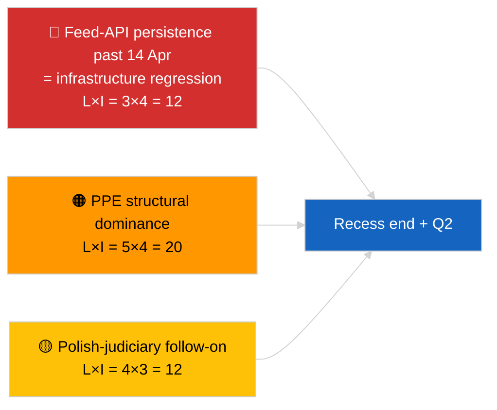

<!-- SPDX-FileCopyrightText: 2026 Hack23 AB -->
<!-- SPDX-License-Identifier: Apache-2.0 -->

# Uitvoerende Samenvatting — Breaking (Strategische Halverwege-Recessesynthese) | 2026-04-05

**Classificatie:** OSINT | Openbare parlementaire stukken
**Vertrouwen:** 🟢 Hoog (12-uur longitudinale halverwege-recessesynthese)
**Gegenereerd:** 2026-04-05T00:00:00Z (retrospectieve samenvatting)
**Artikeltype:** Breaking — Strategische inlichtingenrapport tijdens reces (12-uur longitudinale synthese)
**Bron:** Open dataportaal Europees Parlement

---

## 🎯 BLUF

**Strategische synthese halverwege het reces (dag 10 van 18) bevestigt drie aanhoudende inlichtingenthema's die doorgaan in Q2 2026.** Ten eerste bevindt de EP-feed-API zich nu op de 3e achtereenvolgende dag in GEDEGRADEERDE staat zonder waarneembaar upstream herstel — de reces-correlatiehypothese blijft de voorkeur houden. Ten tweede is de coalitie-aritmetiek van EP10 gestabiliseerd bij de 38% structurele dominantie van de PPE met het Renew–ECR-cohesiesignaal (~0,95) dat dag na dag standhoud. Ten derde blijft het anticorruptie- + Braun- + betere wetgeving- + publieke toegangshervorming-cluster van eind maart de voornaamste institutionele geloofwaardigheidsoutput van Q1. Het exacte middelpuntstiming (9 van 18 verstreken) is een natuurlijk buigpunt voor toekomstplanningen. **🟢 HOOG vertrouwen** in longitudinale patroonsstabiliteit; **🟡 MIDDEL vertrouwen** in voorspelling van feed-API-herstel aan het einde van het reces.

---

## 🧭 3 Beslissingen die Deze Samenvatting Ondersteunt

| # | Beslissing | Beslisser | Deadline | Bewijs |
|:-:|-----------|----------|:--------:|--------|
| 1 | **Redactioneel:** strategische halverwege-recessesynthese publiceren als longitudinaal ankerpunt | Redactie | +24u | 12-uur longitudinale data + 3 thema's |
| 2 | **Monitoring:** voorbereiding op 14 april hersteltest na reces | Datapipeline | 2026-04-14 | Buigpuntplanning |
| 3 | **Vooruitkijken:** 7 april Commissie-dinsdagagenda als volgende externe trigger | Analysehoofd | 2026-04-07 | Eerste institutionele activiteit na Pasen |

---

## 📰 60-Seconden Lezing

- 🔴 **Dag 10 van 18 — exact middelpunt van het paasreces** (27 maart → 13 april 2026). (🟢 Hoog)
- 🟠 **3 aanhoudende thema's** bevestigd door 12-uur longitudinale synthese: feed GEDEGRADEERD, coalitie-aritmetiek stabiel, hervormingscluster carry-over. (🟢 Hoog)
- 🟢 **Geen nieuwe EP-activiteit vandaag** (zondag, reces). (🟢 Hoog)
- 🟡 **Renew–ECR-cohesiesignaal dag na dag gehandhaafd** op ~0,95 sinds 2026-04-03. (🟡 Midden)
- 🔵 **Economische context:** USA–EU-handelskoers ongewijzigd; IMF april WEO-publicatievenster nadert. (🟢 Hoog)
- 🟣 **Kruisverwijzing:** zusterrapporten `breaking` en `breaking-2` geven de ochtendbasislijn; deze run synthetiseert beide. (🟢 Hoog)
- 🩷 **Verstoringsvector:** Pools-justitiële follow-up blijft de meest waarschijnlijke april-plenumverrassing. (🟡 Midden)
- ⚪ **Carry-forward:** voorbereiding Q2-plenumbijeenkomst begint 13 april.

---

## 🗂️ Topbevindingen — Halverwege-recessesynthese

| Rang | Bevinding | Bron | Significantie | Vertrouwen |
|:----:|----------|------|:------------:|:----------:|
| 1 | EP feed-API GEDEGRADEERD (3e achtereenvolgende dag) | 2026-04-03/breaking-2 basislijn | 8,0 | 🟢 HOOG |
| 2 | Coalitie-aritmetiek stabiel (PPE 38% / Renew–ECR 0,95) | 2026-04-03/breaking, 2026-04-04/breaking | 7,5 | 🟡 MIDDEN |
| 3 | Anticorruptie- / hervormingscluster (carry-over) | 2026-04-03/breaking-3 | 9,0 | 🟢 HOOG |
| 4 | Geen nieuwe EP-activiteit dag 10 van 18 | Deze run | 0,0 | 🟢 HOOG |

---

## ⚠️ Risico & Dreigingsoverzicht

| Risico | K | I | Score | Trigger | Bron | Admiraliteit |
|--------|:-:|:-:|:-----:|---------|------|:------------:|
| Feed-API-regressie (na 14 apr) | 3 | 4 | 12 | Geen herstel | 2026-04-03/breaking-2 | A1 |
| PPE structurele dominantie | 5 | 4 | 20 | Alle meerderheden vereisen PPE | Coalitie-aritmetiek | A1 |
| Pools-justitiële follow-up | 4 | 3 | 12 | Nieuw onderzoek | TA-10-2026-0088 | A1 |
| Niveau-1 transponeringsrisico | 4 | 4 | 16 | Nationale divergentie | TA-10-2026-0094 | A1 |

---

## 🔮 Leidende Toekomstige Trigger

**Einde reces 13 april 2026 + eerste post-Pasen Commissie-dinsdag 7 april.** Dit samengestelde triggervenster zal bepalen of de drie aanhoudende thema's zich ontwikkelen (API hersteld, nieuwe actoren verschijnen, hervormingsimplementatie begint) of doorgaan in Q2.

---

## 🛡️ Kwaliteitsbeoordeling Bronnen

- **Primaire bronnen:** Carry-over van 2026-04-03 / 04-04 substantiële runs; 12-uur longitudinale review van `breaking`- en `breaking-2`-ochtendbroers.
- **Vertrouwen:** 🟢 HOOG voor continuïteitsbeweringen; 🟡 MIDDEN voor prognosevensterkadering.

---

## 📎 Links

| Link | Pad |
|------|-----|
| Artikel | `./article.md` |
| Zusterruns | `analysis/daily/2026-04-05/breaking/`, `breaking-2/` |
| Bron — API-sonde | `analysis/daily/2026-04-03/breaking-2/` |
| Bron — coalitiebasislijn | `analysis/daily/2026-04-03/breaking/`, `analysis/daily/2026-04-04/breaking/` |
| Bron — hervormingscluster | `analysis/daily/2026-04-03/breaking-3/` |
| Manifest | `./manifest.json` |

---

**Documentbeheer**
- **Sjabloon:** `/analysis/templates/executive-brief.md`
- **Artefactpad:** `analysis/daily/2026-04-05/breaking-3/executive-brief.md`
- **Classificatie:** Openbaar
- **Retrospectieve generatie:** Terugvulsessie.
