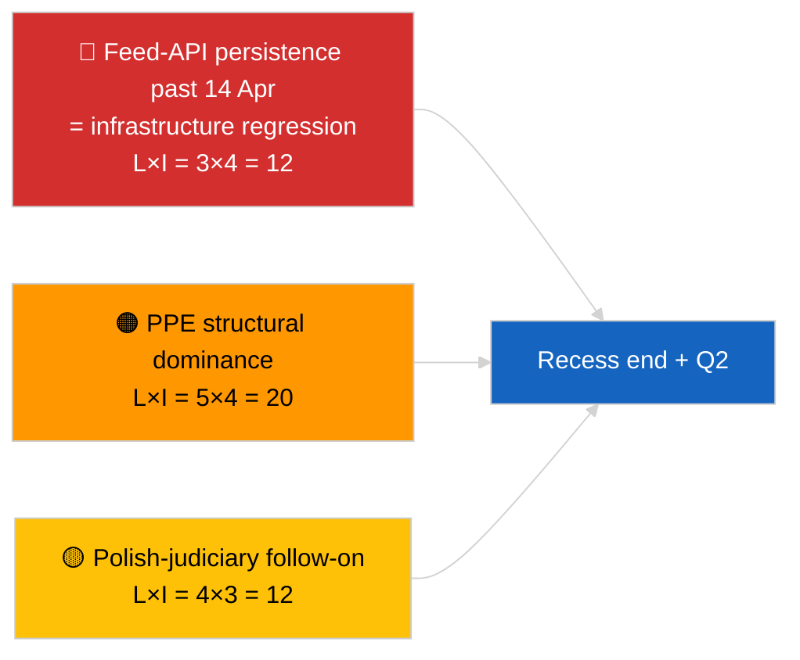

<!-- SPDX-FileCopyrightText: 2026 Hack23 AB -->
<!-- SPDX-License-Identifier: Apache-2.0 -->

# Eksekutivrapport — Breaking (Strategisk Midtpausesyntese) | 2026-04-05

**Klassifisering:** OSINT | Offentlige parlamentariske opptegnelser
**Tillit:** 🟢 Høy (12-timers longitudinell midtpausesyntese)
**Generert:** 2026-04-05T00:00:00Z (retrospektiv rapport)
**Artikkeltype:** Breaking — Strategisk etterretningsrapport under midtpause (12-timers longitudinell syntese)
**Kilde:** Europaparlamentets åpne dataportal

---

## 🎯 BLUF

**Strategisk syntese ved midtpause (dag 10 av 18) bekrefter tre vedvarende etterretningstemaer inn i 2. kvartal 2026.** For det første er EP-feed-API FORRINGET i sin 3. dag på rad uten observerbar oppstrømsrestaurering — hypotesen om pausekorrelasjon fremdeles foretrukket. For det andre har koalisjonsaritmetikken for EP10 stabilisert seg ved PPE sin 38% strukturelle dominans med Renew–ECR-kohesjonssignalet (~0,95) som holder dag-for-dag. For det tredje forblir anti-korrupsjon + Braun + bedre lovgivning + offentlig tilgangsreformklyngen fra slutten av mars det viktigste institusjonelle troverdighetsresultatet for 1. kvartal. Den nøyaktige midtpunktstimingen (9 av 18 forløpt) er et naturlig vendepunkt for fremtidsplanlegging. **🟢 HØY tillit** til longitudinell mønsterstabilitet; **🟡 MIDDELS tillit** til prognose om feed-API-restaurering ved pauseslutt.

---

## 🧭 3 Beslutninger Dette Dokumentet Støtter

| # | Beslutning | Beslutningstaker | Frist | Dokumentasjon |
|:-:|------------|-----------------|:-----:|---------------|
| 1 | **Redaksjonelt:** publiser strategisk midtpausesyntese som longitudinelt anker | Redaktør | +24t | 12-timers longitudinelle data + 3 temaer |
| 2 | **Overvåking:** forbered til 14. april restaureringstest etter pause | Datapipeline | 2026-04-14 | Vendepunktsplanlegging |
| 3 | **Fremtidsovervåking:** 7. april Kommisjonens tirsdagsagenda som neste eksterne utløser | Analyseansvarlig | 2026-04-07 | Første institusjonelle aktivitet etter påske |

---

## 📰 60-Sekunders Lesning

- 🔴 **Dag 10 av 18 — nøyaktig midtpunkt av påskepausen** (27. mars → 13. april 2026). (🟢 Høy)
- 🟠 **3 vedvarende temaer** bekreftet av 12-timers longitudinell syntese: feed FORRINGET, koalisjonsaritmetikk stabil, reformklynge videreføres. (🟢 Høy)
- 🟢 **Ingen ny EP-aktivitet i dag** (søndag, pause). (🟢 Høy)
- 🟡 **Renew–ECR-kohesjonssignal holdt dag-for-dag** ved ~0,95 siden 2026-04-03. (🟡 Middels)
- 🔵 **Økonomisk kontekst:** USA–EU-handelsbane uendret; IMF April WEO-utgivelsesvindu nærmer seg. (🟢 Høy)
- 🟣 **Kryssreferanse:** søskenrapportene `breaking` og `breaking-2` gir morgenbasislinje; dette løpet syntetiserer begge. (🟢 Høy)
- 🩷 **Forstyrrelsesvektorer:** Polsk-rettslig-oppfølging forblir den mest sannsynlige april-plenum-overraskelsen. (🟡 Middels)
- ⚪ **Videreføres:** Forberedelse til 2. kvartal-plenum begynner 13. april.

---

## 🗂️ Toppfunn — Midtpausesyntese

| Rang | Funn | Kilde | Signifikans | Tillit |
|:----:|------|-------|:-----------:|:------:|
| 1 | EP feed-API FORRINGET (3. dag på rad) | 2026-04-03/breaking-2 basislinje | 8,0 | 🟢 HØY |
| 2 | Koalisjonsaritmetikk stabil (PPE 38% / Renew–ECR 0,95) | 2026-04-03/breaking, 2026-04-04/breaking | 7,5 | 🟡 MIDDELS |
| 3 | Anti-korrupsjon / reformklynge (videreføres) | 2026-04-03/breaking-3 | 9,0 | 🟢 HØY |
| 4 | Ingen ny EP-aktivitet dag 10 av 18 | Dette løpet | 0,0 | 🟢 HØY |

---

## ⚠️ Risiko & Trusselbilde

| Risiko | S | K | Score | Utløser | Kilde | Admiralitet |
|--------|:-:|:-:|:-----:|---------|-------|:-----------:|
| Feed-API-regresjon (etter 14. apr) | 3 | 4 | 12 | Ingen restaurering | 2026-04-03/breaking-2 | A1 |
| PPE strukturell dominans | 5 | 4 | 20 | Alle flertall krever PPE | Koalisjonsaritmetikk | A1 |
| Polsk-rettslig-oppfølging | 4 | 3 | 12 | Ny granskning | TA-10-2026-0088 | A1 |
| Nivå-1 transponeringsrisiko | 4 | 4 | 16 | Nasjonal divergens | TA-10-2026-0094 | A1 |

---

## 🔮 Ledende Fremtidsutløser

**Pauseslutt 13. april 2026 + første kommisjonstirsdagen etter påske 7. april.** Dette sammensatte utløservinduet vil avgjøre om de tre vedvarende temaene utvikler seg (API restaurert, nye aktører fremtrer, reformimplementering begynner) eller fortsetter inn i 2. kvartal.

---

## 🛡️ Kildekvalitetsvurdering

- **Primærkilder:** Videreføres fra 2026-04-03 / 04-04 substansielle løp; 12-timers longitudinell gjennomgang av `breaking` og `breaking-2` morgensøskener.
- **Tillit:** 🟢 HØY for kontinuitetspåstander; 🟡 MIDDELS for prediksjonsvinduesrammeverk.

---

## 📎 Lenker

| Lenke | Sti |
|-------|-----|
| Artikkel | `./article.md` |
| Søskenløp | `analysis/daily/2026-04-05/breaking/`, `breaking-2/` |
| Kilde — API-sonde | `analysis/daily/2026-04-03/breaking-2/` |
| Kilde — koalisjonsbasislinje | `analysis/daily/2026-04-03/breaking/`, `analysis/daily/2026-04-04/breaking/` |
| Kilde — reformklynge | `analysis/daily/2026-04-03/breaking-3/` |
| Manifest | `./manifest.json` |

---

**Dokumentkontroll**
- **Mal:** `/analysis/templates/executive-brief.md`
- **Artefaktsti:** `analysis/daily/2026-04-05/breaking-3/executive-brief.md`
- **Klassifisering:** Offentlig
- **Retrospektiv generering:** Tilbakefyllingssesjon.
