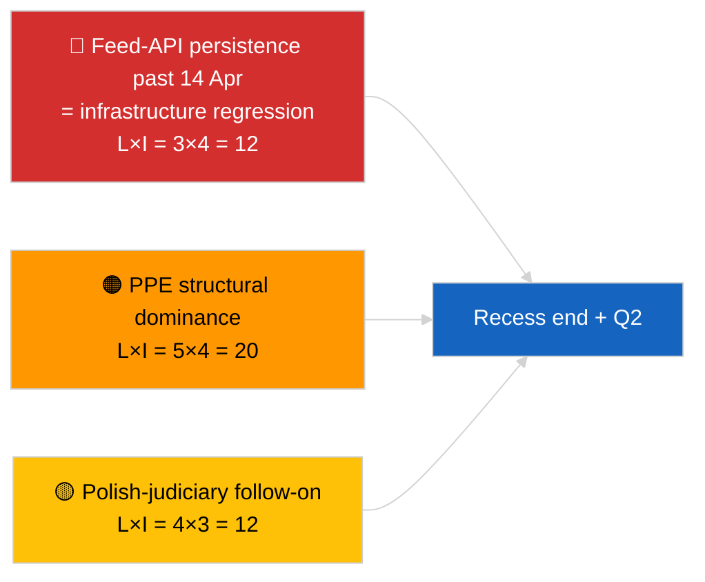

<!-- SPDX-FileCopyrightText: 2026 Hack23 AB -->
<!-- SPDX-License-Identifier: Apache-2.0 -->

# Exekutivrapport — Extra (Strategisk Mittpauskanalys) | 2026-04-05

**Klassificering:** OSINT | Offentliga parlamentshandlingar
**Säkerhet:** 🟢 Hög (12-timmars longitudinell mittpausksyntes)
**Genererad:** 2026-04-05T00:00:00Z (retrospektiv rapport)
**Artikeltyp:** Extra — Strategisk underrättelserapport under mittpausk (12-timmars longitudinell syntes)
**Källa:** Europeiska parlamentets öppna dataportal

---

## 🎯 BLUF

**Strategisk syntes vid mittpausk (dag 10 av 18) bekräftar tre bestående underrättelseteman inför kvartal 2 2026.** För det första är EP:s flödes-API FÖRSÄMRAT under tredje dagen i rad utan observerbar återhämtning uppströms — hypotesen om pauskorrelation fortfarande föredragen. För det andra har koalitionsaritmetiken för EP10 stabiliserats med PPE:s 38% strukturella dominans och Renew–ECR-kohesenssignalen (~0,95) som håller dag-för-dag. För det tredje kvarstår klustret anti-korruption + Braun + bättre lagstiftning + tillgångsreform från slutet av mars som det främsta institutionella trovärdighetsresultatet kvartal 1. Det exakta mittpunktstimingen (9 av 18 förflutna) är en naturlig inflektionspunkt för framtidsplanering. **🟢 HÖG säkerhet** om longitudinell mönsterstabilitet; **🟡 MEDELHÖG säkerhet** om prognos för flödes-API-återhämtning vid pausslut.

---

## 🧭 3 Beslut Detta Dokument Stöder

| # | Beslut | Beslutsfattare | Deadline | Underlag |
|:-:|--------|---------------|:--------:|---------|
| 1 | **Redaktionellt:** publicera strategisk mittpaukssyntes som longitudinellt ankare | Redaktör | +24h | 12-timmars longitudinell data + 3 teman |
| 2 | **Övervakning:** förbered för 14 april återhämtningstest efter pauset | Datapipeline | 2026-04-14 | Inflektionspunktplanering |
| 3 | **Framåtbevakning:** 7 april Kommissionens tisdagsagenda som nästa externa utlösare | Analysansvarig | 2026-04-07 | Första institutionella aktiviteten efter påsk |

---

## 📰 60-Sekunders Läsning

- 🔴 **Dag 10 av 18 — exakt mittpunkt av påskpauset** (27 mars → 13 april 2026). (🟢 Hög)
- 🟠 **3 bestående teman** bekräftade av 12-timmars longitudinell syntes: flöde FÖRSÄMRAT, koalitionsaritmetik stabil, reformkluster kvarstår. (🟢 Hög)
- 🟢 **Ingen ny EP-aktivitet idag** (söndag, paus). (🟢 Hög)
- 🟡 **Renew–ECR-kohesenssignal höll dag-för-dag** vid ~0,95 sedan 2026-04-03. (🟡 Medel)
- 🔵 **Ekonomisk kontext:** USA–EU-handelsbanans riktning oförändrad; IMF April WEO-publiceringsfönster närmast. (🟢 Hög)
- 🟣 **Korsreferens:** syskonrapporterna `breaking` och `breaking-2` ger morgonbaslinjen; denna körning syntetiserar båda. (🟢 Hög)
- 🩷 **Störningsvektor:** Polsk-rättsväsende-uppföljning kvarstår som den mest sannolika aprilplenum-överraskningen. (🟡 Medel)
- ⚪ **Kvarstående:** Förberedelse för kvartal 2-plenum börjar 13 april.

---

## 🗂️ Toppfynd — Mittpaukssyntes

| Rang | Fynd | Källa | Signifikans | Säkerhet |
|:----:|------|-------|:-----------:|:--------:|
| 1 | EP flödes-API FÖRSÄMRAT (3:e konsekutiva dagen) | 2026-04-03/breaking-2 baslinje | 8,0 | 🟢 HÖG |
| 2 | Koalitionsaritmetik stabil (PPE 38% / Renew–ECR 0,95) | 2026-04-03/breaking, 2026-04-04/breaking | 7,5 | 🟡 MEDEL |
| 3 | Anti-korruption / reformkluster (kvarstående) | 2026-04-03/breaking-3 | 9,0 | 🟢 HÖG |
| 4 | Ingen ny EP-aktivitet dag 10 av 18 | Denna körning | 0,0 | 🟢 HÖG |

---

## ⚠️ Risk & Hotbild

| Risk | S | K | Poäng | Utlösare | Källa | Admiralitet |
|------|:-:|:-:|:-----:|----------|-------|:-----------:|
| Flödes-API-regression (efter 14 apr) | 3 | 4 | 12 | Ingen återhämtning | 2026-04-03/breaking-2 | A1 |
| PPE strukturell dominans | 5 | 4 | 20 | Alla majoriteter kräver PPE | Koalitionsaritmetik | A1 |
| Polsk-rättsväsende-uppföljning | 4 | 3 | 12 | Ny utredning | TA-10-2026-0088 | A1 |
| Nivå-1 transponeringsrisk | 4 | 4 | 16 | Nationell divergens | TA-10-2026-0094 | A1 |

---

## 🔮 Ledande Framtidsutlösare

**Pausslut 13 april 2026 + första kommissionstisdagen efter påsk 7 april.** Detta sammansatta utlösarfönster avgör om de tre bestående temana utvecklas (API återställt, nya aktörer framträder, reformimplementering börjar) eller kvarstår in i kvartal 2.

---

## 🛡️ Källkvalitetsbedömning

- **Primärkällor:** Kvarstående från 2026-04-03 / 04-04 substantiella körningar; 12-timmars longitudinell genomgång av `breaking` och `breaking-2` morgonsyskon.
- **Säkerhet:** 🟢 HÖG för kontinuitetspåståenden; 🟡 MEDEL för prognosperspektivram.

---

## 📎 Länkar

| Länk | Sökväg |
|------|--------|
| Artikel | `./article.md` |
| Syskorkörningar | `analysis/daily/2026-04-05/breaking/`, `breaking-2/` |
| Källa — API-sond | `analysis/daily/2026-04-03/breaking-2/` |
| Källa — koalitionsbaslinje | `analysis/daily/2026-04-03/breaking/`, `analysis/daily/2026-04-04/breaking/` |
| Källa — reformkluster | `analysis/daily/2026-04-03/breaking-3/` |
| Manifest | `./manifest.json` |

---

**Dokumentkontroll**
- **Mall:** `/analysis/templates/executive-brief.md`
- **Artefaktsökväg:** `analysis/daily/2026-04-05/breaking-3/executive-brief.md`
- **Klassificering:** Offentlig
- **Retrospektiv generering:** Bakfyllningssession.
